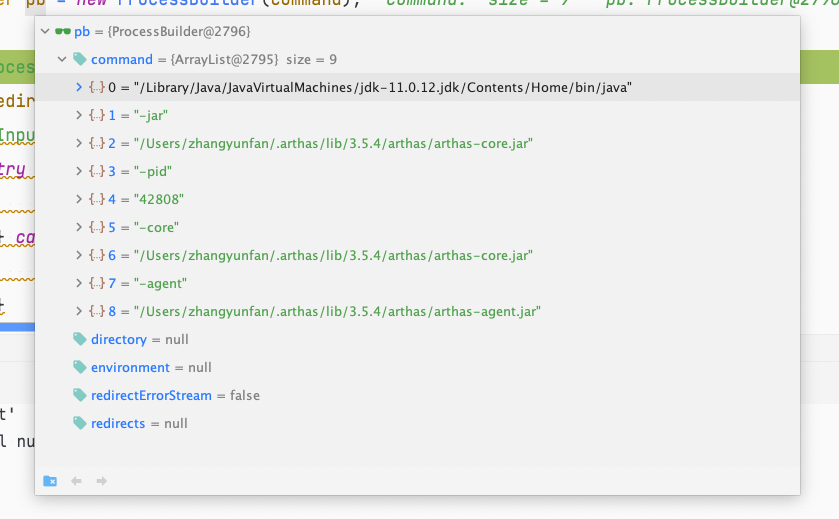

# Arthas源码分析—启动源码分析


## 前言

arthas相信大家已经不陌生了，肯定用过太多次了，平时说到arthas的时候都知道是基于java agent的，那么他具体是怎么实现呢，今天就一起来看看。


## 启动代码分析

首先arthas是在github开源的， 我们可以直接去github上获取源码：https://github.com/alibaba/arthas；然后我们从启动的代码开始分析。众所周知，启动arthas有一种方式是直接`java -jar arthas-boot.jar`这种方式来启动arthas-boot这个jar包，然后我们有两种方式可以找到这个jar包的核心启动类：第一种是直接打开jar包然后找到META-INF下的MANIFEST.MF文件，里面有一行是：`Main-Class: com.taobao.arthas.boot.Bootstrap`这里就是可以说明这个jar包的启动主类就是Bootstrap类，第二种方式是进入arthas-boot的pom文件里可以找到：

```xml
<manifest>
  <mainClass>com.taobao.arthas.boot.Bootstrap</mainClass>
</manifest>
```

这样也可以说明这个jar包的启动类是Bootstrap。那我们直接找到Bootstrap.java：

```java
  			Bootstrap bootstrap = new Bootstrap();
        CLI cli = CLIConfigurator.define(Bootstrap.class);
        CommandLine commandLine = cli.parse(Arrays.asList(args));
        try {
            CLIConfigurator.inject(commandLine, bootstrap);
        } catch (Throwable e) {
            e.printStackTrace();
            System.out.println(usage(cli));
            System.exit(1);
        }
```

首先arthas的命令行解析是用的阿里巴巴的CLI框架，这里就是new了一个Bootstrap类，然后利用cli框架把启动的时候的参数注入到Bootstrap类的属性里面，Bootstrap类有这些属性：

```java
private String targetIp;
private Integer telnetPort;
private Integer httpPort;
...
```

比如启动的时候指定端口:`--telnet-port 9999 --http-port`那么参数就可以绑定到这些属性上面来，具体绑定到方法是用的:

```java
	  @Argument(argName = "pid", index = 0, required = false)
    @Description("Target pid")
    public void setPid(long pid) {
        this.pid = pid;
    }
    @Option(shortName = "h", longName = "help", flag = true)
    @Description("Print usage")
    public void setHelp(boolean help) {
        this.help = help;
    }

    @Option(longName = "target-ip")
    @Description("The target jvm listen ip, default 127.0.0.1")
    public void setTargetIp(String targetIp) {
        this.targetIp = targetIp;
    }

    @Option(longName = "telnet-port")
    @Description("The target jvm listen telnet port, default 3658")
    public void setTelnetPort(int telnetPort) {
        this.telnetPort = telnetPort;
    }

    @Option(longName = "http-port")
    @Description("The target jvm listen http port, default 8563")
    public void setHttpPort(int httpPort) {
        this.httpPort = httpPort;
    }
```

是在这些属性的set方法上面加上Option注解，然后设置参数名字，然后在inject方法里面的时候就根据参数名字和set方法的对应关系来调用类的set方法就可以把配置的值设置到属性里了。这里我们可以看到在启动的时候我们就可以手动指定我们要监听的java进程id了，如果没有启动的时候没有指定那么arthas就会把本机所有的java进程id都找出来让你选择需要监听哪个进程：

```java
 				long pid = bootstrap.getPid();
        // select pid
        if (pid < 0) {
            try {
                pid = ProcessUtils.select(bootstrap.isVerbose(), telnetPortPid, bootstrap.getSelect());
            } catch (InputMismatchException e) {
                System.out.println("Please input an integer to select pid.");
                System.exit(1);
            }
            if (pid < 0) {
                System.out.println("Please select an available pid.");
                System.exit(1);
            }
        }
```

如果启动的时候没有设置那么pid就是-1，这个时候就是调用`ProcessUtils.select`方法去找可用的java进程。点进去可以看到第一步就是用`listProcessByJps`方法把所有可用的java进程用找出来，封装成`Map<Long, String> processMap`map对象，然后在`listProcessByJps`方法里我们可以看到：

```java
 Map<Long, String> result = new LinkedHashMap<Long, String>();
        String jps = "jps";
        File jpsFile = findJps();
        if (jpsFile != null) {
            jps = jpsFile.getAbsolutePath();
        }
        String[] command = null;
        if (v) {
            command = new String[] { jps, "-v", "-l" };
        } else {
            command = new String[] { jps, "-l" };
        }

        List<String> lines = ExecutingCommand.runNative(command);
        long currentPid = Long.parseLong(PidUtils.currentPid());
        for (String line : lines) {
            String[] strings = line.trim().split("\\s+");
            if (strings.length < 1) {
                continue;
            }
            try {
                long pid = Long.parseLong(strings[0]);
                if (pid == currentPid) {
                    continue;
                }
                if (strings.length >= 2 && isJpsProcess(strings[1])) { // skip jps
                    continue;
                }
					...
```

首先是用的`finJps`方法利用系统里配置的java环境变量找到jdk目录下的bin目录里的jps文件，利用java的jps命令来找到java进程， **j**ps是用于查看有权访问的hotspot虚拟机的进程. 当未指定hostid时，默认查看本机jvm进程，否者查看指定的hostid机器上的jvm进程，此时hostid所指机器必须开启jstatd服务。 jps可以列出jvm进程lvmid，主类类名，main函数参数, jvm参数，jar名称等信息。然后会执行`jps -l`命令来打印本机的java进程信息：


然后在for循环里把这个字符串拆分成pid:进程对应的java程序启动类的map，有意思的是之前好像笔者记忆之中在最后的选择pid的界面里是有arthas这个java进程的pid的，也就是可以我监听我自己的，然后现在的代码是加上了过滤当前arthas进程的代码：

```java
 long currentPid = Long.parseLong(PidUtils.currentPid());
 ...
  long pid = Long.parseLong(strings[0]);
  if (pid == currentPid) {
      continue;
      }
```

看提交记录似乎是19年年底才加上的。然后后面就是把这个map打印在控制台上，让用户选择监听哪个进程：

```java
 				String line = new Scanner(System.in).nextLine();
        if (line.trim().isEmpty()) {
            // get the first process id
            return processMap.keySet().iterator().next();
        }
        int choice = new Scanner(line).nextInt();
        if (choice <= 0 || choice > processMap.size()) {
            return -1;
        }
        Iterator<Long> idIter = processMap.keySet().iterator();
        for (int i = 1; i <= choice; ++i) {
            if (i == choice) {
                return idIter.next();
            }
            idIter.next();
        }
```

此时arthas就可以拿到需要监听的java进程的pid了，总结一下其实就是用jps命令来获取所有java进程然后过滤到arthas的进程让用户选择的，所以我们启用arthas的用户一定要有jps这个的执行权限才可以。

然后下面的流程就是根据当前arthas-boot.jar的路径找到其他arthas核心组件还有一些依赖的驱动，如果是在官网下载的发行版本的话那么就是在arthas-bin下就是最完整的，此时的arthas-bin就是arthas.home目录了，需要的全部驱动和组件都在这里，如果没有的话或者说版本对应不上的话就会去阿里云上下载最新版本的：

```java
 if (needDownload) {
     // try to download arthas from remote server.
      DownloadUtils.downArthasPackaging(bootstrap.getRepoMirror(), bootstrap.isuseHttp(), remoteLastestVersion,ARTHAS_LIB_DIR.getAbsolutePath());
                localLastestVersion = remoteLastestVersion;
     }
```

然后的步奏就是启动arthas-core.jarjar包：

```java
...
attachArgs.add("-core");
attachArgs.add(new File(arthasHomeDir, "arthas-core.jar").getAbsolutePath());
attachArgs.add("-agent");
attachArgs.add(new File(arthasHomeDir, "arthas-agent.jar").getAbsolutePath());
...
```

attachArgs参数就是拼接启动命令的，然后调用`ProcessUtils.startArthasCore`方法把参数传进去，先获得本机jdk的绝对路径然后启动core，详细代码就不赘述了，最后传入的命令是：



简单来说就是`java -jar arthas-core.jar -pid 42808 -core corejar包的绝对路径 -agent agent包的绝对路径`

这里arthas-boot的职责就完了，他的职责就是指定pid然后启动arthas的核心组件core。

## Arthas-core启动源码分析

用上面的方法，我们打开core的源码，然后在pom文件里找到mainClass，这里的mainClass就是`<mainClass>com.taobao.arthas.core.Arthas</mainClass>`这个Arthas类的main方法：

```java
 try {
            new Arthas(args);
        } catch (Throwable t) {
            AnsiLog.error("Start arthas failed, exception stack trace: ");
            t.printStackTrace();
            System.exit(-1);
        }
```

很简单，就是new了一个Arthas类。当然了这里说new了不太准确，应该是调用了Arthas这个类的构造函数。在构造函数里：

```java
 private Arthas(String[] args) throws Exception {
        attachAgent(parse(args));
    }
```

先去解析参数，然后调用`attachAgent`方法，我们先看看是怎么解析参数的：

```java
 Option pid = new TypedOption<Long>().setType(Long.class).setShortName("pid").setRequired(true);
        Option core = new TypedOption<String>().setType(String.class).setShortName("core").setRequired(true);
        Option agent = new TypedOption<String>().setType(String.class).setShortName("agent").setRequired(true);
        Option target = new TypedOption<String>().setType(String.class).setShortName("target-ip");
...

        CLI cli = CLIs.create("arthas").addOption(pid).addOption(core).addOption(agent).addOption(target)
                .addOption(telnetPort).addOption(httpPort).addOption(sessionTimeout)
                .addOption(username).addOption(password)         .addOption(tunnelServer).addOption(agentId).addOption(appName).addOption(statUrl).addOption(disabledCommands);
        CommandLine commandLine = cli.parse(Arrays.asList(args));
        Configure configure = new Configure();
        configure.setJavaPid((Long) commandLine.getOptionValue("pid"));
        configure.setArthasAgent((String) commandLine.getOptionValue("agent"));
        configure.setArthasCore((String) commandLine.getOptionValue("core"));
...
        return configure;
```

记得到上文说的阿里巴巴自己的命令行解析工具CLI框架吗，这里还是用了这个，把刚刚在Boot中启动core的时候传递过来的参数封装成了一个`Configure`对象，把刚刚的参数设置成了这个对象的属性。然后传入`attachAgent`方法里面，在`attachAgent`方法里做了什么呢？首先：

```java
        VirtualMachineDescriptor virtualMachineDescriptor = null;
        for (VirtualMachineDescriptor descriptor : VirtualMachine.list()) {
            String pid = descriptor.id();
            if (pid.equals(Long.toString(configure.getJavaPid()))) {
                virtualMachineDescriptor = descriptor;
                break;
            }
        }
        VirtualMachine virtualMachine = null;
        try {
            if (null == virtualMachineDescriptor) { // 使用 attach(String pid) 这种方式
                virtualMachine = VirtualMachine.attach("" + configure.getJavaPid());
            } else {
                virtualMachine = VirtualMachine.attach(virtualMachineDescriptor);
            }
```


这里用了JVM的`VirtualMachineDescriptor`类——在JDK中com.sun.tools.attach.VirtualMachine提供了一些从外部进程attach到jvm上，并执行一些操作的功能，本人理解的是先获取到本机上所有在运行到java程序的JVM虚拟机的`VirtualMachineDescriptor`对象，然后用刚刚获取到的pid进行对比，若匹配则当前的`VirtualMachineDescriptor`就是我目标java程序对应的jvm虚拟机描述符对象，我就直接attach进入这个jvm，如果没有找到则指定pid去attach，attach成功之后返回一个`VirtualMachine`我觉得可以理解为就是JVM对象。attach进入到JVM之后就检查一下java版本：

```java
 						Properties targetSystemProperties = virtualMachine.getSystemProperties();
            String targetJavaVersion = JavaVersionUtils.javaVersionStr(targetSystemProperties);
            String currentJavaVersion = JavaVersionUtils.javaVersionStr();
            if (targetJavaVersion != null && currentJavaVersion != null) {
                if (!targetJavaVersion.equals(currentJavaVersion)) {
                    AnsiLog.warn("Current VM java version: {} do not match target VM java version: {}, attach may fail.",
                                    currentJavaVersion, targetJavaVersion);
                    AnsiLog.warn("Target VM JAVA_HOME is {}, arthas-boot JAVA_HOME is {}, try to set the same JAVA_HOME.",
                                    targetSystemProperties.getProperty("java.home"), System.getProperty("java.home"));
                }
            }
```

然后接下来就是启动arthas-agent了，arthas核心工作类:

```java
    				String arthasAgentPath = configure.getArthasAgent();
            //convert jar path to unicode string
            configure.setArthasAgent(encodeArg(arthasAgentPath));
            configure.setArthasCore(encodeArg(configure.getArthasCore()));
            virtualMachine.loadAgent(arthasAgentPath,
                        configure.getArthasCore() + ";" + configure.toString());
```

这里把刚刚参数里的agent参数解码一下，这里核心的代码是：

```java
virtualMachine.loadAgent(arthasAgentPath,configure.getArthasCore() + ";" + configure.toString());
```

这里就是用刚刚attach成功之后返回的JVM对象调用他的loadAgent方法，传入arthas的agent组件的绝对路径，然后传入一个字符串参数。那么到这里，core组件的职责就完了，他的功能很简单就是获取目标进程的JVM对象，然后运行agent，植入我们的arthas agent。loadAgent方法就是启动我们的Java agent。

## Arthas-agent启动源码分析

在上文中结尾中，我们一直说的java agent是啥？这里我们先来复习一下基础知识。

arthas的根本原理是什么？对，众所周知是java agent，那么什么是java agent呢？

> JavaAgent 是一种能够在不影响正常编译的情况下，修改字节码的技术。java作为一种强类型的语言，不通过编译就不能能够进行jar包的生成。有了 JavaAgent 技术，就可以在字节码这个层面对类和方法进行修改。也可以把 JavaAgent 理解成一种代码注入的方式，但是这种注入比起 Spring的 AOP 更加的优美。
>
> Java Agent支持目标JVM启动时加载，也支持在目标JVM运行时加载，这两种不同的加载模式会使用不同的入口函数，如果需要在目标JVM启动的同时加载Agent：
>
> [1] public static void premain(String agentArgs, Instrumentation inst);
> [2] public static void premain(String agentArgs);
> JVM将首先寻找[1]，如果没有发现[1]，再寻找[2]。如果希望在目标JVM运行时加载Agent，则需要实现下面的方法：
>
> [1] public static void agentmain(String agentArgs, Instrumentation inst);
> [2] public static void agentmain(String agentArgs);
> 这两组方法的第一个参数AgentArgs是随同 “–javaagent”一起传入的程序参数，如果这个字符串代表了多个参数，就需要自己解析这些参数。inst是Instrumentation类型的对象，是JVM自动传入的，我们可以拿这个参数进行类增强等操作。

看了介绍，感觉和spring里的面相切面AOP很像啊，实际上AOP框架之一的AspectJ的原理就是Java

总之，根据基础知识我们要知道，java agent就是一种java增强技术，其次用agent的话需要用到jdk的API，并且要在pom文件里设置agent的类才行，那么我们在源码里打开`arthas-agent`的pom文件来找到他的agent类，我们在pom文件里搜索`premain` 和`agent`：

```xml
 <manifestEntries>
                                    <Premain-Class>com.taobao.arthas.agent334.AgentBootstrap</Premain-Class>
                                    <Agent-Class>com.taobao.arthas.agent334.AgentBootstrap</Agent-Class>
                                  ...
                                </manifestEntries>
```

 通过刚刚的基础知识我们知道了，premain是在应用启动之前调用的，agentmain是在启动之后调用的。那么我们回到我们的源码中，在pom文件里premain和agentmain都指向了同一个类`AgentBootstrap`，在这个类中：

```java
 public static void premain(String args, Instrumentation inst) {
        main(args, inst);
    }

    public static void agentmain(String args, Instrumentation inst) {
        main(args, inst);
    }
```

这两个方法都是调用main方法，并且有两个参数：`args Instrumentation`，args就是刚刚用`virtualMachine.loadAgent`方法传入的字符串参数，就是我们core组件的绝对路径和启动core组件的时候的参数：

```java
virtualMachine.loadAgent(arthasAgentPath,configure.getArthasCore() + ";" + configure.toString());
```

`Instrumentation`参数是java.lang.instrument.Instrumentation 实例，由 JVM 自动传入，集中了几乎所有功能方法，如：类操作、classpath 操作等。这个就是刚刚的JVM对象自己传入进来的。然后我们继续看main方法：

```java
  // 尝试判断arthas是否已在运行，如果是的话，直接就退出
        try {
            Class.forName("java.arthas.SpyAPI"); // 加载不到会抛异常
            if (SpyAPI.isInited()) {
                ps.println("Arthas server already stared, skip attach.");
                ps.flush();
                return;
            }
        } 
        ...
        try {
            ps.println("Arthas server agent start...");
            // 传递的args参数分两个部分:arthasCoreJar路径和agentArgs, 分别是Agent的JAR包路径和期望传递到服务端的参数
            if (args == null) {
                args = "";
            }
            args = decodeArg(args);
            String arthasCoreJar;
            final String agentArgs;
            int index = args.indexOf(';');
            if (index != -1) {
                arthasCoreJar = args.substring(0, index);
                agentArgs = args.substring(index);
            } else {
                arthasCoreJar = "";
                agentArgs = args;
            }
```

首先是检查arthas是否重复运行，其次就是把刚刚传入的字符串参数解析出来，赋值给变量。下面的代码就是如果此时core的绝对路径中找不到core这个jar包的话就在当前目录在重试找一下，如果还是没有的话就退出，可以看出agent这里后续还是会用到core组件的。接下来是重点代码：

```java
   /**
             * Use a dedicated thread to run the binding logic to prevent possible memory leak. #195
             */
            final ClassLoader agentLoader = getClassLoader(inst, arthasCoreJarFile);

            Thread bindingThread = new Thread() {
                @Override
                public void run() {
                    try {
                        bind(inst, agentLoader, agentArgs);
                    } catch (Throwable throwable) {
                        throwable.printStackTrace(ps);
                    }
                }
            };

            bindingThread.setName("arthas-binding-thread");
            bindingThread.start();
            bindingThread.join();
```

首先我们获取我们的类加载器：

```java
private static ClassLoader getClassLoader(Instrumentation inst, File arthasCoreJarFile) throws Throwable {
        // 构造自定义的类加载器，尽量减少Arthas对现有工程的侵蚀
        return loadOrDefineClassLoader(arthasCoreJarFile);
    }
```

我们传入我们的core的File对象去获取或者定义类加载器，获取的是`ArthasClassloader`这个arthas自定义的类加载器，这样做会破坏双亲委派原则，至于为啥这样做上面的注释已经说的很清楚了，如果用双亲委派机制的话那肯定是用我们目标java程序的类加载器的，这样会造成一定的侵蚀，这是我们不希望看到的，所以用的是自定义类加载器。Instrumentation这个入参是没有任何用的，估计是后面重构的这部分代码，忘了删了。然后我们看下bind方法：

```java
			 /**
         * <pre>
         * ArthasBootstrap bootstrap = ArthasBootstrap.getInstance(inst);
         * </pre>
         */
        Class<?> bootstrapClass = agentLoader.loadClass(ARTHAS_BOOTSTRAP);
        Object bootstrap = bootstrapClass.getMethod(GET_INSTANCE, Instrumentation.class, String.class).invoke(null, inst, args);
        boolean isBind = (Boolean) bootstrapClass.getMethod(IS_BIND).invoke(bootstrap);
        if (!isBind) {
            String errorMsg = "Arthas server port binding failed! Please check $HOME/logs/arthas/arthas.log for more details.";
            ps.println(errorMsg);
            throw new RuntimeException(errorMsg);
        }
        ps.println("Arthas server already bind.");
    }
```

这里就是用了刚刚我们获取的类加载器来加载我们的`com.taobao.arthas.core.server.ArthasBootstrap`这个arthas最核心的类，然后用java反射调用他的getInstance方法来获取实例，最后调用他的isBlind方法。这个类是在core这个组件中的，所以也就解释为了什么刚刚要传入core组件的绝对路径过来。对了，然后这里的blind方法是异步的，也就是新建了一个线程来，注释里也说了这样是为了避免内存泄露，那你知道为什么这样可以避免内存泄露呢？（又是jvm垃圾回收的八股文，几个引用类型、垃圾回收算法中的可达性算法可以作为root的对象，所以你说八股文到底有没有用呢？）。然后我们就进入`com.taobao.arthas.core.server.ArthasBootstrap`这个类中来，刚刚先调用的是`getInstance`方法，那么我们先看看这方法：

```java
public synchronized static ArthasBootstrap getInstance(Instrumentation instrumentation, Map<String, String> args) throws Throwable {
        if (arthasBootstrap == null) {
            arthasBootstrap = new ArthasBootstrap(instrumentation, args);
        }
        return arthasBootstrap;
    }
```

这里又是new了一个`ArthasBootstrap`对象，但是如果只是这样的话那就会看不懂的，其实这里更准确的说法是调用了`ArthasBootstrap`方法的构造函数。在构造函数里：

```java

        initFastjson();
        // 1. initSpy()
        initSpy();
        // 2. ArthasEnvironment
        initArthasEnvironment(args);
..
        // 3. init logger
        loggerContext = LogUtil.initLogger(arthasEnvironment);
        // 4. 增强ClassLoader
        enhanceClassLoader();
        // 5. init beans
        initBeans();
        // 6. start agent server
        bind(configure);
        executorService = Executors.newScheduledThreadPool(1, new ThreadFactory() {
            @Override
            public Thread newThread(Runnable r) {
                final Thread t = new Thread(r, "arthas-command-execute");
                t.setDaemon(true);
                return t;
            }
        });
...
        transformerManager = new TransformerManager(instrumentation);
        Runtime.getRuntime().addShutdownHook(shutdown);
```


我们可以看到整个初始化分为六个步骤，初始化fastjson，这个不重要。

1、初始化spy

2、初始化arthas环境

3、初始化日志

4、增强classLoader

5、初始化bean

6、启动agent server

我们一步一步的看；

1、`initSpy`初始化我们的spy：

```java
  // 将Spy添加到BootstrapClassLoader
        ClassLoader parent = ClassLoader.getSystemClassLoader().getParent();
        Class<?> spyClass = null;
        if (parent != null) {
            try {
                spyClass =parent.loadClass("java.arthas.SpyAPI");
            } catch (Throwable e) {
                // ignore
            }
        }
        if (spyClass == null) {
            CodeSource codeSource = ArthasBootstrap.class.getProtectionDomain().getCodeSource();
            if (codeSource != null) {
                File arthasCoreJarFile = new File(codeSource.getLocation().toURI().getSchemeSpecificPart());
                File spyJarFile = new File(arthasCoreJarFile.getParentFile(), ARTHAS_SPY_JAR);
                instrumentation.appendToBootstrapClassLoaderSearch(new JarFile(spyJarFile));
            } else {
                throw new IllegalStateException("can not find " + ARTHAS_SPY_JAR);
            }
        }
```

将我们的 `arthas-spy.jar` 添加到 BootstrapClassLoader 中，在 Java Instrumention 的实现中，这行代码应该是很常见的。为什么要这样做呢？在Java中，Java类加载器分为 BootstrapClassLoader、ExtensionClassLoader和SystemClassLoader。BootstrapClassLoader 主要加载的是JVM自身需要的类，由于双亲委派机制的存在，越基础的类由越上层的加载器进行加载，因此，如果需要在由 BootstrapClassLoader 加载的类的方法中调用由 SystemClassLoader 加载的`arthas-spy.jar`，这违反了双亲委派机制。而 `arthas-spy.jar` 添加到 BootstrapClassLoader 的 classpath 中，由 BootstrapClassLoader加载，就解决了这个问题。

2、`initArthasEnvironment`，初始化arthas环境

这里就是new了一个`ArthasEnvironment`——arthas环境对象，获取了环境变量什么的

```java
 public ArthasEnvironment() {
        propertySources
                .addLast(new PropertiesPropertySource(SYSTEM_PROPERTIES_PROPERTY_SOURCE_NAME, getSystemProperties()));
        propertySources.addLast(
                new SystemEnvironmentPropertySource(SYSTEM_ENVIRONMENT_PROPERTY_SOURCE_NAME, getSystemEnvironment()));
    }
```

然后是：

```java
 /**
         * <pre>
         * 脚本里传过来的配置项，即命令行参数 > System Env > System Properties > arthas.properties
         * arthas.properties 提供一个配置项，可以反转优先级。 arthas.config.overrideAll=true
         * https://github.com/alibaba/arthas/issues/986
         * </pre>
         */
        Map<String, String> copyMap = new HashMap<String, String>();
        if (argsMap != null) {
            copyMap.putAll(argsMap);
        }
        // 添加 arthas.home
        if (!copyMap.containsKey(ARTHAS_HOME_PROPERTY)) {
            copyMap.put(ARTHAS_HOME_PROPERTY, arthasHome());
        }

        MapPropertySource mapPropertySource = new MapPropertySource("args", (Map<String, Object>)(Object)copyMap);
        arthasEnvironment.addFirst(mapPropertySource);

        tryToLoadArthasProperties();

        configure = new Configure();
        BinderUtils.inject(arthasEnvironment, configure);
```

根据刚刚boot给core然后core给agent最后agent再给core的参数和一些环境变量什么的在初始化我们的configure对象。

3、初始化日志

这里就是用了`loggerContext = LogUtil.initLogger(arthasEnvironment);`用刚刚的环境对象来初始化日志的上下文对象，这里用的是logback。


4、`enhanceClassLoader`增强ClassLoader

这里代码就不贴了，总之是因为要解决解决一些ClassLoader加载不到 SpyAPI的问题所以才要增强ClassLoader，这里有一个issue——github.com/alibaba/arthas/issues/1596

5、`initBeans`初始化bean

这里就是给两个成员属性新建赋值:

```java
    private void initBeans() {
        this.resultViewResolver = new ResultViewResolver();
        this.historyManager = new HistoryManagerImpl();
    }
```

6、启动agent server

这里就是我们最后的arthas的启动代码了。首先：

```java
 				long start = System.currentTimeMillis();
        if (!isBindRef.compareAndSet(false, true)) {
            throw new IllegalStateException("already bind");
        }
        // init random port
        if (configure.getTelnetPort() != null && configure.getTelnetPort() == 0) {
            int newTelnetPort = SocketUtils.findAvailableTcpPort();
            configure.setTelnetPort(newTelnetPort);
            logger().info("generate random telnet port: " + newTelnetPort);
        }
        if (configure.getHttpPort() != null && configure.getHttpPort() == 0) {
            int newHttpPort = SocketUtils.findAvailableTcpPort();
            configure.setHttpPort(newHttpPort);
            logger().info("generate random http port: " + newHttpPort);
        }
        // try to find appName
        if (configure.getAppName() == null) {
            configure.setAppName(System.getProperty(ArthasConstants.PROJECT_NAME,
                    System.getProperty(ArthasConstants.SPRING_APPLICATION_NAME, null)));
        }
			try {
            if (configure.getTunnelServer() != null) {
                tunnelClient = new TunnelClient();
                tunnelClient.setAppName(configure.getAppName());
                tunnelClient.setId(configure.getAgentId());
                tunnelClient.setTunnelServerUrl(configure.getTunnelServer());
                tunnelClient.setVersion(ArthasBanner.version());
                ChannelFuture channelFuture = tunnelClient.start();
                channelFuture.await(10, TimeUnit.SECONDS);
            }
        } catch (Throwable t) {
            logger().error("start tunnel client error", t);
        }
```

首先CAS的去改变绑定状态，如果CAS失败那么就是已经绑定成功。然后就是根据我们第二部初始化好的配置对象来设置我们的Telnet端口和Http端口，然后在配置对象中设置我们的java程序的项目名称。然后是设置我们的TunnelServer，这个是远程使用arthas会用到的，顺便arthas在今年开始支持可以通过在spring-boot中引入arthas-starter的方式在自己项目中放入一个arthas客户端，然后用tunnelServer的方式远程使用arthas了，有兴趣的读者可以自行去arthas官网上找相关说明，这里不再赘述。

```java
  ShellServerOptions options = new ShellServerOptions()
                            .setInstrumentation(instrumentation)
                            .setPid(PidUtils.currentLongPid())
                            .setWelcomeMessage(ArthasBanner.welcome());
            if (configure.getSessionTimeout() != null) {
                options.setSessionTimeout(configure.getSessionTimeout() * 1000);
            }

            this.httpSessionManager = new HttpSessionManager();
            this.securityAuthenticator = new SecurityAuthenticatorImpl(configure.getUsername(), configure.getPassword());
            shellServer = new ShellServerImpl(options);
            List<String> disabledCommands = new ArrayList<String>();
          ...
            BuiltinCommandPack builtinCommands = new BuiltinCommandPack(disabledCommands);
            List<CommandResolver> resolvers = new ArrayList<CommandResolver>();
            resolvers.add(builtinCommands)

          ...

            shellServer.listen(new BindHandler(isBindRef));
```

上面这段代码特别长，其实就是初始化`ShellServer`，然后配置好，最后调用listen方法进行监听，在`listen`方法中，主要是根据之前注册的TermServer来逐个启动：

```java
termServer.termHandler(new TermServerTermHandler(this));
termServer.listen(handler);
```

设置term处理器和监听器，接下来看下`TelnetTermServer`中的`listen`方法，termServer有几个实现类比如Http、命令行等，这里以`TelnetTermServer命令行为例讲解，在listen方法中：

```java

        bootstrap = new NettyTelnetTtyBootstrap().setHost(hostIp).setPort(port);
        try {
            bootstrap.start(new Consumer<TtyConnection>() {
                @Override
                public void accept(final TtyConnection conn) {
                    termHandler.handle(new TermImpl(Helper.loadKeymap(), conn));
                }
            }).get(connectionTimeout, TimeUnit.MILLISECONDS);
            listenHandler.handle(Future.<TermServer>succeededFuture());
        } catch (Throwable t) {
            logger.error("Error listening to port " + port, t);
            listenHandler.handle(Future.<TermServer>failedFuture(t));
        }
        return this;
```

调用的是 `NettyTelnetBootstrap` 的 `start`方法，主要是通过 `netty` 来启动网络服务，因为这里需要一个长链接。然后再看看`TermServerTermHandler`输入处理类的处理方法handle，主要是调用了刚刚的shellServer的handleTerm来处理输入：

```java
				synchronized (this) {
            // That might happen with multiple ser
            if (closed) {
                term.close();
                return;
            }
        }

        ShellImpl session = createShell(term);
        tryUpdateWelcomeMessage();
        session.setWelcome(welcomeMessage);
        session.closedFuture.setHandler(new SessionClosedHandler(this, session));
        session.init();
        sessions.put(session.id, session); // Put after init so the close handler on the connection is set
        session.readline(); // Now readline
```

这里`session.readline()`就是来读取用户的输入，这里` session.setWelcome(welcomeMessage);`就是开启arthas的时候的欢迎语输出的地方了，有一个banner的Arthas的logo，这里的welcomeMessage是在刚刚初始化shellServer的时候设置的：

```java
 ShellServerOptions options = new ShellServerOptions()
                            .setInstrumentation(instrumentation)
                            .setPid(PidUtils.currentLongPid())
                            .setWelcomeMessage(ArthasBanner.welcome());
```

可以看到这个启动的Banner是维护在ArthasBanner这个类里面的，两年前笔者想改一下这个logo的，半天没找到哪里设置的，这里算是解答了两年前笔者的一个疑惑了。

然后在`session.readline`中，

```java
    term.readline(prompt, new ShellLineHandler(this),
                new CommandManagerCompletionHandler(commandManager));
```

这里就是设置我们最最最核心的命令管理适配器了，也就是`InternalCommandManager`这个类，这个类会监听到命令之后去查找命令然后用相应的处理器来处理，这个是后面arthas命令的核心。

最后

```java

            sessionManager = new SessionManagerImpl(options, shellServer.getCommandManager(), shellServer.getJobController());
            httpApiHandler = new HttpApiHandler(historyManager, sessionManager);

            logger().info("as-server listening on network={};telnet={};http={};timeout={};", configure.getIp(),
                    configure.getTelnetPort(), configure.getHttpPort(), options.getConnectionTimeout());

            // 异步回报启动次数
            if (configure.getStatUrl() != null) {
                logger().info("arthas stat url: {}", configure.getStatUrl());
            }
            UserStatUtil.setStatUrl(configure.getStatUrl());
            UserStatUtil.arthasStart();

            try {
                SpyAPI.init();
            } catch (Throwable e) {
                // ignore
            }
```


启动完我们核心的shellServer来保持和客户端连接和监听客户端输入之后我们再启动我们的session管理和httpApi的管理（arthas是支持api调用的所以刚刚要初始化fastJson），然后在设置一些配置什么的，最后再启动我们刚刚的spy中的SPYApi来实现为后面的命令做准备了。


## 总结

这里再来一张arthas的流程图帮助大家理解一下整个arthas的流程：


然后接下来笔者会挑选几个最常用的arthas命令来详细讲解他的原理和实现。
