#  根据HashMap的红黑树来看看红黑树


## 1、二叉查找树简单介绍

首先二叉树应该是大家大学学习数据结构与算法的时候一种常见的数据结构，二叉树就是一个父节点最多只能有两个字节点，然后二叉树中有一种叫二叉查找树（Binary Search Tree，简称BST），它的左子节点的值比父节点的值要小，右节点的值要比父节点的值大，所以BST的增删查改的时间复杂度为O(logN)，但是在极端情况下可能会变成O(N)，请看下图：

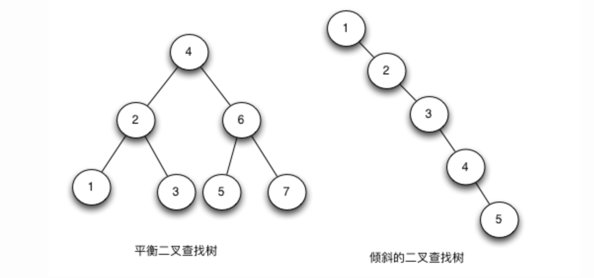

因为他左小右大的特性，所以如果插入的元素都比上一个元素大的话或者都比上一个元素小的话那么就会退化成链表，此时增删改查的时间复杂度就是O(N)，所以为了改进BST树的这个缺点就有了平衡二叉查找树(Balanced BST)，平衡树在插入和删除的时候，会通过旋转操作将高度保持在logN，这样就可以规避掉BST可能会变成链表的缺点，比较有名的平衡二叉查找树有两个第一个是AVL树（Adelson-Velsky and Landis Tree）（发明者名字是 Adelson-Velskii 以及Landis），在AVL树中任何节点的两个子树的高度最大差别为1，所以它也被称为高度平衡树。增加和删除可能需要通过一次或多次树旋转来重新平衡这个树，简单来说就是他是通过旋转来保持平衡的。第二个就是我们今天的主角——红黑树。

红黑树（Red-Black Tree，以下简称RBTree）的实际应用非常广泛，比如Linux内核中的完全公平调度器、高精度计时器、ext3文件系统等等，各种语言的函数库如Java的TreeMap和TreeSet，C++ STL的map、multimap、multiset等。

总结来说BST不够平衡，BBST是一个概念他可以保证BST是平衡的，BBST有两个最有名的实现——AVL树和RB树，AVL树是通过旋转来保证平衡的，RB树也就是红黑树是基于他的特性来保证平衡的，所以在实际使用中红黑树使用的更多一点。

## 2、红黑树的介绍以及简单操作

红黑树是一种含有红黑结点并能自平衡的二叉查找树。它必须满足下面性质：

1. **任何一个节点都有颜色，黑色或者红色。**
2. **根节点是黑色的。**
3. **父子节点之间不能出现两个连续的红节点。**
4. **任何一个节点向下遍历到其子孙的叶子节点（也就是到最底部节点），所经过的黑节点个数必须相等。（黑色完美平衡）**
5. **空节点被认为是黑色的。**

我们又可以根据第四点来推导出：如果一个结点存在黑子结点，那么该结点肯定有两个子结点。

我们可以用代码简单定义一个红黑树：

```java
class  Node<T>{
   public  T value;
   public   Node<T> parent;
   public   boolean isRed;
   public   Node<T> left;
   public   Node<T> right;
}
```

红黑树在理论上还是一棵BST树，但是它在对BST的插入和删除操作时会维持树的平衡，即保证树的高度在[logN,logN+1]（理论上，极端的情况下可以出现RBTree的高度达到2*logN，但实际上很难遇到）。这样红黑树的查找时间复杂度始终保持在O(logN)从而接近于理想的BST。红黑树的删除和插入操作的时间复杂度也是O(logN)。红黑树的查找操作就是BST的查找操作。

上文讲到了红黑树可以根据自身特性来保持平衡，那么他保持平衡的方法就是三种操作：左旋、右旋和变色。其实旋转操作(Rotate)的目的是使节点颜色符合定义，让RBTree的高度达到平衡。 Rotate分为left-rotate（左旋）和right-rotate（右旋），区分左旋和右旋的方法是：待旋转的节点从左边上升到父节点就是右旋，待旋转的节点从右边上升到父节点就是左旋。简单来说就是左升级是右旋、右升级是左旋。

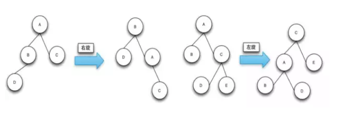

 下面我们从红黑树的查找、插入、删除的操作来简单理解一下红黑树。

### 2.1、查找

红黑树说破天也是属于BST的，所以他也满足左小右大的规则，那么他查找的时候可以从根节点一路查找下去：

1、如果当前节点等于查找值那么就返回当前节点

2、如果当前节点小于查找值那么就找当前节点的右节点

3、如果当前节点大于查找值那么就找当前节点的左节点

笔者感觉有点像二分，总之查找时间复杂度是O(logN)

### 2.2、插入

插入需要找到在树上的父节点（俗称“认爹”），这里其实就是和查找是一样的：

1、找到当前节点，如果比当前节点小则放到当前节点的左侧，如果比当前节点大就放到当前节点右侧

2、如果当前节点的左侧或者右侧已经有了节点那么就把当前节点的子节点设置为当前节点再走第一步。

这里插入之后不能不管了，因为不管的就又会像BST树那样变成链表，那么红黑树简单插入之后还需要对树进行旋转操作和颜色修复（在这里简称插入修复），使得它符合红黑树的定义从而来保持平衡。

首先说回来，我们刚刚插入的节点应该是什么颜色的？我们用图来说明说一下：

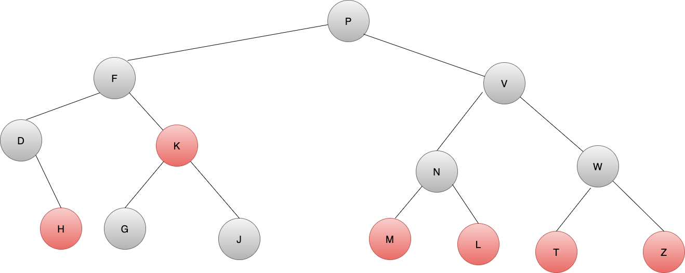

首先这是一个满足要求的红黑树，他满足特性，特别的对于上文中的特点4，例如从根节点P到四级子节点J，所走路径：

P->F->K->J，一共三个黑节点，从根节点P到四级字节点L:P->V->N->M，三个黑节点，完美符合。

此时，我们有一个黑节点X，插入到D的字节点中：

那么从P到X到路径上就有四个黑节点，不满足特性4了，此时就需要旋转。但是如果插入到X是红色节点：

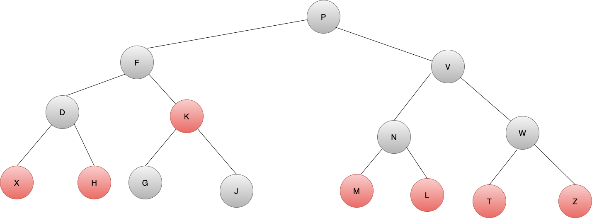

那么P到X还是三个黑点，满足特性4。所以插入红色节点树的性质可能不会改变，而插入黑色节点每次都会违反特性4.

通过性质发现： 将节点设置为红色在插入时对红黑树造成的影响是小的，而黑色是最大的

所以将红黑树的节点默认颜色设置为红色，是为尽可能减少在插入新节点对红黑树造成的影响。

那么我们继续说插入，我们达成共识插入的节点每次都应该是红节点，如果插入节点的父节点是黑节点，就像上图中的情况，那么此时是不需要修复的，因为天然满足红黑树的要求，如果插入节点的父节点是红节点，那么就需要修复，而插入节点是红节点又可以分为三种情况：

1. 叔叔节点也为红色。
2. 叔叔节点为空，且祖父节点、父节点和新节点处于一条斜线上。
3. 叔叔节点为空，且祖父节点、父节点和新节点不处于一条斜线上。

对于情况1:

将父节点和叔叔节点与祖父节点的颜色互换就可以了。即维持了高度的平衡，修复后颜色也符合特性3、4。如图：


插入节点D，D的父节点B、叔叔节点C均是红节点，此时插入D之后不符合特性3，即出现了两个红节点相连，那么我们就把父节点和叔叔节点一起和祖父节点交换颜色，变换之后祖父节点是红节点，父节点和叔叔节点是黑节点，此时满足要求。

对于情况2:

将B节点进行右旋操作，并且和父节点A互换颜色。通过该修复操作RBTRee的高度和颜色都符合红黑树的定义。如果B和C节点都是右节点的话，只要将操作变成左旋就可以了。

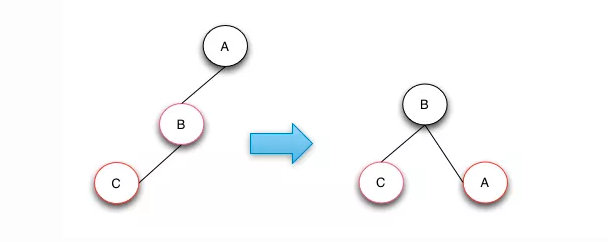

插入之后，C节点和父节点都是红节点，不满足特性3，此时右旋即左升级，BC都是左即都升级，A降级，并且父节点和祖父节点颜色互换。

对于情况3:

将C节点进行左旋，这样就从case 3转换成case 2了，然后针对case 2进行操作处理就行了。case 2操作做了一个右旋操作和颜色互换来达到目的。如果树的结构是下图的镜像结构，则只需要将对应的左旋变成右旋，右旋变成左旋即可。

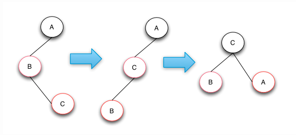

左旋右升级，只有C是右节点，那么C升级，B降级，此时就变成了情况2。

插入总结来说：

1、插入节点必须是红节点

2、若父节点是黑节点直接插入完毕

3、若父节点是红节点则有三种手段：有叔叔就爹和叔一起和爷爷换颜色、没有叔叔的话如果爷爷爹儿子在一条直线上直接一次右旋、没有叔叔的话如果爷爷爹儿子不在一条直线上一次左旋一次右旋

### 2.3 删除

红黑树的删除其实基础也是BST的删除，我们先看看BST的删除：

1. 查找到要删除的节点。
2. 如果待删除的节点是叶子节点，则直接删除。
3. 如果待删除的节点不是叶子节点，则先找到待删除节点的中序遍历的后继节点，用该后继节点的值替换待删除的节点的值，然后删除后继节点。

这里回忆一下基础：

二叉树的四种主要的遍历思想为：

前序遍历：根结点 ---> 左子树 ---> 右子树

中序遍历：左子树---> 根结点 ---> 右子树

后序遍历：左子树 ---> 右子树 ---> 根结点

层次遍历：只需按层次遍历即可

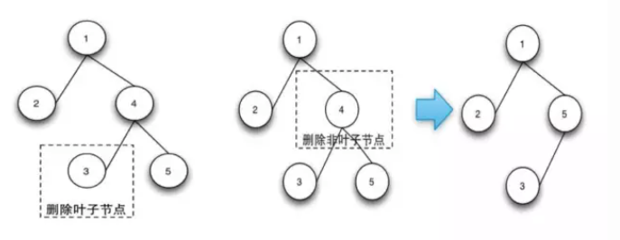

红黑树不一样的是删除后就需要做删除修复操作，使的树符合红黑树的定义，符合定义的红黑树高度是平衡的。

和插入操作一样的点在于：如果删除的节点是红节点那么不影响特性4，即不需要修复；如果删除的节点是黑节点那么删除之后就不满足特性4，就需要修复。原因可以看上问的图自己画一画，这里不再赘述。

删除操作的总体思想是从兄弟节点借调黑色节点使树保持局部的平衡，如果局部的平衡达到了，就看整体的树是否是平衡的，如果不平衡就接着向上追溯调整。

删除修复操作分为四种情况(删除黑节点后)：

1. 待删除的节点的兄弟节点是红色的节点。
2. 待删除的节点的兄弟节点是黑色的节点，且兄弟节点的子节点都是黑色的。
3. 待调整的节点的兄弟节点是黑色的节点，且兄弟节点的左子节点是红色的，右节点是黑色的(兄弟节点在右边)，如果兄弟节点在左边的话，就是兄弟节点的右子节点是红色的，左节点是黑色的。
4. 待调整的节点的兄弟节点是黑色的节点，且右子节点是是红色的(兄弟节点在右边)，如果兄弟节点在左边，则就是对应的就是左节点是红色的。

对于情况1:

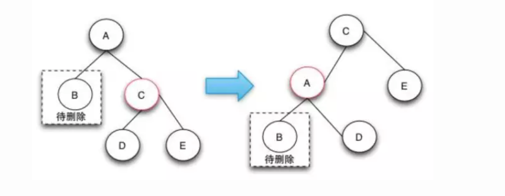

兄弟节点是红节点，那么我们没有可以借调的黑节点，但是因为是红节点所以他的字节点一定都是黑节点，那么我们就需要把C升级，这样C的子节点就变成了原来兄弟节点的子节点，由于C是右节点，根据口诀：左旋右升级、右旋左升级，那么此时应该左旋（如果C是左节点那么就右旋），左旋之后C升级成父节点，A成字节点，那么B就和C原来的子节点D是兄弟节点了，节点D是黑节点，所以这时候就转换为了情况2、3、4了，我们就接着看后面。


对于情况2:

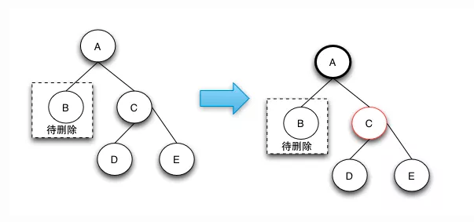


此时由于兄弟节点可以消除一个黑色节点，因为兄弟节点和兄弟节点的子节点都是黑色的，所以可以将兄弟节点变红，这样就可以保证树的局部的颜色符合定义了。这个时候需要将父节点A变成新的节点，继续向上调整，直到整颗树的颜色符合红黑树的定义为止。这种情况下之所以要将兄弟节点变红，是因为如果把兄弟节点借调过来，会导致兄弟的结构不符合RBTree的定义，这样的情况下只能是将兄弟节点也变成红色来达到颜色的平衡。当将兄弟节点也变红之后，达到了局部的平衡了，但是对于祖父节点来说是不符合定义4的。这样就需要回溯到父节点，接着进行修复操作。

对于情况3:

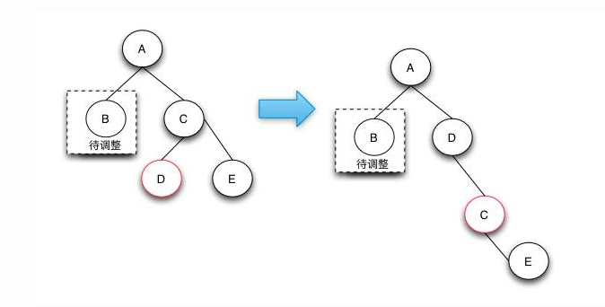

此时删除操作是一个中间步骤，它的目的是将左边的红色节点借调过来，这样就可以转换成情况 4状态了，在情况 4状态下可以将D，E节点都阶段过来，通过将两个节点变成黑色来保证红黑树的整体平衡。

之所以说情况3是一个中间状态，是因为根据红黑树的定义来说，下图并不是平衡的，他是通过情况 2操作完后向上回溯出现的状态。之所以会出现情况 3和后面的情况 4的情况，是因为可以通过借用侄子节点的红色，变成黑色来符合红黑树定义4。


对于情况4:

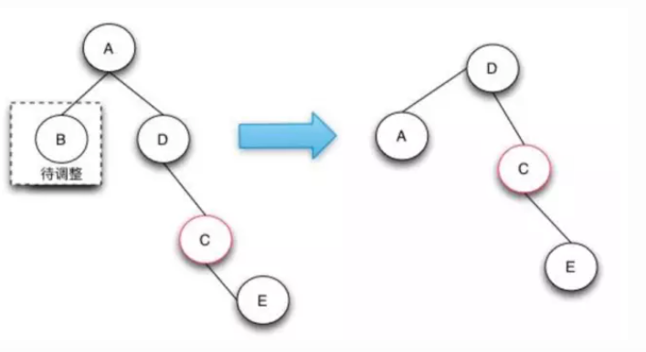

情况 4的操作是真正的节点借调操作，通过将兄弟节点以及兄弟节点的右节点借调过来，并将兄弟节点的右子节点变成红色来达到借调两个黑节点的目的，这样的话，整棵树还是符合红黑树的定义的。

情况 4这种情况的发生只有在待删除的节点的兄弟节点为黑，且子节点不全部为黑，才有可能借调到两个节点来做黑节点使用，从而保持整棵树都符合红黑树的定义。

红黑树的删除操作是最复杂的操作，复杂的地方就在于当删除了黑色节点的时候，如何从兄弟节点去借调节点，以保证树的颜色符合定义。由于红色的兄弟节点是没法借调出黑节点的，这样只能通过选择操作让他上升到父节点，而由于它是红节点，所以它的子节点就是黑的，可以借调。

对于兄弟节点是黑色节点的可以分成3种情况来处理，当所以的兄弟节点的子节点都是黑色节点时，可以直接将兄弟节点变红，这样局部的红黑树颜色是符合定义的。但是整颗树不一定是符合红黑树定义的，需要往上追溯继续调整。

对于兄弟节点的子节点为左红右黑或者 (全部为红，右红左黑)这两种情况，可以先将前面的情况通过选择转换为后一种情况，在后一种情况下，因为兄弟节点为黑，兄弟节点的右节点为红，可以借调出两个节点出来做黑节点，这样就可以保证删除了黑节点，整棵树还是符合红黑树的定义的，因为黑色节点的个数没有改变。

红黑树的删除操作是遇到删除的节点为红色，或者追溯调整到了root节点，这时删除的修复操作完毕。

总结来说就需要经过旋转来让树的结构可以有节点来进行借调，如果兄弟节点被借调之后不符合要求那么就变色。（说实话笔者也不是很懂删除，这里基本都是拷贝的参考资料的）

## 3、HashMap中红黑树的实现

看完了红黑树的简单介绍，我们来实战一把，当然了笔者目前对红黑树的了解程度来说并不能实现一个红黑树，只能看看现成代码里的红黑树代码是怎么实现的，拾人牙慧。Java里最有名的红黑树就是JDK8之后的HashMap里的红黑树，从八股文里我们可以得知，JDK8之后的HashMap的链表结构在大于7的时候会进化成红黑树。

HashMap中红黑树是通过TreeNode类构造的。TreeNode是HashMap的静态内部类，继承与LinkedHashMap.Entry<K,V>类：

```java
 /**
     * Entry for Tree bins. Extends LinkedHashMap.Entry (which in turn
     * extends Node) so can be used as extension of either regular or
     * linked node.
     */
    static final class TreeNode<K,V> extends LinkedHashMap.Entry<K,V> {
        TreeNode<K,V> parent;  // red-black tree links
        TreeNode<K,V> left;
        TreeNode<K,V> right;
        TreeNode<K,V> prev;    // needed to unlink next upon deletion
        boolean red;
        TreeNode(int hash, K key, V val, Node<K,V> next) {
            super(hash, key, val, next);
        }
```

在`HashMap`中`put`方法时候，但数组中某个位置的链表长度大于`8`时，会调用`treeifyBin`方法将链表转化为红黑树:

```java
  if (binCount >= TREEIFY_THRESHOLD - 1) // -1 for 1st
       treeifyBin(tab, hash);
       break;
```

```java
    final void treeifyBin(Node<K,V>[] tab, int hash) {
        int n, index; Node<K,V> e;
        if (tab == null || (n = tab.length) < MIN_TREEIFY_CAPACITY)
            // 数组大小小于64的，调用resize将数组大小扩容至2倍大小
            resize();
        else if ((e = tab[index = (n - 1) & hash]) != null) {
            TreeNode<K,V> hd = null, tl = null;
            // 遍历链表，将链表元素转化成TreeNode链
            do {
                // 调用replacementTreeNode构造TreeNode
                TreeNode<K,V> p = replacementTreeNode(e, null);
                if (tl == null)
                    // TreeNode链为空，将元素设置为hd的首个节点
                    hd = p;
                else {
                    // TreeNode链不为空，向TreeNode链后面添加元素
                    p.prev = tl;
                    tl.next = p;
                }
                tl = p;
            } while ((e = e.next) != null);
            if ((tab[index] = hd) != null)
                // TreeNode链表转化为红黑树
                hd.treeify(tab);
        }
    }
```

我们可以看到这里是先把链表的Node元素链表转化成红黑树的节点TreeNode链表，即把链表里的Node转换为TreeNode，然后再把TreeNode链表转化为红黑树结构，调用了treeify方法：

```java
        final void treeify(Node<K,V>[] tab) {
            TreeNode<K,V> root = null;
          	//先遍历TreeNode链表
            for (TreeNode<K,V> x = this, next; x != null; x = next) {
                next = (TreeNode<K,V>)x.next;
                x.left = x.right = null;
              	//如果根节点为空，那么当前节点就是根节点，根据红黑树定义，根节点一定是黑节点
                if (root == null) {
                    x.parent = null;
                    x.red = false;
                    root = x;
                }
                else {
                  	//如果根节点不为空，那么就是典型的插入操作
                    K k = x.key;
                  	// hashMap元素的hash值用来表示红黑树中节点数值大小
                    int h = x.hash;
                    Class<?> kc = null;
                  	//从根节点开始循环
                    for (TreeNode<K,V> p = root;;) {
                        int dir, ph;
                        K pk = p.key;
                       	//如果要插入节点的值小于根节点的值
                        if ((ph = p.hash) > h)
                          	//根据BST定义，小左右大，那么dir=-1的意思就是当前节点应该在根节点的左边
                            dir = -1;
                        else if (ph < h)
                          	//dir=1的意思就是应该在根节点的右边
                            dir = 1;
                        else if ((kc == null &&
                                  (kc = comparableClassFor(k)) == null) ||
                                 (dir = compareComparables(kc, k, pk)) == 0)
                            // 当前节点的值等于根节点值。
                            // 如果当前节点实现Comparable接口，调用compareTo比较大小并赋值dir
                            // 如果当前节点没有实现Comparable接口，compareTo结果等于0，则调用			  tieBreakOrder继续比较大小
                            // tieBreakOrder本质是通过比较k与pk的hashcode
                          	//总之一定要比较出现当前节点和根节点的大小
                            dir = tieBreakOrder(k, pk);

                        TreeNode<K,V> xp = p;
                      	//如果当前根节点没有子节点，那么直接插入即可
                        if ((p = (dir <= 0) ? p.left : p.right) == null) {
                            x.parent = xp;
                            if (dir <= 0)
                                xp.left = x;
                            else
                                xp.right = x;
                          	//根据上文的，红黑树插入之后我们需要做调整来满足特性
                            root = balanceInsertion(root, x);
                            break;
                        }
                      //这里如果子节点有值了，那么我们就把子节点当成根节点再来一次循环，直到找到没有字节点点根节点为止
                    }
                }
            }
            moveRootToFront(tab, root);
        }
```

那么接下来就是balanceInsertion方法怎么来调整平衡了，这里大家可以复习一下上文第二大节的2.2插入：

```java
 static <K,V> TreeNode<K,V> balanceInsertion(TreeNode<K,V> root,
                                                    TreeNode<K,V> x) {
   					//敲一下黑板，上文提到了，插入节点默认就是红节点
            x.red = true;
   					// xp父节点 xpp祖父节点 xppl祖父左节点 xppr 祖父右节点
            for (TreeNode<K,V> xp, xpp, xppl, xppr;;) {
              	//父节点为空，因为空是黑节点，那么父节点是黑节点的时候结束修复操作不用修复
                if ((xp = x.parent) == null) {
                    x.red = false;
                    return x;
                }
              	//父节点是黑节点或者是根节点也就是肯定是黑节点，那么结束修复
                else if (!xp.red || (xpp = xp.parent) == null)
                    return root;
              	//走到这里来了说明父节点肯定是红节点，则需要修复
              	//父节点是祖父节点的左节点
                if (xp == (xppl = xpp.left)) {
                  	//有叔叔节点，并且叔叔节点是红节点，对应我们的情景1
                    if ((xppr = xpp.right) != null && xppr.red) {
                      	//自己回去看看情景1的解决方案（敲一下黑板），总之就是变色
                        xppr.red = false;
                        xp.red = false;
                        xpp.red = true;
                        x = xpp;
                    }
                    else {
                      	//叔叔节点为空，且祖父节点、父节点当前节点在一条直线上，对应情景1
                        if (x == xp.right) {
                          	//这里因为都在右边就是左旋，如果都在左边就是右旋
                            root = rotateLeft(root, x = xp);
                            xpp = (xp = x.parent) == null ? null : xp.parent;
                        }
                      	//左旋之后，还有父节点
                        if (xp != null) {
                          	//父节点变色
                            xp.red = false;
                          //还有祖父节点的话，祖父节点变色，然后右旋，这里应该是情景3，不在一条直线上
                            if (xpp != null) {
                                xpp.red = true;
                                root = rotateRight(root, xpp);
                            }
                        }
                    }
                }
                else {
                  //父节点是祖父节点的右节点，情景一，有叔叔节点，叔叔节点是红色，直接变色
                    if (xppl != null && xppl.red) {
                        xppl.red = false;
                        xp.red = false;
                        xpp.red = true;
                        x = xpp;
                    }
                    else {
                      //和上文一样，情景2，都在一条直线上，只是是左节点，所以是右旋
                        if (x == xp.left) {
                            root = rotateRight(root, x = xp);
                            xpp = (xp = x.parent) == null ? null : xp.parent;
                        }
                        if (xp != null) {
                            xp.red = false;
                            if (xpp != null) {
                              //情景3，不在一条直线上所以需要旋转两次
                                xpp.red = true;
                                root = rotateLeft(root, xpp);
                            }
                        }
                    }
                }
            }
        }
```

所以上文的基础是相当有用的，基本上依葫芦画瓢就可以看懂了。

插入方法`putTreeVal`就不再赘述了，和这里初始化非根节点其实是一样的，因为初始化非根节点就是插入节点嘛～

查找：

```java
 final TreeNode<K,V> find(int h, Object k, Class<?> kc) {
            TreeNode<K,V> p = this;
            do {
                int ph, dir; K pk;
                TreeNode<K,V> pl = p.left, pr = p.right, q;
                if ((ph = p.hash) > h)
                    p = pl;
                else if (ph < h)
                    p = pr;
                else if ((pk = p.key) == k || (k != null && k.equals(pk)))
                    return p;
                else if (pl == null)
                    p = pr;
                else if (pr == null)
                    p = pl;
                else if ((kc != null ||
                          (kc = comparableClassFor(k)) != null) &&
                         (dir = compareComparables(kc, k, pk)) != 0)
                    p = (dir < 0) ? pl : pr;
                else if ((q = pr.find(h, k, kc)) != null)
                    return q;
                else
                    p = pl;
            } while (p != null);
            return null;
        }
```

查找这里也不多说了，因为很简单就是BST的查找，根据小左大右原则去找就是了。

然后就是删除，删除方法就是`removeTreeNode`然后删除之后也需要平衡，就是方法`balanceDeletion`，这里基于篇幅问题（太长了可读性很差）就不再赘述了，后面有机会单独写一篇，还有个原因也是笔者目前也不是特别能理解删除方法，确实很复杂，就是HashMap源码的注释中的：

```java
   			/**
         * Removes the given node, that must be present before this call.
         * This is messier than typical red-black deletion code because we
         * cannot swap the contents of an interior node with a leaf
         * successor that is pinned by "next" pointers that are accessible
         * independently during traversal. So instead we swap the tree
         * linkages. If the current tree appears to have too few nodes,
         * the bin is converted back to a plain bin. (The test triggers
         * somewhere between 2 and 6 nodes, depending on tree structure).
         */
        final void removeTreeNode(HashMap<K,V> map, Node<K,V>[] tab,
                                  boolean movable) {
```

`This is messier than typical red-black deletion code`这比传统红黑树代码还复杂，确实这个HashMap的删除节点代码很复杂，所以这里就不单独说啦。


## 4、总结

其实一篇学下来，笔者的感触就是红黑树其实没有那么难，只要理清楚他的特性然后根据基本操作的：增删改查来进行梳理，然后每种操作又有哪几种场景，这样下来就非常清楚了，其实有点像我们的业务，比如红黑树就是某种促销规则，我们了解到这种促销规则之后需要对这个规则下的商品或者订单或者用户做特别的操作，所以我们其实时时刻刻都在用算法的，只是自己没有发觉而已。