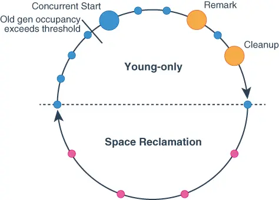

# 从G1源码来看young GC什么时候发生


笔者在某次开发环境故障中惊奇的发现自己居然看球不懂G1的GC 日志，然后整理了一下自己的知识点，发现G1这块了解的比较少，只是会一些大家都会的八股，于是专门开一个系列来学习G1，由于网上G1的资料特别多，所以笔者会选一些网上没有的角度来写文章，其实笔者本来想一篇文章搞定的，但是 奈何越写越多越写越多，考虑到读者的可读性于是笔者只能拆成多篇文章啦。今天分享第一篇关于G1的基本结构和young GC的。young gc这块G1和传统gc不太一样，发生的时机也不太一样，笔者第一篇就来讲讲G1何时发生young gc。

## 什么是G1

G1 GC，全称Garbage-First Garbage Collector，JDK9之前通过-XX:+UseG1GC参数来启用，作为体验版随着JDK 6u14版本面世，在JDK 7u4版本发行时被正式推出，相信熟悉JVM的同学们都不会对它感到陌生。从JDK9开始，G1被提议设置为默认垃圾收集器（JEP 248）。在官网中，是这样描述G1的： 

>The Garbage-First (G1) collector is a server-style garbage collector, targeted for multi-processor machines with large memories. It meets garbage collection (GC) pause time goals with a high probability, while achieving high throughput. The G1 garbage collector is fully supported in Oracle JDK 7 update 4 and later releases. The G1 collector is designed for applications that: > * Can operate concurrently with applications threads like the CMS collector. > * Compact free space without lengthy GC induced pause times. > * Need more predictable GC pause durations. > * Do not want to sacrifice a lot of throughput performance. > * Do not require a much larger Java heap.

从官网的描述中，我们知道G1是一种服务器端的垃圾收集器，应用在多处理器和大容量内存环境中，在实现高吞吐量的同时，尽可能的满足垃圾收集暂停时间的要求。它是专门针对以下应用场景设计的: * 像CMS收集器一样，能与应用程序线程并发执行。 * 整理空闲空间更快。 * 需要GC停顿时间更好预测。 * 不希望牺牲大量的吞吐性能。 * 不需要更大的Java Heap。

G1收集器的设计目标是取代CMS收集器，它同CMS相比，在以下方面表现的更出色：  G1是一个有整理内存过程的垃圾收集器，不会产生很多内存碎片。  G1的Stop The World(STW)更可控，G1在停顿时间上添加了预测机制，用户可以指定期望停顿时间。

有了以上的特性，难怪有人说它是一款驾驭一切的垃圾收集器（[G1: One Garbage Collector To Rule Them All](http://www.infoq.com/articles/G1-One-Garbage-Collector-To-Rule-Them-All)）。


## G1的内存结构


传统的GC收集器将连续的内存空间划分为新生代、老年代和永久代（JDK 8去除了永久代，引入了元空间Metaspace），这种划分的特点是各代的存储地址（逻辑地址，下同）是连续的。如下图所示：


而G1的各代存储地址是不连续的，每一代都使用了n个不连续的大小相同的Region，每个Region占有一块连续的虚拟内存地址。如下图所示：


E代表新生代空间，也就是通常八股中的年轻代中的Eden区域，S代表survivor区，这两个一起组成了G1的年轻代。整个年轻代内存会在初始空间`-XX:G1NewSizePercent`(默认整堆5%)与最大空间(默认60%)之间动态变化，且由参数目标暂停时间`-XX:MaxGCPauseMillis`(默认200ms)、需要扩缩容的大小以`-XX:G1MaxNewSizePercent`及分区的已记忆集合(RSet)计算得到。当然，G1依然可以设置固定的年轻代大小(参数-XX:NewRatio、-Xmn)，但同时G1的可预测停顿模型将失去意义。G1默认是不分S0和S1的，只有S，所以jstat命令查看的话G1会显示S0都是0，S1是100%，这里是写死的：

```c++
//  name "generation.0.space.1"
  // See _old_space_counters for additional counters
  // Set the arguments to indicate that this survivor space is not used.
  _from_counters = new HSpaceCounters(young_collection_name_space,
    "s0", 1 /* ordinal */,
    pad_capacity(0) /* max_capacity */,
    pad_capacity(0) /* init_capacity */);

  //  name "generation.0.space.2"
  // See _old_space_counters for additional counters
  _to_counters = new HSpaceCounters(young_collection_name_space,
    "s1", 2 /* ordinal */,
    pad_capacity(overall_reserved()) /* max_capacity */,
    pad_capacity(survivor_space_committed()) /* init_capacity */);

```

O代表老年代，这个就是传统GC里的老年代，新生代对象没有被回收或者年龄达到一定的阈值则会晋升到老年代。

还有个H，H代表Humongous，这表示这些Region存储的是巨大对象（humongous object，H-obj），即大小大于等于region一半的对象。H-obj有如下几个特征： H-obj直接分配到了old gen，防止了反复拷贝移动。 *H-obj在global concurrent marking阶段的cleanup 和 full GC阶段回收。 在分配H-obj之前先检查是否超过 initiating heap occupancy percent和the marking threshold, 如果超过的话，就启动global concurrent marking，为的是提早回收，防止 evacuation failures 和 full GC。为了减少连续H-objs分配对GC的影响，需要把大对象变为普通的对象，建议增大Region size。G1内部做了一个优化，一旦发现没有引用指向Humongous，则可直接在年轻代收集周期中被回收。

一个Region的大小可以通过参数-XX:G1HeapRegionSize设定，取值范围从1M到32M，且是2的指数。相关的设置代码如下：

```c++
void HeapRegion::setup_heap_region_size(size_t initial_heap_size, size_t max_heap_size) {
  size_t region_size = G1HeapRegionSize;
  if (FLAG_IS_DEFAULT(G1HeapRegionSize)) {
    size_t average_heap_size = (initial_heap_size + max_heap_size) / 2;
    region_size = MAX2(average_heap_size / HeapRegionBounds::target_number(),
                       HeapRegionBounds::min_size());
  }
```

根据源码我们可以知道如果不设定region大小，那么G1会根据Heap大小自动决定，G1最多可以分配2048个Region，一般Region大小等于堆大小除以2048，比如堆大小为4096M，则Region大小为2M，当然了可能因为堆的大小太小了导致计算出来的region大小很小，这时候会有一个最小默认值：1024*1024，即1M，不可能比1M还小

## G1的young GC

G1提供了两种GC模式，young GC和Mixed GC，注意G1并没有full gc，full gc是jvm使用serial old GC来收集整个GC heap，是单线程全stw的过程，所以使用G1的话千万不要进行full gc最好让垃圾在Young GC和Mixed GC就被回收掉。

首先G1的GC算法用了两种：标记清除和复制，对每个region内部用的是复制算法， 存活对象会从一个region复制到另外一个region，然后废弃的region会被标记清除掉。

在G1的GC日志中，young gc是如下打印：
```
[2023-04-11T15:13:30.020+0800] GC(0) Pause Young (Normal) (G1 Evacuation Pause)
[2023-04-11T15:13:30.020+0800] GC(0) Using 3 workers of 8 for evacuation
[2023-04-11T15:13:30.025+0800] GC(0)   Pre Evacuate Collection Set: 0.0ms
[2023-04-11T15:13:30.025+0800] GC(0)   Evacuate Collection Set: 4.9ms
[2023-04-11T15:13:30.025+0800] GC(0)   Post Evacuate Collection Set: 0.3ms
[2023-04-11T15:13:30.025+0800] GC(0)   Other: 0.2ms
[2023-04-11T15:13:30.025+0800] GC(0) Eden regions: 24->0(24)
[2023-04-11T15:13:30.025+0800] GC(0) Survivor regions: 0->3(3)
[2023-04-11T15:13:30.025+0800] GC(0) Old regions: 0->6
[2023-04-11T15:13:30.025+0800] GC(0) Humongous regions: 0->0
[2023-04-11T15:13:30.025+0800] GC(0) Metaspace: 11727K->11727K(106496K)
[2023-04-11T15:13:30.025+0800] GC(0) Pause Young (Normal) (G1 Evacuation Pause) 24M->8M(128M) 5.470ms
[2023-04-11T15:13:30.025+0800] GC(0) User=0.01s Sys=0.00s Real=0.00s
```
`Pause Young`代表young gc，`Eden regions: 24->0(24)`代表本次young gc一共有24个eden regions被回收了，`Survivor regions: 0->3(3)`代表S区的region从0变为3个，`Old regions: 0->6`代表老年代region从0变为6个，也就是说本次young gc回收了24和eden region，有部分对象转移到了3个S region中，剩下的对象晋升到了老年代的region中

## G1的young gc什么时候发生


和传统GC一样Young GC的主要工作是回收eden区和survivor区，也是stw的。关于young GC触发的时机，网上很多资料都是介绍的是eden区满了之后就开始young gc 这和传统GC一致，但是根据刚刚的G1基础介绍我们知道了G1的新生代是可以变化的，默认是从堆的5%到60%之间变化，那么这里是不是矛盾了呢？如果eden满了就会youngGC，那么新生代又怎么去动态变化呢？因为满了就回收满了就回收那就是可以不动态变化了。

带着疑问我们去看下G1的源码，我们知道判断是否需要GC是在分配对象的时候，如果分配对象失败那么就GC，所以这部分源码得从G1对象分配的源码开始看：

G1分配对象的入口是在`G1CollectedHeap::mem_allocate`中：

```c++
HeapWord*G1CollectedHeap::mem_allocate(size_t word_size,
                              bool*  gc_overhead_limit_was_exceeded) {
  assert_heap_not_locked_and_not_at_safepoint();

  if (is_humongous(word_size)) {
    return attempt_allocation_humongous(word_size);
  }
  size_t dummy = 0;
  return attempt_allocation(word_size, word_size, &dummy);
}
```

这里可以看到如果分配的对象是大对象就进入大对象分配入口，如果不是就是普通分配入口：

`G1CollectedHeap::attempt_allocation`:

```c++
inline HeapWord* G1CollectedHeap::attempt_allocation(size_t min_word_size,
                                                     size_t desired_word_size,
                                                     size_t* actual_word_size) {
  assert_heap_not_locked_and_not_at_safepoint();
  assert(!is_humongous(desired_word_size), "attempt_allocation() should not "
         "be called for humongous allocation requests");

  HeapWord* result = _allocator->attempt_allocation(min_word_size, desired_word_size, actual_word_size);

  if (result == NULL) {
    *actual_word_size = desired_word_size;
    result = attempt_allocation_slow(desired_word_size);
  }

 ...
}
```


可以看到这里先去正常分配`attempt_allocation`如果分配失败，那么就尝试用`attempt_allocation_slow`来分配：

```c++
HeapWord* G1CollectedHeap::attempt_allocation_slow(size_t word_size) {
  ResourceMark rm; // For retrieving the thread names in log messages.

  // Make sure you read the note in attempt_allocation_humongous().

  assert_heap_not_locked_and_not_at_safepoint();
  assert(!is_humongous(word_size), "attempt_allocation_slow() should not "
         "be called for humongous allocation requests");

  HeapWord* result = NULL;
  for (uint try_count = 1, gclocker_retry_count = 0; /* we'll return */; try_count += 1) {
    bool should_try_gc;
    uint gc_count_before;

    {
      MutexLockerEx x(Heap_lock);
      result = _allocator->attempt_allocation_locked(word_size);
      if (result != NULL) {
        return result;
      }

    	//重点在这里，先判断是否能扩展新生代
      if (GCLocker::is_active_and_needs_gc() && g1_policy()->can_expand_young_list()) {
        result = _allocator->attempt_allocation_force(word_size);
        if (result != NULL) {
          return result;
        }
      }
      should_try_gc = !GCLocker::needs_gc();
      gc_count_before = total_collections();
    }

    if (should_try_gc) {
      //下面就是young gc的代码，不是这里的重点，不赘述，感兴趣的去hotspot的share/gc/g1/g1CollectedHeap.cpp中自己查看
  ...
    }
```

我们可以看到，这里的源码就很清楚，首先在try gc之前有一个判断——是否扩展年轻代，如果能扩展那么就扩展，我们要照的答案也许就在`attempt_allocation_force`中。

这里判断是否能扩展的方法很简单：

```c++
bool G1Policy::can_expand_young_list() const {
  uint young_list_length = _g1h->young_regions_count();
  uint young_list_max_length = _young_list_max_length;
  return young_list_length < young_list_max_length;
}
```

就是判断当前年轻大的大小是否超过最大大小，最大大小就是初始化设置的，参数`G1MaxNewSizePercent`控制的

如果可以扩展那么就进入`attempt_allocation_force`方法中，就是强制分配，由于这个方法特别的深，所以我们直接看这里这个方法的调用栈为：
```c++
HeapWord* G1Allocator::attempt_allocation_force -> 
  HeapWord* G1AllocRegion::attempt_allocation_force ->  
  HeapWord* G1AllocRegion::new_alloc_region_and_allocate -> 
  HeapRegion* MutatorAllocRegion::allocate_new_region -> 
  HeapRegion* G1CollectedHeap::new_mutator_alloc_region
```

最后进入到了`new_mutator_alloc_region`来判断是否新建：

```c++
  bool should_allocate = g1_policy()->should_allocate_mutator_region();
  if (force || should_allocate) {
    HeapRegion* new_alloc_region = new_region(word_size,
                                              false /* is_old */,
                                              false /* do_expand */);
    if (new_alloc_region != NULL) {
...
    }
  }
```


`new_region`就是新建一个region可以理解扩充我们的新生代了，也就是说重点就是在`should_allocate_mutator_region`中：

```c++
bool G1Policy::should_allocate_mutator_region() const {
  uint young_list_length = _g1h->young_regions_count();
  uint young_list_target_length = _young_list_target_length;
  return young_list_length < young_list_target_length;
}
```

这里有一个变量`young_list_target_length`是核心，如果当前年轻代小于他则可以新建，那么`young_list_target_length`就决定了我们是否扩充新生代还是执行GC。


搜索代码，这个young_list_target_length变量更新的逻辑在 `G1Policy::update_young_list_target_length` 方法中。查阅资料，`update_young_list_target_length`这个方法就是实现G1自适应调整新生代的核心方法，在`update_young_list_target_length`中调用的是`young_list_target_lengths`:

```c++
G1Policy::YoungTargetLengths G1Policy::young_list_target_lengths(size_t rs_lengths) const {
  YoungTargetLengths result;

  const uint base_min_length = _g1h->survivor_regions_count();
  uint desired_min_length = calculate_young_list_desired_min_length(base_min_length);
  // This is the absolute minimum young length. Ensure that we
  // will at least have one eden region available for allocation.
  uint absolute_min_length = base_min_length + MAX2(_g1h->eden_regions_count(), (uint)1);
  // If we shrank the young list target it should not shrink below the current size.
  desired_min_length = MAX2(desired_min_length, absolute_min_length);
  // Calculate the absolute and desired max bounds.

  uint desired_max_length = calculate_young_list_desired_max_length();

  uint young_list_target_length = 0;
  //是否自适应新生代
  if (adaptive_young_list_length()) {
    if (collector_state()->in_young_only_phase()) {
      young_list_target_length =
                        calculate_young_list_target_length(rs_lengths,
                                                           base_min_length,
                                                           desired_min_length,
                                                           desired_max_length);
    } else {
      //不在计算的时机
      // Don't calculate anything and let the code below bound it to
      // the desired_min_length, i.e., do the next GC as soon as
      // possible to maximize how many old regions we can add to it.
    }
  } else {
    //非自适应就不算了
    // The user asked for a fixed young gen so we'll fix the young gen
    // whether the next GC is young or mixed.
    young_list_target_length = _young_list_fixed_length;
  }

  result.second = young_list_target_length;

  // We will try our best not to "eat" into the reserve.
  uint absolute_max_length = 0;
  if (_free_regions_at_end_of_collection > _reserve_regions) {
    absolute_max_length = _free_regions_at_end_of_collection - _reserve_regions;
  }
  if (desired_max_length > absolute_max_length) {
    desired_max_length = absolute_max_length;
  }

  //确认计算出来的结果合规
  if (young_list_target_length > desired_max_length) {
    young_list_target_length = desired_max_length;
  }
  if (young_list_target_length < desired_min_length) {
    young_list_target_length = desired_min_length;
  }

  assert(young_list_target_length > base_min_length,
         "we should be able to allocate at least one eden region");
  assert(young_list_target_length >= absolute_min_length, "post-condition");

  result.first = young_list_target_length;
  return result;
}
```

这里核心的计算方法在`calculate_young_list_target_length`，这里就不赘述了，因为要讲的话就太多了，因为这个涉及到G1的核心——`Pause Prediction Model`可预测停顿模型，比较复杂，对这个算法感兴趣的读者可以自己深入研读源码。

这里计算自适应有两个前提:

第一个前提是`adaptive_young_list_length`，这个是读取的`G1YoungGenSizer`的变量`_adaptive_size`，而`G1YoungGenSizer`是初始化年轻代的时候初始化的，初始化的代码如下：

```c++
G1YoungGenSizer::G1YoungGenSizer() : _sizer_kind(SizerDefaults),
 			//就是这个变量，默认就是true
			_adaptive_size(true),
        _min_desired_young_length(0), _max_desired_young_length(0) {
  if (FLAG_IS_CMDLINE(NewRatio)) {
    if (FLAG_IS_CMDLINE(NewSize) || FLAG_IS_CMDLINE(MaxNewSize)) {
      log_warning(gc, ergo)("-XX:NewSize and -XX:MaxNewSize override -XX:NewRatio");
    } else {
      _sizer_kind = SizerNewRatio;
    	//第一种情况
      _adaptive_size = false;
      return;
    }
  }

  if (NewSize > MaxNewSize) {
    if (FLAG_IS_CMDLINE(MaxNewSize)) {
      log_warning(gc, ergo)("NewSize (" SIZE_FORMAT "k) is greater than the MaxNewSize (" SIZE_FORMAT "k). "
                            "A new max generation size of " SIZE_FORMAT "k will be used.",
                            NewSize/K, MaxNewSize/K, NewSize/K);
    }
    FLAG_SET_ERGO(size_t, MaxNewSize, NewSize);
  }

  if (FLAG_IS_CMDLINE(NewSize)) {
    _min_desired_young_length = MAX2((uint) (NewSize / HeapRegion::GrainBytes),
                                     1U);
    if (FLAG_IS_CMDLINE(MaxNewSize)) {
      _max_desired_young_length =
                             MAX2((uint) (MaxNewSize / HeapRegion::GrainBytes),
                                  1U);
      _sizer_kind = SizerMaxAndNewSize;
      //第二种情况
      _adaptive_size = _min_desired_young_length != _max_desired_young_length;
    } else {
      _sizer_kind = SizerNewSizeOnly;
    }
  } else if (FLAG_IS_CMDLINE(MaxNewSize)) {
    _max_desired_young_length =
                             MAX2((uint) (MaxNewSize / HeapRegion::GrainBytes),
                                  1U);
    _sizer_kind = SizerMaxNewSizeOnly;
  }
}
```

这段代码就是判断是否开启自适应策略，在代码里我们可以得出如果什么都不配置默认就是开启的，但是会有两种情况关闭自适应策略：

1. 设置了 NewRatio（但是未设置 NewSize 和 MaxNewSize）
2. 设置了 NewSize 和 MaxNewSize，并且数值一致（也就是设置 Xmn）

也就是说如果设置了堆的大小的话是必然不会去自适应伸缩的。

第二个前提是`collector_state()->in_young_only_phase()`，也就是`in_young_only_phase`

`in_young_only_phase表示：

1. GC 结束后
    a. 处于 `in_young_only_phase` （也就说 Pause Young (Prepare Mixed) 结束后不调整）
    b. FullGC 结束后
2. G1YoungRemSetSamplingThread 并发调整
    处于 `in_young_only_phase`，在 GC 停顿之间尝试调整

这个 `in_young_only_phase` 看图理解比较清楚：



也就是说在young gc的开始阶段就会进行自适应调整新生代。

简单来解释上面的代码就是如果G1开启了自适应策略那么young gc之前会根据自适应调整新生代的大小来判断是gc还是扩充新生代，这个自适应调整的大小是在每次young gc的时候重新计算的。

我们在官网上也可以找到如下介绍：

> The G1 GC has a pause time-target that it tries to meet (soft real time). During young collections, the G1 GC adjusts its young generation (eden and survivor sizes) to meet the soft real-time target.

我们可以看到，确实也就是在young gc期间会重新根据可停顿预测模型来调整年轻代的大小

简单总结一下就是：

G1的young gc触发的时机要分为两种情况：

1、如果没有开启自适应策略，那么就是eden区满了之后立即开始young gc

2、如果开启了自适应策略，YoungGC并不是Eden区放满了就会马上触发，而是会去判断当前新生代是否可以扩充，如果可以则直接新建新生代的region不会发生young gc，如果不可以则young gc，而能不能扩充取决于上一次young gc中对于可停顿预测模型的计算的结果来的

并且这里虽然是讲young gc的时机，顺便也把自适应新生代也讲了，再总结下自适应新生代：

1、默认是开启自适应新生代的

2、如果设置了NewRatio或者NewSize 和 MaxNewSize，并且数值一致也就是设置死了新生代的大小就会关闭自适应新生代

3、自适应新生代是在young gc的时候重新计算的，根据可停顿预测模型来计算也就是和参数`MaxGCPauseMillis`息息相关，如果当前当前求得的gc时间小于配置的时间就扩充我们的新生代.

4、当然了，如果实际stw的时间大于了我们配置的期望时间，GC日志就会打印`MMU target violated: %.1lfms (%.1lfms/%.1lfms`来提示，并且会下降新生代的空间，尽量让时间吻合。当然了比较的步骤是在stw之后，源码如下：

```c++
//start和end分别表示该次 STW 停顿的起始和结束时间
void G1MMUTrackerQueue::add_pause(double start, double end) {
  double duration = end - start;

  remove_expired_entries(end);
  if (_no_entries == QueueLength) {
  ...

  //  GCPauseIntervalMillis，默认值为 MaxGCPauseMillis+1
  double slice_time = calculate_gc_time(end);
  G1MMUTracer::report_mmu(_time_slice, slice_time, _max_gc_time);
	//_max_gc_time设置的 MaxGCPauseMillis
  if (slice_time >= _max_gc_time) {
    log_info(gc, mmu)("MMU target violated: %.1lfms (%.1lfms/%.1lfms)", slice_time * 1000.0, _max_gc_time * 1000.0, _time_slice * 1000);
  }
}
```

`add_pause`方法是记录除了full gc之外的所有stw停顿时间的。
