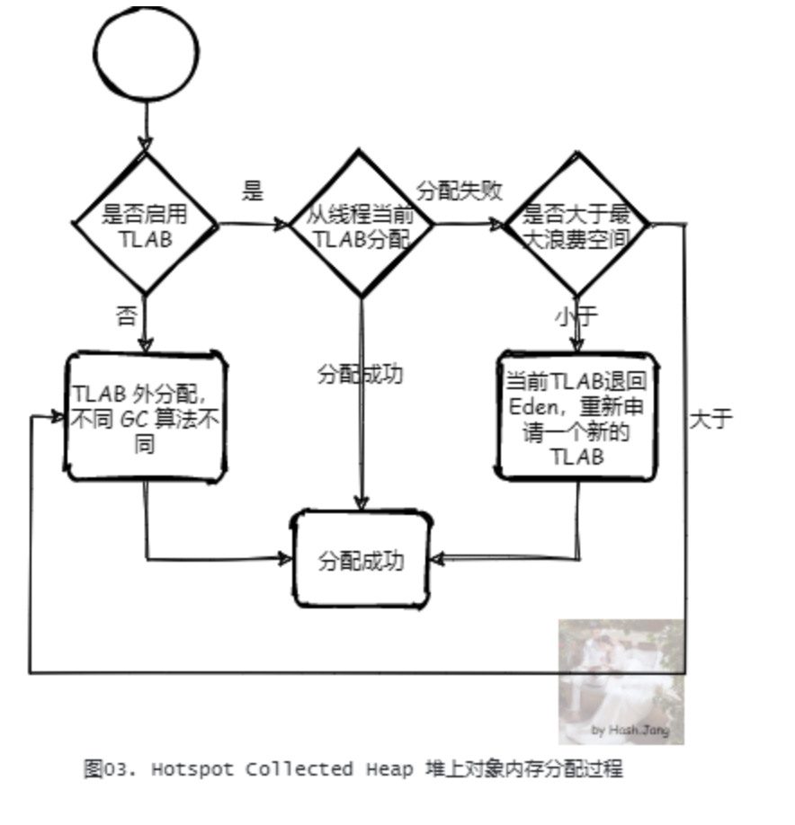
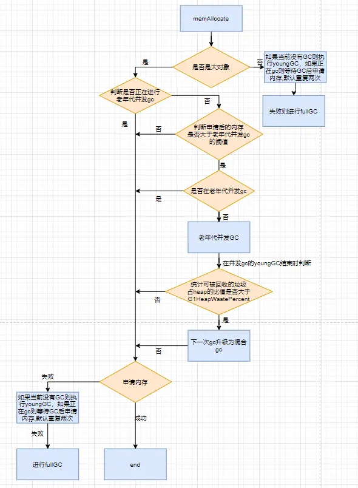

# G1新对象分配源码分析

 ## JVM创建新对象

首先我们根据八股知道，当eden区没有足够空间分配我们的对象的时候就会触发youngGC，然后eden的存活对象复制到S0，然后下一次eden区又满了之后，eden区的存活对象和S0的存活对象一起复制到S1然后清空eden和S0。那么我们可以认为就是在对象分配到时候触发的，那么我们就直接从jvm的对象分配入手来探寻G1的youngGc源码。


上文中，我们简单了解了一下G1的动态年轻代扩容，今天我们接着来看看G1的内存是怎么分配的。

要讲G1的内存怎么分配就不得不从JVM的新对象创建入手

首先我们编写一个简单的java类，目的是来看下jvm是怎么新创建对象的：

```java
public class TestParam {

    public static void main(String[] args) {
        TestParam param = new TestParam();
    }
}
```

然后我们用javac编译成class文件，再用`javap -verbose`来查看这个class文件的字节码：

```java
...
public static void main(java.lang.String[]);
    descriptor: ([Ljava/lang/String;)V
    flags: (0x0009) ACC_PUBLIC, ACC_STATIC
    Code:
      stack=2, locals=2, args_size=1
         0: new           #2                  // class /TestParam
         3: dup
         4: invokespecial #3                  // Method "<init>":()V
         7: astore_1
         8: return
      LineNumberTable:
        line 13: 0
        line 14: 8
      LocalVariableTable:
        Start  Length  Slot  Name   Signature
            0       9     0  args   [Ljava/lang/String;
            8       1     1 param   Lcom/kuainiu/ai/platform/dataset/pojo/param/TestParam;
    MethodParameters:
      Name                           Flags
      args
}
...
```

我们忽略掉什么魔数和类基本信息这种无关的，只看这个main方法的字节码，我们可以看到第一行就是一个new关键字，然后根据八股我们知道class文件运行在jvm上是由jvm的解释器来运行的，简单来说就是jvm的解释器来解释和运行我们的字节码（这也是为什么java是跨平台的，一处编译处处运行，根本原理就是底层是jvm来适配不同的平台），根据2021年笔者的文章的`深入JVM源码分析Synchronized实现原理`中，jvm解释运行指令的文件是:`hotspot/src/share/vm/interpreter/InterpreterRuntime.cpp`，我们找到这个文件，然后找到和new相关的方法，这里简单科普一下解释器是怎么执行的:是用的`IRT_ENTRY`,IRT_ENTRY是JVM中的一个宏定义，它表示一个函数入口点的标记。在JVM中，每个函数都有一个IRT_ENTRY标记，用于指示该函数的入口点。这个标记通常是在函数的汇编代码中定义的，用于告诉JVM在哪里开始执行该函数的代码。IRT_ENTRY的含义是"Interpreted Method Entry"，表示该函数是一个解释执行的方法。所以我们可以找到`InterpreterRuntime.cpp`中的`IRT_ENTRY::_new`方法，这就是解释器执行new关键字的方法：

````C++
IRT_ENTRY(void, InterpreterRuntime::_new(JavaThread* thread, ConstantPool* pool, int index))
  //先会去常量池（这里的常量池其实运行时常量池）中查找Klass的信息
  Klass* k_oop = pool->klass_at(index, CHECK);
  //然后将其包装成instanceKlassHandle句柄,其实就是klass包装类
  instanceKlassHandle klass (THREAD, k_oop);
  //做一些验证和初始化操作
  klass->check_valid_for_instantiation(true, CHECK);
  klass->initialize(CHECK);
  //调用申请对象的方法
  oop obj = klass->allocate_instance(CHECK);
  //将申请的结果返回
  thread->set_vm_result(obj);
IRT_END
````

我们重点看申请对象的方法：`oop obj = klass->allocate_instance(CHECK);`

```c++
//这个方法返回的instanceOop是instanceOopDesc指针的别名（不开启预编译），instanceOopDesc是oopDesc
//的子类,表示java class的实例
//InstanceKlass是Klass的子类，表示类的元数据
instanceOop InstanceKlass::allocate_instance(TRAPS) {
  //判断是否定义finalizer方法
  bool has_finalizer_flag = has_finalizer(); 
  //返回实例大小
  int size = size_helper();
  //封装成KlassHandle句柄，可以简单理解为是Klass的封装类
  KlassHandle h_k(THREAD, this);
 
  instanceOop i;
  //创建对象实例
  i = (instanceOop)CollectedHeap::obj_allocate(h_k, size, CHECK_NULL);
  //注册finalizer方法
  if (has_finalizer_flag && !RegisterFinalizersAtInit) {
    i = register_finalizer(i, CHECK_NULL);
  }
  return i;

```

这里有一个隐藏的知识点：instanceOopDesc和InstanceKlass，这个涉及到了jvm的oop-klass模型：

> oop-klass模型是一种用于描述Java对象的内部结构的模型。它定义了Java对象的布局和访问方式，包括对象头、实例变量和方法等。在JVM中，每个Java对象都有一个oop-klass指针，指向该对象的类信息。oop-klass模型是JVM实现Java面向对象编程的基础，也是JVM实现Java虚拟机规范的关键之一。

这里一笔带过，感兴趣的读者可以自行查阅资料。

重点还是在创建对象实例这里`(instanceOop)Universe::heap()->obj_allocate(**this**, size, CHECK_NULL);`

```c++

oop CollectedHeap::obj_allocate(Klass* klass, int size, TRAPS) {
  ObjAllocator allocator(klass, size, THREAD);
  return allocator.allocate();
}
...
oop MemAllocator::allocate() const {
  oop obj = NULL;
  {
    Allocation allocation(*this, &obj);
    //内存分配，看这里
    HeapWord* mem = mem_allocate(allocation);
    if (mem != NULL) {
      obj = initialize(mem);
    }
  }
  return obj;
}
...
  HeapWord* MemAllocator::mem_allocate(Allocation& allocation) const {
  //配置了走TLAB的话走TLAB，就从当前线程的 TLAB 分配内存，TLAB 快分配
  if (UseTLAB) {
    HeapWord* result = allocate_inside_tlab(allocation);
    if (result != NULL) {
      return result;
    }
  }
 //如果分配失败则走 TLAB 慢分配，需要 refill 或者直接从 Eden 分配
  return allocate_outside_tlab(allocation);
}
...
  HeapWord* MemAllocator::allocate_outside_tlab(Allocation& allocation) const {
  allocation._allocated_outside_tlab = true;
  //在堆上分配内存
  HeapWord* mem = _heap->mem_allocate(_word_size, &allocation._overhead_limit_exceeded);
  if (mem == NULL) {
    return mem;
  }
```

这里有个关于jvm对象分配的知识点：TLAB，简单来说TLAB（Thread-Local Allocation Buffer）是一种用于提高对象分配效率的技术。它是JVM在堆内存中为每个线程分配的一块内存区域，用于存储该线程的对象分配请求。当一个线程需要分配对象时，它会先在自己的TLAB中分配内存，如果TLAB中的空间不足，则会向堆内存申请更多的空间。使用TLAB可以减少线程之间的竞争，提高对象分配的效率，从而提高应用程序的性能：



上图简单描述了一下TLAB的流程，根据图我们可以知道，如果当前TLAB剩余大小足够容纳新对象那么就放在TLAB里，如果放不下且剩余大小小于最大浪费大小就说明这个空间通常不满足对象的分配，所以最好丢弃，丢弃的方法就是填充一个dummy对象，然后申请新的TLAB来分配对象，如果TLAB剩余大小大于最大浪费大小说明这个TLAB不能放弃但是也不能容纳下我们的新对象，那么久直接进入堆上分配，不同GC逻辑不一样，我们本文的重点是G1回收器。

本文重点也不是TLAB所以暂时一笔带过，感兴趣的自己查阅资料了解（https://www.cnblogs.com/zhxdick/p/14371562.html）

所以我们重点代码就是：

`HeapWord* mem = _heap->mem_allocate(_word_size, &allocation._overhead_limit_exceeded);`

`_heap`表示的是当前jvm使用的堆类，由于我们是G1的垃圾回收器，所以这里返回的是`g1CollectedHeap.cpp`，所以终于到我们的G1里面来了。

## G1是如何分配内存的

我们进入到 `g1CollectedHeap.cpp`中：

```c++
HeapWord* G1CollectedHeap::mem_allocate(size_t word_size,
                              bool*  gc_overhead_limit_was_exceeded) {
  assert_heap_not_locked_and_not_at_safepoint();

  if (is_humongous(word_size)) {
    return attempt_allocation_humongous(word_size);
  }
  size_t dummy = 0;
  //注意这里，第一个参数和第二个参数都是word_size下文要用
  return attempt_allocation(word_size, word_size, &dummy);
}
```

这段代码上文中见到过，就是先判断一下是不是大对象，如果是对象就进入大对象的分配方法如果不是就普通分配方法。

这里判断是不是大对象很简单就是：

```java
  static bool is_humongous(size_t word_size) {
    // Note this has to be strictly greater-than as the TLABs
    // are capped at the humongous threshold and we want to
    // ensure that we don't try to allocate a TLAB as
    // humongous and that we don't allocate a humongous
    // object in a TLAB.
    return word_size > _humongous_object_threshold_in_words;
  }
```

这里 `_humongous_object_threshold_in_words`就是大对象的阈值，是这样初始化的：

```c++
  _humongous_object_threshold_in_words = humongous_threshold_for(HeapRegion::GrainWords);
  ...
    static size_t humongous_threshold_for(size_t region_size) {
    return (region_size / 2);
  }
```

所以我们可以得知大小大于region大小一半的就是G1的大对象。

 ### 普通对象分配

我们先看普通的对象分配：

```c++
inline HeapWord* G1CollectedHeap::attempt_allocation(size_t min_word_size,
                                                     size_t desired_word_size,
                                                     size_t* actual_word_size) {
  assert_heap_not_locked_and_not_at_safepoint();
  assert(!is_humongous(desired_word_size), "attempt_allocation() should not "
         "be called for humongous allocation requests");

  //快速无锁分配
  HeapWord* result = _allocator->attempt_allocation(min_word_size, desired_word_size, actual_word_size);

  if (result == NULL) {
    *actual_word_size = desired_word_size;
    //慢速分配
    result = attempt_allocation_slow(desired_word_size);
  }

  assert_heap_not_locked();
  if (result != NULL) {
    assert(*actual_word_size != 0, "Actual size must have been set here");
    dirty_young_block(result, *actual_word_size);
  } else {
    *actual_word_size = 0;
  }

  return result;
}
```

快速无锁分配：指的是在当前可以分配的堆分区中使用CAS来获取一块内存，如果成功则可以作为TLAB的空间。因为使用CAS可以并行分配，当然也有可能不成功。对于不成功则进行慢速分配，代码如下所示：

```c++

inline HeapWord* G1ContiguousSpace::par_allocate_impl(size_t min_word_size,
                                                      size_t desired_word_size,
                                                      size_t* actual_size) {
  do {
    //desired_word_size和min_word_size是一样的，都是刚刚size Helper计算出来的对象大小
    HeapWord* obj = top();
    size_t available = pointer_delta(end(), obj);
    size_t want_to_allocate = MIN2(available, desired_word_size);
    if (want_to_allocate >= min_word_size) {
      HeapWord* new_top = obj + want_to_allocate;
      //CAS获取内存
      HeapWord* result = Atomic::cmpxchg(new_top, top_addr(), obj);
      // result can be one of two:
      //  the old top value: the exchange succeeded
      //  otherwise: the new value of the top is returned.
      if (result == obj) {
        assert(is_aligned(obj) && is_aligned(new_top), "checking alignment");
        *actual_size = want_to_allocate;
        return obj;
      }
    } else {
      return NULL;
    }
  } while (true);
}
```

`  HeapWord* result = Atomic::cmpxchg(new_top, top_addr(), obj);`这一行就是关键，先根据需要分配的对象大小计算出一个内存偏移量，然后cas去直接分配大小。这里失败了说明

慢速分配比较复杂我们一个一个来看：

```c++
HeapWord* G1CollectedHeap::attempt_allocation_slow(size_t word_size) {


  //不成功，如果尝试分配次数达到阈值（默认值是2次）则返回失败。
  for (uint try_count = 1, gclocker_retry_count = 0; /* we'll return */; try_count += 1) {
    bool should_try_gc;
    uint gc_count_before;

    {
      MutexLockerEx x(Heap_lock);
      //首先尝试对堆分区进行加锁分配，成功则返回，
      result = _allocator->attempt_allocation_locked(word_size);
      if (result != NULL) {
        return result;
      }

      if (GCLocker::is_active_and_needs_gc() && g1_policy()->can_expand_young_list()) {
        // No need for an ergo message here, can_expand_young_list() does this when
        // it returns true.
        //不成功，则判定是否可以对新生代分区进行扩展，如果可以扩展则扩展后再分配TLAB，成功则返回
        result = _allocator->attempt_allocation_force(word_size);
        if (result != NULL) {
          return result;
        }
    ...

    if (should_try_gc) {
      bool succeeded;
      //不成功，判定是否可以进行垃圾回收，如果可以进行垃圾回收后再分配，成功则返回，这句代码也就是执行youngGC的地方
      result = do_collection_pause(word_size, gc_count_before, &succeeded,
                                   GCCause::_g1_inc_collection_pause);
    ...
    } else {
      // Failed to schedule a collection.
      //不成功，如果尝试分配次数达到阈值（默认值是2次）则返回失败。
      if (gclocker_retry_count > GCLockerRetryAllocationCount) {
        log_warning(gc, alloc)("%s: Retried waiting for GCLocker too often allocating "
                               SIZE_FORMAT " words", Thread::current()->name(), word_size);
        return NULL;
      }
    ...
      GCLocker::stall_until_clear();
      gclocker_retry_count += 1;
    }

    // We can reach here if we were unsuccessful in scheduling a
    // collection (because another thread beat us to it) or if we were
    // stalled due to the GC locker. In either can we should retry the
    // allocation attempt in case another thread successfully
    // performed a collection and reclaimed enough space. We do the
    // first attempt (without holding the Heap_lock) here and the
    // follow-on attempt will be at the start of the next loop
    // iteration (after taking the Heap_lock).
    //这里的注释意思是如果是因为另外一个线程比我们先上heap锁来分配对象导致我们失败了，那么就在重试一次
    size_t dummy = 0;
    //如果还可以继续尝试，再次判定是否进行快速分配，如果成功则返回。
    result = _allocator->attempt_allocation(word_size, word_size, &dummy);
    if (result != NULL) {
      return result;
    }

    // Give a warning if we seem to be looping forever.
    if ((QueuedAllocationWarningCount > 0) &&
        (try_count % QueuedAllocationWarningCount == 0)) {
      log_warning(gc, alloc)("%s:  Retried allocation %u times for " SIZE_FORMAT " words",
                             Thread::current()->name(), try_count, word_size);
    }
  }

  ShouldNotReachHere();
  return NULL;
}

```

所以抛开重试的情况，一共有三种情况：加锁分配、新生代分区扩展分配、younGC。我们一个一个来看，首先先看加锁分配：

```c++
inline HeapWord* G1AllocRegion::attempt_allocation_locked(size_t min_word_size,
                                                          size_t desired_word_size,
                                                          size_t* actual_word_size) {
  //先尝试再分配，这个和快速分配代码一样
  HeapWord* result = attempt_allocation(min_word_size, desired_word_size, actual_word_size);
  if (result != NULL) {
    return result;
  }
//放弃当前region
  retire(true /* fill_up */);
  //新建一个region并且把对象分配在这个新region上
  result = new_alloc_region_and_allocate(desired_word_size, false /* force */);
  if (result != NULL) {
    *actual_word_size = desired_word_size;
    trace("alloc locked (second attempt)", min_word_size, desired_word_size, *actual_word_size, result);
    return result;
  }
  trace("alloc locked failed", min_word_size, desired_word_size);
  return NULL;
}
```

加锁分配实际上就是再试试快速分配还是失败的话就放弃当前region然后在新建一个region并且把对象分配在上面。

`attempt_allocation_force`扩展新生代分配，则是在上一篇文章中详细讲过的，当时重点是何时扩展新生代。所以今天再来看看`attempt_allocation_force`：

```c++
inline HeapWord* G1AllocRegion::attempt_allocation_force(size_t word_size) {
  assert_alloc_region(_alloc_region != NULL, "not initialized properly");

  trace("forcing alloc", word_size, word_size);
  HeapWord* result = new_alloc_region_and_allocate(word_size, true /* force */);
  if (result != NULL) {
    trace("alloc forced", word_size, word_size, word_size, result);
    return result;
  }
  trace("alloc forced failed", word_size, word_size);
  return NULL;
}
```

可以看到这里其实很简单，就是新申请region并且分配，重点其实在上文说到的是新生代扩展中，总之这里就是扩展新生代然后直接分配，如果不能扩展新生代则不进这个分支，直接进入下一种情况：

```c++

HeapWord* G1CollectedHeap::do_collection_pause(size_t word_size,
                                               uint gc_count_before,
                                               bool* succeeded,
                                               GCCause::Cause gc_cause) {
  //安全点
  assert_heap_not_locked_and_not_at_safepoint();
  
  // gc操作任务类,第四个参数表示本次gc是不是老年代并发gc，第一个参数就是当前要分配的大小
  VM_G1CollectForAllocation op(word_size,
                               gc_count_before,
                               gc_cause,
                               false, /* should_initiate_conc_mark */
                               g1_policy()->max_pause_time_ms());
  VMThread::execute(&op);

  //GC操作类直接返回新分配的大小，结束
  HeapWord* result = op.result();
  bool ret_succeeded = op.prologue_succeeded() && op.pause_succeeded();
  assert(result == NULL || ret_succeeded,
         "the result should be NULL if the VM did not succeed");
  *succeeded = ret_succeeded;

  assert_heap_not_locked();
  return result;
}
```

由于youngGC不是本文重点（下一篇文章会详细介绍G1的youngGC）所以这里跳过，总之就是进行一次youngGC并且在GC中分配新对象。


### 大对象分配

看完普通对象分配，我们在看看大对象分配，大对象分配很复杂， ，我们先看网上一张图片：



我们结合图和代码一起看：

```c++
HeapWord* G1CollectedHeap::attempt_allocation_humongous(size_t word_size) {
  ResourceMark rm; // For retrieving the thread names in log messages.


  //是否在进行老年代并发GC
  if (g1_policy()->need_to_start_conc_mark("concurrent humongous allocation",
                                           word_size)) {
    collect(GCCause::_g1_humongous_allocation);
  }

  HeapWord* result = NULL;
  //循环尝试
  for (uint try_count = 1, gclocker_retry_count = 0; /* we'll return */; try_count += 1) {
    bool should_try_gc;
    uint gc_count_before;


    {
      MutexLockerEx x(Heap_lock);

      // 大对象直接分配
      result = humongous_obj_allocate(word_size);
      if (result != NULL) {
        size_t size_in_regions = humongous_obj_size_in_regions(word_size);
        g1_policy()->old_gen_alloc_tracker()->
          add_allocated_humongous_bytes_since_last_gc(size_in_regions * HeapRegion::GrainBytes);
        return result;
      }

   //分配失败判断是否需要GC
      should_try_gc = !GCLocker::needs_gc();
      // Read the GC count while still holding the Heap_lock.
      gc_count_before = total_collections();
    }

    if (should_try_gc) {
      bool succeeded;
      //先youngGC，因为youngGC不仅会回收年轻代还会回收部分大对象region
      result = do_collection_pause(word_size, gc_count_before, &succeeded,
                                   GCCause::_g1_humongous_allocation);
      if (result != NULL) {
        assert(succeeded, "only way to get back a non-NULL result");
        log_trace(gc, alloc)("%s: Successfully scheduled collection returning " PTR_FORMAT,
                             Thread::current()->name(), p2i(result));
        //获取大对象在region中的大小
        size_t size_in_regions = humongous_obj_size_in_regions(word_size);
        g1_policy()->old_gen_alloc_tracker()->
          record_collection_pause_humongous_allocation(size_in_regions * HeapRegion::GrainBytes);
        return result;
      }

      if (succeeded) {
        // We successfully scheduled a collection which failed to allocate. No
        // point in trying to allocate further. We'll just return NULL.
        log_trace(gc, alloc)("%s: Successfully scheduled collection failing to allocate "
                             SIZE_FORMAT " words", Thread::current()->name(), word_size);
        return NULL;
      }
      log_trace(gc, alloc)("%s: Unsuccessfully scheduled collection allocating " SIZE_FORMAT "",
                           Thread::current()->name(), word_size);
    } else {
  	...
      //失败
      GCLocker::stall_until_clear();
      //重试次数+1
      gclocker_retry_count += 1;
    }


...
    }
  }

  ShouldNotReachHere();
  return NULL;
}
```

刨除掉GC的情况，我们直接看：` result = humongous_obj_allocate(word_size);`这一行直接分配的：

```c++
HeapWord* G1CollectedHeap::humongous_obj_allocate(size_t word_size) {
  //对堆进行加锁或者处于安全点状态。
  assert_heap_locked_or_at_safepoint(true /* should_be_vm_thread */);

  //调用 _verifier->verify_region_sets_optional() 方法对区域集合进行可选的验证。
  _verifier->verify_region_sets_optional();

  uint first = G1_NO_HRM_INDEX;
  //根据巨型对象的大小（word_size），计算出需要多少个区域（obj_regions）。
  uint obj_regions = (uint) humongous_obj_size_in_regions(word_size);

  //如果只需要一个region
  if (obj_regions == 1) {
	//new一个region
    HeapRegion* hr = new_region(word_size, true /* is_old */, false /* do_expand */);
    if (hr != NULL) {
      //新的region指向这个first
      first = hr->hrm_index();
    }
  } else {
    //如果不止一个region，那么久使用 _hrm 分配巨型对象的内存空间，首先尝试从空闲区域列表中分配空间，如果空闲列表中的区域数量不足，则从堆中的空闲和未提交的区域中查找是否有足够的区域。如果找到合适的区域，则在其中分配巨型对象，否则按照策略触发碎片整理 
    first = _hrm.find_contiguous_only_empty(obj_regions);
    if (first != G1_NO_HRM_INDEX) {
      _hrm.allocate_free_regions_starting_at(first, obj_regions);
    }
  }

  //使用HRM
  if (first == G1_NO_HRM_INDEX) {
    // Policy: We could not find enough regions for the humongous object in the
    // free list. Look through the heap to find a mix of free and uncommitted regions.
    // If so, try expansion.
    first = _hrm.find_contiguous_empty_or_unavailable(obj_regions);
    if (first != G1_NO_HRM_INDEX) {
      // We found something. Make sure these regions are committed, i.e. expand
      // the heap. Alternatively we could do a defragmentation GC.
      log_debug(gc, ergo, heap)("Attempt heap expansion (humongous allocation request failed). Allocation request: " SIZE_FORMAT "B",
                                    word_size * HeapWordSize);

      _hrm.expand_at(first, obj_regions, workers());
      g1_policy()->record_new_heap_size(num_regions());

#ifdef ASSERT
      for (uint i = first; i < first + obj_regions; ++i) {
        HeapRegion* hr = region_at(i);
        assert(hr->is_free(), "sanity");
        assert(hr->is_empty(), "sanity");
        assert(is_on_master_free_list(hr), "sanity");
      }
#endif
      _hrm.allocate_free_regions_starting_at(first, obj_regions);
    } else {
      // Policy: Potentially trigger a defragmentation GC.
    }
  }

  HeapWord* result = NULL;
  //不使用
  if (first != G1_NO_HRM_INDEX) {
    //直接分配，如果需要多个region就分配到不同region，humongous_obj_allocate_initialize_regions方法就是做这个的
    result = humongous_obj_allocate_initialize_regions(first, obj_regions, word_size);
    assert(result != NULL, "it should always return a valid result");

    // A successful humongous object allocation changes the used space
    // information of the old generation so we need to recalculate the
    // sizes and update the jstat counters here.
    g1mm()->update_sizes();
  }

  _verifier->verify_region_sets_optional();

  return result;
}
```

这里有一个知识点"HRM"——G1_NO_HRM_INDEX是G1垃圾收集器是否使用HRM（Humongous Region Marking）索引。HRM索引是G1垃圾收集器用于管理大对象的一种机制，它可以提高垃圾收集器的效率。当G1_NO_HRM_INDEX设置为true时，表示禁用HRM索引，G1垃圾收集器将不再使用HRM索引来管理大对象，这可能会导致垃圾收集器的效率降低。当G1_NO_HRM_INDEX设置为false时，表示启用HRM索引，G1垃圾收集器将使用HRM索引来管理大对象，这可以提高垃圾收集器的效率

这里`humongous_obj_allocate_initialize_regions`就是在region上分配大对象的逻辑，这里主要是针对特别大的对象分配在不同的region，需要记录一下对应的region

其他地方不再赘述要不然本篇文章就刹不住了，我们可以看到大对象分配这里知识点非常多，我们后面慢慢补。


## 总结

就一个对象分配涉及到了非常多的jvm知识点啊，看来真的学不完了啊啊啊啊啊