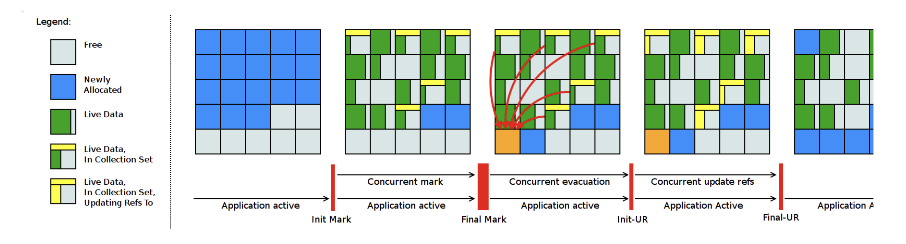
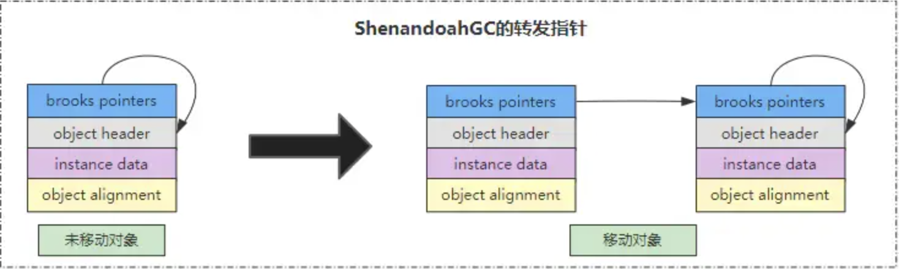
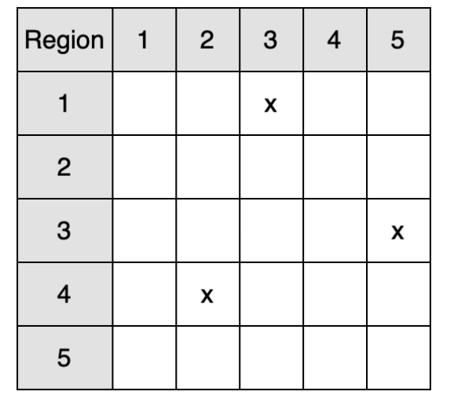

# Shenandoah GC是什么

Shenandoah GC是在jdk12中（jep 189:https://openjdk.org/jeps/189）作为一个实验功能推出的新一个GC算法，由redHat贡献，在之后的LTS——jdk17中正式发布。今天我们就来简单介绍一下这个新的GC算法

>Shenandoah GC名字来源于一首歌《Shenandoah》中文译名情人渡，这首歌十九世纪初起源于[密西西比河](https://baike.baidu.com/item/密西西比河/0?fromModule=lemma_inlink)和[密苏里河](https://baike.baidu.com/item/密苏里河/0?fromModule=lemma_inlink)流域之间，歌曲讲述了一位富有年轻英俊的商人爱上了印第安族长Shenandoah的女儿。歌曲深受水手们喜爱，于是随着他们的航程相传，十九世纪四十年代前，第一次在美国广为流传。Shenandoah现是一条小河的名称，全长40英里，在美国滨州和[乔治亚州](https://baike.baidu.com/item/乔治亚州/0?fromModule=lemma_inlink)的阿帕拉契山脉间。因为Shenandoah太有名，整个区域的国家公园也是以“Shenandoah”命名


## 1、什么是Shenandoah GC

Shenandoah 是一款低暂停时间垃圾收集器，它通过与正在运行的 Java 程序同时执行更多垃圾收集工作来减少 GC 暂停时间(亚毫秒级)。Shenandoah 会同时执行大部分 GC 工作，包括并发压缩，这意味着它的暂停时间不再与堆的大小成正比。垃圾收集 200 G的堆或 2 G的堆应该都会有类似的低暂停行为。

 `ShenandoahGC`的内存布局与G1很相似，也会将堆内存划分为一个个 大小相同的`Region`区域，也同样有存放大对象的`Humongous`区，但是不同的是，每个区域并不与任何代相关联，在 `G1` 中，每个`Region`区域都与年轻代、老年代和大对象相关联，所以`ShenandoahGC`和`ZGC`一样，也没有实现分代的架构，所以在触发GC时也不会有新生代、年老代之说，只会存在一种覆盖全局的GC类型。`ShenandoahGC`是基于`forwarding pointer`转发指针实现。

这里多说一句在jdk21正式推出了有分代的ZGC，只需要用参数`ZGenerational`来控制使用分代ZGC还是不分代ZGC，在jdk21代码中分代ZGC叫XGC：

```c++
CollectedHeap* ZSharedArguments::create_heap() {
  if (ZGenerational) {
    return ZArguments::create_heap();
  } else {
    return XArguments::create_heap();
  }
}
```

有意思的是虽然ShenandoahGC是在jdk12中首次发布的，但是后面又兼容了JDK11和JDK8，也就是说理论上我们是可以在JDK11和JDK8中使用ShenandoahGC，不过具体要看不同版本jdk的支持：

- Red Hat
  - Fedora 24+ OpenJDK 8+ 版本包含 Shenandoah
  - RHEL 7.4+ 附带 OpenJDK 8+，其中包含 Shenandoah 作为 技术预览
  - 适用于 Windows 的 Red Hat OpenJDK 8u 版本 包括 Shenandoah
- Amazon
  - 从 OpenJDK 11.0.9 开始，Shenandoah 在 Amazon Corretto 中推出
- Oracle
  - 在任何版本中均不附带包括 OpenJDK 版本和专有版本
- Azul
  - 从 OpenJDK 11.0.9 开始，Shenandoah 将在 Azul Zulu 中推出
- SAP
  - Shenandoah 从 SapMachine 17 开始提供并支持
- AdoptOpenJDK
  - 从 OpenJDK 11.0.9 开始，Shenandoah 以默认二进制文件形式发布
- Linux 发行版
  - Debian 从 OpenJDK 11.0.9 开始提供 Shenandoah
  - Gentoo 针对 IcedTea 的 ebuild 有 Shenandoah USE 标志
  - 基于 RHEL/Fedora 的发行版或使用其软件包的其他发行版也可能启用了 Shenandoah。值得注意的是，CentOS、 [Oracle Linux和 Amazon Linux都附带了它。


## 2、Shenandoah GC的参数

Shenandoah GC参数比较多，在jdk源码`hotspot/share/gc/shenandoah/shenandoah_globals.hpp`

中可以看到他的全部参数，大概有61个参数，太多了，我们选其中重点的参数说说。

- `-XX:+UseShenandoahGC`：启用 Shenandoah GC
- `-XX:ShenandoahGCMode`：使用的 GC 模式，有三个选项：

>1. **satb**。此模式使用 Snapshot-At-The-Beginning (SATB) 标记运行并发 GC。此标记模式与 G1 所做的类似：拦截写入并通过“上一个”对象进行标记。
>2. **iu**（实验性）此模式使用增量更新 (IU) 标记运行并发 GC。此标记模式与 SATB 模式相同：拦截写入并通过“新”对象进行标记。这可能会使标记不那么保守，尤其是在访问弱引用时。
>3. **passive**此模式运行 stop-the-world GC。此模式用于功能测试，但有时它对于使用 GC 屏障二分性能异常或确定应用程序中的实际实时数据大小很有用。

默认是`satb`:

```c++
product(ccstr, ShenandoahGCMode, "satb",                                  \
        "GC mode to use.  Among other things, this defines which "        \
        "barriers are in in use. Possible values are:"                    \
        " satb - snapshot-at-the-beginning concurrent GC (three pass mark-evac-update);"  \
        " iu - incremental-update concurrent GC (three pass mark-evac-update);"  \
        " passive - stop the world GC only (either degenerated or full)") \
```

- `-XX:ShenandoahGCHeuristics=<heuristic>`：设置 Shenandoah 的启发式策略

选择后，启发式策略会告知 Shenandoah 何时启动 GC 周期，以及它认为需要撤离的区域。一些启发式策略接受配置参数，这可能有助于更好地根据您的用例定制 GC 操作。可用的启发式方法包括：

>1、**adaptive** 
>
>此启发式策略会观察之前的 GC 周期，并尝试启动下一个 GC 周期，以便在堆耗尽之前完成.有用参数包括：
>
>1.1. `-XX:ShenandoahInitFreeThreshold`：触发“学习”收集的初始阈值，这个参数以百分比的形式设定了在一些启发式方法触发初始（学习）周期之前应该释放的堆内存大小。当堆内存的空闲空间达到这个阈值时，垃圾回收器就会启动新的垃圾回收周期。这个参数的设定会影响到虚拟机启动时以及在发生剧烈状态变化后的垃圾收集周期频率，例如，退化或完成的垃圾收集周期之后，默认为70%，这里可以理解为一次GC周期的结束标志即空闲的空间大于等于堆的70%就算一次GC的结束
>1.2. `-XX:ShenandoahMinFreeThreshold`：启发式策略无条件触发 GC 的可用空间阈值，默认为10%，也就是说可用空间低于10% Shenandoah gc就会触发GC无论这个学习策略是如何的，只要堆低于10%可用都会触发GC
>1.3. `-XX:ShenandoahAllocSpikeFactor`：为吸收分配峰值保留多少堆，当堆内存的使用率超过这个百分比时，垃圾收集器就会启动新的垃圾收集周期，默认为5%
>1.4. `-XX:ShenandoahGarbageThreshold`：设置`Region`区域在被标记为收集之前需要包含的垃圾百分比默认为25%，也就是某个`Region`区域的垃圾比例超过25%就会被标记会需要回收的`Region`区域
>
>2、**static**
>
>此启发式策略根据堆占用情况决定启动 GC 周期。有用参数包括：
>
>2.1. `-XX:ShenandoahMinFreeThreshold`：启发式策略无条件触发 GC 的可用空间阈值，默认为10%，也就是说可用空间低于10% Shenandoah gc就会触发GC无论这个学习策略是如何的，只要堆低于10%可用都会触发GC
>2.2. `-XX:ShenandoahGarbageThreshold`：设置`Region`区域在被标记为收集之前需要包含的垃圾百分比默认为25%，也就是某个`Region`区域的垃圾比例超过25%就会被标记会需要回收的`Region`区域
>
>3、**compact**
>
>此启发式策略连续运行 GC 周期，只要发生分配，上一个周期一结束就立即开始下一个周期。此启发式方法通常会产生吞吐量开销，但应提供最迅速的空间回收。有用参数是：
>
>3.1. `-XX:ConcGCThreads` 减少并发 GC 线程数，为应用程序运行腾出更多空间
>3.2. `-XX:ShenandoahAllocationThreshold`：设置自上一个 GC 周期以来分配的内存百分比，然后再启动另一个 GC 周期
>
>4、**aggressive**
>
>此启发式策略告诉 GC 完全处于活动状态。它会在前一个 GC 周期结束后立即启动新的 GC 周期（如“紧凑”）， *并* 撤离所有活动对象。此启发式方法对于收集器本身的功能测试很有用。它会导致严重的性能损失

默认是adaptive（自适应，这里可以看到这个很像是G1的GC，根据期望时间来调整）：

```c++
product(ccstr, ShenandoahGCHeuristics, "adaptive",                        \
        "GC heuristics to use. This fine-tunes the GC mode selected, "    \
        "by choosing when to start the GC, how much to process on each "  \
        "cycle, and what other features to automatically enable. "        \
        "Possible values are:"                                            \
        " adaptive - adapt to maintain the given amount of free heap "    \
        "at all times, even during the GC cycle;"                         \
        " static -  trigger GC when free heap falls below the threshold;" \
        " aggressive - run GC continuously, try to evacuate everything;"  \
        " compact - run GC more frequently and with deeper targets to "   \
        "free up more memory.")       
```

- `-XX:+ShenandoahPacing`：如果应用程序的内存分配速度过快，可能会导致 GC 没有足够的时间来进行垃圾回收，从而最终导致内存分配失败，也就是常说的 OutOfMemoryError。为了解决这个问题，Shenandoah 提供了一种可选的节制机制，即通过 `ShenandoahPacing` 参数来控制。当 `ShenandoahPacing` 参数设为 `true` 时，如果 GC 预测在不久的将来可能会发生内存分配失败，那么 GC 会主动减慢应用程序的内存分配速度，以腾出时间和空间进行垃圾回收。这种机制可以在维护应用程序的响应性的同时，防止内存分配失败，默认为true：

```c++
product(bool, ShenandoahPacing, true, EXPERIMENTAL,                       \
        "Pace application allocations to give GC chance to start "        \
        "and complete before allocation failure is reached.")      
```

- `-XX:ShenandoahPacingMaxDelay`：启用 `-XX:+ShenandoahPacing`时，`-XX:ShenandoahPacingMaxDelay` 控制了 GC 在尝试通过降低应用程序的内存分配速度来防止内存分配失败时，能够接受的最大延迟。但是同时，降低内存分配速度也意味着增加了 GC 在内存分配路径中的延迟。如果获得更大的延迟阈值，虽然可以提供更强的防止内存耗尽的能力，但也代价就是增加了隐藏在内存分配过程中的 GC 延迟。如果该参数设置为一个足够大的值，那么在极端情况下，GC 可以通过无限期地阻塞线程来防止内存分配失败，从而避免触发退化 GC（Degenerate GC）或全量 GC（Full GC）,默认为10ms:

```c++
product(uintx, ShenandoahPacingMaxDelay, 10, EXPERIMENTAL,                \
        "Max delay for pacing application allocations. Larger values "    \
        "provide more resilience against out of memory, at expense at "   \
        "hiding the GC latencies in the allocation path. Time is in "     \
        "milliseconds. Setting it to arbitrarily large value makes "      \
        "GC effectively stall the threads indefinitely instead of going " \
        "to degenerated or Full GC.")    
```

- `-XX:ShenandoahDegeneratedGC`:退化 GC,在 Shenandoah GC 中，"退化GC `Degenerated GC`和`full GC`是两种在面临资源压力时的降级策略。`Degenerated GC`其实就是让 GC 在运行过程中执行更多的工作，以清理更多的垃圾。这能比全面的 GC 降低系统暂停的时间，但可能会导致应用程序的吞吐量稍微降低。而 `full GC` 则是最重的 GC 方式，它将暂停应用程序的所有线程，并且执行完整的垃圾回收。这可能会导致系统暂停时间较长，但可以最大化清理垃圾。这个参数 `ShenandoahDegeneratedGC` 的作用就是控制 Shenandoah 在面临压力时选择优雅降级的策略：是选择`Degenerated GC`，还是直接进行`full GC`。如果该参数设为 `true`，则选择`Degenerated GC`；如果设为 `false`，则选择`full  GC`。在启发策略是`passive`下，这个参数可以用于度量`Degenerated GC`和`full  GC`的相对成本，以便开发者和运维人员进行性能评估和调优，默认是启用

```c++
product(bool, ShenandoahDegeneratedGC, true, DIAGNOSTIC,                  \
        "Enable Degenerated GC as the graceful degradation step. "        \
        "Disabling this option leads to degradation to Full GC instead. " \
        "When running in passive mode, this can be toggled to measure "   \
        "either Degenerated GC or Full GC costs.")  
```


## 3、Shenandoah GC的GC流程

上文介绍了，Shenandoah GC和G1一样是以region为单位来维护堆的，他的一次GC流程如下：



1. **Init Mark**（初始标记） 

   启动并发标记。它为并发标记准备堆和应用程序线程，然后扫描`GCRoots`。这是GC中的第一个STW，最主要的消费者是`GCRoots`扫描。因此，其持续时间取决于`GCRoots`大小。

2. **Concurrent Ma∂rking** （并发标记）

   遍历堆并跟踪可访问对象。此阶段与应用程序同时运行，其持续时间取决于堆中活动对象的数量和对象图的结构。由于应用程序在此阶段可以自由分配新数据，因此并发标记期间堆占用率会上升。

3. **Final Mark**（最终标记）

   通过清空所有待处理的标记/更新队列并重新扫描`GCRoots`来完成并发标记。它还通过确定要清空的区域（集合集）、预先清空一些根来初始化清空，并为下一阶段准备运行时。这项工作的一部分可以在**并发预清理**阶段并发完成。这是周期中的第二次STW，这里最主要的时间消费者是清空队列和扫描`GCRoots`。 

4. **Concurrent Cleanup**（并发清理）

   会回收即时垃圾区域 - 即并发标记后检测到的不存在活动对象的区域。

5. **Concurrent Evacuation**（并发疏散）

   将对象从收集集复制到其他区域。这是与其他 OpenJDK GC 的主要区别。此阶段再次与应用程序一起运行，因此应用程序可以自由分配。其持续时间取决于循环所选收集集的大小。

6. **Init Update Refs**（初始化更新引用）

   它几乎不做任何事情，只是确保所有 GC 和应用程序线程都已完成撤离，然后为下一阶段准备 GC。这是周期中的第三次STW，也是所有STW中最短的一次。

7. **Concurrent Update References**（并发更新引用）

   遍历堆，并更新对并发撤离期间移动的对象的引用。 这是与其他 OpenJDK GC 的主要区别。 它的持续时间取决于堆中的对象数量，而不是对象图结构，因为它线性扫描堆。此阶段与应用程序同时运行。

8. **Final Update Refs** （最终更新引用）

   通过重新更新现有`GCRoots`来完成更新引用阶段。它还会回收集合中的区域，因为现在堆不再有对（过时的）对象的引用。这是循环中的最后一次暂停，其持续时间取决于`GCRoots`的大小。

9. **Concurrent Cleanup** （并发清理回收）
与用户线程并发执行，会待回收区域中的存活对象复制到其他未使用的`Region`区中去，然后会将原本的`Region`区全部清理并回收。这里使用的GC算法是并发标记-压缩（Concurrent Mark-Compact）算法

这里可以看到，其他流程和G1大差不差，区别就是在并发疏散和最后的回收阶段，Shenandoah GC的并发疏散阶段或者说压缩阶段，是可以和用户线程一起进行的，但是G1是需要stw的，最后回收阶段也是G1是stw的，而Shenandoah GC则是可以和用户线程一起进行。

那为什么G1需要stw而Shenandoah不用呢？那是因为Shenandoah解决了如下两个问题：

1、压缩中由于不会stw，如果一个对象被复制到新的区域，用户线程通过原本指针访问时如何定位对象呢？

2、在并发回收过程中，如果复制的时候出现了安全性问题怎么办？

那么Shenandoah GC是怎么解决这两个问题的呢？答案就是上文提到的`forwarding pointer`转发指针

所谓的转发指针就是在每个对象的对象头前面添加了一个新的字段（在对象头第一位的往前走8位），也就是对象头前面多了根指针。对于未移动的对象而言，指针指向的地址是自己，但对于移动的对象而言，该指针指向的为对象新地址中的`ForwardingPointers`转发指针:



使用转发指针的时候会在读取和写入的时候新增一个读屏障（以X86为例）：

```
mov %rax，（%rax，-8）
```

当读取一个对象的引用时，读屏障会先查看目标对象是否有设置转发指针。如果有，那说明这个对象已经被移动，那么就使用转发指针找到新的位置并更新引用。这样就可以保证我们读取到的对象都是最新的

Shenandoah GC通过这种技术解决了被移动对象的访问问题，但带来弊端也很明显，即需要更多内存。在最坏的情况下，对于没有任何有效负载的对象，对于原本只有两个字的对象，这会增加一个字。这增加了 50%。使用更现实的对象大小分布，您最终仍需要多 5%-10% 的开销。这也会导致性能下降：分配相同数量的对象会比没有该开销时更快地达到上限——更频繁地提示 GC——从而降低吞吐量

然后是安全性问题，这里的安全就是指线程安全，情况如下：

- 1、GC线程正在复制旧对象去到新的区域。
- 2、用户线程此时更新了原本对象的数据。
- 3、GC线程将原本旧对象的转发指针指向新对象的转发指针。

分析如上情况可以得知，因为GC线程已经复制对象了，只是还没来得及更新旧对象的转发指针，所以导致了用户操作落到了旧对象上面，从而出现了安全问题。而Shenandoah GC中则采用读、写屏障确保了步骤1、3是原子性的，从而解决了该问题。

这里再简单说下Shenandoah GC如何处理跨region引用的，在G1中是使用了RSet记忆集来实现的，忘了的读者可以复习笔者写过的G1 GC源码探究部分，Shenandoah GC没有记忆集，而是用链接矩阵来代替：

连接矩阵可以简单理解为一个二维表格，如果Region A中有对象指向Region B中的对象，那么就在表格的第A行第B列打上标记。

比如，Region 1指向Region 3，Region 4指向Region 2，Region 3指向Region 5：



相比G1的记忆集来说，连接矩阵的颗粒度更粗，直接指向了整个Region，所以扫描范围更大。但由于此时GC是并发进行的，所以这是通过选择更低资源消耗的连接矩阵而对吞吐进行妥协的一项决策。


## 4、分代Shenandoah GC

上文说到了Shenandoah GC和ZGC一样不区分年轻代老年代等，但是在JDK21中有了分代ZGC，说明分代对比不分代还是有一些优势的，于是Shenandoah GC也有了分代Shenandoah GC：https://openjdk.org/jeps/404

在jep中开发者详细阐述了为什么要开发分代Shenandoah GC：

>The main goal is to provide an experimental generational mode, without breaking non-generational Shenandoah, with the intent to make the generational mode the default in a future release.
>
>Other goals are set relative to non-generational Shenandoah:
>
>- Reduce the sustained memory footprint without sacrificing the low GC pauses.
>- Reduce CPU and power usage.
>- Decrease the risk of incurring degenerated and full collections during allocation spikes.
>- Sustain high throughput.
>- Continue to support compressed object pointers.
>- Initially support x64 and AArch64, with support for other instruction sets added as this experimental mode progresses to readiness as the default

大概意思就是为了解决上文中我们提到的Shenandoah GC的一些缺点：高CPU、高内存使用（对比G1和ZGC）以及会影响服务的吞吐量。

但是分代Shenandoah GC不会取代原来的Shenandoah GC，因为开发者相信有的服务会在单一代代Shenandoah GC上表现更好，只是默认的Shenandoah GC会改成分代Shenandoah GC。

目前分代Shenandoah GC已经开发完毕，不过在jdk21中并没有发布，而是被删除了：


Roman Kenke就是单代Shenandoah GC的作者，他建议跳过JDK21，因为他觉得目前分代Shenandoah GC还没有达到最佳状态，不过预计我们很快就能够就能和分代Shenandoah GC见面了。


## 5、关于Shenandoah GC的资料

虽然距离JDK17发布已经三年了，但是网上关于Shenandoah GC的中文资料还是比较少的，并且内容也不多，这里推荐几篇redHat和openjdk官方关于Shenandoah GC的一些文档，也是本文的参考文档：

https://wiki.openjdk.org/display/shenandoah/Main

https://developers.redhat.com/blog/2019/06/27/shenandoah-gc-in-jdk-13-part-1-load-reference-barriers?p=602377

