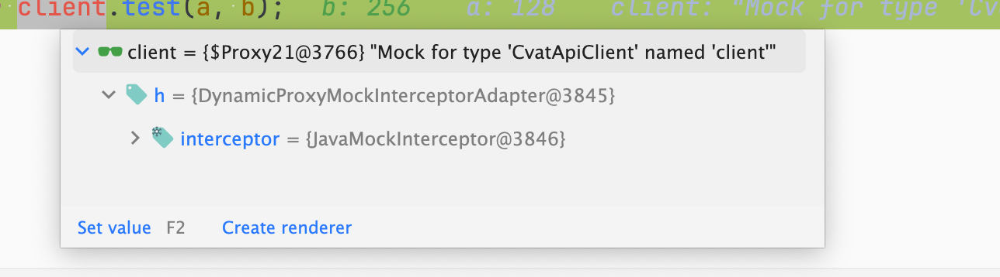
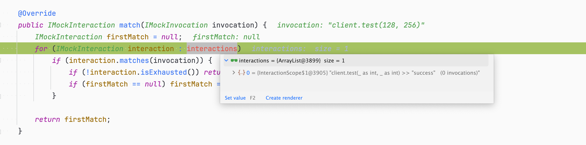
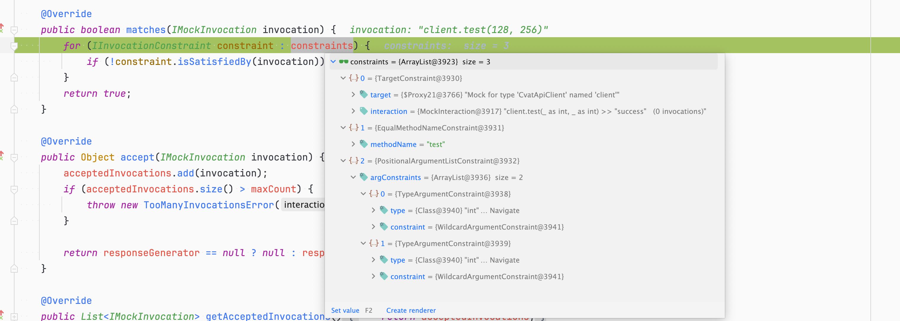
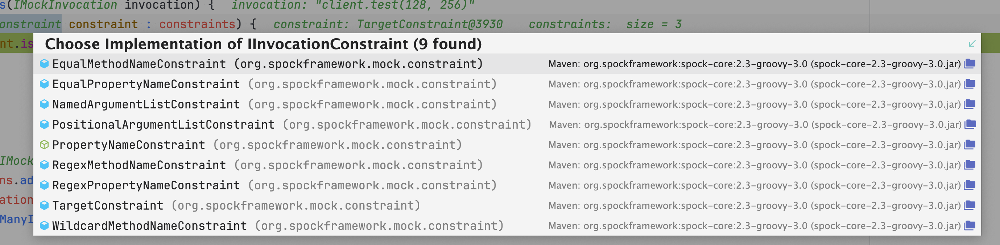
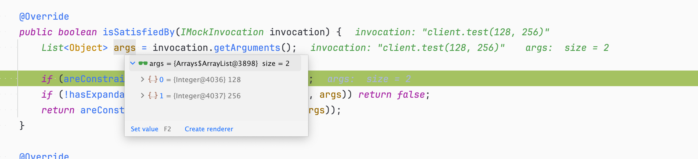
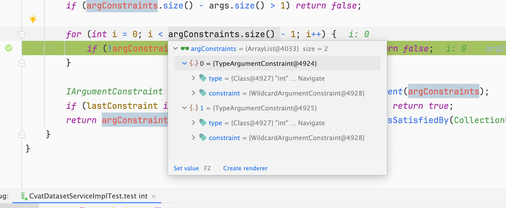
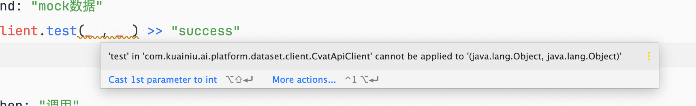
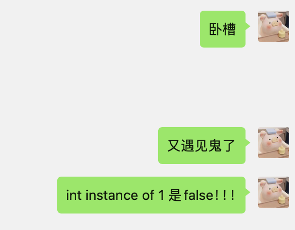
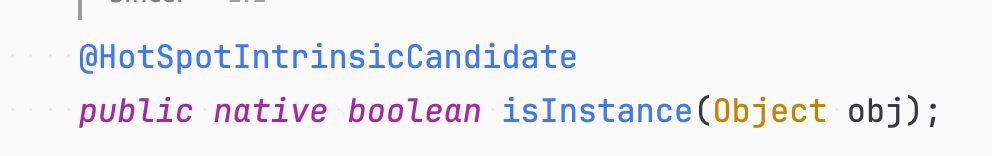
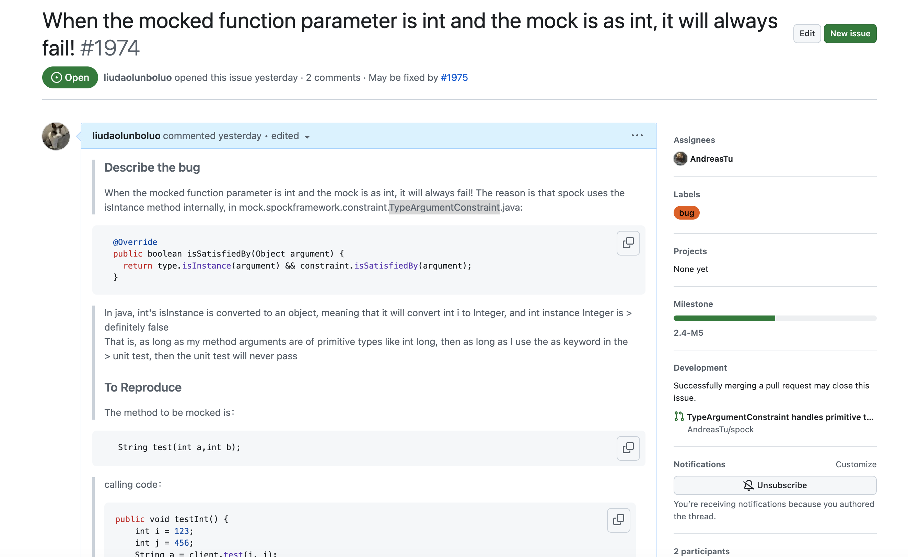

# Spock无法mock指定方法

## 1、问题描述

最近用spock写单元测试的时候，突然发现spock无法mock指定的方法，我明明在and里指定了方法的返回值，但是在运行单元测试后中返回值就是null，导致单元测试无法通过，我的被测试的方法大概如下：

```java
    public String test() {
        int a = 128;
        int b = 256;
        return client.test(a, b);
    }
```

client test方法如下：

```java
 public  String test(int a, int b){
   ...do something
   }
```

然后我的单元测试如下：

```groovy
    def "test int"() {
        given: "准备参数"


        and: "mock数据"
        client.test(_ as int, _ as int) >> "success"


        when: "调用"
        def result = cvatDatasetService.test()


        then: "验证数据"
        result == "success"


    }
```

这里我把代码简化了，尽量让大家轻松看懂。可以看到，代码非常的简单，但是在实际测试中`client.test`返回的就是null，导致单元测试无法通过，报错：

```
Condition not satisfied:

result == "success"
|      |
null   false
```

这里我就纳闷儿了，这个单元测试看起来没问题啊。

我们静下心来分析，无非就是我们mock的方法没有生效，导致返回了null（实际代码里，client是一个feign客户端，所以是一个接口，所以并没有进入到原来的方法逻辑）

百思不得其解下我决定自己debug看一下，排查一下为啥spock mock方法没有生效。


## 2、排查过程

这里我们先简单过下mock方法的原理，其实就是用一个代理类来代理我们被模拟的类，然后在这个代理类中实现指定的方法，这个方法返回值写死为我们设置的值就行了，所以我们第一步是找到代理类，我们打一个断点然后查看这个client就可以找到代理类啦：



这里可以看到，在代理类之前还有一个拦截器，所以我们直接先查看这个拦截器：`JavaMockInterceptor`

F5进入之后我们就进入到了`JavaMockInterceptor`的`intercept`方法中，在这个方法最后一行：

```java
return mockController.handle(invocation);
```

 中就是调用了`mockController`的`handle`来处理我们的mock逻辑。在`mockController`中会有一行代码：

```java
IMockInteraction interaction = scope.match(invocation);
```

字面意思就是找到匹配的mock，所以我们F5再进去，进入之后发现，果然这里会遍历刚刚我们在单元测试中设置的mock条件，然后看当前方法是否匹配这些mock条件：



这里每个在单元测试的and里mock都会和当前方法做match匹配看是否匹配，如果匹配则会执行我们的mock逻辑，这里有有一个match：

进入之后发现这里会对三个constraints也就是限制条件 做比对；



然后每个条件对应一个校验器，当前方法和当前设置mock会依次做对比，如果都匹配那么就说明当前方法要被mock


这里限制条件校验器是一个接口`IInvocationConstraint`，他的实现类有：



可以看到不同的限制条件对应不同的校验器。

我们的问题应该就出在这里，我们的方法没有被mock，那么就说明这里有限制条件不满足，所以我们依次看看三个限制条件哪个不满足：

这里第一个限制条件是类型的类型以及名称，意思是当前方法所在的类以及名称都要匹配，这里用到的校验器是`TargetConstraint`也就是目标校验器，这里是通过的，肯定没问题

第二个限制条件是方法名称，对应的校验器是`EqualMethodNameConstraint`就是比对我们的方法名称是否一致，这个进入之后也是通过的，方法名都是"test"

那问题肯定出在第三个限制条件，第三个限制条件就是我们的参数校验器，也就是校验我们当前方法的参数数量和类型是否一致，这是避免方法的重载的情况，所以我们进入`PositionalArgumentListConstraint`校验器中：



这里会把当前被测试类中的所有参数以及类型都列出来，然后去和mock的方法做比较，我们一行一行的排查看是哪一行返回了false就行了，经过测试问题出在了：

```java
if (areConstraintsSatisfiedBy(args)) return true;
```

这里一行，这个`areConstraintsSatisfiedBy`方法返回了false，这个方法如下：

```java
  private boolean areConstraintsSatisfiedBy(List<Object> args) {
    if (argConstraints.isEmpty()) return args.isEmpty();
    if (argConstraints.size() - args.size() > 1) return false;

    for (int i = 0; i < argConstraints.size() - 1; i++) {
      if (!argConstraints.get(i).isSatisfiedBy(args.get(i))) return false;
    }

    IArgumentConstraint lastConstraint = CollectionUtil.getLastElement(argConstraints);
    if (lastConstraint instanceof SpreadWildcardArgumentConstraint) return true;
    return argConstraints.size() == args.size() && lastConstraint.isSatisfiedBy(CollectionUtil.getLastElement(args));
  }
```

也就是遍历我们的mock的时候设置的mock条件中的参数约束来和当前运行的方法的参数做比对，如果满足mock条件中的参数约束则通过，这里会首先校验参数个数，我们参数个数肯定是通过的都是两个，下一步就是每个参数一一进行比对，就是：

```java
  if (!argConstraints.get(i).isSatisfiedBy(args.get(i))) return false;
```

这一行中

这里我们先看下我们的参数约束是什么：



第一个的type对应的是我们as里的类型约束，这里是int，这个as是idea帮我加上的，如果你不写as直接写`_`就会警告：



又因为笔者有强迫症见不得警告所以就给加上了，其实加上也没有问题，更严谨了。第二个中的`WildcardArgumentConstraint`即通配符参数约束，也就是`_`这种通配符的约束，我们先看看这个类型约束里是如何判断的：

```java
  public boolean isSatisfiedBy(Object argument) {
    return type.isInstance(argument) && constraint.isSatisfiedBy(argument);
  }
```

第一个是用看类型是否匹配，第二个是看约束是否满足，由于我们的约束都是通配符所以肯定是true的，所以这里凶手就是：`type.isInstance(argument)`!!!

这里`type`就是Class对象，所以这里就是很简单的调用`Class`对象的`isInstance`方法

这里`type`就是as的限制也就是`int`，`argument`就是我们传递的真实参数，这里就是`128`,那么这里128就是int啊，我在外面定义了`int a=128`那么这里和`int`比较那肯定是true，那为什么是false呢？？这里笔者也纳闷了：



直呼遇见鬼了

我们把代码抽象成如下：

```java
Class<?> type = int.class;
int i = 1;
System.out.println(type.isInstance(i));
```

笔者问了周围的十个人，有九个人一口答的都是true，包括笔者，但是运行之后是false，那么为什么呢？

我们反编译一下就知道答案了：


这里自动装箱了！！所以这里实际上是`int`和`Integer`进行比较，那肯定是false，`int`是原始类型，`Integer`是包装类型，肯定不一样。之所以自动装箱是因为：



`isInstance`这个方法接受的参数是`Object`所以原始类型会自动转换为对象。

所以可以解释为什么这里不匹配了，返回false，导致我们的方法没有被mock

## 3、解决方案

这里笔者首先想到的是把`_ as int`改成`_ as Integer `或者直接`_`通配符，但是仔细一想不对啊，我的参数就是`int`我干嘛要改呢，于是这里其实就是spock的一个bug，他参数限制不支持基本数据类型。根据刚刚的结论`long` 、`shot`这些基本类型肯定也有问题，于是去github上给spock提了一个issue：https://github.com/spockframework/spock/issues/1974



spock的开发人员虽然有点嘴硬，但是很快修复了代码提了pr：https://github.com/spockframework/spock/pull/1975

这里可以看下代码，就是如果是原始类型则用原始类型的包装类型来进行`isInstance`判断：


所以算笔者发现的spock的一个bug