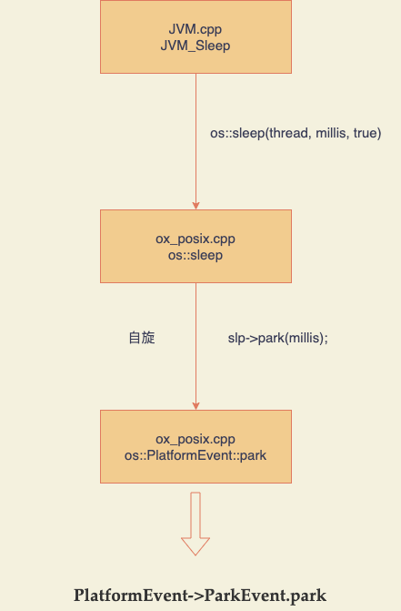
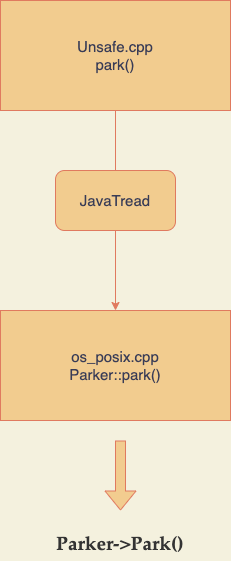

# Thread.sleep和LockSupport.parkNanos到底怎么选


## 1、背景

  上周在做一个需求的时候需要用到线程阻塞，需求背景大概是这样的：在代码里我需要启动一个文档服务类似于腾讯文档飞书文档这样的，然后这个这个服务会为每个用户启动一个单独的实例，实例会直接运行在K8S上，然后这个实例启动之后为需要给这个实例上传一个类似于ReadMe的说明文档，但是有个问题是这个实例没有完全启动成功的话我上传文档就会失败，调用启动实例的接口也只是让实例开始启动，真正的启动流程是异步的，所以我就需要线程阻塞等到几秒让实例完全启动然后再上传文档。所以我就有个几个选择：1、让线程自旋，也就是for循环里去查询服务启动状态，直到服务状态返回启动成功为止，为了防止死循环，给定一个最大循环次数；2、让线程暂停等到几秒来等待实例的完全启动；

  我第一考虑的是使用自旋，因为我本来就是在异步线程里（我会给定一个状态“启动中”，然后用户点击启动之后我只是把状状态改为启动中，然后在异步线程里真正去启动）操作的，所以自旋也还能接受，但是由于等到启动的时间太长了，我要自旋查询一百多次才能启动完毕，为了避免无效的网络IO所以pass掉了这个方案，下一个方案就是让线程等待几秒。

  让线程等待几秒就是让线程从running状态变为wait状态，并且这里需要指定等待时间让线程自己醒过来，根据八股文我们知道有下列几个方法可以实现：

`Thread.sleep`、`Thread.yield`、`Object.wait()`、`LockSupport.`parkNanos或者untilPark

`Object.wait()`需要对应的`notify`来唤醒，`LockSupport.park`同理，我们这里尽量简单化，就在当前线程里阻塞然后让线程自己醒来就可以了。所以pass掉

`Thread.yield`是让出CPU，然后重新等待CPU调度，其实这里好像还是挺合适的，我们在等待服务完全启动的时候就可以不占用CPU资源，但是这里重新开始执行的时间不固定也不能指定完全依赖于CPU调度，所以可能会造成过早的唤醒。

所以我们现在就剩下两个选择：`Thread.sleep`和`LockSupport.parkNanos(untilPark差不多)`，那么我们怎么选呢？

简单来说两个方法都是让线程暂停几秒，但是他们有什么区别呢？我们怎么选择呢？本着打破砂锅问到底的态度，我们从两个方法的底层实现来看看他们有什么异同，从而来选择最适合我们当前场景的方法。


## 2、Thread.sleep的底层原理

点击进`Thread`里我们可以看到：

```java
public static native void sleep
```

sleep方法是navive方法，是直接调用的底层jvm的代码，这里我们简单看下native源码怎么查找的。每个有native方法的java类一定对应一个`.c`的C语言文件，所以我们在jdk的源码中找到`Thread.c`：

```c
#include "jni.h"
#include "jvm.h"

#include "java_lang_Thread.h"

#define THD "Ljava/lang/Thread;"
#define OBJ "Ljava/lang/Object;"
#define STE "Ljava/lang/StackTraceElement;"
#define STR "Ljava/lang/String;"

#define ARRAY_LENGTH(a) (sizeof(a)/sizeof(a[0]))

static JNINativeMethod methods[] = {
    {"start0",           "()V",        (void *)&JVM_StartThread},
    {"stop0",            "(" OBJ ")V", (void *)&JVM_StopThread},
    {"isAlive",          "()Z",        (void *)&JVM_IsThreadAlive},
    {"suspend0",         "()V",        (void *)&JVM_SuspendThread},
    {"resume0",          "()V",        (void *)&JVM_ResumeThread},
    {"setPriority0",     "(I)V",       (void *)&JVM_SetThreadPriority},
    {"yield",            "()V",        (void *)&JVM_Yield},
    {"sleep",            "(J)V",       (void *)&JVM_Sleep},
    {"currentThread",    "()" THD,     (void *)&JVM_CurrentThread},
    {"countStackFrames", "()I",        (void *)&JVM_CountStackFrames},
    {"interrupt0",       "()V",        (void *)&JVM_Interrupt},
    {"isInterrupted",    "(Z)Z",       (void *)&JVM_IsInterrupted},
    {"holdsLock",        "(" OBJ ")Z", (void *)&JVM_HoldsLock},
    {"getThreads",        "()[" THD,   (void *)&JVM_GetAllThreads},
    {"dumpThreads",      "([" THD ")[[" STE, (void *)&JVM_DumpThreads},
    {"setNativeName",    "(" STR ")V", (void *)&JVM_SetNativeThreadName},
};

```

我们可以看到这里`sleep`方法对应的是`JVM_Sleep`，所以这里`Thread.sleep`调用的实际上是`jvm.cpp`的`JVM_Sleep`方法，那么我们就看一下`jvm.cpp`：

```c++
JVM_ENTRY(void, JVM_Sleep(JNIEnv* env, jclass threadClass, jlong millis))
  JVMWrapper("JVM_Sleep");

		//参数校验
  if (millis < 0) {
    THROW_MSG(vmSymbols::java_lang_IllegalArgumentException(), "timeout value is negative");
  }

  ////如果线程已经中断，抛出异常，java里Thread.sleep需要抛出InterruptedException异常
  if (Thread::is_interrupted (THREAD, true) && !HAS_PENDING_EXCEPTION) {
    THROW_MSG(vmSymbols::java_lang_InterruptedException(), "sleep interrupted");
  }

  //设置线程状态为SLEEPING，并在结束的时候恢复
  JavaThreadSleepState jtss(thread);

	//hotspot虚拟机线程休眠开始点，主要为了计时
  HOTSPOT_THREAD_SLEEP_BEGIN(millis);

	//定规一个线程休眠事件
  EventThreadSleep event;

  //如果时间是0就执行OS的naked_yield方法,naked_yiel的作用是让系统查看是否有其他线程迫切需要CPU，将CPU让给其他线程，如果没有其他线程则立即返回。
  if (millis == 0) {
    os::naked_yield();
  } else {
    //保存初始状态，返回时恢复原状态
    ThreadState old_state = thread->osthread()->get_state();
    //设置Sleep状态
    thread->osthread()->set_state(SLEEPING);
     //调用os::sleep方法，如果发生中断，抛出异常
    if (os::sleep(thread, millis, true) == OS_INTRPT) {
      //可能会产生异常例如ThreadDeathException。我们在休眠的时候不会覆盖这种异常
      if (!HAS_PENDING_EXCEPTION) {
        //如果事件可以提交则提交thread_sleep_event
        if (event.should_commit()) {
          post_thread_sleep_event(&event, millis);
        }
        //hotspot结束点
        HOTSPOT_THREAD_SLEEP_END(1);

        // TODO-FIXME: THROW_MSG returns which means we will not call set_state()
        // to properly restore the thread state.  That's likely wrong.
        //这里有个修复我的注释，就是这里不会去恢复线程状态，但是恢复原来的状态的话又可能是错误的状态
        THROW_MSG(vmSymbols::java_lang_InterruptedException(), "sleep interrupted");
      }
    }
    //复原原来的状态
    thread->osthread()->set_state(old_state);
  }
//如果事件可以提交则提交thread_sleep_event
  if (event.should_commit()) {
    post_thread_sleep_event(&event, millis);
  }
 //hotspot结束点
  HOTSPOT_THREAD_SLEEP_END(0);
JVM_END
```

这里单独说下`Thread.sleep(0)`这种情况，之前网上有篇文章很火的说是RocketMQ源码里有一段是`Thread.sleep(0)`，目的是为了新增安全点，因为调用native方法会增加安全点，但是我们看了`Thread.sleep`源码之后发现除了新增安全点之外`Thread.sleep(0)`还有个作用就是可以把CPU让出来，看有没有线程要使用CPU，没有的话就不让出CPU有的话就让出CPU，所以这里是有机会把CPU让给GC线程的。

这里我们可以看到在`jvm.cpp`中调用了`os::sleep`这里os就是不同操作系统的实现，这里我们看linux上的也就是`ox_posix.cpp`中：

```c++
int os::sleep(Thread* thread, jlong millis, bool interruptible) {
  assert(thread == Thread::current(),  "thread consistency check");
  //线程有如下几个成员变量:
  //ParkEvent * _ParkEvent ;          // for synchronized()
  //ParkEvent * _SleepEvent ;        // for Thread.sleep
  //ParkEvent * _MutexEvent ;      // for native internal Mutex/Monitor
  //ParkEvent * _MuxEvent ;         // for low-level muxAcquire-muxRelease

  ParkEvent * const slp = thread->_SleepEvent ;
  slp->reset() ;
  OrderAccess::fence() ;
	
  //可中断是true，上文中我们就是true
  if (interruptible) {
    jlong prevtime = javaTimeNanos();

    for (;;) {
      //判断是否中断
      if (os::is_interrupted(thread, true)) {
        return OS_INTRPT;
      }
			//获取当前时间
      jlong newtime = javaTimeNanos();
			//如果linux不支持monotonic lock,有可能出现newtime<prevtime，这里应该就是linux的时钟跳跃
      if (newtime - prevtime < 0) {
        // time moving backwards, should only happen if no monotonic clock
        // not a guarantee() because JVM should not abort on kernel/glibc bugs
        assert(!os::supports_monotonic_clock(), "unexpected time moving backwards detected in os::sleep(interruptible)");
      } else {
        millis -= (newtime - prevtime) / NANOSECS_PER_MILLISEC;
      }
			//认为到达指定睡眠时间，return返回OS_OK，退出死循环。
      if (millis <= 0) {
        return OS_OK;
      }

      prevtime = newtime;

      {
        assert(thread->is_Java_thread(), "sanity check");
        //拿到当前线程对象
        JavaThread *jt = (JavaThread *) thread;
        ThreadBlockInVM tbivm(jt);
        OSThreadWaitState osts(jt->osthread(), false /* not Object.wait() */);

        jt->set_suspend_equivalent();
       
				//这里才是真正的开始调用阻塞了，调用的是os::PlatformEvent::park
        slp->park(millis);

        //在等待时是否被外部暂停
        jt->check_and_wait_while_suspended();
      }
    }
  } else {
    //interruptible为false的情况暂时跳过
    ...
}
```

可以看到这里阻塞真正调用的是`os::PlatformEvent::park`方法：

```C++
int os::PlatformEvent::park(jlong millis) {
  // Transitions for _event:
  //   -1 => -1 : illegal
  //    1 =>  0 : pass - return immediately
  //    0 => -1 : block; then set _event to 0 before returning

  // Invariant: Only the thread associated with the Event/PlatformEvent
  // may call park().
  assert(_nParked == 0, "invariant");
	//信号量
  int v;
  // CAS原子递减_event的值int
  for (;;) {
    v = _event;
    if (Atomic::cmpxchg(v - 1, &_event, v) == v) break;
  }
  //类似Assert的宏，可以忽略；
  guarantee(v >= 0, "invariant");

  //用阻塞
  if (v == 0) {
    struct timespec abst;
    // We have to watch for overflow when converting millis to nanos,
    // but if millis is that large then we will end up limiting to
    // MAX_SECS anyway, so just do that here.
    //这里和上面的注释主要是为了毫微米转换为纳米
    if (millis / MILLIUNITS > MAX_SECS) {
      millis = jlong(MAX_SECS) * MILLIUNITS;
    }
    to_abstime(&abst, millis * (NANOUNITS / MILLIUNITS), false);

    int ret = OS_TIMEOUT;
    //获取_mutex成员变量表示的互斥锁
    int status = pthread_mutex_lock(_mutex);
    assert_status(status == 0, status, "mutex_lock");
    guarantee(_nParked == 0, "invariant");
    
    // 阻塞线程加一
    ++_nParked;

    // 如果递减之后event为-1则阻塞，否则立刻返回
    while (_event < 0) {
      //核心实现逻辑，最终的线程阻塞就是这个pthread_cond_timedwait函数，
      //pthread_cond_timedwait函数在_cond成员变量表示的条件变量上等待abst时间
      status = pthread_cond_timedwait(_cond, _mutex, &abst);
      assert_status(status == 0 || status == ETIMEDOUT,
                    status, "cond_timedwait");
     //OS级别的“虚假唤醒”被忽略，除非FilterSpuriousWakeups设置为false。那状态应该被废除。
      if (!FilterSpuriousWakeups) break;
      if (status == ETIMEDOUT) break;
    }
    // 阻塞线程减一
    --_nParked;

    //阻塞完成
    if (_event >= 0) {
      ret = OS_OK;
    }

    //重置
    _event = 0;
    //释放锁
    status = pthread_mutex_unlock(_mutex);
    assert_status(status == 0, status, "mutex_unlock");
    // Paranoia to ensure our locked and lock-free paths interact
    // correctly with each other.
    OrderAccess::fence();
    return ret;
  }
  return OS_OK;
}
```

这里知识点有点多，我们慢慢捋。

1、PlatformEvent；PlatformEvent首先是适用于特定于平台的一个基类，真正实现它的有两个，一个是`ParkEvent`,ParkEvent是用于java级别的synchronize关键字，还有一个是`Parker`，Parker是JSR166来的并发工具集合,

`ParkerEvent`中的park，unpark方法用于实现Java的object.wait()方法和object.notify()方法、Thread.sleep方法。使用ParkEvent可以使线程睡眠与唤醒。一个ParkEvent与一个线程的生命周期绑定，当线程结束时，ParkEvent会移到一个EventFreeList链表，而新创建的线程会在EventFreeList中查找ParkEvent，如果没有就分配新的ParkEvent。ParkEvent本身只有分配和释放接口，但是它继承了平台相关的PlaformEvent，因此它就有了PlatformEvent提供的park、unpark接口

`Parker中`的park，unpark方法用于实现Java的Locksupprt.park()方法和Locksupprt.unpark()方法。Parker的核心是_counter值的变化，_coutner也叫permit。如果permit可获得（为1），那么调用park的线程立刻返回，否则可能阻塞。调用unpark使permit可获得；调用park使permit不可获得。与之不同的是，信号量（Semaphore）的permit可以累加，而Parker只有可获得、不可获得两种状态，它可以被看作受限的信号量。

Parker主要用于实现JSR166的并发组件。之前提到过JDK有个Unsafe类，该类允许Java层做一些底层的工作，如插入内存屏障，Parker也是通过Unsafe类暴露API的

**简单来说，Thread.sleep是基于ParkerEvent的父类PlatformEvent的park实现的，而LockSupport.park是基于Parker实现的**

2、sleep最核心的sleep是通过pthread_cond_timedwait实现的，而不是通过linux的sleep实现的，相比于linux的sleep，pthread_cond_timedwait有如下优势：

- pthread_cond_timedwait既可以堵塞在某个条件变量上，也可以设置超时时间；
- linux的sleep不能及时唤醒线程,最小精度为秒；

可以看出pthread_cond_timedwait使用灵活，而且时间精度更高；

### 总结

`Thread.sleep`的调用链为：




## 3、LockSupport.parkNanos实现原理

`LockSupport.parkNanos`看源码可以看的是调用的`unsafe`的：

```java
public native void park(boolean isAbsolute, long time);
```

所以我们需要找到`unsafe`的native代码。`unsafe`的native代码和其他native方法不太一样的地方是实现都在`hotspot\src\share\vm\prims\Unsafe.cpp`中，并不是在正常的`jdk\src\share\native`目录下，其本地方法的注册通过JVM_RegisterUnsafeMethods方法实现，对应于Unsafe类的静态registerNatives本地方法，即当Unsafe类加载的时候就会通过上述方法完成Unsafe类中其他本地方法的注册。

我们找到`unsafe.cpp`的park方法：

```c++
UNSAFE_ENTRY(void, Unsafe_Park(JNIEnv *env, jobject unsafe, jboolean isAbsolute, jlong time)) {
  HOTSPOT_THREAD_PARK_BEGIN((uintptr_t) thread->parker(), (int) isAbsolute, time);
  EventThreadPark event;

  JavaThreadParkedState jtps(thread, time != 0);
  //核心代码实现park。
  thread->parker()->park(isAbsolute != 0, time);
  //下面和上面的sleep一样是发送事件的，重点不是这个
  if (event.should_commit()) {
    const oop obj = thread->current_park_blocker();
    if (time == 0) {
      post_thread_park_event(&event, obj, min_jlong, min_jlong);
    } else {
      if (isAbsolute != 0) {
        post_thread_park_event(&event, obj, min_jlong, time);
      } else {
        post_thread_park_event(&event, obj, time, min_jlong);
      }
    }
  }
  HOTSPOT_THREAD_PARK_END((uintptr_t) thread->parker());
} UNSAFE_END
```

实际上核心代码就只有一句：` thread->parker()->park(isAbsolute != 0, time);`这里的tread对象就是native层的JavaThread对象，JavaThread对象是java层面线程在JVM内部的代理，它们之间为一一对应关系，JavaThread和OSThread也是一一对应关系，从而java线程和OS线程也是一一对应关系。JavaThread在JVM内部也被称为NativeThread，简单来说JavaThread对象就是jvm中的操作系统的线程对象。

然后每个thread都有一个Parker的实例，在`thread.hpp`中:

```c++
// JSR166 per-thread parker
private:
  Parker*    _parker;
public:
  Parker*     parker() { return _parker; }
```


上文其实已经已经剧透了，`LockSupport.park`的底层实现是另外一个实现类`Parker`的park方法，所以这里关注Parker，我们上文介绍了Parker还是继承自PlatformParker，我们简单看看Parker的定义,Parker.hpp:

```c++
class Parker : public os::PlatformParker {
private:
  volatile int _counter ;
  Parker * FreeNext ;
  JavaThread * AssociatedWith ; // Current association
```

定义私有属性_counter：可以理解为是否可以调用park的一个许可证，>0表示可以通行，如果_counter=0，调用park线程会等待，直到被unpark唤醒，如果先调用unpack，再调用park会直接返回，并消费掉_counter（设置为0）；重写了父类的park和unpark自己实现了支撑阻塞/唤醒线程；

所以最终的调用的还是上文出现过的linux平台的实现类——`os_posix.cpp`中：

```c++
void Parker::park(bool isAbsolute, jlong time) {

  // Optional fast-path check:
  // Return immediately if a permit is available.
  // We depend on Atomic::xchg() having full barrier semantics
  // since we are doing a lock-free update to _counter.
  //这里对counter也就是parker的信号量做CAS原子更新为0，如果CAS失败就返回
  if (Atomic::xchg(0, &_counter) > 0) return;

  //当前线程对象
  Thread* thread = Thread::current();
  assert(thread->is_Java_thread(), "Must be JavaThread");
  JavaThread *jt = (JavaThread *)thread;

  // Optional optimization -- avoid state transitions if there's
  // an interrupt pending.
  //如果线程中断了就挂起
  if (Thread::is_interrupted(thread, false)) {
    return;
  }

  // Next, demultiplex/decode time arguments
  //如果有时间，就处理时间，也就是如果调用的是parkNanos或者parkUtil
  struct timespec absTime;
  if (time < 0 || (isAbsolute && time == 0)) { // don't wait at all
    return;
  }
  if (time > 0) {
    to_abstime(&absTime, time, isAbsolute);
  }

  // Enter safepoint region
  // Beware of deadlocks such as 6317397.
  // The per-thread Parker:: mutex is a classic leaf-lock.
  // In particular a thread must never block on the Threads_lock while
  // holding the Parker:: mutex.  If safepoints are pending both the
  // the ThreadBlockInVM() CTOR and DTOR may grab Threads_lock.
  //构造当前线程的ThreadBlockInVM
  ThreadBlockInVM tbivm(jt);

  // Don't wait if cannot get lock since interference arises from
  // unparking. Also re-check interrupt before trying wait.
  //这里如果没有拿到锁就直接退出，因为这里没有获取到锁的原因只可能是调用的unpark唤醒，所以不用等待。
  //继续判断线程是否中断
  if (Thread::is_interrupted(thread, false) ||
      pthread_mutex_trylock(_mutex) != 0) {
    return;
  }

  int status;
  //counter大于0的情况就是先调用了unpark，这种情况不用等待
  if (_counter > 0)  { // no wait needed
    _counter = 0;
    //和sleep一样的函数获取互斥锁
    status = pthread_mutex_unlock(_mutex);
    assert_status(status == 0, status, "invariant");
    // Paranoia to ensure our locked and lock-free paths interact
    // correctly with each other and Java-level accesses.
    OrderAccess::fence();
    return;
  }

  OSThreadWaitState osts(thread->osthread(), false /* not Object.wait() */);
  jt->set_suspend_equivalent();
  // cleared by handle_special_suspend_equivalent_condition() or java_suspend_self()

  assert(_cur_index == -1, "invariant");
  if (time == 0) {
    _cur_index = REL_INDEX; // arbitrary choice when not timed
    //核心代码，阻塞线程，如果没有传入time也就是直接调用park就调用pthread_cond_wait无限等待阻塞
    status = pthread_cond_wait(&_cond[_cur_index], _mutex);
    assert_status(status == 0, status, "cond_timedwait");
  }
  else {
    _cur_index = isAbsolute ? ABS_INDEX : REL_INDEX;
    //核心代码，阻塞线程，如果传入time也就是直接调用parkutil和parknacos就调用pthread_cond_timedwait，等待时间唤醒或者到达时间前手动唤醒
    status = pthread_cond_timedwait(&_cond[_cur_index], _mutex, &absTime);
    assert_status(status == 0 || status == ETIMEDOUT,
                  status, "cond_timedwait");
  }
  _cur_index = -1;
	//信号量置为0
  _counter = 0;
  //开锁
  status = pthread_mutex_unlock(_mutex);
  assert_status(status == 0, status, "invariant");
  // Paranoia to ensure our locked and lock-free paths interact
  // correctly with each other and Java-level accesses.
  OrderAccess::fence();

  // If externally suspended while waiting, re-suspend
  if (jt->handle_special_suspend_equivalent_condition()) {
    jt->java_suspend_self();
  }
}
```

简单来说park方法就是把counter置为0，然后调用pthread_cond_wait函数或者pthread_cond_timedwait来阻塞实现，这两个函数的区别就在于是否有超时唤醒和只能手动唤醒。对应的unpark方法就是将_counter置为1，然后判断之前_counter的值：

- 小于1时，调用pthread_cond_signal唤醒在park中等待的线程；
- 等于1时，unlock mutex，返回。


### 总结

park方法的调用如下：




## 4、对比总结

我们分析了`Thread.sleep`和`LockSupport.parkNanos`源码可以发现，他们最底层的实现都依赖于`pthread_cond_timedwait`（`pthread_cond_wait`的区别仅仅是不会超时自动唤醒其他都一样）。只是Thread.sleep会有一段自旋的情况，自旋就会占用cpu时间片（我觉得可以小到忽略不计），而park的情况如果是调用的`pthread_cond_wait`那么就存在其他地方调用`pthread_cond_signal`(例如notifyAll)来虚假唤醒。

最后借用stackOverFLow的一个高赞回答来帮助你选择：

```
Readability: Thread.sleep has a pretty intuitive meaning. How would you describe (to another developer) your use of LockSupport.parkNanos? If that description primarily consists of "I want the current thread to sleep" then surely Thread.sleep is more descriptive.

The conciseness comes from the lack of interrupt handling - so create a wrapper method to do this if you want, which propagates the exception as a RuntimeException. Heck, if you're creating a wrapper method, you can use either implementation, although another thread could of course unpark your "sleeping" thread in the same way as it could interrupt it...
```

`Thread.sleep`更加简介形象，如果你不能抛出异常那么就写一个类来做一个包装。当然了，park也不是不可以，只是要尽量避免虚假唤醒的情况。


所以最后的结论就是：

# 都可以哦

