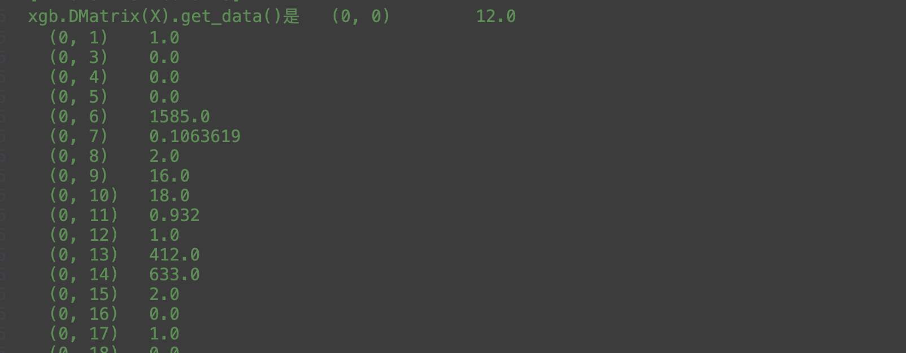
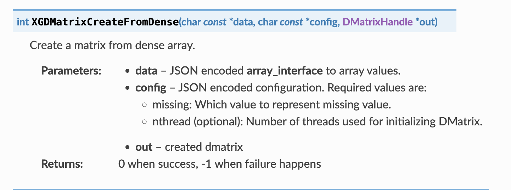
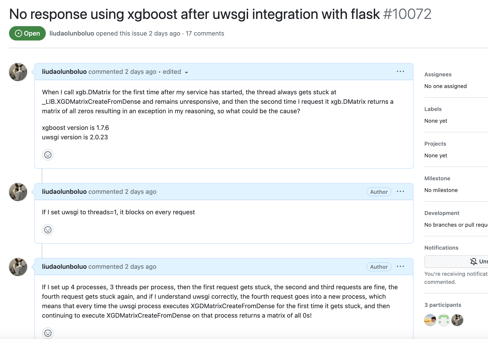
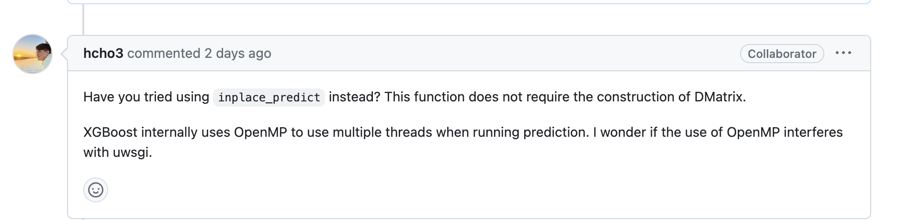
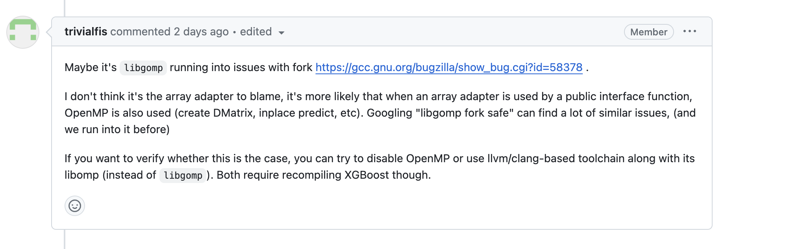
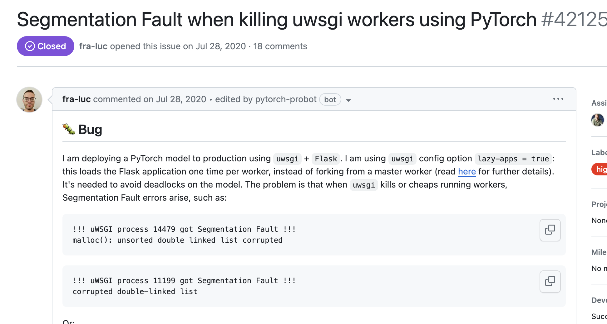

# 一次性能优化引发的线上xgboost事故

 ## 1、线上出事啦！

某天算法的同学找过来，表示线上因为最近搞活动上量，我们的风控模型服务每天都有少量超时的，调用时间过长。首先我加了节点，但是经过一天观察之后还是有少量超时，于是我开始对代码打主意。

首先风控模型服务是部署的线上的风控模型的服务，利用机器学习针对用户的特征对用户的风控风险进行打分，这里只用到了xgboost算法。

模型服务的语言是python，框架是flask，看了下代码，目前模型服务的启动方式是用的flask的manager的run方法，这种方法启动只适用于开发环境，实际上启动之后的日志也在报警，推荐生产环境使用uwsgi等web服务器。这种manager启动方式每个实例就是单线程的，所以这可能是造成线上超时的原因，于是我集成了uwsgi，集成的方法也很简单，放一个配置文件然后dockerfile里改一下启动方式，从python启动改为uwsgi启动就行了，这里说一个坑，如果是使用的apt安装的uwsgi的话，需要指定plugin为python并且需要安装uwsgi的python插件，如果是pip安装的uwsgi则不需要。

于是快速改完本地测试完成之后，发布到了测试环境，测试之后算法同学表示没问题就上线了，上线之后观察了一会儿线上没有报错，于是就觉得这次优化完成了。

第二天，算法同学急冲冲的找过，问我：“你改模型了？”我很疑惑，“我没有改业务代码啊”，“那不对啊，昨天晚上开始通过率开始大量异常，好像所有用户都通过了，而且档位分数还一样”，听闻之后，于是我立马去线上找了几个日志，发现返回的分数和概率值还真是一样的，无论特征值是多少都只会返回同一个概率值，而且几乎是所有模型都是。但是为什么测试的时候没有发现呢？然后我不甘心又去测试环境试了试，发现是正常的，啊？这也太奇怪了吧？


## 2、开始线下排查！

第一时间先把线上环境回滚了，保证线上数据正常，然后把出问题的镜像拉到开发环境试试。

放到开发环境，果不其然的复现了，无论特征值是多少，概率始终都是同一个值，而且是所有xgboost模型都是，同时还在开发环境发现一个问题，服务启动之后第一次访问会卡死一直没有响应直到我们的客户端超时，然后再次访问就返回哪一个固定的概率值了，联系到线上在发现通过率异常之前也有部分超时并且没有返回值的请求，于是发现这也是个问题，那这两个问题会不会有联系呢？但是对比卡死的问题，概率值一样的问题要着急一点，因为毕竟这影响到了线上的业务。卡死的问题我们可以用技术手段在排查，而且卡死的请求并不多，只会是刚启动第一次卡死，所以我决定先看概率值的问题，并且比起卡死的问题概率值的问题显然更让人好奇一点。（剧透一下其实这两个问题是有联系的）

我个人喜欢出问题之后看源码，不过python没有类似于arthas的工具可以看方法的返回值和参数，于是这里我用了刚学java的时候的日志大法，也就是给代码里加日志，然后每次看日志的输出，因为我们用到的是K8S加docker部署的，所以这里我可以把主要的代码挂载出来方便修改（这对其他语言同学来说很正常，但是当一个写了五年的java开发得知还有这种骚操作的时候确实震惊了一会儿）。

首先代码没有问题。确实没有人改过，排除了我手贱误改代码引起的问题，而且不止是一个模型出问题了，所有使用了xgboost的模型都有问题，概率返回值都是同一个值。反复检查了git提交记录之后，发现出问题的代码和没有问题的代码，区别就是一个是uwsgi启动一个不是，那这为什么会造成模型推理出问题？

首先我们看下我们的业务代码：

```python
filepath ="model path"
clf = joblib.load(filepath)
...
X = data[clf.feature_names].apply(pd.to_numeric, errors='coerce')
y_pred = float(clf.predict(xgb.DMatrix(X))[0])
```

就是很普通的机器学期推理代码加上flask，先用joblib把训练之后导出的模型文件加载到内存中来，然后对hppt请求的参数进行特征处理（这一步在机器学习中很常见，主要是对一个非数字特征进行编码，比如使用手机型号是iphone或者三星，对应的就是1和2，因为机器学习这里只能识别数字）然后筛选出入模特征，然后用xgboost的方法把参数的panda格式转换为xgboost的矩阵，最后用xgboost的推理来得到概率值。

我一开始认为的，如果模型和代码没问题，那么唯一可能的变量就是集成了uwsgi，uwsgi是多线程的，会不会是线程安全问题？但是这个念头一闪而过，因为从java的线程安全经验来说，线程安全会导致值随机变化而不是固定的一个值，应该可能不是这个原因吧，于是我为了排除多线程的问题，我把uwsgi的配置改为了：

```properties
worker=1
threads=1
```

意思是只启动一个进程，每个进程只有一个线程，这样就是单线程的了，然后启动之后发现，会卡死！然后后面再继续访问还是继续卡死，于是我觉得这个卡死问题应该是多线程造成的，至于具体原因，我还是先看看概率值的问题吧毕竟影响到了线上业务。除了多线程这个变量之外还有一个变量就是参数，这个因素显然更容易引起概率值问题，会不会是因为用uwsgi之后入参的会需要一些处理否则的话就会出问题例如有中文的话会不会乱码，于是我将线上测试环境和开发环境作为对比组来进行对比，加了点日志打印了参数，结果发现两个环境的参数直到推理之前都是一样的！包括处理之后panda也是一样的！这就奇怪了呀，虽然两个环境的参数都是一样的但是开发环境推理出来的概率和测试环境的不一样，测试环境的概率才是正确的，那么问题出在哪里呢？我继续思考，既然参数直到panda哪里都是正常的，那么一定能保证进去推理的参数也是一样的吗？在最后推理之前我们还有一步，需要把panda转换为xgboost可以使用的稀疏矩阵也就是这一步：`xgb.DMatrix(X)`

所以我还需要把两个环境的矩阵打印出来，来确定是不是推理的特征真的是一样的。

于是我把两个环境的矩阵打印出来了，发现还真不一样，在正常的测试环境中，我们的矩阵是可以正常打印的：



就是一个1行31列的矩阵，并且都有我们特征处理之后的值。

有问题的环境：


打印出来居然没有？！看到这里好像有点眉目了，那么为什么打印出来是空呢？后来查阅资料得知稀疏矩阵会默认隐藏值为0的部分，但是密集矩阵不会，所以这里我们再把稀疏矩阵转换为密集矩阵输出：


啊哈！感觉有点拨开乌云了，为什么会发生不同的特征值推理出来的概率都是一样的，因为他们最后推理之前转换为的矩阵都是0！所以概率就是一样的。

那么为什么转换为矩阵之后值会是0？

我的习惯还是看代码，所以我直接点进`xgb.DMatrix`中查看：

```python
  # 获取矩阵的句柄，特征名和特征类型     
  handle, feature_names, feature_types = dispatch_data_backend(
            data,
            missing=self.missing,
            threads=self.nthread,
            feature_names=feature_names,
            feature_types=feature_types,
            enable_categorical=enable_categorical,
        )
        assert handle is not None
    # 设置句柄
        self.handle = handle
 ...
def dispatch_data_backend(...):
  ...
  if _is_pandas_df(data):
        return _from_pandas_df(data, enable_categorical, missing, threads,
                               feature_names, feature_types)
 ...

def _from_pandas_df(
   ...
    )
    return _from_numpy_array(data, missing, nthread, feature_names, feature_types)
...
def _from_numpy_array(
   ...,
) -> DispatchedDataBackendReturnType:
    if len(data.shape) != 2:
        raise ValueError(
            "Expecting 2 dimensional numpy.ndarray, got: ", data.shape
        )
        # 设置转换之后的特征
    data, _ = _ensure_np_dtype(data, data.dtype)
    # 初始化一个C++指针
    handle = ctypes.c_void_p()
    # 配置
    args = {
        "missing": float(missing),
        "nthread": int(nthread),
    }
    config = bytes(json.dumps(args), "utf-8")
    # 调用libxgboot.so的库的函数来转换为矩阵
    _check_call(
        _LIB.XGDMatrixCreateFromDense(
          # 主要是获取数组接口信息，这个信息包含了描述数组的元数据的字典，然后转换为json
            _array_interface(data),
            config,
            ctypes.byref(handle),
        )
    )
```

这里可以很清楚的看到，xgboost把panda转换为矩阵，就是先获取panda的danaframe的数组接口信息然后转换为json当成参数传递，这里调用xgboost库的C++函数`XGDMatrixCreateFromDense`,我们可以查到这个函数的信息：



每个参数都解释的比较清楚，最后会传递一个初始化的指针，然后转换为矩阵之后会把传递进去的指针指向矩阵，这样就可以拿到结果了。

这里我一开始不太确定，究竟在python调用C++之前特征的值就丢失了还是传递进去之后丢失的？

于是我还是用日志大法，这里不一样的是调用代码不是我们项目中的了而是python的依赖`xgboost`中源码了，这也难不倒我，反正万物皆可挂载，于是我把site package目录的这个源码挂载出来了，然后就可以外部修改这个代码加日志了。（java开发倒是挺熟悉这个对依赖库源码的骚操作的，但是java要方便一点，可以根据类加载特性在自己的项目里新建一个来覆盖）

打印之后发现传递进C++之前我们的参数都是正常的，并没有变化。那就是C++函数的问题？于是，我一贯的作风就是看代码，就去github上拉下来了xgboost的源码开始研究了。

`XGDMatrixCreateFromDense`函数的代码大概是这样：

```c++
XGB_DLL int XGDMatrixCreateFromDense(char const *data,
                                     char const *c_json_config,
                                     DMatrixHandle *out) {
  API_BEGIN();
  xgboost_CHECK_C_ARG_PTR(data);
  xgboost::data::ArrayAdapter adapter{xgboost::data::ArrayAdapter(StringView{data})};
  xgboost_CHECK_C_ARG_PTR(c_json_config);
  auto config = Json::Load(StringView{c_json_config});
  float missing = GetMissing(config);
  auto n_threads = OptionalArg<Integer, int64_t>(config, "nthread", common::OmpGetNumThreads(0));
  xgboost_CHECK_C_ARG_PTR(out);
  *out =
      new std::shared_ptr<DMatrix>(DMatrix::Create(&adapter, missing, n_threads));
  API_END();
}
```

简单研究了一下，这里先把传递的特征值的从json还原为原始的值，然后转换为`ArrayAdapter`然后在转换为`DMatrix`对象，然后返回一个指针。看到这里其实还是没有发现问题，如果是C++库的原因那么为什么测试环境是可以的呢？于是我联想到了卡死的问题，因为测试环境是不会卡死的，那么这个卡死的问题和概率值一样的问题是不是有联系的，因为没有卡死就不会有概率值一样的问题，于是我改主意了，先排查卡死的问题，说不定卡死的问题解决之后就可以解决这个概率值一样的问题了。

于是我又用了日志大法，来排查我们的代码究竟是卡在哪里了。其实ubantu上可以使用pstack、gdb等工具来排查线程卡死问题，但是由于在刚刚排查概率值问题的时候我们加了太多日志：

```python
print(' _array_interface(data):', _array_interface(data))
    _check_call(
        _LIB.XGDMatrixCreateFromDense(
            _array_interface(data),
            config,
            ctypes.byref(handle),
        )
    )
    print('生成矩阵的时候handle:', handle)
```

于是发现卡死的请求，日志总是卡在` _array_interface(data):`这里，这里往下的日志是没有打印的，也就是说卡死的线程是卡在了调用xgboost的库的函数中！这不就和概率值一样的问题呼应上了！概率值一样的问题中，也是因为这个函数导致的生成的矩阵全为0从而引发的线上的概率值都一样的问题。遇到到这里我越来越相信，这两个问题可能都是同一个原因导致的


既然都和C++的底层函数有关系，那么我去github上给他们提一个isuue吧，看官方人员有没有办法：



很快xgboost的开发人员就给出了回复：



他建议我使用`inplace_predict`方法来代替，因为这个方法不会转换为矩阵。于是我把代码里的`predict`替换为了`inplace_predict`，惊奇的发现虽然还是会卡死，但是后续推理的结果是正确的，到这里就很疑惑了，这两个方法有啥不一样呢？难道转换矩阵有bug？并且这里这位开发人员提了一嘴openMP，不过我也没有在意。

然后我就在github上询问他，这个矩阵为0的情况，到底啥情景能让矩阵为0，不过他后面的回复让我陷入了巨大的失望之中：


原来他也搞不懂了！他的意思是等待有缘人来解答吧，但是这个有缘人会不会出现多久出现就不知道了，看到这里我又明白只能靠自己了，但是自己想破头也不知道为啥会卡死又为啥矩阵都为0了，难道自己没有能力排查出原因了吗，职业生涯又要多一个悬案了吗？

## 3、柳暗花明又一村！有缘人出现！

以为就到这里了，结果第二天起床一看，一个好大哥回复了我，并且给出了他的建议：



有缘人真的出现了！他告知，可能是libgomp的问题，也就是libgomp的for问题，还贴心的给出了这个fork问题的bug报告页面，并且还说了在创建矩阵和推理的时候都用了这个openMP的，最后他说他们也遇到了类似的。

看到这里我就非常激动了，我知道了，这个问题快解决了！

这里简单解释一下openMP和libgomp

>OpenMP（Open Multi-Processing）是一种并行编程的标准，旨在简化多线程编程的复杂性。它提供了一种在共享内存系统中并行执行程序的方法，使得开发人员可以更轻松地利用多核处理器和多处理器系统的性能优势。
>
>以下是一些关于 OpenMP 的主要特点和用途：
>
>1. **并行性增强**：OpenMP 允许程序员通过在代码中插入指令来实现并行化，从而利用多个处理器或多核心并行执行代码，加快程序的运行速度。
>2. **简单易用**：相较于传统的多线程编程，使用 OpenMP 编写并行程序更加简单直观。通过在现有代码中添加一些指令或注释，程序员可以很容易地实现并行化。
>3. **跨平台性**：OpenMP 是一个跨平台的并行编程标准，支持在各种操作系统和编译器上使用。这使得开发人员可以在不同平台上编写具有可移植性的并行程序。
>4. **灵活性**：OpenMP 提供了丰富的指令集，可以控制并行执行的方式，例如设置并行区域、循环并行化、任务并行化等，使得程序员可以根据需要灵活地调整并行策略。
>5. **性能优化**：通过合理地使用 OpenMP，开发人员可以优化程序的性能，利用多核处理器的潜力，加速程序的执行速度。
>
>在 C、C++ 和 Fortran 等编程语言中，开发人员可以利用 OpenMP 标准来编写并行程序。通过在代码中插入 `#pragma omp` 指令，指示编译器如何并行化代码块，从而实现并行执行。然而，在多进程环境中使用 OpenMP 时，需要注意一些潜在的问题，如在 fork 后使用 OpenMP 可能导致线程状态混乱或死锁等情况。


>`libgomp` 是 GNU Compiler Collection (GCC) 中用于支持 OpenMP 的库。在 GCC 编译器中，`libgomp` 负责实现 OpenMP 的运行时支持，包括创建线程池、管理线程、执行并行指令等功能。在使用 GCC 编译器编译支持 OpenMP 的程序时，会链接到 `libgomp` 库来实现并行化。
>
>与 OpenMP 的关系是，OpenMP 是一种并行编程的标准，而 `libgomp` 则是 GCC 编译器中用于实现 OpenMP 标准的库。OpenMP 提供了一套并行编程的指令和规范，使得开发人员可以更容易地编写并行程序，而 `libgomp` 则是 GCC 对于 OpenMP 标准的实现，提供了运行时支持，帮助程序在运行时实现并行化。

然后他发的链接（https://gcc.gnu.org/bugzilla/show_bug.cgi?id=52303）也点进去看了，大概意思就是openMP如果是在fork出来的进程中使用的话可能会造成死锁问题，这里的fork指的是uninx中的fork，也就是可以理解为生成一个子线程并且集成父线程中的数据。

那么这个fork和我的问题有什么联系呢？

在他所说的`libgomp fork safe`的谷歌中。我发现了这一个issue：



当然了我的问题和pytorch没有联系，但是！这里说了一个很重要的信息，uwsgi有一个配置`lazy_apps`如果为false则不会初始化一次程序然后fork出若干个进程而是会初始化程序若干次，也就是新建进程，那么这不就刚刚说的对应上了！因为我们没有配置这个，所以uwsgi启动的时候是会fork出子进程的，然后这个fork出来的进程因为调用了xgboost中的openMP部分所以导致了死锁也就是卡死了！

要验证也很简单，我们可以做双重验证：

1、我们配置一下`lazy_apps`为true，来不让fork进程而是新建进程来初始化。果然！修改配置后没有问题了！！

2、去掉xgboost中的openMP功能。这个需要重新编译xgboost，这根本难不倒我，下载好源码之后进入到源码目录，依次执行：

```shell
mkdir build
cd build
cmake -DUSE_OPENMP=OFF .. 
make -j4
```

这里`-DUSE_OPENMP=OFF`就是关掉我们的openMP，然后执行完成之后就可以在lib目录下找到我们的`libxgboost.so`中，然后把原始镜像下载下来然后把新的so文件拷贝进去覆盖就行了：

```dockerfile
FROM analyze-server:V1.4.8
COPY libxgboost.so /usr/local/lib/python3.10/dist-packages/xgboost/lib/
```

然后发现也没有问题！！！

所以卡死的问题，我们就有了答案：是因为uwsgi默认使用了fork的方式来生成worker进程，然后在worker进程上调用了xgboost的方法，xgboost的方法里又使用了openMP造成死锁从而卡死，而且只有第一个会。

但是我们仍然还是有疑问：

1、矩阵为0的是什么原因造成的？

2、为什么测试环境是好的

既然知道是openMP的问题之后我们就可以再去重新看代码，发现在生成矩阵这里大量使用了openMP，比如：

```c++
 ...
 size_t num_elements = 0;
    size_t num_rows = 0;
    // Import Arrow RecordBatches
#pragma omp parallel for reduction(+ : num_elements, num_rows) num_threads(ctx_.Threads())
    for (int i = 0; i < static_cast<int>(batches.size()); ++i) {  // NOLINT
      num_elements += batches[i]->Import(missing);
      num_rows += batches[i]->Size();
    }
    total_elements += num_elements;
    total_batch_size += num_rows;
    // Compute global offset for every row and starting row for every batch
    std::vector<uint64_t> batch_offsets(batches.size());
    for (size_t i = 0; i < batches.size(); ++i) {
      if (i == 0) {
        batch_offsets[i] = total_batch_size - num_rows;
        batches[i]->ShiftRowOffsets(total_elements - num_elements);
      } else {
        batch_offsets[i] = batch_offsets[i - 1] + batches[i - 1]->Size();
        batches[i]->ShiftRowOffsets(batches[i - 1]->RowOffsets().back());
      }
    }
    // Pre-allocate DMatrix memory
    data_vec.resize(total_elements);
    offset_vec.resize(total_batch_size + 1);
    // Copy data into DMatrix
#pragma omp parallel num_threads(ctx_.Threads())
    {
#pragma omp for nowait
      for (int i = 0; i < static_cast<int>(batches.size()); ++i) {  // NOLINT
        size_t begin = batches[i]->RowOffsets()[0];
        for (size_t k = 0; k < batches[i]->Size(); ++k) {
          for (size_t j = 0; j < batches[i]->NumColumns(); ++j) {
            auto element = batches[i]->GetColumn(j).GetElement(k);
            if (!std::isnan(element.value)) {
              data_vec[begin++] = Entry(element.column_idx, element.value);
            }
          }
        }
      }
#pragma omp for nowait
      for (int i = 0; i < static_cast<int>(batches.size()); ++i) {
        auto& offsets = batches[i]->RowOffsets();
        std::copy(offsets.begin() + 1, offsets.end(), offset_vec.begin() + batch_offsets[i] + 1);
      }
    }
  }
}
...
```

这里初始化的值都是0，于是我们可以认为，因为openMP出现了问题，后续线程在执行代码块的时候并没有执行这些使用了openMP的部分，所以导致最后我们返回出去的都是0，也就是初始值。

最后就是为啥测试环境没有问题？

这里我反复对比了测试环境和开发环境线上环境的不一样，因为他们的镜像都一样，然后测试环境和线上环境又被K8S调度到了同一个节点上，所以排除了宿主机的干扰，但是！我突然发现测试环境恰恰是因为和线上环境在同一个节点，他为了不影响线上环境的性能，他配置了性能限制！！他指定了CPU最多只能分配0.25核！然后在开发环境中我也这样配置了之后，发现问题解决了！于是我查询了一下资料，因为openMP默认是创建和CPU核心数一样多的线程！如果CPU核心数不足1就只会创建一个线程，这个时候实际上就是单线程操作，效果和禁用openMp的是一样的！所以这也解释了为什么测试环境没有问题而开发和线上有问题！


## 4、总结

本次问题的根本原因就在于uwsgi和openMP的冲突，因为uwsgi默认是fork子进程的模式，而openMP又会在fork出来的进程上出现奇奇怪怪的bug，最后xgboost又恰好使用了openMP而不是jvm的pthread来使用多线程，所以出现了问题，最后解决问题就只需要在配置文件中配置上`lazy_app=true`就解决了，不过似乎多线程优化对xgboost影响不大，这个可以后面有时间再讲讲。