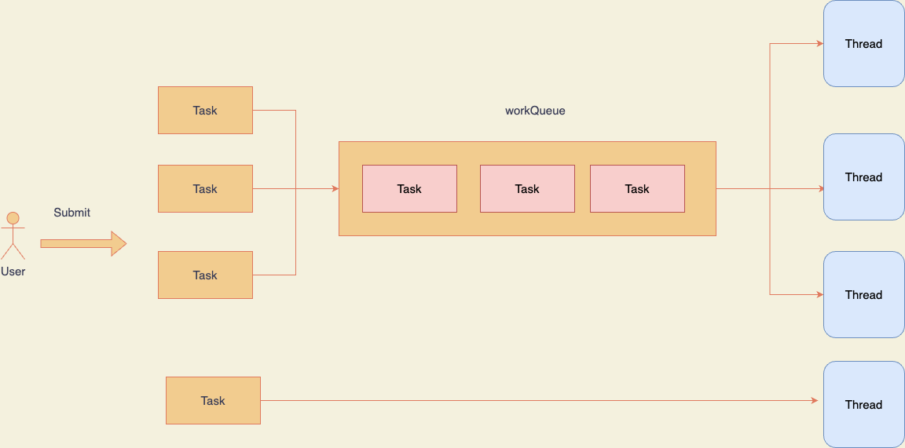
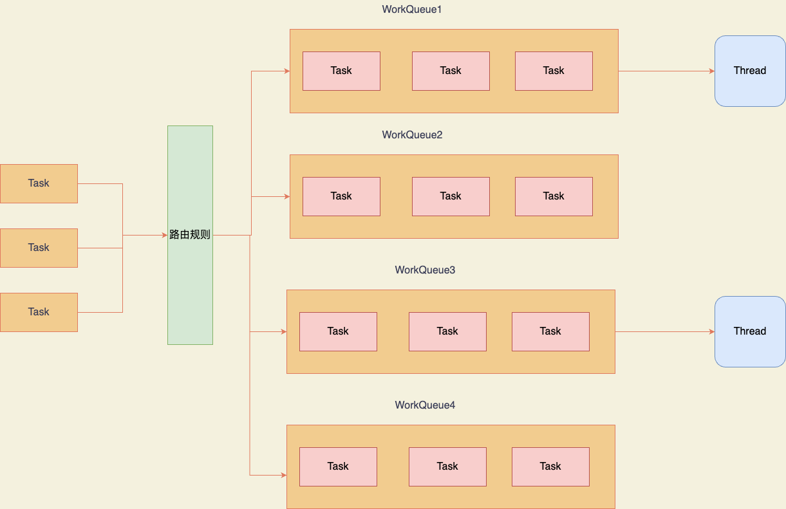
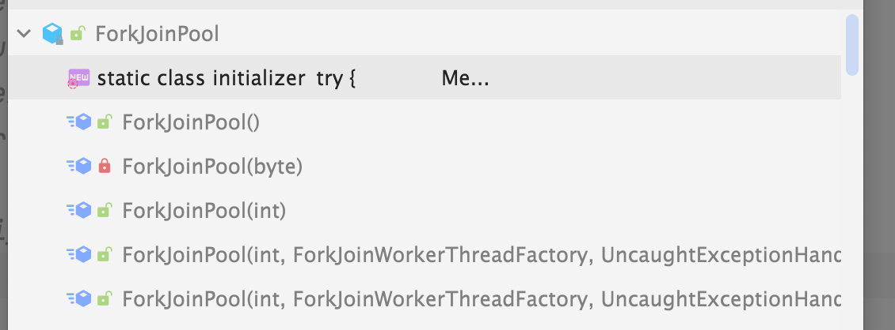
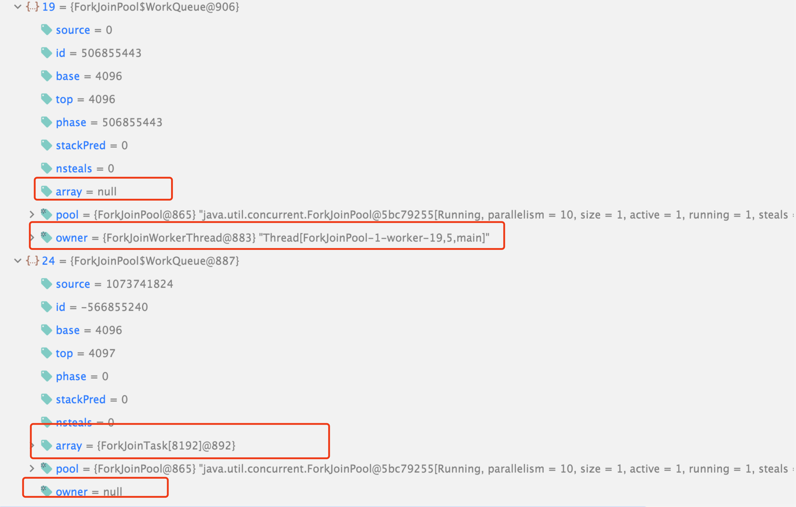
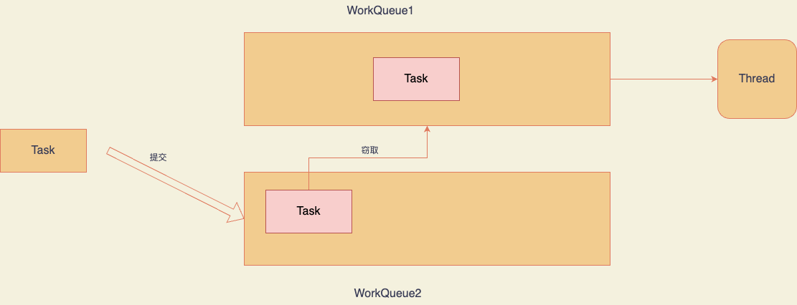

# 究竟什么是ForkJoinPool


上文我们大概研究了一下虚拟线程的原理以及源码，在源码中我们注意到了虚拟线程默认的调度器是ForkJoinPool，那么为什么虚拟线程要用ForkJoinPool而不是我们熟悉的ThreadPoolExecutor，到底ForkJoinPool好在哪里？

本文将分为四个部分，首先会先介绍一下ForkJoinPool是什么， 如何使用他？然后会详略得当的介绍他的原理以及部分源码，最后就是JDK21中ForkJoinPool的变化以及针对虚拟线程做了什么优化，最后就是为什么虚拟线程要使用ForkJoinPool作为默认的调度器，大家可以选择阅读。

## 1、什么是ForkJoinPool

># Fork/Join
>
>The fork/join framework is an implementation of the `ExecutorService` interface that helps you take advantage of multiple processors. It is designed for work that can be broken into smaller pieces recursively. The goal is to use all the available processing power to enhance the performance of your application.
>
>As with any `ExecutorService` implementation, the fork/join framework distributes tasks to worker threads in a thread pool. The fork/join framework is distinct because it uses a *work-stealing* algorithm. Worker threads that run out of things to do can steal tasks from other threads that are still busy.
>
>The center of the fork/join framework is the [`ForkJoinPool`](https://docs.oracle.com/javase/8/docs/api/java/util/concurrent/ForkJoinPool.html) class, an extension of the `AbstractExecutorService` class. `ForkJoinPool` implements the core work-stealing algorithm and can execute [`ForkJoinTask`](https://docs.oracle.com/javase/8/docs/api/java/util/concurrent/ForkJoinTask.html) processes.
>
>## Basic Use
>
>The first step for using the fork/join framework is to write code that performs a segment of the work. Your code should look similar to the following pseudocode:
>
>```
>if (my portion of the work is small enough)
>  do the work directly
>else
>  split my work into two pieces
>  invoke the two pieces and wait for the results
>```
>
>Wrap this code in a `ForkJoinTask` subclass, typically using one of its more specialized types, either [`RecursiveTask`](https://docs.oracle.com/javase/8/docs/api/java/util/concurrent/RecursiveTask.html) (which can return a result) or [`RecursiveAction`](https://docs.oracle.com/javase/8/docs/api/java/util/concurrent/RecursiveAction.html).
>
>After your `ForkJoinTask` subclass is ready, create the object that represents all the work to be done and pass it to the `invoke()` method of a `ForkJoinPool` instance.

oracle的java文档里是这样介绍[ForkJoinPool](https://docs.oracle.com/javase/tutorial/essential/concurrency/forkjoin.html)的，通俗解释来说就是ForkJoinPool和ThreadPoolExecutor一样都是把任务丢给子线程去异步处理，但是ForkJoinPool不同的地方在于：1、可递归分解为较小部分。目标是利用所有可用的处理能力来提高应用程序的性能。2、使用*工作窃取*算法。无事可做的工作线程可以从其他仍然忙碌的线程中窃取任务

我们先看看ForkJoinPool的基本使用方法。

说起递归，那么相信大家就都很熟悉，在算法题中用过很多次了，比如java中计算斐波那契数列前N项和就是最经典的递归，我们普通的 写法如下：

```java
 public static long fibonacci(int n) {
        if (n <= 1) return n;
        else return fibonacci(n-1) + fibonacci(n-2);
    }

    public static void main(String[] args) {
        long sum = 0;
        for (int i = 0; i < 100; i++) {
            sum += fibonacci(i);
        }
        System.out.println("结果是: " + sum);
    }
```

这种场景我们就可以用我们的ForkJoinPool了，我称之为“多线程递归”：

```java
    public static void forJoinPool() {
        ForkJoinPool pool = new ForkJoinPool();
        long sum = 0;
        for (int i = 0; i < 100; i++) {
            FibonacciForkJoin task = new FibonacciForkJoin(i);
            sum += pool.invoke(task);
        }
        System.out.println("结果是" + sum);
    }
    
...

class FibonacciForkJoin extends RecursiveTask<Long> {

    private final int n;

    public FibonacciForkJoin(int n) {
        this.n = n;
    }

    @Override
    protected Long compute() {
        if (n <= 1) {
            return (long) n;
        }
        FibonacciForkJoin f1 = new FibonacciForkJoin(n - 1);
        f1.fork();
        FibonacciForkJoin f2 = new FibonacciForkJoin(n - 2);
        return f2.compute() + f1.join();
    }

}
```

这里我们的task继承RecursiveTask而不是实现Runnable接口，然后在内部再对任务拆分，拆分原则就是上文所说的拆的不能再小了再去计算，和递归很像，区别是多线程去做的。

## 2、ForkJoinPool原理是什么样的

### 2.1原理概述

刚刚在使用中我们体会到ForkJoinPool的第一个特点——“可分解性”，那么我们要深入到源码中才能体会到第二个特点——“可窃取”。

再深入源码之前，我们还是先笼统的看一下ForkJoinPool的大概原理，然后心里有一个大概的认识再去看源码这样比直接看源码简单的多，因为ForkJoinPool的源码相当晦涩难懂如果直接看很难能看懂。

首先我们知道ForkJoinPool也是把任务分配调度给子线程，那么他具体是怎么做的呢？

说ForkJoinPool之前，我们先复习一下我们熟的不能再熟的ThreadPoolExecutor:



我们熟悉的ThreadPoolExecutor大概流程就是用户提交一个任务，然后如果有空闲的线程就让空闲线程处理，如果没有就进入我们的workQueue，如果workQueue满了就启用我们配置的最大线程数，如果当前线程数已经达到了最大线程数就执行拒绝策略

那么在ForkJoinPool中就完全不一样了：



简单来说，ForkJoinPool中维护了多个workQueue，他们组成了一个workQueue数组，然后我们的任务根据不同的规则进入到不同的workQueue中，注意这里笔者的图没有画错，偶数下标的workQueue是没有工作线程的，只有奇数下标的workQueue有工作线程，所以用户提交的任务会先进入到偶数标的workQueue中，然后被奇数标的workQueue窃取来执行。fork出来的任务是先放在奇数标workQueue中的，窃取是不分奇数偶数的，所以奇数标也会窃取奇数标的任务，这个时候就可能会有冲突，ForkJoinPool的解决方案是，workQueue消费自己队列的任务是LIFO，窃取别的队列的时候是FIFO，这样可以尽可能的减少冲突。

### 2.2源码探寻

好了说完大概的原理，我们就要深入到源码里去探究刚刚说到的原理的一些实现细节了。由于ForkJoinPool的代码非常晦涩难懂，所以读者就选主要的一部分讲一下，大家有个大概印象就行了（本文源码基于JDK11）。

#### 2.2.1 构造函数

首先，ForkjoinPool和ThreadPoolExecutor一样都继承自AbstractExecutorService，这个抽象类，也就是他们的用法实际上都一样，ThreadPoolExecutor能做的ForkjoinPool也能做，只是ForkjoinPool可以内部fork join而已，所以ForkjoinPool也属于线程池的一种。

我们先看构造函数，ForkjoinPool有五个构造函数：



我们选取参数最全的和无参的讲,这样可以搞清楚构造函数参数有哪些，默认值又是什么：

```java
    public ForkJoinPool() {
        this(Math.min(MAX_CAP, Runtime.getRuntime().availableProcessors()),
             defaultForkJoinWorkerThreadFactory, null, false,
             0, MAX_CAP, 1, null, DEFAULT_KEEPALIVE, TimeUnit.MILLISECONDS);
    }

```

这里先解释一下这十个构造函数参数的意思：

- `int parallelism`：并行度，FJP核心参数，可以看到这里默认值就是当前CPU核心数
- `ForkJoinWorkerThreadFactory factory`：工作线程工厂就是创建线程的时候的工厂
- `UncaughtExceptionHandler handler`：异常处理器，由于执行任务时遇到不可恢复的错误而终止的内部工作线程的处理程序，默认是空
- `boolean asyncMode`：是否异步模式，如果为ture，则队列将采用FIFO_QUEUE，实现先进先出，反之则LIFO_QUEUE 实现后进先出
- `int corePoolSize`：要保留在池中的线程数 (除非在经过keep-alive之后超时)，默认是不保留
- `int maximumPoolSize`：允许的最大线程数。当达到最大值时，尝试替换阻塞的线程失败。(但是，由于不同线程的创建和终止可能会重叠，并且可能由给定的线程工厂管理，因此可能会暂时超过此值
- `int minimumRunnable`：为了维持系统处理能力，应保持可运行的最小线程数
- `Predicate<? super ForkJoinPool> saturate`：自定义策略，用于决定在任务队列可能满时或线程池达到最大限制时如何处理新提交的任务
- `long keepAliveTime`：线程保持活跃时间
- `TimeUnit unit`：线程保持活跃时间单位

```java
public ForkJoinPool(int parallelism,
                        ForkJoinWorkerThreadFactory factory,
                        UncaughtExceptionHandler handler,
                        boolean asyncMode,
                        int corePoolSize,
                        int maximumPoolSize,
                        int minimumRunnable,
                        Predicate<? super ForkJoinPool> saturate,
                        long keepAliveTime,
                        TimeUnit unit) {
        // 参数检查
        if (parallelism <= 0 || parallelism > MAX_CAP ||
            maximumPoolSize < parallelism || keepAliveTime <= 0L)
            throw new IllegalArgumentException();
        if (factory == null)
            throw new NullPointerException();
        long ms = Math.max(unit.toMillis(keepAliveTime), TIMEOUT_SLOP);

        int corep = Math.min(Math.max(corePoolSize, parallelism), MAX_CAP);
        long c = ((((long)(-corep)       << TC_SHIFT) & TC_MASK) |
                  (((long)(-parallelism) << RC_SHIFT) & RC_MASK));
        int m = parallelism | (asyncMode ? FIFO : 0);
        int maxSpares = Math.min(maximumPoolSize, MAX_CAP) - parallelism;
        int minAvail = Math.min(Math.max(minimumRunnable, 0), MAX_CAP);
        int b = ((minAvail - parallelism) & SMASK) | (maxSpares << SWIDTH);
  			//根据并行度计算workQueue数量
        int n = (parallelism > 1) ? parallelism - 1 : 1; // at least 2 slots
        n |= n >>> 1; n |= n >>> 2; n |= n >>> 4; n |= n >>> 8; n |= n >>> 16;
        n = (n + 1) << 1; // power of two, including space for submission queues

        this.workerNamePrefix = "ForkJoinPool-" + nextPoolId() + "-worker-";
        this.workQueues = new WorkQueue[n];
        this.factory = factory;
        this.ueh = handler;
        this.saturate = saturate;
        this.keepAlive = ms;
        this.bounds = b;
        this.mode = m;
        this.ctl = c;
        checkPermission();
    }
```

这里主要就是一些赋值成员变量和参数检查，比较重要的是:

1、计算workQueue容量的，介绍原理的时候说到了这个队列数组比较重要：

```java
int n = (parallelism > 1) ? parallelism - 1 : 1; // at least 2 slots
n |= n >>> 1; n |= n >>> 2; n |= n >>> 4; n |= n >>> 8; n |= n >>> 16;
n = (n + 1) << 1; // power of two, including space for submission queues
```

可以看到用了大量位移操作，最终的目的是计算一个大于等于给定 并行度的最小的2的幂次方，根据这个代码可以整理一下部分并行度和容量的关系：

| 并行度  | 容量 |
| ------- | ---- |
| 1，2    | 4    |
| 3，4    | 8    |
| 5 ～ 8  | 16   |
| 9 ～ 16 | 32   |

2、初始化ctl属性

```java
int corep = Math.min(Math.max(corePoolSize, parallelism), MAX_CAP);
long c = ((((long)(-corep)       << TC_SHIFT) & TC_MASK) |
                  (((long)(-parallelism) << RC_SHIFT) & RC_MASK));
```


ctl是比较重要的属性，他是线程池的核心控制线程字段，用于管理和控制 `ForkJoinPool` 的状态和行为。

ctl分为高位和低位：

- 高位部分用于表示线程数量和并行度相关的信息
- 低位部分用于表示工作队列和任务调度相关的信息

他的大概布局如下：

```
  63            48  47      32  31              16  15               0
+----------------+----------+-----------------+------------------+
| 并行度    | 保留位 | 运行中的线程数   | 线程数     |
+----------------+----------+-----------------+------------------+
```

- 并行度：占据高 16 位（从位 63 到位 48），表示 `ForkJoinPool` 的并行度，即最大并行执行的线程数。
- 保留位：占据中间 16 位（从位 47 到位 32），目前保留未使用，未来可能用于其他目的。
- 运行中的线程数：占据低 16 位（从位 31 到位 16），表示当前正在运行的工作线程的数量。
- 线程数：占据低 16 位（从位 15 到位 0），表示当前 `ForkJoinPool` 中的总线程数，包括正在运行的线程和空闲的线程。

#### 2.2.2 提交任务

ForkJoinPool在初始化之后，支持三种调用方式 invoke 、execute 和submit，其中invoke和其他两个的区别在于invoke会阻塞等待执行结果。

```java
    public ForkJoinTask<?> submit(Runnable task) {
        if (task == null)
            throw new NullPointerException();
        return externalSubmit((task instanceof ForkJoinTask<?>)
            ? (ForkJoinTask<Void>) task // avoid re-wrap
            : new ForkJoinTask.AdaptedRunnableAction(task));
    }
```

```java
    public void execute(Runnable task) {
        if (task == null)
            throw new NullPointerException();
        ForkJoinTask<?> job;
        if (task instanceof ForkJoinTask<?>) // avoid re-wrap
            job = (ForkJoinTask<?>) task;
        else
            job = new ForkJoinTask.RunnableExecuteAction(task);
        externalSubmit(job);
    }
```

```java
    public <T> T invoke(ForkJoinTask<T> task) {
        if (task == null)
            throw new NullPointerException();
        externalSubmit(task);
        return task.join();
    }

```

这里统一的逻辑就是如果入参只是runable则手动转换为ForkJoinTask

这三个入口方法都指向了同一个方法：`externalSubmit`:

```java
    private <T> ForkJoinTask<T> externalSubmit(ForkJoinTask<T> task) {
        Thread t; ForkJoinWorkerThread w; WorkQueue q;
        if (task == null)
            throw new NullPointerException();
      //如果当前线程不是用户手动提交的是fork出来的，并且所属的pool也是当前pool，并且所在的workQeue不为空则就直接加入到当前fork线程的所属的队列中
        if (((t = Thread.currentThread()) instanceof ForkJoinWorkerThread) &&
            (w = (ForkJoinWorkerThread)t).pool == this &&
            (q = w.workQueue) != null)
            q.push(task);
        else
          //如果不是则走这里
            externalPush(task);
        return task;
    }
```

首先会判断当前线程是不是fork出来的线程这种情况，并且workQueue也初始化好了，这种就是最简单的情况

否则的话就进入`externalPush`方法：

```java
   final void externalPush(ForkJoinTask<?> task) {
        int r;
     		//通过ThreadLocalRandom产生随机数
        if ((r = ThreadLocalRandom.getProbe()) == 0) {
            ThreadLocalRandom.localInit();
            r = ThreadLocalRandom.getProbe();
        }
        for (;;) {
            WorkQueue q;
            int md = mode, n;
            WorkQueue[] ws = workQueues;
            //检查线程池是否已关闭，工作队列数组是否为null或长度为0，任一条件满足则触发拒绝异常
            if ((md & SHUTDOWN) != 0 || ws == null || (n = ws.length) <= 0)
                throw new RejectedExecutionException();
            //根据随机数计算出来的下标对应的队列为空就初始化队列
            else if ((q = ws[(n - 1) & r & SQMASK]) == null) { // add queue
                int qid = (r | QUIET) & ~(FIFO | OWNED);
                Object lock = workerNamePrefix;
              //初始化一个task数组，长度就是队列初始长度
                ForkJoinTask<?>[] qa =
                    new ForkJoinTask<?>[INITIAL_QUEUE_CAPACITY];
              //初始化一个新的队列，可以看到队列的array属性实际上就是一个task数组
                q = new WorkQueue(this, null);
                q.array = qa;
                q.id = qid;
                q.source = QUIET;
              //用sync锁保证线程安全，然后向workQueue数组注册新建的workQueue队列
                if (lock != null) {     // unless disabled, lock pool to install
                    synchronized (lock) {
                        WorkQueue[] vs; int i, vn;
                        if ((vs = workQueues) != null && (vn = vs.length) > 0 &&
                            vs[i = qid & (vn - 1) & SQMASK] == null)
                            vs[i] = q;  // else another thread already installed
                    }
                }
            }
            //如果队列已存在但当前被锁定，则更新探针值并重新尝试。也就是换一个队列
            else if (!q.tryLockPhase()) // move if busy
                r = ThreadLocalRandom.advanceProbe(r);
            else {
              //如果队列存在并且没有被锁定，那么就把任务放到队列里并且通知其他工作线程来窃取
                if (q.lockedPush(task))
                    signalWork();
                return;
            }
        }
    }
```

这个方法很复杂可以总结为以下步骤：

1、获取随机数

2、开启一个自旋

3、如果线程池被关闭就抛异常

4、根据随机数找到对应的队列

5、如果队列为空就新建一个workQueue，注意这个队列是偶数下标

6、如果队列存在但是已经被锁定就重新生成随机数然后继续下一次循环，也就是继续5、6、7

7、如果队列存在且没有被锁定那么就锁定这个队列然后进入这个队列，然后通知工作线程来处理

我们接下来看看如何进入队列：

```java
   final boolean lockedPush(ForkJoinTask<?> task) {
            ForkJoinTask<?>[] a;
            boolean signal = false;
     				//workQueue的属性，top是下一个进来的槽位索引，base是下一个出去的槽位索引
            int s = top, b = base, cap, d;
            if ((a = array) != null && (cap = a.length) > 0) {
              //将任务 task 添加到数组的计算位置。这里使用位运算 (cap - 1) & s 来确保索引在数组范围内，这是一种常见的技术，用于在环形数组中处理索引
                a[(cap - 1) & s] = task;
              //将下一个进来的槽位指向加1，也就是移动这个索引指针
                top = s + 1;
              	//如果下一个出去的槽位索引和下一个进来的槽位索引的差加上数组容量减1等于0，意味着数组已满，需要扩容。这里扩容成功之后会把锁释放，然后就返回false，让外层进入下一次循环重新放入队列，如果这里需要扩容就是说放入队列失败了等到扩容之后下次再放入
                if (b - s + cap - 1 == 0)
                    growArray(true);
                else {
                  //释放锁
                    phase = 0; // full volatile unlock
                  	//添加成功
                    if (((s - base) & ~1) == 0) // size 0 or 1
                        signal = true;
                }
            }
            return signal;
        }
```


这里的phase就是workQueue的锁，在上面`externalPush`中有一个if分支是队列被锁定就更换随机数下标重新找一个队列，这里判断队列是否被锁定就是：

```java
   final boolean tryLockPhase() {
            return PHASE.compareAndSet(this, 0, 1);
        }
...
    static final VarHandle PHASE;
        static {
            try {
                MethodHandles.Lookup l = MethodHandles.lookup();
                PHASE = l.findVarHandle(WorkQueue.class, "phase", int.class);
            } catch (ReflectiveOperationException e) {
                throw new ExceptionInInitializerError(e);
            }
        }
    }
```

用CAS的方式给PHASE将0变成1，1就是锁定的状态，这里用了一个JDK新增的`VarHandle`,`VarHandle`就是提供了一种机制来直接操作 Java 变量的底层表示，常用于自定义的并发数据结构和算法中，例如在无锁编程中实现细粒度的同步和状态控制。

进入到队列之后，就是唤醒空闲的工作线程执行任务了，就是`signalWork`方法:

```java
 final void signalWork() {
   //自旋
        for (;;) {
            long c; int sp; WorkQueue[] ws; int i; WorkQueue v;
          //这里就开始使用刚刚说的线程池控制字段ctl了
          //表示有足够的工作线程
            if ((c = ctl) >= 0L)                      // enough workers
                break;
          //如果控制状态 ctl 的低32位为0，表示没有空闲的工作线程， 因为c为long，强转int 32位的高位都丢弃，此时如果没有修改过ctl那么低位一定为0 可参考前面ctl的推算过程，所以此处sp 为0 sp为0则说明没有空闲的worker
            else if ((sp = (int)c) == 0) { 
              //检查控制状态 ctl 是否包含 ADD_WORKER 标志位。如果包含，表示工作线程不足，尝试添加新的工作线程
              //取TC的高位，如果不等于0，则说明目前的工作着还没有达到并行度
                if ((c & ADD_WORKER) != 0L)           
                    tryAddWorker(c);
                break;
            }
          //workQueue为空，还没启动或者已经终止
            else if ((ws = workQueues) == null)
                break;
          //已经终止
            else if (ws.length <= (i = sp & SMASK))
                break;  
          //这里其实是会遍历所有workQueue，也就是说当前工作线程如果足够也就是满足并行度参数的话就会找其他工作队列的工作线程
            else if ((v = ws[i]) == null)
                break; 
          //程序执行到这里，说明有空闲线程
            else {
                int np = sp & ~UNSIGNALLED;
                int vp = v.phase;
                long nc = (v.stackPred & SP_MASK) | (UC_MASK & (c + RC_UNIT));
                Thread vt = v.owner;
              //如果当前队列没有上锁，
                if (sp == vp && CTL.compareAndSet(this, c, nc)) {
                  //上锁
                    v.phase = np;
                  //唤醒工作队列的所有者线程
                    if (vt != null && v.source < 0)
                        LockSupport.unpark(vt);
                    break;
                }
              //如果上锁了，说明被占用了，就进入下一次循环，下一次循环会再次判断当前工作线程是否足够等情况
            }
        }
    }
```

这里就三种情况：1、如果没有空闲的工作线程就根据当前队列个数来判断是否需要新增工作队列，注意这里并不是简单判断当前workQueue的工作线程是不是空闲，因为当前workQueue如果是偶数标的话就没有工作线程一定是判断整个线程池的工作队列是否有空闲的，新增队列就一起新增了工作线程；2、线程池状态不是运行中，这种就直接退出了；3、遍历workQueue数组，然后找到有工作线程的workQueue，但是分为两种情况：如果是空闲的并且在阻塞等待任务，就唤醒工作线程；如果当前线程的工作线程被占用了，就啥也不做，等到其他workQueue的工作线程来窃取。

这里真正处理的就是workQueue新建之后没有工作线程的情况和工作线程阻塞住的情况。那么任务是怎么被工作线程执行的呢？别急，我们慢慢看

#### 2.2.3 新建工作线程

那么我们再看下工作线程是怎么新建的呢？

```java
    private void tryAddWorker(long c) {
        do {
            long nc = ((RC_MASK & (c + RC_UNIT)) |
                       (TC_MASK & (c + TC_UNIT)));
          //修改ctl
            if (ctl == c && CTL.compareAndSet(this, c, nc)) {
              //创建工作线程
                createWorker();
                break;
            }
        } while (((c = ctl) & ADD_WORKER) != 0L && (int)c == 0);
    }

```

```java
    private boolean createWorker() {
        ForkJoinWorkerThreadFactory fac = factory;
        Throwable ex = null;
        ForkJoinWorkerThread wt = null;
        try {
          //通过工厂来创建线程
            if (fac != null && (wt = fac.newThread(this)) != null) {
              //启动工作线程
                wt.start();
                return true;
            }
        } catch (Throwable rex) {
            ex = rex;
        }
      //如果执行线程遇到异常就清扫这个异常
        deregisterWorker(wt, ex);
        return false;
    }
```

 这里的fac就是在构造函数的时候传入的线程工厂，默认的是：

```java
defaultForkJoinWorkerThreadFactory = new DefaultForkJoinWorkerThreadFactory();
```

```java
 private static final class DefaultForkJoinWorkerThreadFactory
        implements ForkJoinWorkerThreadFactory {
        private static final AccessControlContext ACC = contextWithPermissions(
            new RuntimePermission("getClassLoader"),
            new RuntimePermission("setContextClassLoader"));

        public final ForkJoinWorkerThread newThread(ForkJoinPool pool) {
            return AccessController.doPrivileged(
                new PrivilegedAction<>() {
                    public ForkJoinWorkerThread run() {
                        return new ForkJoinWorkerThread(
                            pool, ClassLoader.getSystemClassLoader()); }},
                ACC);
        }
    }
```

这里就是创建一个`ForkJoinWorkerThread`实例，`ForkJoinWorkerThread`有两个属性：

```java
final ForkJoinPool pool;                // the pool this thread works in
final ForkJoinPool.WorkQueue workQueue; // work-stealing mechanics
```

一个线程池和一个所属队列，线程池就是在构造函数传入的当前线程池，而所属队列则是在构造函数里：

```java
    protected ForkJoinWorkerThread(ForkJoinPool pool) {
        // Use a placeholder until a useful name can be set in registerWorker
        super("aForkJoinWorkerThread");
        this.pool = pool;
        this.workQueue = pool.registerWorker(this);
    }
```

可以看到这里的对应的workQueue并不是刚刚新建的偶数下标而是通过registerWorker返回的，我们看看registerWorker：

```java
 final WorkQueue registerWorker(ForkJoinWorkerThread wt) {
      ...
        if (prefix != null) {
            synchronized (prefix) {
                WorkQueue[] ws = workQueues; int n;
                int s = indexSeed += SEED_INCREMENT;
                idbits |= (s & ~(SMASK | FIFO | DORMANT));
                if (ws != null && (n = ws.length) > 1) {
                 ...
                    w.phase = w.id = tid | idbits;      // now publishable
                  //这里计算新workQueue的下标，因为s<<1肯定是偶数，所以|1尾部肯定是个奇数，m=ws.length-1,所以m肯定也是个奇数，奇数&奇数就是个奇数，所以新workQueue的下标肯定是奇数
                 if (ws != null && (n = ws.length) > 1) {
                    int m = n - 1;
 										tid = m & ((s << 1) | 1); 
                   ...
                    if (tid < n)
                        ws[tid] = w;
                    else {                              // expand array
                        int an = n << 1;
                        WorkQueue[] as = new WorkQueue[an];
                        as[tid] = w;
                        int am = an - 1;
                        for (int j = 0; j < n; ++j) {
                            WorkQueue v;                // copy external queue
                            if ((v = ws[j]) != null)    // position may change
                                as[v.id & am & SQMASK] = v;
                            if (++j >= n)
                                break;
                            as[j] = ws[j];              // copy worker
                        }
                        workQueues = as;
                    }
                }
            }
         ...
        }
        return w;
    }
```

我省略一下细节，我们可以简单的看这里其实就是又新建了一个workQueue，然后加入到pool到workQueue数组中，这里保证了新的workQueue的下标肯定是奇数，所以这个时候workQueue数组存在两个workQueue：



我们可以清楚的看到，先前的偶数标workQueue有task array也就是待执行的任务但是没有owner所属工作线程，后面新建的奇数标workQueue有工作线程但是没有待执行任务，这就很奇怪了，我们接着往下看，代码走到这里整个提交的代码就完成了，那么接下来的代码在哪里呢？

#### 2.2.4 执行任务

在刚刚createWorker方法中，我们新建完成了工作线程，然后调用了工作线程的start方法：

```java
wt.start()
```

我们知道这个wt就是ForkJoinWorkerThread，这个类继承了Thread，那么根据我们的基础知识储备：这个类调用start方法实际上就是通过底层操作系统接口新建了一个线程，然后通过回调方法的方式来调用这个类的run方法，所以我们就只看ForkJoinWorkerThread的run方法，这就是提交任务完成之后的代码：

```java
   public void run() {
     //这里只会运行一次，第一次运行也就是唯一一次运行的时候，task array必然是空的，因为奇数标workQueue才有工作线程，奇数标创建的时候是不会设置task array的
        if (workQueue.array == null) { // only run once
            Throwable exception = null;
            try {
                onStart();
                pool.runWorker(workQueue);
            } catch (Throwable ex) {
                exception = ex;
            } finally {
                try {
                    onTermination(exception);
                } catch (Throwable ex) {
                    if (exception == null)
                        exception = ex;
                } finally {
                  //抛异常或者被放弃掉了之后清理
                    pool.deregisterWorker(this, exception);
                }
            }
        }
    }
```

因为只有奇数标的workQueue有工作线程，所以这里自然而然workQueue就是刚刚的奇数标的WorkQueue，就是有工作线程但是没有待执行任务的，那么array肯定就是null，然后就会执行pool的runWorker方法：

```java
 final void runWorker(WorkQueue w) {
   			//获取工作线程w的ID，然后与ThreadLocalRandom.nextSecondarySeed()的结果进行异或运算，最后与FIFO进行位或运算，生成一个随机数r。ThreadLocalRandom.nextSecondarySeed()是一个线程局部的随机数生成器，它可以为每个线程生成一个独立的随机数。FIFO是一个常量，它的值是1，用于确保r是一个奇数
        int r = (w.id ^ ThreadLocalRandom.nextSecondarySeed()) | FIFO; // rng
   			//初始化自己的任务列表
        w.array = new ForkJoinTask<?>[INITIAL_QUEUE_CAPACITY]; // initialize
        for (;;) {
            int phase;
          //扫描工作队列，直到队列看起来为空为止。如果队列不为空，则进行一系列位运算操作。
            if (scan(w, r)) {                     // scan until apparently empty
                r ^= r << 13; r ^= r >>> 17; r ^= r << 5; // move (xorshift)
            }
          //如果工作队列中没有任务，但是当前阶段 phase 大于等于 0，则表示可以将任务入队并重新扫描。
            else if ((phase = w.phase) >= 0) {    // enqueue, then rescan
                long np = (w.phase = (phase + SS_SEQ) | UNSIGNALLED) & SP_MASK;
                long c, nc;
                do {
                    w.stackPred = (int)(c = ctl);
                    nc = ((c - RC_UNIT) & UC_MASK) | np;
                } while (!CTL.weakCompareAndSet(this, c, nc));
            }
          //没扫描到就阻塞等待
  				else {                                // already queued
                int pred = w.stackPred;
                Thread.interrupted();             // clear before park
                w.source = DORMANT;               // enable signal
                long c = ctl;
                int md = mode, rc = (md & SMASK) + (int)(c >> RC_SHIFT);
                if (md < 0)                       // terminating
                    break;
                else if (rc <= 0 && (md & SHUTDOWN) != 0 &&
                         tryTerminate(false, false))
                    break;                        // quiescent shutdown
                else if (rc <= 0 && pred != 0 && phase == (int)c) {
                    long nc = (UC_MASK & (c - TC_UNIT)) | (SP_MASK & pred);
                    long d = keepAlive + System.currentTimeMillis();
                  //这里是11做的优化，利用刚刚构造函数的keepAlive参数，这里会有一个阻塞规定时间，超过了不用被唤醒自己醒来。
                    LockSupport.parkUntil(this, d);
                  //自己醒来或者被唤醒
                    if (ctl == c &&   
                        //是到了keepAlive被唤醒的那么就放弃掉这个线程，直接break了
                        d - System.currentTimeMillis() <= TIMEOUT_SLOP &&
                        CTL.compareAndSet(this, c, nc)) {
                        w.phase = QUIET;
                        break;
                    }
                }
                else if (w.phase < 0)
                  //这里没有keepAlive的时候，始终阻塞
                    LockSupport.park(this);       // OK if spuriously woken
            //被signalWorker唤醒之后继续自旋
                w.source = 0;                     // disable signal
            }
        }
    }
```

这里代码越来越困难了，这段代码主要是就是做三件事：1、扫描任务；2、再次扫描任务；3、阻塞等待任务

我们在上文的signalWork中，我们可以清楚的看到有一个分支是唤醒等到的工作线程，这里就是在这个工作线程开始等待的地方。

这里最重要的代码是scan，ForkJoinPool最复杂的任务窃取就隐藏在这个方法里：

```java
 private boolean scan(WorkQueue w, int r) {
        WorkQueue[] ws; int n;
       //检查工作队列数组是否为空，数组长度是否大于 0，并且传入的工作队列 w 不为空。
        if ((ws = workQueues) != null && (n = ws.length) > 0 && w != null) {
          //这行代码是一个自旋，它首先计算出n - 1的值并赋值给m，然后将r与m进行位与运算，得到的结果赋值给j。j是在数组ws中寻找队列的索引。位与运算的目的是为了确保j的值在0到n - 1之间也就是j始终在workQueue数组长度范围之内
            for (int m = n - 1, j = r & m;;) {
                WorkQueue q; int b;
              //当前工作对列是否有任务可以执行
                if ((q = ws[j]) != null && q.top != (b = q.base)) {
                    int qid = q.id;
                    ForkJoinTask<?>[] a; int cap, k; ForkJoinTask<?> t;
                  //array不为空则是有任务
                    if ((a = q.array) != null && (cap = a.length) > 0) {
                      //从底部base获取，满足FIFO的窃取顺序
                        t = (ForkJoinTask<?>)QA.getAcquire(a, k = (cap - 1) & b);
                        if (q.base == b++ && t != null &&
                            QA.compareAndSet(a, k, t, null)) {
                            q.base = b;
                            w.source = qid;
                          //当前任务队列有多于一个任务，调用signalWork，看是新增工作线程还是唤醒其他工作线程来处理
                            if (q.top - b > 0)
                                signalWork();
                          //用当前任务队列来执行任务
                            w.topLevelExec(t, q,  // random fairness bound
                                           r & ((n << TOP_BOUND_SHIFT) - 1));
                        }
                    }
                    return true;
                }
              //如果当前索引处的队列没有可执行任务，则继续向后遍历。
                else if (--n > 0)
                    j = (j + 1) & m;
              //遍历完所有队列仍未找到可执行任务，则跳出循环。

                else
                    break;
            }
        }
   //未找到可以执行的任务
        return false;
    }
```

这段代码就是“窃取”的核心代码，实际上我们看这部分：

```java
	//获取工作线程w的ID，然后与ThreadLocalRandom.nextSecondarySeed()的结果进行异或运算，最后与FIFO进行位或运算，生成一个随机数r。ThreadLocalRandom.nextSecondarySeed()是一个线程局部的随机数生成器，它可以为每个线程生成一个独立的随机数。FIFO是一个常量，它的值是1，用于确保r是一个奇数
        int r = (w.id ^ ThreadLocalRandom.nextSecondarySeed()) | FIFO; 
...
   WorkQueue[] ws; int n;
       //检查工作队列数组是否为空，数组长度是否大于 0，并且传入的工作队列 w 不为空。
        if ((ws = workQueues) != null && (n = ws.length) > 0 && w != null) {
          //这行代码是一个自旋，它首先计算出n - 1的值并赋值给m，然后将r与m进行位与运算，得到的结果赋值给j。j是在数组ws中寻找队列的索引。位与运算的目的是为了确保j的值在0到n - 1之间也就是j始终在workQueue数组长度范围之内
            for (int m = n - 1, j = r & m;;) {
```

这几行代码就实现了所谓的任务窃取，也就是让当前工作线程去随机扫描整个workQueue，只要任务数组不为空就用FIFO的方式取出来一个任务然后用topLevelExec方法来执行，精髓就是生成随机数，保证了每个线程的随机数都不一样，最大可能保证了不会冲突，即多个工作线程窃取同一个workQueue

在topLevelExec中：

```java
  final void topLevelExec(ForkJoinTask<?> t, WorkQueue q, int n) {
            if (t != null && q != null) { // hoist checks
              //初始化窃取次数，这里因为肯定是窃取的所以初始化为1
                int nstolen = 1;
                for (;;) {
                  //执行窃取来的任务任务
                    t.doExec();
                    if (n-- < 0)
                        break;
                  //尝试获取本地队列中的下一个任务
                    else if ((t = nextLocalTask()) == null) {
                      //如果本地队列中没有任务，则尝试从刚刚外部获取到的q队列中窃取任务，如果没有则退出循环
                        if ((t = q.poll()) == null)
                            break;
                        else
                          //窃取成功，次数加一
                            ++nstolen;
                    }
                }
                ForkJoinWorkerThread thread = owner;
              //设置整个workQueue的窃取次数
                nsteals += nstolen;
                source = 0;
                if (thread != null)
                  //执行顶层任务执行后的清理工作
                    thread.afterTopLevelExec();
            }
        }
```

这里先看如何执行任务，调用的是doExec方法：

```java
 final int doExec() {
        int s; boolean completed;
        if ((s = status) >= 0) {
            try {
                completed = exec();
            } catch (Throwable rex) {
                completed = false;
                s = setExceptionalCompletion(rex);
            }
            if (completed)
                s = setDone();
        }
        return s;
    }

```

这里exec是ForkJoinTask这个抽象类的抽象方法，这个ForkJoinTask是在最初的submit的时候传入的，这里分为两种情况：

1、如果是需要fork/join的任务，是继承自RecursiveTask，RecursiveTask继承自ForkJoinTask，所以在RecursiveTask中的exec方法是：

```java
    protected final boolean exec() {
        result = compute();
        return true;
    }
```

执行的就是自己实现的compute方法

2、如果submit直接传入的是runnable，那么会调用:

```java
new ForkJoinTask.AdaptedRunnableAction(task))
```

来转换为ForkJoinTask的默认子类——AdaptedRunnableAction：

```java
  static final class AdaptedRunnableAction extends ForkJoinTask<Void>
        implements RunnableFuture<Void> {
        final Runnable runnable;
        AdaptedRunnableAction(Runnable runnable) {
            if (runnable == null) throw new NullPointerException();
            this.runnable = runnable;
        }
        public final Void getRawResult() { return null; }
        public final void setRawResult(Void v) { }
        public final boolean exec() { runnable.run(); return true; }
        public final void run() { invoke(); }
        public String toString() {
            return super.toString() + "[Wrapped task = " + runnable + "]";
        }
        private static final long serialVersionUID = 5232453952276885070L;
    }
```

这里exec就是执行的我们的run方法，所以这里最终就走到我们提交的任务里来了。

然后回到topLevelExec中：

```java
//尝试获取本地队列中的下一个任务
else if ((t = nextLocalTask()) == null) {
  //如果本地队列中没有任务，则尝试从刚刚外部获取到的q队列中窃取任务，如果没有则退出循环
  if ((t = q.poll()) == null)
    break;
  else
    //窃取成功，次数加一
    ++nstolen;
}
```

执行完第一个也就是肯定从偶数标窃取过来的任务之后，就该检查自己的队列里有没有任务了，如果自己队列还没有任务的话就会再去刚刚窃取到任务的队列上窃取其他任务这样做的好处是尽可能的减少其他队列的工作负担充分调用这个工作线程而且避免重复无用的重复扫描，因为这个队列还有任务就别去扫描其他队列啦。

我们看看自己队列的任务是如何获取：

```java
        final ForkJoinTask<?> nextLocalTask() {
            ForkJoinTask<?> t = null;
            int md = id, b, s, d, cap; ForkJoinTask<?>[] a;
          //检查是否有任务
            if ((a = array) != null && (cap = a.length) > 0 &&
                (d = (s = top) - (b = base)) > 0) {
              //如果不是FIFO也就是LIFO，则从尾部也就是Top获取任务
                if ((md & FIFO) == 0 || d == 1) {
                    if ((t = (ForkJoinTask<?>)
                         QA.getAndSet(a, (cap - 1) & --s, null)) != null)
                        TOP.setOpaque(this, s);
                }
              //如果是FIFO则从base获取任务，也就是顶部
                else if ((t = (ForkJoinTask<?>)
                          QA.getAndSet(a, (cap - 1) & b++, null)) != null) {
                    BASE.setOpaque(this, b);
                }
              //FIFO或者LIFO发生竞争的时候则使用poll获取
                else 
                    t = poll();
            }
            return t;
        }
```

这里就和之前说的原理对应上了，workQueue获取自己队列的任务的时候默认是用的LIFO，来避免和窃取的FIFO发生竞争，如果选择的是FIFO模式或者说LIFO也发生了竞争，那么就调用更复杂的poll来获取任务，

```java
        final ForkJoinTask<?> poll() {
            int b, k, cap; ForkJoinTask<?>[] a;
            while ((a = array) != null && (cap = a.length) > 0 &&
                   top - (b = base) > 0) {
             // 从队列的底部取出一个任务
                ForkJoinTask<?> t = (ForkJoinTask<?>)
                    QA.getAcquire(a, k = (cap - 1) & b);
                if (base == b++) {
                    if (t == null)
                        Thread.yield(); // await index advance
                    else if (QA.compareAndSet(a, k, t, null)) {
                        BASE.setOpaque(this, b);
                        return t;
                    }
                }
            }
            return null;
        }
```

poll中是直接从底部也就是用FIFO模式来取出任务

这里可以看到， 工作线程扫描任务是优先会去窃取的，因为有工程线程的奇数标workQueue默认是没有任务的，执行完第一个窃取任务之后，可能执行的过程中有其他任务提交过来所以才会后面才检查自己的workQueue有没有任务。

#### 2.2.5 总结提交任务

整个提交任务执行任务流程的源码就讲完了，限于篇幅原因，所以fork/join就不讲了，有了上面的基础fork/join就非常简单了，基本就是上文流程的一个循环，因为fork就是直接把任务放到奇数标队列里等到执行或者窃取，join就是等到这个任务执行完成，大家可以自行阅读fork/join的源码来检验一下对ForkJoinPool的源码掌握情况

简单总结一下：

我们提交一个任务，首先会把这个任务放在偶数标的workQueue里，然后去添加工作线程，新建工程线程的时候会随之新建一个奇数标的workQueue，在工作线程启动之后，会去遍历workQueue数组，如果这个workQueue有任务的话就执行这个任务，由于第一次执行，奇数标的workQueue肯定没有任务但是有工作线程，偶数标的有任务但是一定没有工作线程，所以这次遍历会执行偶数标的workQueue的任务，也就是所谓窃取，然后执行完了之后奇数标的工作线程不会停止，会继续找到本队列下一个任务，默认是LIFO也可以FIFO的寻找，没有找到的话会用FIFO去寻找刚刚那个偶数标队列剩下的任务，如果都没有任务了就调用park来阻塞等待，后面的任务来了就会唤醒这个工作线程，然后继续寻找任务：




最后笔者再啰嗦一下asynMode这个参数，根据上文的源码可以清楚的知道，这个asynMode就是控制队列FIFO还是LIFO的，true的话是FIFO，false的话是LIFO，为什么要叫异步模式呢？因为FIFO相当于进入的任务不一定马上被执行，他需要去排队，而LIFO的话就是提交之后马上就会被执行有点同步的意思。那么这个参数如何设置呢？我的想法是，如果你的任务里涉及到了fork/join那肯定是设置为false，好处有：需要拆分的时候，大任务能够先被分解，小任务能够先被执行到。并且因为涉及到fork/join所以奇数标队列会有任务放进来，这样就会和窃取的发生冲突的概率减小，毕竟一个FIFO一个LIFO。如果只是当成普通线程池使用不做拆分， 那么就最好把asynMode设置为true，FIFO，这样先提交的任务可以先执行，没有fork也意味着奇数标队列不会放入任务，只会去窃取任务，也不会有冲突。


## 3、JDK21中的ForkJoinPool有什么不同


在上文讲虚拟线程的时候笔者埋了一个问题，那就是jdk21的ForkJoinPool针对虚拟线程做了优化，不过笔者读完jdk11的源码又看了jdk21的源码， 很遗憾，并没有针对虚拟线程的所谓优化，只是有一些代码结构的优化，大的逻辑并没有做太多调整，比如核心的窃取方法scan，jdk21的是：

```java
  private int scan(WorkQueue w, int prevSrc, int r) {
        WorkQueue[] qs = queues;
        int n = (w == null || qs == null) ? 0 : qs.length;
        for (int step = (r >>> 16) | 1, i = n; i > 0; --i, r += step) {
            int j, cap; WorkQueue q; ForkJoinTask<?>[] a;
            if ((q = qs[j = r & (n - 1)]) != null &&
                (a = q.array) != null && (cap = a.length) > 0) {
                int src = j | SRC, b = q.base;
                int k = (cap - 1) & b, nb = b + 1, nk = (cap - 1) & nb;
                ForkJoinTask<?> t = a[k];
                U.loadFence();                  // for re-reads
                if (q.base != b)                // inconsistent
                    return prevSrc;
                else if (t != null && WorkQueue.casSlotToNull(a, k, t)) {
                    q.base = nb;
                    w.source = src;
                    if (src + (src << SWIDTH) != prevSrc &&
                        q.base == nb && a[nk] != null)
                        signalWork();           // propagate at most twice/run
                    w.topLevelExec(t, q);
                    return src + (prevSrc << SWIDTH);
                }
                else if (q.array != a || a[k] != null || a[nk] != null)
                    return prevSrc;             // revisit
            }
        }
        return -1;
    }
```


11和21的区别在于具体的实现细节和变量命名上的差异，但整体逻辑和目的是相同的

也就是说其实并没有针对虚拟线程有特别的优化，所以笔者上文中的说法是错误的，笔者也查阅了很多资料但是确实没有地方讲到，如果有读者能够找到jdk21的ForkJoinPool针对虚拟线程的优化希望可以告知笔者。


## 4、为什么虚拟线程要使用ForkJoinPool来作为默认的调度器

笔者同样查阅了很多资料，但是没有地方讲到为什么要用ForkJoinPool，于是笔者就自己试一下如果用ThreadPoolExecutor来作为虚拟线程的调度器，然后对比一下两者的效率，不过很遗憾的是，jdk21并不支持修改虚拟线程的调度器，因为虚拟线程不能直接new，只能通过构造器模式或者Executor模式来新建，构造器模式中：

```java
 Thread.ofVirtual().unstarted
   ...
public static Builder.OfVirtual ofVirtual() {
        return new ThreadBuilders.VirtualThreadBuilder();
    }
...
   static final class VirtualThreadBuilder
            extends BaseThreadBuilder implements OfVirtual {
        private Executor scheduler;

        VirtualThreadBuilder() {
        }

        // invoked by tests
        VirtualThreadBuilder(Executor scheduler) {
            if (!ContinuationSupport.isSupported())
                throw new UnsupportedOperationException();
            this.scheduler = Objects.requireNonNull(scheduler);
        }
```

构造器只支持无参构造，有调度器的构造函数无法调用。

而用Executor模式新建的话：

```java
 ExecutorService executor = Executors.newVirtualThreadPerTaskExecutor();
...
     public static ExecutorService newVirtualThreadPerTaskExecutor() {
        ThreadFactory factory = Thread.ofVirtual().factory();
        return newThreadPerTaskExecutor(factory);
    }
...
    @Override
        public ThreadFactory factory() {
            return new VirtualThreadFactory(scheduler, name(), counter(), characteristics(),
                    uncaughtExceptionHandler());
        }
```

这里scheduler是属于VirtualThreadBuilder的属性，是没有定义的，传入的自然就是null了，然后返回了一个newThreadPerTaskExecutor，意思是每个任务依次执行，执行的线程用传入的factory来新建，这里自然就是新建虚拟线程来执行啦。

所以这里也是无法传入scheduler调度器的。


于是笔者去stackoverflow上提了一个问题：

https://stackoverflow.com/questions/78554636/why-java-virtual-threads-use-forkjoinpool?noredirect=1#comment138542454_78554636


评论里谈到了，ForkJoinPool的工作窃取真是被选中的原因，这个文章里关于ForkJoinPool的部分我贴出来：

>**The default scheduler for virtual threads is the work-stealing scheduler introduced in `ForkJoinPool`**. (It is interesting how the [work-stealing aspect of fork/join](https://docs.oracle.com/javase/tutorial/essential/concurrency/forkjoin.html) has become far more important than the recursive decomposition of tasks.)
>
>The design of Project Loom is predicated on developers understanding the computational overhead that will be present on the different threads in their applications.
>
>Simply put, if there are a vast number of threads that all need a lot of CPU time constantly, your application has a resource crunch that clever scheduling can’t help. On the other hand, if there are only a few threads that are expected to become CPU-bound, these should be placed into a separate pool and provisioned with platform threads.
>
>Virtual threads are also intended to work well in the case where there are many threads that are CPU-bound only occasionally. **The intent is that the work-stealing scheduler will smooth out the CPU utilization** and real-world code will eventually call an operation that passes a yield point (such as blocking I/O).

重要的部分我加粗了，大概意思就是工作窃取可以让程序尽可能的提高CPU的利用率，其实也就是刚刚看源码的，空闲的线程会去尽可能的找到可以执行的任务避免空闲。

那么为什么不用ThreadPoolExecutor呢，这里笔者自己做了一个分析：

首先我们复习一下ThreadPoolExecutor的提交方法：

```java
   if (workerCountOf(c) < corePoolSize) {
            if (addWorker(command, true))
                return;
            c = ctl.get();
        }
        if (isRunning(c) && workQueue.offer(command)) {
            int recheck = ctl.get();
            if (! isRunning(recheck) && remove(command))
                reject(command);
            else if (workerCountOf(recheck) == 0)
                addWorker(null, false);
        }
```

这里如果核心线程数没有达到的话，会新建线程然后通过把此任务作为这个工作线程的firtTask来马上执行，如果核心线程数满了，后面的任务就会进入到阻塞 队列里，然后刚刚新建的工作线程执行完firstTask之后，会通过getTask来获取任务：

```java
  private Runnable getTask() {
        boolean timedOut = false; // Did the last poll() time out?

        for (;;) {
          ...

            try {
                Runnable r = timed ?
                    workQueue.poll(keepAliveTime, TimeUnit.NANOSECONDS) :
                    workQueue.take();
```

然后通过阻塞队列的take或者poll来阻塞等待任务（线程过期就是通过这个poll的timeOut来实现的）

所以ThreadPoolExecutor的获取任务的模式还是通过被动的获取，而ForkJoinPool则是通过工作线程主动的遍历窃取来获取，这样可以最大程度压榨CPU，也就是对平台线程利用率更高一点。

不过在我提问的stackoverflow中有人在讨论ForkJoinPool是否过誉了，这个就留在后面在讨论了，

总结一下虚拟线程使用ForkJoinPool的原因就是因为他的工作窃取使CPU利用率更高。

