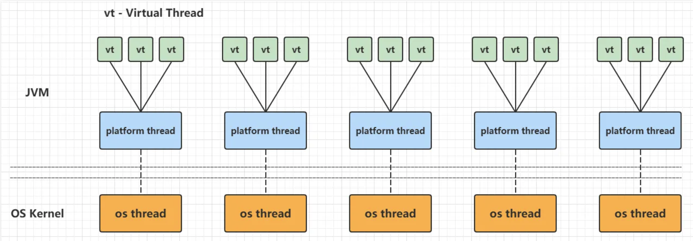
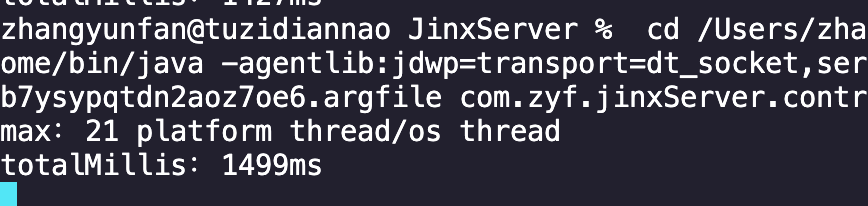
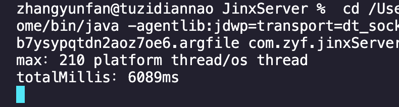
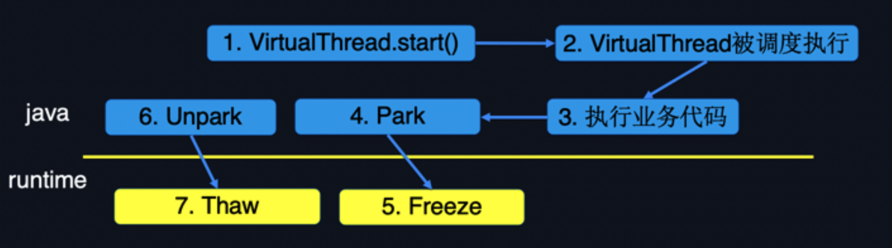
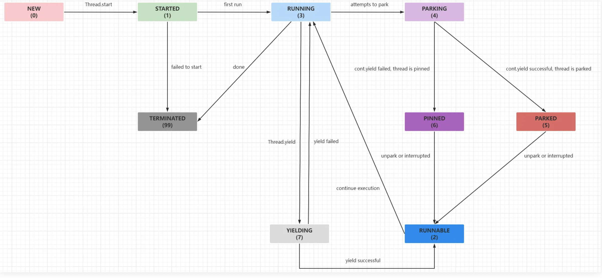
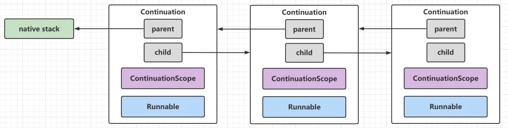
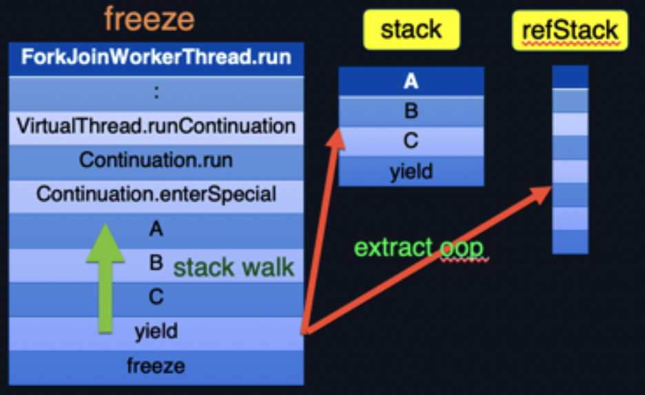
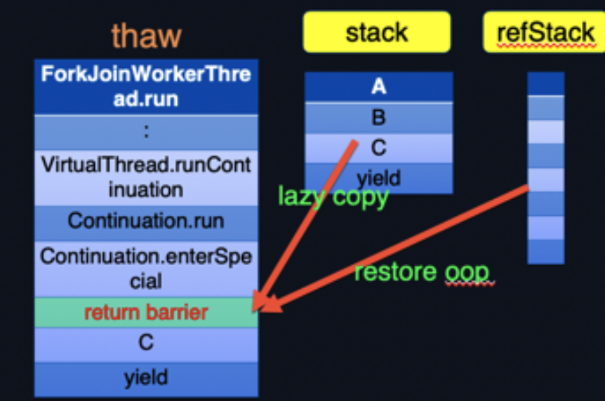
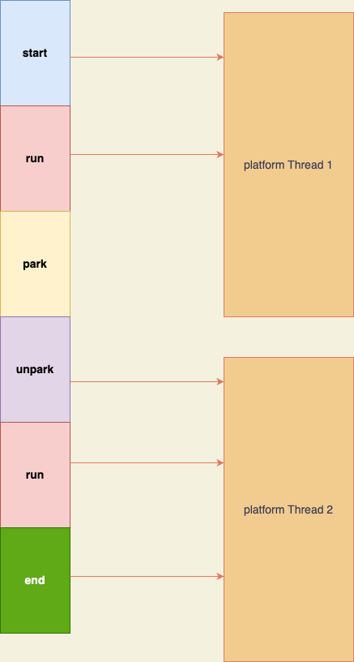

# 今天来谈一谈Java的虚拟线程

2023年9月份，JDK最近的一个LTS（ long-term support）版本JDK21正式发布：https://openjdk.org/projects/jdk/21/

之前在jdk19发布的 VirtualThread（虚拟线程）功能终于在这个LTS版本正式发布了。

虚拟线程是JEP 425提出的预览功能，并在JDK 19中提供。为了留出时间进行反馈并获得更多经验， JEP 436再次提议将它们作为预览功能并在JDK 20中提供，最终在JEP444中最终在jdk21发布。这里可以看到关于虚拟线程的详细介绍：https://openjdk.org/jeps/444

今天我们就从什么是，为什么需要、出现之前我们是怎么做的、对比之前之后以及底层原理，五个方面来谈一谈，至于如何使用这个网上太多例子了，相信聪明的你经过简单搜索，五分钟就可以学会了，所以今天这里不再赘述如何使用。


## 1、什么是虚拟线程

我们知道之前的Java中每个Thread实例都是一个*平台线程*。平台线程在底层操作系统线程上运行 Java 代码，并在代码的整个生命周期内捕获操作系统线程。平台线程数受限于操作系统线程数。

虚拟*线程*是在底层操作系统线程上运行 Java 代码的实例`java.lang.Thread`，但不会在代码的整个生命周期内捕获操作系统线程。这意味着许多虚拟线程可以在同一个操作系统线程上运行它们的 Java 代码，从而有效地共享它。虽然平台线程独占宝贵的操作系统线程，但虚拟线程却不然。虚拟线程的数量可以比操作系统线程的数量大得多。

虚拟线程是 JDK 而不是操作系统提供的轻量级线程实现。它们是*用户模式线程*的一种形式，在其他多线程语言中已经取得了成功（例如，Go 中的 goroutine 和 Erlang 中的进程）：



## 2、为什么需要虚拟线程

服务器应用程序的可扩展性受利特尔定律(Little's Law)的约束，该定律与延迟、并发性和吞吐量相关：对于给定的请求处理持续时间（即延迟），应用程序同时处理的请求数（即并发性）必须与到达率（即吞吐量）成比例增长。例如，假设平均延迟为 50 毫秒的应用程序通过同时处理 10 个请求，实现了每秒 200 个请求的吞吐量。为了使该应用程序扩展到每秒 2000 个请求的吞吐量，需要同时处理 100 个请求。如果每个请求在请求持续时间内都在一个线程中处理，那么为了让应用程序跟上，线程数量必须随着吞吐量的增长而增长。

不幸的是，可用线程的数量是有限的，因为 JDK 将线程实现为操作系统 (OS) 线程的包装器。操作系统线程的成本很高，因此我们不能拥有太多线程，这使得实现不适合每个请求线程的风格。如果每个请求在其持续时间内消耗一个线程，从而消耗一个操作系统线程，那么在其他资源（例如 CPU 或网络连接）耗尽之前，线程数量通常会成为限制因素。JDK 当前的线程实现将应用程序的吞吐量限制在远低于硬件可支持的水平。即使线程被池化，也会发生这种情况，因为池化有助于避免启动新线程的高成本，但不会增加线程总数。所以虚拟线程应运而生（此为虚拟线程诞生的大背景）

我们要了解一下操作系统的线程模型。

在操作系统中我们平时所说的并发编程、多线程、共享资源等概念都是与线程相关的，这里所说的线程实际上应该叫作“用户线程”，而对应到操作系统，还有另外一种线程叫作“内核线程”，

在操作系统和编程语言层面上，线程模型可以分为几种类型：

>1.1:1 模型：每个用户级线程对应一个内核级线程。这种模型下，线程管理由操作系统内核完成，提供了良好的并发性能，但可能在创建线程或上下文切换时引入更多的开销。大部分编程语言的线程库（如linux的pthread，Java的java.lang.Thread，C++11的std::thread等等）都是 1:1 模型。
>
>2.N:1 模型：多个用户级线程映射到一个内核级线程。这种模型下 ，线程管理由用户级库执行，线程操作开销较小，但无法利用多核处理器的优势，且一个线程的阻塞会阻塞整个进程。
>
>3.M:N 模型：多个用户级线程映射到多个内核级线程。这种模型旨在结合1:1和N:1模型的优点，可以由用户级线程库和操作系统内核共同管理。

java传统的thread就是1:1模型，一个用户线程对应一个操作系统线程，但是线程又是一种重量级的资源因为涉及到上下文切换和新建销毁的开销，所以这种1比1模型会“很重”，好处就是不用程序来调度线程而是交给操作系统来调度线程，java解决“很重”的办法是用线程池的池化思想来避免频繁重复创建和销毁线程。但是即使是池化了，也存在如何确定线程池的线程数问题以及大量任务的等待问题，相信各位java程序员在创建线程池的时候最痛苦的莫过于决定参数了吧。

第二种N:1模型就是我们通常所说的单线程，redis就是使用的这种模型，好处是响应快不存在线程安全问题占有资源小，但是缺点也很明显在高并发下会有阻塞问题，虽然redis用了无阻塞IO来解决这个问题但是这个解决方案并不适用于其他大多数系统

而第三种模型就是我们的虚拟线程，可以看到虚拟线程可以有效避免频繁的创建和销毁线程也可以减少上下文切换，在多线程的场景下虚拟线程可以创建很少的线程，这也意味着在操作系统层面可以节约更多的时间和资源。

所以虚拟线程便宜且充足，因此永远不应该被池化：应该为每个应用程序任务创建一个新的虚拟线程。因此，大多数虚拟线程都是短暂的，并且具有浅层调用堆栈，只执行单个 HTTP 客户端调用或单个 JDBC 查询。相比之下，平台线程重量级且昂贵，因此通常必须进行池化。它们往往寿命很长，具有很深的调用堆栈，并且在许多任务之间共享。

总之，虚拟线程保留了可靠的每个请求线程风格，该风格与 Java 平台的设计相协调，同时最佳地利用了可用的硬件。使用虚拟线程不需要学习新概念，尽管它可能需要放弃为应对当今线程的高成本而养成的习惯。虚拟线程不仅可以帮助应用程序开发人员，还可以帮助框架设计人员提供易于使用的 API，这些 API 与平台的设计兼容，而不影响可扩展性


## 3、Java在虚拟线程之前是怎么创建线程的

我们知道Java创建启动线程都是在Thread类中完成的，我们会new一个Thread类然后调用start方法来真正启动一个线程，我们从jvm底层来探究一下java到底是如何创建线程的，虽然在笔者之前的文章：[从jvm源码看TLAB](https://mp.weixin.qq.com/s/a0-kB4vwsZYlkNf0YvXLig)中有讲解过（因为要看TLAB在线程启动的时候如何初始化的），但是今天我们再复习一遍:

根据我们的基础知识，java中线程的启动核心代码就是:`thread.start();`那么我们就到`Thread.java`中的start方法，那么我们可以看到start最终执行的是`start0()`这个native方法，经常看我文章的朋友可能已经对如何查看native方法可太熟练了，我们找到jdk源码里的`Thread.c`即可，然后最后源码在`jvm.cpp`中的方法`JVM_StartThread`里，核心代码就是:

```c++
    ... 
native_thread = new JavaThread(&thread_entry, sz);
    ...
```

在Javathread的构造方法里也就是Thread.cpp中：

```c++
JavaThread::JavaThread(ThreadFunction entry_point, size_t stack_sz) :
                       Thread() {
  initialize();
  _jni_attach_state = _not_attaching_via_jni;
  set_entry_point(entry_point);
  // Create the native thread itself.
  // %note runtime_23
  os::ThreadType thr_type = os::java_thread;
  thr_type = entry_point == &compiler_thread_entry ? os::compiler_thread :
                                                     os::java_thread;
  os::create_thread(this, thr_type, stack_sz);
  ...
```

也就是`os::create_thread(this, thr_type, stack_sz);`

这个就涉及到了每个操作系统自己的实现，我们就看linux：

```c++
int ret = pthread_create(&tid, &attr, (void* (*)(void*)) thread_native_entry, thread);
```

>在 C++ 中，`pthread_create` 是用于创建新线程的 POSIX 标准函数。它允许你在程序中创建一个新的执行线程，这个线程可以并行地执行程序中的其他任务。
>
>这个函数的原型如下：
>
>```c
>int pthread_create(pthread_t *thread, const pthread_attr_t *attr, void *(*start_routine) (void *), void *arg);
>```
>
>这里是对参数的简要解释：
>
>- `thread`：一个指向 `pthread_t` 类型的指针，用于存储新线程的标识符。
>- `attr`：一个指向 `pthread_attr_t` 类型的指针，用于指定新线程的属性。通常可以将其设置为 `NULL`，表示使用默认属性。
>- `start_routine`：一个指向函数的指针，这个函数是新线程要执行的函数。它接受一个 `void*` 类型的参数，并返回一个 `void*` 类型的指针。
>- `arg`：传递给 `start_routine` 函数的参数。
>
>当调用 `pthread_create` 函数时，它会创建一个新的线程，并在新线程中执行 `start_routine` 函数。`start_routine` 函数的参数就是 `arg`。新线程的标识符将会存储在 `thread` 指向的位置。
>
>需要注意的是，新线程的执行会立即开始，但是它的执行顺序可能是不确定的，具体取决于操作系统的调度和其他因素。
>
>在使用 `pthread_create` 函数时，你需要小心管理线程的生命周期和资源，包括在适当的时候终止线程，并释放线程所占用的资源，以避免出现资源泄漏或者线程安全问题。
>
>总的来说，`pthread_create` 函数为 C++ 程序员提供了一种创建并发执行线程的方式，使得程序能够更高效地利用多核处理器和并行计算能力。

所以普通的Thread类就是通过linux的标准函数创建了一个操作系统的线程，顺便jdk里面也是通过这个`pthread_create`函数的第三个参数来实现的调用runable的run方法的。


## 4、对比Thread的线程和虚拟线程

既然说了虚拟线程比起传统的Thread会有比较大的性能提升，那么我们就来验证一下：

```java
public static void main(String[] args) {
        // 开启一个线程来监控当前的平台线程（系统线程）总数
        ScheduledExecutorService scheduledExecutorService = Executors.newScheduledThreadPool(1);
        scheduledExecutorService.scheduleAtFixedRate(() -> {
            ThreadMXBean threadBean = ManagementFactory.getThreadMXBean();
            ThreadInfo[] threadInfo = threadBean.dumpAllThreads(false, false);
            saveMaxThreadNum(threadInfo.length);
        }, 1, 1, TimeUnit.SECONDS);

        long start = System.currentTimeMillis();
        ExecutorService executor = Executors.newFixedThreadPool(200);
        for (int i = 0; i < 100000; i++) {
            executor.submit(() -> {
                try {
                    // 线程睡眠 10ms，可以等同于模拟业务耗时10ms
                    TimeUnit.MILLISECONDS.sleep(10);
                } catch (InterruptedException e) {
                }
            });
        }
        executor.close();
        System.out.println("max：" + (list.isEmpty() ? 0 : list.get(0)) + " platform thread/os thread");
        System.out.printf("totalMillis：%dms\n", System.currentTimeMillis() - start);
    }

    // 保存平台线程的创建的最大总数
    public static List<Integer> saveMaxThreadNum(int num) {
        if (list.isEmpty()) {
            list.add(num);
        } else {
            Integer integer = list.get(0);
            if (num > integer) {
                list.add(0, num);
            }
        }
        return list;
    }
```

```java
 public static void main(String[] args) {
        // 开启一个线程来监控当前的平台线程（系统线程）总数
        ScheduledExecutorService scheduledExecutorService = Executors.newScheduledThreadPool(1);
        scheduledExecutorService.scheduleAtFixedRate(() -> {
            ThreadMXBean threadBean = ManagementFactory.getThreadMXBean();
            ThreadInfo[] threadInfo = threadBean.dumpAllThreads(false, false);
            saveMaxThreadNum(threadInfo.length);
        }, 10, 10, TimeUnit.MILLISECONDS);

        long start = System.currentTimeMillis();
        ExecutorService executor = Executors.newVirtualThreadPerTaskExecutor();
        for (int i = 0; i < 100000; i++) {
            executor.submit(() -> {
                // 线程睡眠 10ms，可以等同于模拟业务耗时10ms
                try {
                    TimeUnit.MILLISECONDS.sleep(10);
                } catch (InterruptedException e) {
                }
            });
        }
        executor.close();
        System.out.println("max：" + list.get(0) + " platform thread/os thread");
        System.out.printf("totalMillis：%dms\n", System.currentTimeMillis() - start);
    }

    public static List<Integer> saveMaxThreadNum(int num) {
        if (list.isEmpty()) {
            list.add(num);
        } else {
            Integer integer = list.get(0);
            if (num > integer) {
                list.add(0, num);
            }
        }
        return list;
    }
}

class CustomThread implements Runnable {

    @Override
    public void run() {
        try {
            TimeUnit.MILLISECONDS.sleep(10);
        } catch (InterruptedException e) {
        }
    }

}
```

我们分别进行10万个任务，每个任务里睡眠10ms来模拟io和业务流程，然后对比传统thread线程和虚拟线程的创建的线程数和总耗时，注意这里thread是使用了线程池的。

虚拟线程的运行结果：



Thread线程的运行结果：



我们可以看到线程差了十倍，耗时差了五倍，虚拟线程确实提升了性能。


## 5、虚拟线程的底层原理

那么虚拟线程究竟是如何实现的M:N模型从而来提升我们多线程下的性能的呢？

我们从整体来简单介绍一下虚拟线程大大概原理然后再深入源码。



如图所示，展示了一个虚拟线程的生命周期。最初，执行VirtualThread.start()方法创建一个虚拟线程，等待被调度；当虚拟线程被调度执行以后，开始执行用户指定的业务代码，在执行代码的过程中可能会去访问数据库/访问网络，这些IO操作最后都会调用到底层的一个Park操作。Park可以理解为虚拟线程让出执行权限，且当前不能被调度执行。IO结束后会调用Unpark，Unpark之后虚拟线程可以被调度执行。在Park操作时，需要执行一个freeze操作，这个操作主要是将当前虚拟线程的执行状态，也就是调用栈保存起来。当虚拟线程Unpark且被调度时，会执行一个thaw操作，它是freeze的对称操作，主要是把之前freeze保存的调用栈恢复到执行线程上。然后就继续在此虚拟线程上执行后面的逻辑。


然后我们就深入源码了，虚拟线程的代码可读性不高，可能因为还是半实验性质的功能的缘故，所以笔者这里只会简单介绍，一些细节会跳过不会太过于深入。

### 5.1 启动

首先我们要找到入口：

```java
Thread unStarted = Thread.ofVirtual().unstarted(customThread1);
unStarted.start();
```

我们用`ofVirtual.unstarted`创建一个未启动的虚拟线程然后调用`start`方法启动，当然我们也可以直接`.ofVirtual().started`启动一个虚拟线程，anyway，虚拟线程启动的入口在`start`方法，我们点进去发现，`Thread`的`start`方法有有两个实现：


一个是我们java传统的`Thread`实现，一个就是虚拟线程实现，`VirtualThread`是`BaseVirtualThread`的子类，而`BaseVirtualThread`是一个"密封类"，它是`Thread`的子类，只对`VirtualThread`和`ThreadBuilders.BoundVirtualThread`开放，并且`VirtualThread`是**包私有访问权限的**同时用`final`关键字修饰，无法被继承。我们点进到虚拟线程的实现:

```java
    @Override
    public void start() {
        start(ThreadContainers.root());
    }
...

void start(ThreadContainer container) {
  		//cas的方式修改状态为新建
        if (!compareAndSetState(NEW, STARTED)) {
            throw new IllegalThreadStateException("Already started");
        }

        // 绑定线程容器，这里是传入的根容器
        assert threadContainer() == null;
        setThreadContainer(container);

        // 开始标记
        boolean addedToContainer = false;
        boolean started = false;
        try {
          	//钩子函数
            container.onStart(this);  
            addedToContainer = true;

            // 从线程容器继承extent-local绑定参数
            inheritScopedValueBindings(container);

            // 提交'runContinuation'任务到调度器
            submitRunContinuation();
            started = true;
        } finally {
            if (!started) {
              //启动失败，则标记最终状态和回调终结钩子方法
                setState(TERMINATED);
                afterTerminate(addedToContainer, /*executed*/false);
            }
        }
    }

```

先看一下虚拟线程的状态：

```java
    private static final int NEW      = 0;			//初始化
    private static final int STARTED  = 1;			//开始
    private static final int RUNNABLE = 2;     // 运行中卸载
    private static final int RUNNING  = 3;     // 运行中挂载
    private static final int PARKING  = 4;		 //阻塞
    private static final int PARKED   = 5;     // 卸载
    private static final int PINNED   = 6;     // 挂载
    private static final int YIELDING = 7;     // 让出执行权限
    private static final int TERMINATED = 99;  // 最终状态
```

他们之间的状态转换：



这里提交任务到调度器是:

```java
    private void submitRunContinuation() {
        try {
            scheduler.execute(runContinuation);
        } catch (RejectedExecutionException ree) {
            submitFailed(ree);
            throw ree;
        }
    }
```

这里我们挨个挨个看，首先`scheduler`就是虚拟线程的调度器，这里调度器是在构造函数中初始化的：

```java
VirtualThread(Executor scheduler, String name, int characteristics, Runnable task) {
        super(name, characteristics, /*bound*/ false);
        Objects.requireNonNull(task);

        // choose scheduler if not specified
        if (scheduler == null) {
            Thread parent = Thread.currentThread();
            if (parent instanceof VirtualThread vparent) {
                scheduler = vparent.scheduler;
            } else {
                scheduler = DEFAULT_SCHEDULER;
            }
        }
...
```

可以不传入调度器，默认的调度器就是：

```java
  private static final ForkJoinPool DEFAULT_SCHEDULER = createDefaultScheduler();
```

一个`forkJoinPool`相信大家对这个模型（jdk因为虚拟线程对forkjoinpool做了大量优化，至于有哪些优化不是本文重点哈）

然后提交到调度器执行的`runContinuation`是这个：

```java
  private final Runnable runContinuation;
```

就是一个`Runnable`类型的成员变量，他也是在构造函数的时候初始化：

```java
 this.runContinuation = this::runContinuation;
```

所以最后提交到调度器的方法就是`runContinuation`：

```java
 private void runContinuation() {
        //运载线程必须是平台线程
        if (Thread.currentThread().isVirtual()) {
            throw new WrongThreadException();
        }

        
        int initialState = state();
        if (initialState == STARTED && compareAndSetState(STARTED, RUNNING)) {
            // 当前为STARTED状态并且CAS更新为RUNNING状态则标记首次运行为true
        } else if (initialState == RUNNABLE && compareAndSetState(RUNNABLE, RUNNING)) {
            // 当前为RUNNABLE状态并且CAS更新为RUNNING状态则标记首次运行为false，并且设置park许可为false
            setParkPermit(false);
        } else {
            // not runnable
            return;
        }

        // 在挂载之前唤醒 JVMTI（JVMTI是监控虚拟机的）
        notifyJvmtiMount(/*hide*/true);

        try {
          //cont就是：private final Continuation cont;，所以这里就是执行Continuation.run()
            cont.run();
        } finally {
          // Continuation执行完成，回调钩子方法afterTerminate
            if (cont.isDone()) {
                afterTerminate();
            } else {
              // Continuation没有执行完成，说明调用了Continuation.yield或者pin到运载线程中进行了park操作
                afterYield();
            }
        }
    }
```

这里核心是就是`Continuation#run`，我们先简单介绍一下`Continuation`类：

`Continuation`组件是用户真实任务的包装器，也是任务切换虚拟线程与平台线程之间数据转移的一个句柄，它提供的`yield`操作可以实现任务上下文的中断和恢复，上文中提到的阻塞让出执行权限然后恢复执行就是`Continuation`组件负责的。

这个类对于虚拟线程来说非常的重要可以说就是虚拟线程的核心类

`Continuation`直译为"连续"，一般来说表示一种语言构造，**使语言可以在任意点保存执行状态并且在之后的某个点返回**。在`JDK`中对应类`jdk.internal.vm.Continuation`，这个类只有一句类注释`A one-shot delimited continuation`，直译为**一个只能执行一次的回调函数**。

首先`Continuation`是一个双向链表设计:



然后我们看看他的成员变量：

```java
//Unsafe实例  
private static final Unsafe U = Unsafe.getUnsafe();

//挂载偏移量
private static final long MOUNTED_OFFSET = U.objectFieldOffset(Continuation.class, "mounted");

//保留范围值缓存
private static final boolean PRESERVE_SCOPED_VALUE_CACHE;

//JavaLangAccess提供了对Java核心类库中一些关键类的访问权限，执行一些底层的操作
private static final JavaLangAccess JLA = SharedSecrets.getJavaLangAccess();

//需要执行的,也就是用户的任务
private final Runnable target;

// 标识Continuation的范围，
private final ContinuationScope scope;

// Continuation的父节点，如果为空的时候则为本地线程栈
private Continuation parent;

// Continuation的子节点，非空时候说明在子Continuation中进行了yield操作
private Continuation child;

// 猜测为Continuation栈结构，由JVM管理
private StackChunk tail;

// 标记Continuation是否已经完成
private boolean done;

// 标记是否进行了mount操作
private volatile boolean mounted;

// yield操作时候设置的信息
private Object yieldInfo;

// 标记一个未挂载的Continuation是否通过强制抢占式卸载
private boolean preempted;

// 范围值缓存
private Object[] scopedValueCache;
```

然后`Continuation`只有一个构造函数:

```java
  public Continuation(ContinuationScope scope, Runnable target) {
        this.scope = scope;
        this.target = target;
    }
```

传入作用域和真正的任务。

我们回过头再来看虚拟线程中的的`Continuation`，初始化也是在`VirtualThread`构造函数中，直接new了一个：

```java
 this.cont = new VThreadContinuation(this, task);
```

这里`VThreadContinuation`是`VirtualThread`的内部私有化的静态类，继承`Continuation`：

```java
 private static class VThreadContinuation extends Continuation {
        VThreadContinuation(VirtualThread vthread, Runnable task) {
          //调用父类的构造函数，这里主要包装一下参数，这里VTHREAD_SCOPE就是是    private static final ContinuationScope VTHREAD_SCOPE = new ContinuationScope("VirtualThreads"); 意思就是虚拟线程
            super(VTHREAD_SCOPE, wrap(vthread, task));
        }
   			//pinnd钩子函数
        @Override
        protected void onPinned(Continuation.Pinned reason) {
            if (TRACE_PINNING_MODE > 0) {
                boolean printAll = (TRACE_PINNING_MODE == 1);
                PinnedThreadPrinter.printStackTrace(System.out, printAll);
            }
        }
   //包装一下，主要是把用户的真正的任务包装到虚拟线程中
        private static Runnable wrap(VirtualThread vthread, Runnable task) {
            return new Runnable() {
                @Hidden
                public void run() {
                    vthread.run(task);
                }
            };
        }
    }
```

这里可以看出来我们的真正的任务被包装在了虚拟线程的run方法里了。

然后我们看`Continuation`到`run`方法：

```java
public final void run() {
  			//无限循环
        while (true) {
          //挂载，这里是cas修改成员变量中的挂载状态而已
            mount();
           //设置作用域缓存
            JLA.setScopedValueCache(scopedValueCache);
					//如果已经完成了
            if (done)
                throw new IllegalStateException("Continuation terminated");
					//获取当前载体线程，载体线程就是虚拟线程真正依附于的线程，必须是平台线程
            Thread t = currentCarrierThread();
          //校验父节点
            if (parent != null) {
                if (parent != JLA.getContinuation(t))
                    throw new IllegalStateException();
            } else
              //如果为空则设置本地线程栈
                this.parent = JLA.getContinuation(t);
            JLA.setContinuation(t, this);

            try {
              //是否虚拟线程
                boolean isVirtualThread = (scope == JLA.virtualThreadContinuationScope());
              //是否第一次执行
                if (!isStarted()) { // is this the first run? (at this point we know !done)
                    enterSpecial(this, false, isVirtualThread);
                } else {
                    assert !isEmpty();
                    enterSpecial(this, true, isVirtualThread);
                }
              //都执行enterSpecial，但是区别在于第二个参数isContinue，一个是false一个是true，就是说如果是第一次执行那么就不是唤醒继续执行如果不是那就是继续执行的。
            } finally {
              //设置内存屏障
                fence();
                try {
                    assert isEmpty() == done : "empty: " + isEmpty() + " done: " + done + " cont: " + Integer.toHexString(System.identityHashCode(this));
                  //当前Continuation执行完成后，把运载线程的Continuation指向父Continuation
                    JLA.setContinuation(currentCarrierThread(), this.parent);
                    if (parent != null)
                        parent.child = null;

                    postYieldCleanup();
										//卸载
                    unmount();
                    if (PRESERVE_SCOPED_VALUE_CACHE) {
                        scopedValueCache = JLA.scopedValueCache();
                    } else {
                        scopedValueCache = null;
                    }
                    JLA.setScopedValueCache(null);
                } catch (Throwable e) { e.printStackTrace(); System.exit(1); }
            }
            // we're now in the parent continuation

            assert yieldInfo == null || yieldInfo instanceof ContinuationScope;
          //父Continuation的yieldInfo缓存当前的scope实例，清空当前Continuation的父节点和yieldInfo
            if (yieldInfo == null || yieldInfo == scope) {
                this.parent = null;
                this.yieldInfo = null;
                return;
            } else {
              //执行到这个位置说明在当前是子Continuation并且进行了yield操作，需要跳转到父Continuation进行yield操作
                parent.child = this;
                parent.yield0((ContinuationScope)yieldInfo, this);
                parent.child = null;
            }
        }
    }
```

代码相当复杂我们从开始的地方看，这里核心就是`enterSpecial`方法，意思是真正开始`Continuation`，这里`enterSpecial`是一个native方法，所以我们需要去JVM里看了。

有意思的是。这个native方法并不是传统的native方法，传统的native方法可以直接在`.c`文件里找到真正执行的方法，这里并不是，这里需要去`sharedRuntime_XX`（XX是代表计算机架构，比如X86、arm，sharedRuntime是适配不同架构的的类）里去找也就是生成本地方法包装的地方：

```c++
nmethod* SharedRuntime::generate_native_wrapper(MacroAssembler* masm,
                                                const methodHandle& method,
                                                int compile_id,
                                                BasicType* in_sig_bt,
                                                VMRegPair* in_regs,
                                                BasicType ret_type) {
  if (method->is_continuation_native_intrinsic()) {
    int exception_offset = -1;
    OopMapSet* oop_maps = new OopMapSet();
    int frame_complete = -1;
    int stack_slots = -1;
    int interpreted_entry_offset = -1;
    int vep_offset = -1;
    if (method->is_continuation_enter_intrinsic()) {
      gen_continuation_enter(masm,
                             in_regs,
                             exception_offset,
                             oop_maps,
                             frame_complete,
                             stack_slots,
                             interpreted_entry_offset,
                             vep_offset);
    } else if (method->is_continuation_yield_intrinsic()) {
      gen_continuation_yield(masm,
                             in_regs,
                             oop_maps,
                             frame_complete,
                             stack_slots,
                             vep_offset);
    } else {
      guarantee(false, "Unknown Continuation native intrinsic");
    }
```

这里可以看到`Continuation`的两个native方法是很特殊的，他不会像传统的native方法那样简单的调用而是在这里指定调用

`gen_continuation_enter`和`gen_continuation_yield`（这里PPC、X86、arm都是如此实现，X86 32位没有看到如此实现）

所以我们看`gen_continuation_enter`(在每个架构下实现不一样因为指令集都不一样了，这里我们只看X86架构的)这里代码都是用了X86的汇编代码，所以我们就只看关键的：

```c++
static void gen_continuation_enter(MacroAssembler* masm,
                                   const VMRegPair* regs,
                                   int& exception_offset,
                                   OopMapSet* oop_maps,
                                   int& frame_complete,
                                   int& stack_slots,
                                   int& interpreted_entry_offset,
                                   int& compiled_entry_offset) {

  // enterSpecial(Continuation c, boolean isContinue, boolean isVirtualThread)
  int pos_cont_obj   = 0;
  int pos_is_cont    = 1;
  int pos_is_virtual = 2;
	//映射参数
  // The platform-specific calling convention may present the arguments in various registers.
  // To simplify the rest of the code, we expect the arguments to reside at these known
  // registers, and we additionally check the placement here in case calling convention ever
  // changes.
  Register reg_cont_obj   = c_rarg1;
  Register reg_is_cont    = c_rarg2;
  Register reg_is_virtual = c_rarg3;
  ...
  //为 Continuation 进入点设置必要的环境，并创建用于垃圾回收的对象位置映射信息
     OopMap* map = continuation_enter_setup(masm, stack_slots);
  ...
  // If isContinue, call to thaw. Otherwise, call Continuation.enter(Continuation c, boolean isContinue)
    //这条指令对寄存器 reg_is_cont 中的值进行按位与操作，并设置相应的标志位（例如零标志位）。这个操作不会改变寄存器中的值，只是根据操作的结果设置标志位。
  __ testptr(reg_is_cont, reg_is_cont);
  //这条指令根据前面 testptr 操作设置的标志位，进行条件跳转。具体来说，如果 reg_is_cont 寄存器的值不为零（即标志位不为零），则跳转到标号为 L_thaw 的位置执行代码。
  __ jccb(Assembler::notZero, L_thaw);
  ...
 //：这条指令将代码的执行点标记为标号为 L_thaw 的位置，这样在后续的代码中可以通过标号来引用这个位置。
  __ bind(L_thaw);
//这条指令会调用名为 cont_thaw 的函数。在这里，RuntimeAddress 用于将一个地址转换为运行时可执行的函数地址，StubRoutines::cont_thaw() 则是获取 cont_thaw 函数的地址。
  __ call(RuntimeAddress(StubRoutines::cont_thaw()));
```

然后`cont_thaw()`还是在X86 64位下的定义：

```c++
  StubRoutines::_cont_thaw          = generate_cont_thaw();
```

也就是最后调用的是`StubGenerator`的`generate_cont_thaw`方法。

而`enter`则是指的Java中的`Continuation`类的`enter`方法。

总结一下`enterSpecial`方法会根据是否首次执行来执行`Continuation`类的`enter`方法或者`StubGenerator`的`generate_cont_thaw`方法对应我们开头的原理中的开始调度执行步骤和`unpark`之后的`Thaw`操作。

我们从`Continuation`类的`enter`方法开始看：

```c++
private static void enter(Continuation c, boolean isContinue) {
        // This method runs in the "entry frame".
        // A yield jumps to this method's caller as if returning from this method.
        try {
            c.enter0();
        } finally {
            c.finish();
        }
    }
    ...
     private void enter0() {
        target.run();
    }
```

这里就是执行`target`的run方法，然后target这里是在构造函数中定义的，我们上文提到过的：

```c++
 private static Runnable wrap(VirtualThread vthread, Runnable task) {
            return new Runnable() {
                @Hidden
                public void run() {
                    vthread.run(task);
                }
            };
        }
```

也就是这里绕回到虚拟线程中的run方法了：

```c++
 private void run(Runnable task) {
        assert state == RUNNING;

        // 第一次装配
        mount();
   			//唤醒启动JVM TI JVMTI （JVM Tool Interface）是Java虚拟机对外提供的Native编程接口，通过JVMTI，外部进程可以获取到运行时JVM的诸多信息，比如线程、GC等。Agent是一个运行在目标JVM的特定程序，它的职责是负责从目标JVM中获取数据，然后将数据传递给外部进程
        notifyJvmtiStart();

        //如果启用了虚拟线程启动事件则发送一个虚拟线程事件
        if (VirtualThreadStartEvent.isTurnedOn()) {
            var event = new VirtualThreadStartEvent();
            event.javaThreadId = threadId();
            event.commit();
        }
				//线程的范围绑定值，这里是运载线程的
        Object bindings = Thread.scopedValueBindings();
        try {
          //运行真正的任务
            runWith(bindings, task);
        } catch (Throwable exc) {
            dispatchUncaughtException(exc);
        } finally {
            try {
                // pop any remaining scopes from the stack, this may block
                StackableScope.popAll();

                // 发送结束事件
                if (VirtualThreadEndEvent.isTurnedOn()) {
                    var event = new VirtualThreadEndEvent();
                    event.javaThreadId = threadId();
                    event.commit();
                }

            } finally {
                // last unmount
                notifyJvmtiEnd();
               //卸载
                unmount();

                // final state
              //设置虚拟线程状态状态为完成
                setState(TERMINATED);
            }
        }
    }
```


这里其实只用关注装配、运行任务和卸载就行了

运行任务的代码也很简单：

```java
final void runWith(Object bindings, Runnable op) {
  //native方法确保堆栈可以复制
    ensureMaterializedForStackWalk(bindings);
  //运行我们真正的任务的run方法
    op.run();
  //没有任何逻辑，消除各种情况对jvm的性能影响，这个方法用了ForceInline注解
    Reference.reachabilityFence(bindings);
}
```

那么启动的代码就这么多了，到这里就是虚拟线程启动的地方了

### 5.2 阻塞


上文说到了如果虚拟线程有阻塞IO操作，他们最终会调用park方法，然后在park方法里会有其他操作来让出运载线程，我们己接着看(其实`park(long nano)`、`sleep`等其他阻塞操作也会触发相关流程，不过这里只看剧有代表性的`park`)：

熟悉juc源码的读者应该知道，Java的park方法是在`LockSupport`中，所以我们直接看`LockSupport`的`park`方法：

```java
public static void park() {
    if (Thread.currentThread().isVirtual()) {
        VirtualThreads.park();
    } else {
        U.park(false, 0L);
    }
}
```

果然！如果在虚拟线程内调用了`park`就会触发其他逻辑，这里进入到了虚拟线程自己的park方法中：

```java

public static void park() {
    JLA.parkVirtualThread();
}
...
public void parkVirtualThread() {
                Thread thread = Thread.currentThread();
                if (thread instanceof BaseVirtualThread) {
                    BaseVirtualThread vthread = (BaseVirtualThread)thread;
                    vthread.park();
                } else {
                    throw new WrongThreadException();
                }
            }
```

这一通操作还是回到`VirtualThread`的`park`方法中来：

```java
void park() {
        assert Thread.currentThread() == this;

        // 如果此时已经不是中断状态了，那么就立刻完成
        if (getAndSetParkPermit(false) || interrupted)
            return;

        // 阻塞线程，这里标记让出了运载线程
        boolean yielded = false;
  			//设置状态为park
        setState(PARKING);
        try {
          	//通过Continuation来让出运载线程
            yielded = yieldContinuation();  // may throw
        } finally {
            assert (Thread.currentThread() == this) && (yielded == (state() == RUNNING));
          	//如果没有让出成功则设置为运行中，也就是这个虚拟线程还是要占用运载线程
            if (!yielded) {
                assert state() == PARKING;
                setState(RUNNING);
            }
        }

        // 当存在Pinned Thread的情况等时候就直接阻塞运载线程
        if (!yielded) {
            parkOnCarrierThread(false, 0);
        }
    }
```

首先这里简单介绍下`Pinned Thread`：

当在虚拟线程的任务存在如下情况的时候：

- `Continuation`栈存在`native`方法或者外部函数（`FFM`的`API`，见`JEP-424`）
- 当持有监视器或者等待监视器的时候（一般是使用了`synchronized`关键字或者`Object.wait()`）

则运载线程不能进行`yield`操作，导致虚拟线程无法从平台线程卸载，虽然不会影响程序正确执行，但是会影响性能，也就是如果这些虚拟线程是可复用的，永远无法切换到其运载线程，导致任务切换开销永久性增大

至于原因，我举个例子，虚拟线程中用了`Synchronized`关键字来上锁，根据基础知识真正拿到这个锁也就是这个控制器的是运载线程，那么运载线程可能不会只运行一个虚拟线程，那么这个时候这个锁的安全性就失效了，所以开发人员直接让这种情况下装载线程只运行这一个虚拟线程，也就是回归到1:1的情况。

至于这个问题，jvm的开发人员也关注到了，在最新的采访中他们表示会开始考虑重构`monitor`控制器，采访视频：

https://inside.java/2023/10/26/ama-java-architects/

4分16秒开始，虚拟线程的Loom项目的架构师 AlanBateman的回答

然后看看yield方法：

```java
    private boolean yieldContinuation() {
        // unmount
        notifyJvmtiUnmount(/*hide*/true);
        unmount();
        try {
          //调用Continuation的yield方法，注意这里是静态方法！
            return Continuation.yield(VTHREAD_SCOPE);
        } finally {
            // re-mount
            mount();
            notifyJvmtiMount(/*hide*/false);
        }
    
```

这里先把虚拟线程和运载线程卸载之后再调用`Continuation`的`yield`方法，在卸载的方法里：

```java
 private void unmount() {
        // set Thread.currentThread() to return the platform thread
        Thread carrier = this.carrierThread;
        carrier.setCurrentThread(carrier);

        // break connection to carrier thread, synchronized with interrupt
        synchronized (interruptLock) {
            setCarrierThread(null);
        }
        carrier.clearInterrupt();
    }
```

这里会上一把锁，然后设置运载线程为空，这里锁的对象是虚拟线程实例自己的属性，然后我们在看`Continuation`的`yield`方法：

```java
    public static boolean yield(ContinuationScope scope) {
        // 获取当前运载线程的Continuation实例
        Continuation cont = JLA.getContinuation(currentCarrierThread());
        Continuation c;
        // 基于Continuation实例当前向父节点遍历，直到匹配虚拟线程类型的ContinuationScope的Continuation，如果没有匹配的Continuation会抛出异常中断流程
        for (c = cont; c != null && c.scope != scope; c = c.parent)
            ;
        if (c == null)
            throw new IllegalStateException("Not in scope " + scope);
       // 把当前的Continuation挂起到给定的ContinuationScope
        return cont.yield0(scope, null);
    }


 private boolean yield0(ContinuationScope scope, Continuation child) {
        // 强制抢占式卸载标记为false
        preempted = false;
				//如果当前Continuation实例的yieldInfo不等于传入的ContinuationScope实例，则进行更新，相等的情况下yieldInfo会保持是一个空值
        if (scope != this.scope)
            this.yieldInfo = scope;
        //调用native方法来进行yield操作
        int res = doYield();
   //放置内存屏障防止指令重排，后面注释提到是防止编译器进行某些转换
        U.storeFence(); // needed to prevent certain transformations by the compiler

        assert scope != this.scope || yieldInfo == null : "scope: " + scope + " this.scope: " + this.scope + " yieldInfo: " + yieldInfo + " res: " + res;
        assert yieldInfo == null || scope == this.scope || yieldInfo instanceof Integer : "scope: " + scope + " this.scope: " + this.scope + " yieldInfo: " + yieldInfo + " res: " + res;
				//作者自己都看下去了
        if (child != null) { // TODO: ugly
            if (res != 0) {
                child.yieldInfo = res;
            } else if (yieldInfo != null) {
                assert yieldInfo instanceof Integer;
                child.yieldInfo = yieldInfo;
            } else {
                child.yieldInfo = res;
            }
            this.yieldInfo = null;
        } else {
            if (res == 0 && yieldInfo != null) {
                res = (Integer)yieldInfo;
            }
            this.yieldInfo = null;

            if (res == 0)
              // Continuation实例继续执行前回调
                onContinue();
            else
              // Continuation固定在运载线程前回调，res是pined的级别
                onPinned0(res);
        }
        assert yieldInfo == null;
				//// 返回布尔值结果表示当前Continuation实例是否会继续执行
        return res == 0;
    }
```

这里比较核心的代码还是在native中，也就是执行yield的`doYield`，上文提到过这个方法在JVM源码中的位置，所以这里我们直接看jvm源码：

```c++
static void gen_continuation_yield(MacroAssembler* masm,
                                   const VMRegPair* regs,
                                   OopMapSet* oop_maps,
                                   int& frame_complete,
                                   int& stack_slots,
                                   int& compiled_entry_offset) {
  enum layout {
    rbp_off,
    rbpH_off,
    return_off,
    return_off2,
    framesize // inclusive of return address
  };
...
  //核心，调用freeze来挂起
  __ call_VM_leaf(Continuation::freeze_entry(), 2);
  __ reset_last_Java_frame(true);

  Label L_pinned;
	//如果协程成功挂起，则函数会跳转到协程的入口点，并执行协程的清理操作。然后，函数会恢复之前保存的栈帧，并返回。
  __ testptr(rax, rax);
  __ jcc(Assembler::notZero, L_pinned);

...

  //如果协程无法挂起（被 "pin"），则函数会检查是否有未处理的异常。如果有未处理的异常，则函数会跳转到异常处理入口。否则，函数会恢复之前保存的栈帧，并返回
  __ cmpptr(Address(r15_thread, Thread::pending_exception_offset()), NULL_WORD);
  Label ok;
  __ jcc(Assembler::equal, ok);
  __ leave();
  __ jump(RuntimeAddress(StubRoutines::forward_exception_entry()));
  __ bind(ok);

  __ leave();
  __ ret(0);
}
```

这里又是大量的汇编，这里核心就是调用`freeze_entry`方法来挂起，这里和我们开头讲的又对应上了。

所以我们直接看`freeze_entry`方法:

```c++
static inline int freeze_internal(JavaThread* current, intptr_t* const sp) {
  //函数首先检查当前线程是否有未处理的异常。如果有，那么会触发一个断言错误。
  assert(!current->has_pending_exception(), "");

...

  //获取当前线程的最后一个协程入口点
  ContinuationEntry* entry = current->last_continuation();

  oop oopCont = entry->cont_oop(current);
...
  //创建了一个 ContinuationWrapper 对象，这个对象是用来封装和管理协程的。
  ContinuationWrapper cont(current, oopCont);
  log_develop_debug(continuations)("FREEZE #" INTPTR_FORMAT " " INTPTR_FORMAT, cont.hash(), p2i((oopDesc*)oopCont));
//接着检查当前线程是否持有任何监视器锁，或者是否在一个关键区域内。如果是，那么协程不能被挂起，函数会返回一个表示失败的结果。
  assert(entry->is_virtual_thread() == (entry->scope(current) == java_lang_VirtualThread::vthread_scope()), "");
  assert(monitors_on_stack(current) == ((current->held_monitor_count() - current->jni_monitor_count()) > 0),
         "Held monitor count and locks on stack invariant: " INT64_FORMAT " JNI: " INT64_FORMAT, (int64_t)current->held_monitor_count(), (int64_t)current->jni_monitor_count());

  if (entry->is_pinned() || current->held_monitor_count() > 0) {
    log_develop_debug(continuations)("PINNED due to critical section/hold monitor");
    verify_continuation(cont.continuation());
    freeze_result res = entry->is_pinned() ? freeze_pinned_cs : freeze_pinned_monitor;
    log_develop_trace(continuations)("=== end of freeze (fail %d)", res);
    return res;
  }
//定义一个freeze对象来执行freeze操作
  Freeze<ConfigT> freeze(current, cont, sp);

 ...
   	//执行freeze，先判断是否可以快速挂起
    freeze_result res = fast ? freeze.try_freeze_fast() : freeze.freeze_slow();

    CONT_JFR_ONLY(freeze.jfr_info().post_jfr_event(&event, oopCont, current);)
    freeze_epilog(current, cont, res);
    cont.done(); // allow safepoint in the transition back to Java
    return res;
  JRT_BLOCK_END
}
```

是否快速挂起的区别就是，快速挂起是直接分配一个新的栈块，并在其中进行快速挂起操作失败就会进行非快速挂起，非快速挂起会递归的尝试递归地挂起栈帧，所以我们直接看非快速挂起的递归挂起：

```c++
NOINLINE freeze_result FreezeBase::recurse_freeze(
  //当前要挂起的栈
  frame& f, 
  //调用者栈帧
  frame& caller, 
  //调用者参数大小 
  int callee_argsize, 
  //调用者是否是解释帧
  bool callee_interpreted, 
  //是否是栈顶帧
  bool top) {
  assert(f.unextended_sp() < _bottom_address, ""); // see recurse_freeze_java_frame
  assert(f.is_interpreted_frame() || ((top && _preempt) == ContinuationHelper::Frame::is_stub(f.cb())), "");
  //检查是否栈溢出
  if (stack_overflow()) {
    return freeze_exception;
  }
  //如果栈帧 f 是编译帧，函数会检查其是否有 oop map。如果没有，说明这是一个特殊的本地帧，函数会返回一个表示本地帧被 "pin" 的结果。否则，函数会尝试挂起编译帧
  if (f.is_compiled_frame()) {
    if (UNLIKELY(f.oop_map() == nullptr)) {
      // special native frame
      return freeze_pinned_native;
    }
    return recurse_freeze_compiled_frame(f, caller, callee_argsize, callee_interpreted);
  } 
  //如果栈帧 f 是解释帧，函数会检查它是否是一个本地方法。如果是，并且这是栈顶帧并且正在进行抢占，函数会返回一个表示本地帧被 "pin" 的结果。否则，函数会尝试挂起解释帧。
  else if (f.is_interpreted_frame()) {
    assert((_preempt && top) || !f.interpreter_frame_method()->is_native(), "");
    if (_preempt && top && f.interpreter_frame_method()->is_native()) {
      // int native entry
      return freeze_pinned_native;
    }

    return recurse_freeze_interpreted_frame(f, caller, callee_argsize, callee_interpreted);
  }
  //如果栈帧 f 是一个存根帧，并且这是栈顶帧并且正在进行抢占，函数会尝试挂起存根帧。
  else if (_preempt && top && ContinuationHelper::Frame::is_stub(f.cb())) {
    return recurse_freeze_stub_frame(f, caller);
  } 
  //如果以上所有情况都不满足，函数会返回一个表示本地帧被 "pin" 的结果。
  else {
    return freeze_pinned_native;
  }
}
```

这里代码涉及太多C++和JVM底层了，所以不做过多解释，大家随便看看，总之在yield里会完成把当前的运载线程的栈清空的操作，然后把虚拟线程在运载线程上面的栈复制出来，这里用一张图简单表示：



### 5.3 唤醒

看完park，那么就一定有unpark，也就是虚拟线程如果被唤醒了， 如何调度

同样的我们看`unpark`方法：

```java
    public static void unpark(Thread thread) {
        if (thread != null) {
            if (thread.isVirtual()) {
                VirtualThreads.unpark(thread);
            } else {
                U.unpark(thread);
            }
        }
    }

```

和park一样，虚拟线程有单独的逻辑：

```c++
void unpark() {
    Thread currentThread = Thread.currentThread();
    // 重置park许可false -> true，并且判断当前线程是虚拟线程
    if (!getAndSetParkPermit(true) && currentThread != this) {
        int s = state();
        // 如果是park状态则cas修改为运行状态
        if (s == PARKED && compareAndSetState(PARKED, RUNNABLE)) {
          //如果当前线程是虚拟线程
            if (currentThread instanceof VirtualThread vthread) {
              //获取运载线程，并且给运载线程的所有者设置为自己
                Thread carrier = vthread.carrierThread;
                carrier.setCurrentThread(carrier);
                try {
                  //再次提交 'runContinuation'任务到调度器
                    submitRunContinuation();
                } finally {
                  //完了之后把运载线程的所有者设置当前虚拟线程
                    carrier.setCurrentThread(vthread);
                }
            } else {
              //如果不是虚拟线程就直接提交任务
                submitRunContinuation();
            }
        } else if (s == PINNED) {
            // 如果是钉的状态，那么说明park操作基于运载线程阻塞，则调用Usafe的unpark api进行唤醒，唤醒后在parkOnCarrierThread()中会重新被修改为RUNNING状态
            synchronized (carrierThreadAccessLock()) {
                Thread carrier = carrierThread;
                if (carrier != null && state() == PINNED) {
                    U.unpark(carrier);
                }
            }
        }
    }
}
```

这里很简单，又回到了启动虚拟线程的`submitRunContinuation`函数，这里结合上文讲到的，最后会进入到`enterSpecial`方法，然后在很复杂的汇编中判断是否第一次执行，如果不是则会执行`StubGenerator`的`generate_cont_thaw`方法:

```c++
address generate_cont_thaw(const char* label, Continuation::thaw_kind kind) {
    if (!Continuations::enabled()) return nullptr;

    bool return_barrier = Continuation::is_thaw_return_barrier(kind);
    bool return_barrier_exception = Continuation::is_thaw_return_barrier_exception(kind);

    StubCodeMark mark(this, "StubRoutines", label);

    Register tmp1 = R10_ARG8;
    Register tmp2 = R9_ARG7;
    Register tmp3 = R8_ARG6;
    Register nvtmp = R15_esp;   // nonvolatile tmp register
    FloatRegister nvftmp = F20; // nonvolatile fp tmp register

    address start = __ pc();

  ...
    //调用Thaw方法
    __ call_VM_leaf(Continuation::thaw_entry(), R16_thread, R4_ARG2);

...

    return start;
  }
```

然后真正的`thaw`操作：

```c++
static inline intptr_t* thaw_internal(JavaThread* thread, const Continuation::thaw_kind kind) {
...
  ContinuationWrapper cont(thread, oopCont);
 ...
//真正执行thaw
  Thaw<ConfigT> thw(thread, cont);
  intptr_t* const sp = thw.thaw(kind);

...
  return sp;
}
```

这里在后面就不深究了，太底层了

总之这里用一张图来说明一下thaw操作：



总之就是把刚刚freeze的时候保存出去的当前虚拟线程的栈信息拷贝回到当前运载线程的栈中然后继续执行。

### 5.4 总结

虚拟线程的大概生命周期就是这样：



当然运载的平台线程也可能是同一个这取决于调度器

虚拟线程的核心就是多个虚拟线程可以共用一个平台线程，以此来达到节约资源的目的，而他能共用的原理就是虚拟线程在自己阻塞的时候可以让出运载的平台线程给其他虚拟线程使用，再唤醒之后可以无阻碍的在另外的运载平台线程上继续运行。不过目前虚拟线程暂时还不成熟还存在pinn问题，在两种情况下，虚拟线程在阻塞操作期间无法卸载，因为它被固定到其运载线程上：

1. 当它在块或方法内执行代码时`synchronized
2. 当它执行一个`native`方法或一个JVM外部函数或者内存API时。

第一个是因为锁的安全性考虑和监控器的局限性，第二个是因为栈无法拷贝出去。
