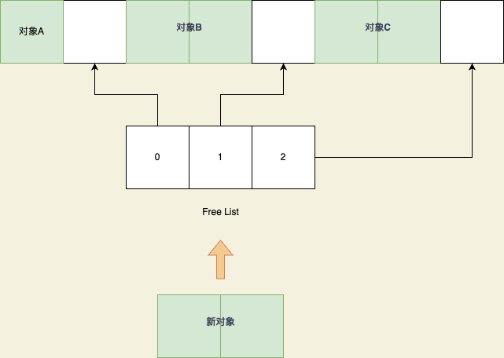
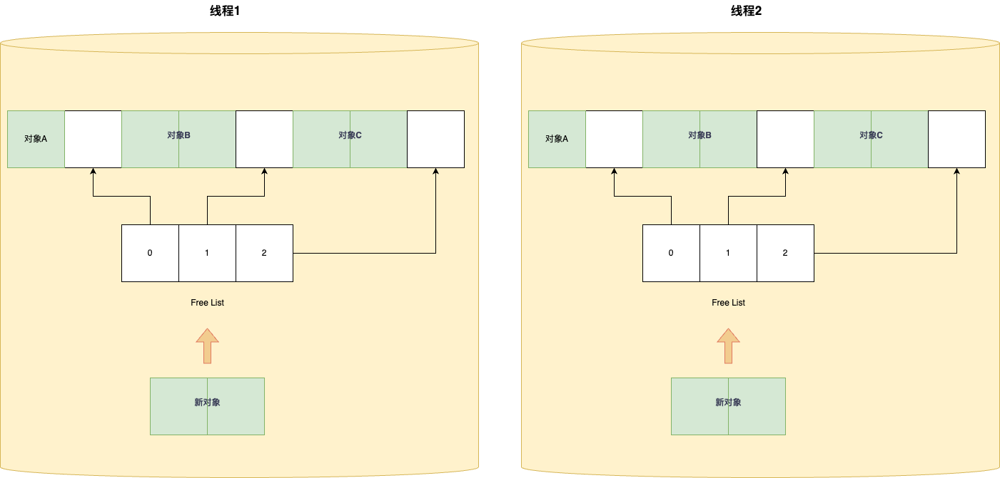

# 从jvm源码看TLAB

在上一章G1的对象分配中，我们有看到TLAB，当时的代码是：

```c++
 HeapWord* MemAllocator::mem_allocate(Allocation& allocation) const {
  //配置了走TLAB的话走TLAB，就从当前线程的 TLAB 分配内存，TLAB 快分配
  if (UseTLAB) {
    HeapWord* result = allocate_inside_tlab(allocation);
    if (result != NULL) {
      return result;
    }
  }
 //如果分配失败则走 TLAB 慢分配，需要 refill 或者直接从 Eden 分配
  return allocate_outside_tlab(allocation);
}
```

也就是`allocate_inside_tlab`，当时因为重点是G1中的对象分配，所以TLAB只是简单介绍了一下概念，然后一笔掠过，今天我们就详细来看看jvm中的TLAB。


## 1、什么是TLAB

开始源码分析前，我们先花几分钟来搞清楚TLAB，我学习新一个东西，大概的学习顺序是这样的：这个东西是解决什么问题的？这个问题是怎么产生的？如果没有这个东西是怎么做的会产生什么问题，有了这东西之后是怎么做的怎么解决了这个问题，所以我们按照这个顺序来解释一下TLAB。

首先TLAB是用来提高对象分配效率的，那么为什么要提高效率， 怎么提高效率？

我们假设现在没有TLAB，那么对象是怎么分配在内存的呢（这里的内存只指堆）？

我们根据上一章的知识知道，对象在分配之前是可以提前计算好大小的，代码如下：

```c++
instanceOop InstanceKlass::allocate_instance(TRAPS) {
  bool has_finalizer_flag = has_finalizer(); // Query before possible GC
  int size = size_helper();  // Query before forming handle.
  ...
```

计算的依据就是解析对象被加载进入了元空间的类的信息，所以可以提前计算好这个对象的大小。

那么我们已经知道了这个对象的大小了，我们就可以直接放到内存里了，那么如果内存是连续的，我们就直接挨个挨个插入就可以了：


这种简单的分配方式就是线性分配，也被称为撞针分配（bump-the-pointer），当然了不可能总是只有一个线程新建对象，所以每次插入肯定是CAS。那么这样有什么问题呢？我们知道jvm的堆里，会新建对象也会回收对象，那么就会导致我们的内存的剩余内存并不一定是连续的，比如说上图中，对象A被回收了，但是对象B还在，那么新对象分配的时候要是连续线性分配下去，对象A的内存就会被浪费掉，那么怎么办呢？

聪明的你一定能想到我们用一个变量来记录空白的区域不就可以了嘛，如果内存区域被回收了，那么就写到记录里，然后从记录里移除，每次分配都通过这个记录来找到空白位置，然后放入：



当然了，这样描述不太准确我只是让大家更好的理解，其实真实的流程是：将释放的对象内存加入 FreeList，下次分配对象的时候，**优先从 FreeList 中寻找合适的内存大小进行分配**，之后再在主内存中撞针分配。

那么优化到这里还有什么问题呢？我们注意到了，不管是直接撞针分配和free list分配其实都是CAS，因为可能都是多线程下来分配必然要CAS，CAS已经是乐观锁了但是因为可能会存在若干次重试所以效率仍然不高 ，那么怎么解决呢？那么聪明的你一定能想到：多线程下CAS就是为了保证线程安全在这里是保证多个线程之间分配不冲突，但是CAS效率又比较低下，那我不用CAS不就完了，不用CAS又能保证线程安全，那我单线程不就行了，内存区域有那么大得嘛，那我给每个线程都划分一块区域，你这个线程就只在这块区域里分配，这样不就不存在多线程的问题了，就可以不用CAS了啊：



如果你能想到这个，恭喜你！已经基本掌握了TLAB的基本概念了。这块专门给一个线程分配的区域就叫TLAB（Thread Local Allocation Buffer）

TLAB对象分配流程：


我们先大概看一下这个TLAB的流程，大家有个大概的概念，一会儿看源码的时候有个大概方向。

总之，TLAB 要解决的问题很明显，即**尽量避免从堆上直接分配内存从而避免频繁的锁争用。**再通俗一点也可以说；**它是为了提高多线程环境下对象分配的性能**

## 2、TLAB所带来的问题

但是这世界上的事物，有好的一面就有坏的一面，没有百分之百完美的东西，引入了TLAB之后也会引入新的问题。

### 孔隙

例如内存孔隙问题：

- 当前 TLAB 不够分配时，如果剩余空间小于**最大浪费空间限制**，那么这个 TLAB 会被退回 Eden，重新申请一个新的。这个剩余空间就会成为孔隙。也就是说小于最大浪费空间的内存都可以被浪费。
- 当发生 GC 的时候，TLAB 没有用完，没有分配的内存也会成为孔隙。

### GC负担

如果不管这些孔隙，由于 TLAB 仅线程内知道哪些被分配了，在 GC 扫描发生时返回 Eden 区，如果不填充的话，外部并不知道哪一部分被使用哪一部分没有，需要做额外的检查，那么会影响 GC 扫描效率。所以 TLAB 回归 Eden 的时候，**会将剩余可用的空间用一个 dummy object 填充满** 。如果填充**已经确认会被回收的对象** ，也就是 dummy object， GC 会直接标记之后跳过这块内存，增加扫描效率。但是同时，由于需要填充这个 dummy object，所以需要**预留出这个对象的对象头的空间**。这里的问题就是我们会给GC增加多余的负担

### 线程分配内存不稳定

还有一个问题我们给每个线程分布的内存空间并不好控制，最简单的是每个线程都分配一摸一样的大小，但是这样会有问题，比如：我们每个线程做的事情不一样，有的线程可能用到的内存多点有的线程的少点，即使是同一个接口在不同的时间所用的内存也可能是不一样的，所以我们自然而然就期望TLAB分配的内存能满足这种场景，那么他就必须要：

- 不能一下子就给一个线程申请一个比较大的 TLAB，而是考虑**这个线程 TLAB 分配满之后再申请新的**，这样更加灵活。
- **每次申请 TLAB 的大小是变化**的，并不是固定的。
- **每次申请 TLAB 的大小需要考虑当前 GC 轮次内会分配对象的线程的个数期望**
- **每次申请 TLAB 的大小需要考虑所有线程期望 TLAB 分配满重新申请新的 TLAB 次数**

可以看到这里TLAB的大小是和“期望”有关的，这个期望是根据历史数据计算得出的，也就是**每次输入采样值，根据历史采样值得出最新的期望值** 。不仅 TLAB 用到了这种期望计算，GC 和 JIT 等等 JVM 机制中都用到了。这里们来看一种 TLAB 中经常用到的 **EMA（Exponential Moving Average 指数平均数）** 算法：


这部分代码在JVM源码里的`gcUtil.hpp`的`AdaptiveWeightedAverage`类中，有兴趣的读者可以自行了解


## 3、TLAB 相关的 JVM 参数

| 参数名称                |    作用  |
| ----------------------- | ---- |
| UseTLAB                 | 是否启用 TLAB，默认是启用的。 |
| ZeroTLAB                | 是否将新创建的 TLAB 内的所有字节归零。们创建一个类的时候，类的 field 是有默认值的，例如 boolean 是 false，int 是 0 等等，实现的方式就是对分配好的内存空间赋 0。设置 ZeroTLAB 为 true **代表在 TLAB 申请好的时候就赋 0** ，否则会在分配对象并初始化的时候赋 0.讲道理，**由于 TLAB 分配的时候会涉及到 Allocation Prefetch 优化 CPU 缓存，在 TLAB 分配好之后立刻更新赋 0 对于 CPU 缓存应该是更友好的**，并且，如果 TLAB 没有用满，填充的 dummy object 其实依然是 0 数组，相当于大部分不用改。这么看来，开启应该更好。但是ZeroTLAB 默认还是不开启的。 |
| ResizeTLAB              | TLAB 是否是可变的，默认为是，也就是会根据线程历史分配数据相关 EMA 计算出每次期望 TLAB 大小并以这个大小为准申请 TLAB。 |
| TLABSize                | 初始 TLAB 大小。单位是字节 |
| MinTLABSize             | 最小 TLAB 大小。单位是字节 |
| TLABAllocationWeight    | TLAB 初始大小计算和线程数量有关，但是线程是动态创建销毁的。所以需要基于历史线程个数推测接下来的线程个数来计算 TLAB 大小。一般 JVM 内像这种预测函数都采用了 EMA 。**这个参数就是 图06 中的最小权重**，权重越高，最近的数据占比影响越大。TLAB 重新计算大小是根据分配比例，分配比例也是采用了 EMA 算法，最小权重也是 TLABAllocationWeight |
| TLABWasteTargetPercent  | TLAB 的大小计算涉及到了 Eden 区的大小以及可以浪费的比率。**TLAB 浪费**指的是上面提到的重新申请新的 TLAB 的时候老的 TLAB 没有分配的空间。这个参数其实就是 TLAB 浪费占用 Eden 的百分比，这个参数的作用会在接下来的原理说明内详细说明 |
| TLABRefillWasteFraction | 初始**最大浪费空间限制** 计算参数，初始**最大浪费空间限制** = 当前期望 TLAB 大小 / TLABRefillWasteFraction |
| TLABWasteIncrement      | **最大浪费空间限制并不是不变的** ，在发生 TLAB 缓慢分配的时候（也就是当前 TLAB 空间不足以分配的时候），会增加最大浪费空间限制。这个参数就是 TLAB 缓慢分配时允许的 TLAB 浪费增量。单位不是字节，而是 `MarkWord` 个数，也就是 Java 堆的内存最小单元，64 位虚拟机的情况下，`MarkWord` 大小为 3 字节。 |
|                         |      |

## 4、TLAB源码解析

介绍完基本知识，我们终于可以开始看源码，如果你只是想大概了解TLAB那么看到这里就可以关闭啦。

根据上一节中的代码，我么可以很轻松的找到TLAB在hotspot jvm中的源码所在位置：

`share/gc/shared/threadLocalAllocBuffer.cpp`

`share/gc/shared/threadLocalAllocBuffer.inline.hpp`

### 全局初始化

在看TLAB的全局初始化代码之前我们先看看他有哪些属性，在`threadLocalAllocBuffer.hpp`中：

```c++
private:
  HeapWord* _start;                              // TLAB 起始地址，表示堆内存地址都用 HeapWord* 
  HeapWord* _top;                                // TLAB 的顶部地址，表示下一次分配的起始位置。即 _top 之前的内存已经被分配。
  HeapWord* _pf_top;                             // 预取标记地址，用于预取下一次分配的位置。
  HeapWord* _end;                                // TLAB 的结束地址，表示分配内存的结束位置。可以是采样结束点或 _allocation_end。
  HeapWord* _allocation_end;                     // 分配结束点，表示实际的 TLAB 结束位置，不包括对齐保留空间。

  size_t    _desired_size;                       // 期望的 TLAB 大小，包括对齐保留空间。
  size_t    _refill_waste_limit;                 // 当 _top 到 _end 之间的空闲内存大小超过此限制时，保持 TLAB 不释放。又叫最大浪费空间
  size_t    _allocated_before_last_gc;           // 上次 GC 之前分配的总字节数。
  size_t    _bytes_since_last_sample_point;      // 距离上次采样点之后分配的字节数。

  static size_t   _max_size;                          // 任何 TLAB 的最大大小。
  static int      _reserve_for_allocation_prefetch;   // 在 TLAB 末尾预留的空间大小，用于预取优化。
  static unsigned _target_refills;                    // 在两次 GC 之间预期的 TLAB 重新填充次数。

  unsigned  _number_of_refills;                 // 线程分配内存数据采集相关，TLAB 剩余空间不足分配次数		
	unsigned  _fast_refill_waste;                 // 线程分配内存数据采集相关，TLAB 快速分配浪费，快速分配就是直接在 TLAB 分配，这个在现在 JVM 中已经用不到了
	unsigned  _slow_refill_waste;                 // 线程分配内存数据采集相关，TLAB 慢速分配浪费，慢速分配就是重填一个 TLAB 分配
	unsigned  _gc_waste;                          // 线程分配内存数据采集相关，gc浪费
	unsigned  _slow_allocations;                  // 线程分配内存数据采集相关，TLAB 慢速分配计数 
	size_t    _allocated_size;                    // 分配的内存大小


  AdaptiveWeightedAverage _allocation_fraction;  // 在 TLAB 中分配的 Eden 区域的比例的自适应加权平均值
```

然后我们再看JVM启动的时候的初始化代码，在`threadLocalAllocBuffer.cpp`中的`startup_initialization`方法中：

```c++

void ThreadLocalAllocBuffer::startup_initialization() {

  //_target_refills的意思是在两次 GC 之间预期的 TLAB 重新填充次数。
  // 这里计算是为了确定在进行垃圾回收时，每个线程需要重新填充 TLAB 的次数，TLABWasteTargetPercent就是上文的参数
  _target_refills = 100 / (2 * TLABWasteTargetPercent);
  // 为了避免在虚拟机初始化期间发生垃圾回收并导致虚拟机中止最大只能是 2，以确保有足够的 TLAB 重新填充次数，也就是说TLABWasteTargetPercent最多是100
  _target_refills = MAX2(_target_refills, 2U);

  //用于记录全局的 TLAB 统计信息
  _global_stats = new GlobalTLABStats();

  //如果是C2编译器 ，就做相关的设置，主要是需要在 TLAB 的末尾预留额外的空间，以避免 C2 编译器生成的预取指令访问堆外存储导致错误。根据不同的预取样式和预取指令，需要预留不同数量的空间。
#ifdef COMPILER2
  if (is_server_compilation_mode_vm()) {
    int lines =  MAX2(AllocatePrefetchLines, AllocateInstancePrefetchLines) + 2;
    _reserve_for_allocation_prefetch = (AllocatePrefetchDistance + AllocatePrefetchStepSize * lines) /
                                       (int)HeapWordSize;
  }
#endif

  // 在 JVM 启动期间，主线程在堆初始化之前被初始化。因此，在这里重新初始化主线程的 TLAB。
  guarantee(Thread::current()->is_Java_thread(), "tlab initialization thread not Java thread");
  Thread::current()->tlab().initialize();
	
  //记录 TLAB 的最小大小、当前线程的初始期望大小和最大大小。
  log_develop_trace(gc, tlab)("TLAB min: " SIZE_FORMAT " initial: " SIZE_FORMAT " max: " SIZE_FORMAT,
                               min_size(), Thread::current()->tlab().initial_desired_size(), max_size());
}
```

可以看到，TLAB的全局初始化就是赋值`_max_size、_reserve_for_allocation_prefetch、_target_refills这三个static的变量的值。

总结来说TLAB在JVM启动的时候初始化的工作有：

- 计算 TLAB 重新填充次数，并且最大值只能是2
- 初始化全局统计信息，主要是新建了一个GlobalTLABStats
- 设置 C2 编译器相关的预留空间，避免 C2 编译器生成的预取指令访问堆外存储导致错误
- 初始化主线程的 TLAB，并记录相关的日志信息

这里涉及到了jvm的几个知识点：c2编译器、jvm主线程。

 ### 初始化

刚刚只是jvm启动的时候全局初始化TLAB，真正每个线程的TLAB初始化的时机应该是在java的线程启动的时候来创建我们的TLAB，那我们顺便就来看看java中怎么初始化线程的：

根据我们的基础知识，java中线程的启动核心代码就是:`thread.start();`那么我们就到`Thread.java`中的start方法，那么我们可以看到start最终执行的是`start0()`这个native方法，经常看我文章的朋友可能已经对如何查看native方法可太熟练了，我们找到jdk源码里的`Thread.c`即可，然后最后源码在`jvm.cpp`中的方法`JVM_StartThread`里，核心代码就是:

```c++
				... 
native_thread = new JavaThread(&thread_entry, sz);
				...
```

  在Javathread的构造方法里也就是Thread.cpp中：

```c++
 os::create_thread(this, thr_type, stack_sz);
```

`os::create_thread`就是创建线程的核心代码，每个操作系统的实现不一样，例如在linux中为：

```c++
 int ret = pthread_create(&tid, &attr, (void* (*)(void*)) thread_native_entry, thread);
```

在这里我们可以看到java中的线程得是调用了start方法才会在操作系统中真的创建一个线程，new出来的线程并不是真正启动的线程。

查阅资料之后发现，`pthread_create` 方法的第三个参数就是创建线程完成之后执行的回调方法，第四个参数就是这个方法的参数，那么这里创建完线程之后就是执行`thread_native_entry`方法，参数就是`thread`，那么在`thread_native_entry`方法中：

```c++
			...
thread->call_run();
			...
```

最重要的就是这句代码，字面上就是执行run方法，也就是回到了我们的`thread.cpp`中，

```c++
// The first routine called by a new Java thread
void JavaThread::run() {
  this->initialize_tlab();
	...
  thread_main_inner();
  ...
}
```

这里只截取最重要的两句代码，`initialize_tlab`就是我们今天的重点TLAB，这里就是线程初始化的时候初始我们的TLAB的核心代码，第二个`thread_main_inner`这个方法就是jvm去回调我们java中的run方法的代码，大家有兴趣的可以去看看，总之这里是用了jni的回调机制来执行我们java代码里设置好了的run方法。

顺便这里总结一下java中线程初始化的顺序:

Thread.java => jvm.cpp => thread.cpp => os_linux.cpp =>  pthread_create() => thread.cpp => Thread.java => Runable#run()

我们接着今天的重点来看看`initialize_tlab`方法：

```c++
 void initialize_tlab() {
    if (UseTLAB) {
      tlab().initialize();
    }
  }
```

如果jvm参数里指定了不适用UseTLAB那么就不用。这里可以看到tlab就是线程的一个属性：

```c++
  ThreadLocalAllocBuffer _tlab;                 // Thread-local eden
```

如上文中，全局初始化就是初始化static属性的值，那么在每个线程中初始化TLAB的时候就是初始化他的私有变量的值了

在`threadLocalAllocBuffer.cpp`中的`initialize`方法中：

```c++
void ThreadLocalAllocBuffer::initialize() {
  //这里就是初始化_start、 _top、_pf_top、_end、_allocation_end的值，因为还没有从eden分配，所以都是null
  HeapWord* _allocation_end;   
  initialize(NULL,                    // start
             NULL,                    // top
             NULL);                   // end

  //设置 desired_size：调用 set_desired_size() 方法，将 desired_size 设置为 initial_desired_size() 的返回值。initial_desired_size() 方法用于确定初始的 TLAB 大小。
  set_desired_size(initial_desired_size());

 	// 检查堆是否已初始化
  if (Universe::heap() != NULL) {
    //获取当前线程的 TLAB 容量
    size_t capacity   = Universe::heap()->tlab_capacity(myThread()) / HeapWordSize;
    // 使用 float 类型存储 alloc_frac，避免进行双精度到单精度的转换。
    float alloc_frac = desired_size() * target_refills() / (float) capacity;
    //将 alloc_frac 的值作为样本传递给 _allocation_fraction（自适应加权平均值）。这个和EMA计算有关系
    _allocation_fraction.sample(alloc_frac);
  }
	
  //计算并且设置最大浪费空间
  set_refill_waste_limit(initial_refill_waste_limit());

  //初始化统计信息，包括重新填充次数、浪费字节数等。	
  initialize_statistics();
}
```

我们一个一个多看，首先是计算初始的TLAB大小的方法：

```c++
size_t ThreadLocalAllocBuffer::initial_desired_size() {
  size_t init_sz = 0;
	
  //如果通过 -XX:TLABSize 设置了 TLAB 大小，则用这个值作为初始期望大小
  if (TLABSize > 0) {
    //init_sz表示堆内存占用大小都需要用占用几个 HeapWord 表示，所以用TLABSize / HeapWordSize
    init_sz = TLABSize / HeapWordSize;
  } else if (global_stats() != NULL) {
    //如果没有指定
    // 获取平均分配线程数。
    unsigned nof_threads = global_stats()->allocating_threads_avg();
		//将当前线程的TLAB 容量除以 HeapWordSize 得到 TLAB 容量的字节数，然后除以 (nof_threads * target_refills()) 得到初始大小。这里TLAB容量计算和GC有关系
    init_sz  = (Universe::heap()->tlab_capacity(myThread()) / HeapWordSize) /
                      (nof_threads * target_refills());
    //初始大小进行对象大小对齐（通常是 8 字节对齐）。
    init_sz = align_object_size(init_sz);
  }
  //将 init_sz 限制在最小值和最大值之间，使用 MIN2() 和 MAX2() 方法进行限制。min_size() 和 max_size() 方法分别返回允许的最小和最大 TLAB 大小。
  init_sz = MIN2(MAX2(init_sz, min_size()), max_size());
  return init_sz;
}
```


这里我们如果没有设置初始化大小的话，我们就手动设置，这里` Universe::heap()->tlab_capacity(myThread())`表示不同的 GC 实现有不同的 TLAB 容量，我们以G1举例，在G1中就是：

```c++
size_t G1CollectedHeap::tlab_capacity(Thread* ignored) const {
  return (_g1_policy->young_list_target_length() - _survivor.length()) * HeapRegion::GrainBytes;
}
```

这里可以简单理解为年轻代减去Survivor区，也就是Eden区，也就是在G1中整个Eden区就是TLAB的全部大小。那么代入到代码中大小就是： Eden区大小/(当前 epcoh 内会分配对象期望线程个数 * 每个 epoch 内每个线程 refill 次数配置)，target_refills就是全局初始化的时候计算好了的。这里看不懂没关系，你只需要记住TLAB的初始化大小可以指定，如果不指定则是和eden区大小和目标填充次数有关。这里最晦涩的就是`unsigned nof_threads = global_stats()->allocating_threads_avg();`这个和EMA 预测有关，也就是和JVM的估计算法有关系，我觉得只需要知道有这个东西并且TLAB大小和这个算法有关系就行了，只要你不去开发JVM，那么这个东西在你大脑里的寿命就是这个文章的开始和结束。

这里还需要看的是TLAB的最大和最小大小如何确定，最小大小的代码如下：

```c++
 static size_t min_size()                       { return align_object_size(MinTLABSize / HeapWordSize) + alignment_reserve(); }
```

可以看到这个和参数`MinTLABSize`有关系,默认是2048。

最大大小:

```c++
  static void set_max_size(size_t max_size)      { _max_size = max_size; }
```

`set_max_size`这个方法是在堆初始化的时候调用的：

```c++
  ThreadLocalAllocBuffer::set_max_size(Universe::heap()->max_tlab_size());
```

可以看到还是每个GC不一样，我们还是用G1举例：

```c++
// For G1 TLABs should not contain humongous objects, so the maximum TLAB size
// must be equal to the humongous object limit.
size_t G1CollectedHeap::max_tlab_size() const {
  return align_down(_humongous_object_threshold_in_words, MinObjAlignment);
}
```

这里看注释就懂了，在G1中TLAB的最大大小就是G1中大对象的大小，那么在G1中大对象大小是什么呢？在笔者上上篇文章中已经说了，即是region的一半：

```c++
 _humongous_object_threshold_in_words = humongous_threshold_for(HeapRegion::GrainWords);
  ...
    static size_t humongous_threshold_for(size_t region_size) {
    return (region_size / 2);
  }
```

只所以这样设计，是因为G1如果是大对象则有专门的大对象分配，这样做可以保证大对象只能去大对象分配方法。

总结来说，在G1中我们的TLAB的最小大小是2048这个可以由`MinTLABSize`参数来修改，最大大小是大对象大小也就是region大小的一半。

### 分配内存

TLAB初始化完了，就是分配对象了，在上文中(https://mp.weixin.qq.com/s/w8FWloLhgEnobHEViRz5Jg)我们看到了TLAB分配对象的代码，所以直接从上文中切入即可：

```c++
HeapWord* MemAllocator::allocate_inside_tlab(Allocation& allocation) const {
  assert(UseTLAB, "should use UseTLAB");

  // 直接在当前线程的已存在的TLAB中分配
  HeapWord* mem = _thread->tlab().allocate(_word_size);
  if (mem != NULL) {
    return mem;
  }

  // 尝试重新填充 TLAB 并在其中分配对象。
  return allocate_inside_tlab_slow(allocation);
}
```

这里我们可以分成两部分，快分配和慢分配。

#### 快分配

先看快分配，在`threadLocalAllocBuffer.inline.hpp`中：

```c++
inline HeapWord* ThreadLocalAllocBuffer::allocate(size_t size) {
  //检查线程本地分配缓冲区（TLAB）的不变量。这些不变量包括确保 TLAB 的顶部指针在合理的范围内，并且 TLAB 的顶部指针不超过结束指针
  invariants();
  //获取顶部地址，顶部地址表示下一次分配的起始位置
  HeapWord* obj = top();
  //计算 结束地址（表示分配内存的结束位） 和 顶部地址 之间的偏移量，判断是否有足够的空间来分配大小为 size 的对象。如果有足够的空间则继续
  if (pointer_delta(end(), obj) >= size) {
    // 成功进行线程本地分配：在这种情况下，线程可以在 TLAB 中成功分配对象。
#ifdef ASSERT
    //在 顶部位置 的位置之后填充对象头之外的空间，以确保返回的空间不会被任何并发的垃圾回收线程解析。
    size_t hdr_size = oopDesc::header_size();
    Copy::fill_to_words(obj + hdr_size, size - hdr_size, badHeapWordVal);
#endif // ASSERT
    // 即将顶部地址向上移动 size 字节，表示已经使用了这部分空间，也就是说分配成功
    set_top(obj + size);
		//再次检查线程本地分配缓冲区（TLAB）的不变量。这些不变量包括确保 TLAB 的顶部指针在合理的范围内，并且 TLAB 的顶部指针不超过结束指针
    invariants();
    return obj;
  }
  return NULL;
}
```

这里快分配很简单，就是把顶部指针往后移动，也就是说新分配地址。

但是这里可能是会失败的，比如当前TLAB剩余大小不足以容纳下这个对象，那么我们就会进入慢分配逻辑

#### 慢分配

在`memAllocator.cpp`中：

```c++
HeapWord* MemAllocator::allocate_inside_tlab_slow(Allocation& allocation) const {
  HeapWord* mem = NULL;
  ThreadLocalAllocBuffer& tlab = _thread->tlab();


  //如果当前大小大于最大浪费大小，则不丢弃这个TLAB，回到堆上的去分配，也就是上上篇文章的内容
  if (tlab.free() > tlab.refill_waste_limit()) {
    //这里记录慢分配失败，会去扩充最大浪费大小，避免每次都直接去堆上分配
    tlab.record_slow_allocation(_word_size);
    return NULL;
  }

  // 如果当前大小大雨最大浪费大小，则丢弃这个TLAB然后新建一个新的TLAB
  // 为尽量减少碎片，新的 TLAB 可能比其他 TLAB 小。
  size_t new_tlab_size = tlab.compute_size(_word_size);
	//丢弃当前TLAB
  tlab.clear_before_allocation();
	//如果新的大小没有计算出来，就直接在堆上分配
  if (new_tlab_size == 0) {
    return NULL;
  }

 	//计算最小大小，
  size_t min_tlab_size = ThreadLocalAllocBuffer::compute_min_size(_word_size);
  //分配新的 TLAB 空间，并在里面分配对象
  mem = _heap->allocate_new_tlab(min_tlab_size, new_tlab_size, &allocation._allocated_tlab_size);
  if (mem == NULL) {
    assert(allocation._allocated_tlab_size == 0,
           "Allocation failed, but actual size was updated. min: " SIZE_FORMAT
           ", desired: " SIZE_FORMAT ", actual: " SIZE_FORMAT,
           min_tlab_size, new_tlab_size, allocation._allocated_tlab_size);
    return NULL;
  }
...
  //如果启用了 ZeroTLAB(是否将新创建的 TLAB 内的所有字节归零) 这个 JVM 参数，则将对象所有字段置零值
  if (ZeroTLAB) {
    // ..and clear it.
    Copy::zero_to_words(mem, allocation._allocated_tlab_size);
  } else {
 ...
  }

  //设置新的 TLAB 空间为当前线程的 TLAB
  tlab.fill(mem, mem + _word_size, allocation._allocated_tlab_size);
  return mem;
}
```

`mem = _heap->allocate_new_tlab(min_tlab_size, new_tlab_size, &allocation._allocated_tlab_size);`是GC重新给新TLAB分配空间，以G1举例：

```c++
HeapWord* G1CollectedHeap::allocate_new_tlab(size_t min_size,
                                             size_t requested_size,
                                             size_t* actual_size) {
...
  return attempt_allocation(min_size, requested_size, actual_size);
}
```

在上上文中我们可以知道，`attempt_allocation`就是分配普通对象的方法，所以这里就是简单的分配一片区域给TLAB。

还有一个要单独说的代码是`tlab.fill`：

```c++
void ThreadLocalAllocBuffer::fill(HeapWord* start,
                                  HeapWord* top,
                                  size_t    new_size) {
  //TLAB 剩余空间不足分配次数加一，用来做监控
  _number_of_refills++;
  //分配的内存大小加上新的TLAB的大小，用来记录保存当前线程整个的TLAB分配内存大小
  _allocated_size += new_size;
  print_stats("fill");
  assert(top <= start + new_size - alignment_reserve(), "size too small");

  //初始化新的TLAB的指针
  initialize(start, top, start + new_size - alignment_reserve());

  // 设置TLAB最大浪费空间
  set_refill_waste_limit(initial_refill_waste_limit());
}
```

这里计算最大浪费空间在线程初始化的时候也出现过，这里我们一起来看：

```c++
  size_t initial_refill_waste_limit()            { return desired_size() / TLABRefillWasteFraction; }
```

就是期望的 TLAB 大小除以`TLABRefillWasteFraction`参数（初始最大浪费空间限制计算参数，默认是64）的值

在上面代码中我们可以看到，如果慢分配也失败了（即当前大小大于最大浪费大小）那么就会记录一下然后去堆上分配：

```c++
void ThreadLocalAllocBuffer::record_slow_allocation(size_t obj_size) {
  //每次慢分配，_refill_waste_limit 增加 refill_waste_limit_increment，也就是 TLABWasteIncrement
  set_refill_waste_limit(refill_waste_limit() + refill_waste_limit_increment());
  _slow_allocations++;
 ...
}
```

我们知道，如果总是TLAB分配失败，那么TLAB就没用了，还是一起去堆上分配，所以在每次失败之后jvm都会去增加最大浪费大小，以此来避免直接在堆上分配，这里每次增加的大小就是参数`TLABWasteIncrement`，注意这里单位不是字节，而是 `MarkWord` 个数，也就是 Java 堆的内存最小单元，64 位虚拟机的情况下，`MarkWord` 大小为 3 字节，默认值是4，也就是4个`MarkWord` ，也就是在64位虚拟机上是12字节

#### 丢弃TLAB

上面看到如果TLAB剩余大小小于最大浪费值，那么就会被丢弃

丢弃当前TLAB代码如下：

```c++
void ThreadLocalAllocBuffer::make_parsable(bool retire, bool zap) {
  if (end() != NULL) {
    //检查参数
    invariants();
    if (retire) {
      //将用了的空间记录如线程分配对象大小记录
      myThread()->incr_allocated_bytes(used_bytes());
    }

    //填充dummy object。让TLAB变成满的
    Universe::heap()->fill_with_dummy_object(top(), hard_end(), retire && zap);

    //清空指针
    if (retire || ZeroTLAB) {  
      set_start(NULL);
      set_top(NULL);
      set_pf_top(NULL);
      set_end(NULL);
      set_allocation_end(NULL);
    }
  }
  assert(!(retire || ZeroTLAB)  ||
         (start() == NULL && end() == NULL && top() == NULL &&
          _allocation_end == NULL),
         "TLAB must be reset");
}
```


可以看到逻辑很简单，就是把TLAB中的剩余大小用dummy object填充然后清空参数。

最后就是TLAB和GC部分了，不过这部分和GC有强关联，所以就放在后面的G1 GC里一起讲。


这里讲到最后有一个疑问，就是在初始化TLAB中，我们只是给top这些参数设置为了null然后计算了例如最大浪费大小的值，其实并没有去申请内存空间，其实这里的意思是TLAB是懒加载的，也就是说我们线程在初始化的时候TLAB并没有分配在堆上而只是初始化了一些值，然后在这个线程中第一个对象分配的时候：快分配肯定失败，因为指针都是null，于是就进入了慢分配，如果当前对象大小大于了最大浪费大小就去了堆中分配，直到当前线程中的有新对象切大小小于最大浪费空间（最大浪费空间每次都会增加）的时候就会第一次给TLAB分配空间，注意！这个时候才会给TLAB在eden上分配空间。所以TLAB是懒加载的！


### 总结

TLAB就是在线程初始化的时候初始化，这里初始化不会去分配空间，他的大小以及最大浪费大小都是实时计算变化的。在新对象分配的时候，优先分配到现成的TLAB中，如果分配不下则判断当前对象大小是否大于最大浪费大小，如果大于则TLAB分配去堆中分配（CAS，效率低），如果小于则放弃当前TLAB（放弃方法为填充Dummy Objects），然后新建一个TLAB（就是去当前堆上的新申请一块内存区域）来分配对象。
