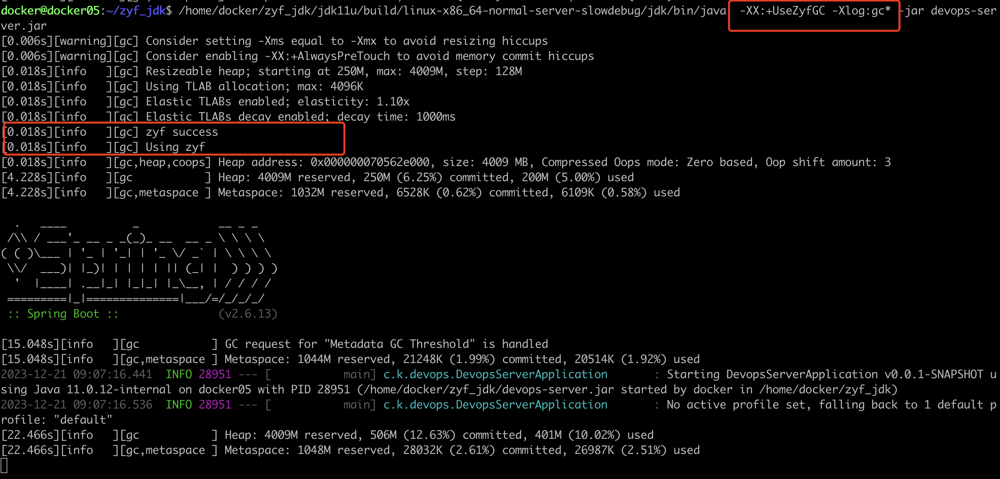

# 如何自己手动实现一个JVM GC

在前面的文章中我们大概的解读了G1 GC的源码，也有了一点JVM源码的基本功，那么今天我们来看看如何自己实现一个属于自己的GC吧。本文基于JDK11

在本文第一章中是讲如何定位到新GC需要的类，第二章才会直接开始讲新建GC，本文偏向于理论，即偏向于怎么去新建GC的“怎么去”。

**由于本GC只是一个简单的demo，所以核心实现逻辑会参考（ctrl+v）JDK11的Epsilon GC，Epsilon GC实现了一个最小化的Java GC所必须实现的功能。**


## 1、如何新建一个GC

我们之前阅读了G1的源码，大概知道和GC有关系的类是——`g1CollectedHeap.cpp`，核心逻辑都在这里，那么具体应该怎么做呢。

首先我们可以简单从初始化堆的代码来看一下如何新建GC，我的逻辑是这样的，因为GC最重要的功能就是初始化堆和分配对象（之前的知识告诉我们垃圾回收是在分配对象的时候触发的），所以我们重点就关注初始化堆和对象分配，先看初始化代码，看一下初始化一个GC需要用到哪些类，然后完成初始化之后，就看一下分配的代码，确认一下分配需要用到哪些类和哪些方法。

初始化我们直接看：`init.cpp`

>`init.cpp` 是 Java 虚拟机 (JVM) 的初始化代码文件之一，它是 JVM 的 C++ 实现的一部分。
>
>在 JVM 的源代码中，`init.cpp` 文件通常包含了 JVM 的启动和初始化过程的实现。它包含了一些关键的函数和方法，用于执行各种初始化任务，例如设置运行时环境、加载系统属性、初始化线程、创建类加载器、解析命令行参数等。
>
>具体来说，`init.cpp` 文件中的代码会被编译为 JVM 的初始可执行文件，用于启动和初始化 JVM 运行时环境。这些代码会在 JVM 启动时执行，以确保 JVM 在运行应用程序之前进行必要的初始化工作。

在`init.cpp`中有一行是：`jint universe_init(); `所以我们直接定位到了`Universe.cpp`中的`universe_init`方法：

```c++
jint universe_init() {
...
	//初始化堆
  jint status = Universe::initialize_heap();
  if (status != JNI_OK) {
    return status;
  }
...
```

在`initialize_heap`中：

```c++
jint Universe::initialize_heap() {
  //创建heap
  _collectedHeap = create_heap();
  //调用heap的initialize方法
  jint status = _collectedHeap->initialize();
```

关键就在`create_heap`中：

```c++
CollectedHeap* Universe::create_heap() {
  assert(_collectedHeap == NULL, "Heap already created");
  return GCConfig::arguments()->create_heap();
}
```

这里会返回一个`GCArguments`对象，然后调用其`create_heap`方法，值得注意一下的是这里不同的GC都有一个`GCArguments`的子类，也就是说从这里就开始了每个GC不同的逻辑，所以我们需要实现的第一个类就是`GCArguments`的子类。

既然来都来了我们就顺便再看看JVM启动的时候如何根据参数选择不同的GC的：

```c++
GCArguments* GCConfig::arguments() {
  assert(_arguments != NULL, "Not initialized");
  return _arguments;
}
```

`arguments`方法就是返回一个类成员，我们就看看`_arguments`是如何初始化的：

```c++
void GCConfig::initialize() {
  assert(_arguments == NULL, "Already initialized");
  _arguments = select_gc();
}
====================================
GCArguments* GCConfig::select_gc() {
  // 如果选择了一个未知的GC比如-XXUserXXXGC
  fail_if_unsupported_gc_is_selected();
	//没有特别选择GC
  if (is_no_gc_selected()) {
    //就自动默认的选择GC
    select_gc_ergonomically();

    //如果自动默认都没有选中，那么就报错
    if (is_no_gc_selected()) {
      // Failed to select GC ergonomically
      vm_exit_during_initialization("Garbage collector not selected "
                                    "(default collector explicitly disabled)", NULL);
    }

    // 成功选中默认GC
    _gc_selected_ergonomically = true;
  }

  if (!is_exactly_one_gc_selected()) {
    // 选中了不止一个
    vm_exit_during_initialization("Multiple garbage collectors selected", NULL);
  }

  //只选中了一个GC就返回当前选中GC的arguments子类
  FOR_EACH_SUPPORTED_GC(gc) {
    if (gc->_flag) {
      return &gc->_arguments;
    }
  }

  fatal("Should have found the selected GC");

  return NULL;
}
```

这里先看看`select_gc_ergonomically`是如何默认选中GC的：

```c++
void GCConfig::select_gc_ergonomically() {
  if (os::is_server_class_machine()) {
#if INCLUDE_G1GC
    FLAG_SET_ERGO_IF_DEFAULT(bool, UseG1GC, true);
#elif INCLUDE_PARALLELGC
    FLAG_SET_ERGO_IF_DEFAULT(bool, UseParallelGC, true);
#elif INCLUDE_SERIALGC
    FLAG_SET_ERGO_IF_DEFAULT(bool, UseSerialGC, true);
#endif
  } else {
#if INCLUDE_SERIALGC
    FLAG_SET_ERGO_IF_DEFAULT(bool, UseSerialGC, true);
#endif
  }
}
```

可以看到，很多八股都会说JDK11默认的GC是G1，但是这个是不严谨的，我们从源码可以看到这里会先判断当前环境是否是“服务器机器”，这里JVM对“server machine”的定义为：

```c++
// This is the working definition of a server class machine:
// >= 2 physical CPU's and >=2GB of memory, with some fuzz
// because the graphics memory (?) sometimes masks physical memory.
// If you want to change the definition of a server class machine
// on some OS or platform, e.g., >=4GB on Windows platforms,
// then you'll have to parameterize this method based on that state,
// as was done for logical processors here, or replicate and
// specialize this method for each platform.  (Or fix os to have
// some inheritance structure and use subclassing.  Sigh.)
// If you want some platform to always or never behave as a server
// class machine, change the setting of AlwaysActAsServerClassMachine
// and NeverActAsServerClassMachine in globals*.hpp.
bool os::is_server_class_machine() {
...
```

大于等于2核CPU和大于2G内存，否则的话就会使用`Serial GC`，`Serial GC`是单线程的GC，其实也能理解，小于2核了就别多线程了。所以当诸位以后去面试别人的时候可以问问"JDK 11的默认GC是什么"，当他满怀信心的回答"是 G1"的时候若有所思的问他一句：“你确定吗？”

其次比较重要的代码是：

```c++
 FOR_EACH_SUPPORTED_GC(gc) {
    if (gc->_flag) {
      return &gc->_arguments;
    }
  }
```

在`FOR_EACH_SUPPORTED_GC`方法内：

```c++
#define FOR_EACH_SUPPORTED_GC(var)                                          \
  for (const SupportedGC* var = &SupportedGCs[0]; var < &SupportedGCs[ARRAY_SIZE(SupportedGCs)]; var++)
```

这里就是遍历`SupportedGCs`这个数组，找到符合的直接返回，所以我们看看`SupportedGCs`：

```c++
static const SupportedGC SupportedGCs[] = {
    CMSGC_ONLY_ARG(SupportedGC(UseConcMarkSweepGC, CollectedHeap::CMS,        cmsArguments,        "concurrent mark sweep gc"))
   EPSILONGC_ONLY_ARG(SupportedGC(UseEpsilonGC,       CollectedHeap::Epsilon,    epsilonArguments,    "epsilon gc"))
        G1GC_ONLY_ARG(SupportedGC(UseG1GC,            CollectedHeap::G1,         g1Arguments,         "g1 gc"))
  PARALLELGC_ONLY_ARG(SupportedGC(UseParallelGC,      CollectedHeap::Parallel,   parallelArguments,   "parallel gc"))
  PARALLELGC_ONLY_ARG(SupportedGC(UseParallelOldGC,   CollectedHeap::Parallel,   parallelArguments,   "parallel gc"))
    SERIALGC_ONLY_ARG(SupportedGC(UseSerialGC,        CollectedHeap::Serial,     serialArguments,     "serial gc"))
SHENANDOAHGC_ONLY_ARG(SupportedGC(UseShenandoahGC,    CollectedHeap::Shenandoah, shenandoahArguments, "shenandoah gc"))
         ZGC_ONLY_ARG(SupportedGC(UseZGC,             CollectedHeap::Z,          zArguments,          "z gc"))
};
```

所以我们这里可以看到每个参数和GC的对应关系了。

说回我们初始化，再拿到``argeuments`之后就是调用`arguments`的`create_heap`方法了，我们以G1为例：

```c++
CollectedHeap* G1Arguments::create_heap() {
  return create_heap_with_policy<G1CollectedHeap, G1CollectorPolicy>();
}
===================
CollectedHeap* GCArguments::create_heap_with_policy() {
  Policy* policy = new Policy();
  policy->initialize_all();
  return new Heap(policy);
}
```

这里可以看到除了刚刚说到的核心`CollectHeap`类还需要一个`CollectorPolicy`的子类。

初始化就是先调用`CollectorPolicy`的`initialize_all`方法和Heap类的构造方法。

所以从初始化我们可以看出来，我们需要新建三个类的子类：`GCArguments`、`CollectedHeap`、`CollectorPolicy`

分配的代码我们说过太熟悉了，相信大家也很熟练了，在`memAllocator.cpp`中

```c++
HeapWord* MemAllocator::mem_allocate(Allocation& allocation) const {
  if (UseTLAB) {
    HeapWord* result = allocate_inside_tlab(allocation);
    if (result != NULL) {
      return result;
    }
  }

  return allocate_outside_tlab(allocation);
}
```

之前讲过TLAB，即使在在TLAB中分配由于第一次分配当前线程还没有TLAB也需要去新建一个TLAB，最后新建TLAB的代码也和outside殊途同归了，忘记了的可以看下笔者之前的文章：[从jvm源码看TLAB](https://mp.weixin.qq.com/s/a0-kB4vwsZYlkNf0YvXLig)，所以这里我们直接看outside：

```c++
HeapWord* MemAllocator::allocate_outside_tlab(Allocation& allocation) const {
  allocation._allocated_outside_tlab = true;
  HeapWord* mem = _heap->mem_allocate(_word_size, &allocation._overhead_limit_exceeded);
  if (mem == NULL) {
    return mem;
  }
```

所以这里就是调用了`CollectedHeap`的mem_allocate方法，所以分配的话关键还是`CollectedHeap`


那么我们大概看了下分配和初始化的代码，已经对如何创建一个新GC有了一点初步的概念，下一步我们直接开干了。

 ## 2、新建GC

我们参考`G1CollectedHeap.cpp`就可以知道，GC有关的代码都在目录：`/src/hotspot/share/gc`下（这里简单解释一下JVM的代码目录，和hotspot虚拟机有关的代码都在`/src/hotspot`下，`share`表示平台无关的共通代码，`gc`就是垃圾回收器的意思了）：

```shell
.
└─├─parallel
└─├─g1
└───├─c1
└───├─c2
└─├─epsilon
└─├─z
└───├─c1
└───├─c2
└─├─shared
└───├─c1
└───├─stringdedup
└───├─c2
└─├─shenandoah
└───├─heuristics
└───├─mode
└───├─c1
└───├─c2
└─├─cms
└─├─serial
```

可以看到在`gc`目录下每种GC都是一个单独的目录（C1、C2是编译器的意思，和JVM的JIT有关系，这里GC的影响主要是`BarrierSet`内存屏障，部分GC才会有区别），这里可以看到眼熟的G1、ZGC、CMS等等。

所以我们就在`/src/hotspot/share/gc`新建一个目录来存放我们自己的GC，就取名`zyfGc`好了,然后新建之后的目录结构如下：

```shell
└─├─parallel
└─├─g1
└───├─c1
└───├─c2
└─├─epsilon
└─├─z
└───├─c1
└───├─c2
└─├─shared
└───├─c1
└───├─stringdedup
└───├─c2
└─├─shenandoah
└───├─heuristics
└───├─mode
└───├─c1
└───├─c2
└─├─cms
└─├─zyf
└─├─serial
```

上文中说到，我们初始化堆第一个需要的类是`GCArguments`的子类，所以我们创建一个`zyfArguments`类来继承：

首先`zyfArguments.hpp`：

```c++
#ifndef SHARE_GC_ZYF_ZYFARGUMENTS_HPP
#define SHARE_GC_ZYF_ZYFARGUMENTS_HPP

#include "gc/shared/gcArguments.hpp"

class CollectedHeap;

class ZyfArguments : public GCArguments {
public:
  //定义虚函数
  //初始化
  virtual void initialize();
  //堆内存对齐
  virtual size_t conservative_max_heap_alignment();
  //创建堆
  virtual CollectedHeap* create_heap();
};

#endif // SHARE_GC_ZYF_ZYFARGUMENTS_HPP
```

然后`zyfArguments.cpp`：

```c++

#include "precompiled.hpp"
#include "gc/zyf/zyfArguments.hpp"
#include "gc/zyf/zyfCollectorPolicy.hpp"
#include "gc/zyf/zyfHeap.hpp"
#include "gc/shared/gcArguments.inline.hpp"
#include "runtime/globals.hpp"
#include "runtime/globals_extension.hpp"


//堆内存对齐，控制堆内存对齐的最大边界，UseLargePages表示是否使用最大值，最大值是操作系统的大页大小否则为操作系统支持的页的大小
size_t ZyfArguments::conservative_max_heap_alignment()
{
    return UseLargePages ? os::large_page_size() : os::vm_page_size();
}

void ZyfArguments::initialize()
{
  	//调用父类的initialize
    GCArguments::initialize();

  	//参数校验
    assert(UseZyfGC, "Sanity");

    //内存溢出
    if (FLAG_IS_DEFAULT(ExitOnOutOfMemoryError))
    {
        FLAG_SET_DEFAULT(ExitOnOutOfMemoryError, true);
    }

    // 对堆大小相关参数的校验
    if (InitialHeapSize != MaxHeapSize)
    {
        log_warning(gc)("Consider setting -Xms equal to -Xmx to avoid resizing hiccups");
    }

  	//AlwaysPreTouch参数就是让JVM不用虚拟内存而是直接分配内存
    // 在服务启动的时候真实的分配物理内存给JVM，而不再是虚拟内存，效果是可以加快代码运行效率，缺点也是有的，毕竟把分配物理内存的事提前放到JVM进程启动时做了，自然就会影响JVM进程的启动时间，导致启动时间降低几个数量级。
    if (FLAG_IS_DEFAULT(AlwaysPreTouch) && !AlwaysPreTouch)
    {
        log_warning(gc)("Consider enabling -XX:+AlwaysPreTouch to avoid memory commit hiccups");
    }

  	//这里是自己定义的参数，后面再讲
    if (ZYFMaxTLABSize < MinTLABSize)
    {
        log_warning(gc)("ZYFMaxTLABSize < MinTLABSize, adjusting it to " SIZE_FORMAT, MinTLABSize);
        ZYFMaxTLABSize = MinTLABSize;
    }

   //这里是自己定义的参数，后面再讲
    if (!ZYFElasticTLAB && ZYFElasticTLABDecay)
    {
        log_warning(gc)("Disabling ZYFElasticTLABDecay because ZYFElasticTLAB is disabled");
        FLAG_SET_DEFAULT(ZYFElasticTLABDecay, false);
    }

  	//C2编译器
#ifdef COMPILER2
    // Enable loop strip mining: there are still non-GC safepoints, no need to make it worse
    if (FLAG_IS_DEFAULT(UseCountedLoopSafepoints))
    {
        FLAG_SET_DEFAULT(UseCountedLoopSafepoints, true);
        if (FLAG_IS_DEFAULT(LoopStripMiningIter))
        {
            FLAG_SET_DEFAULT(LoopStripMiningIter, 1000);
        }
    }
#endif
}

CollectedHeap *ZyfArguments::create_heap()
{
  //刚刚讲到的创建堆的核心代码
    return create_heap_with_policy<ZyfHeap, ZyfCollectorPolicy>();
}
```

这里`ZyfArguments`要做的其实就是对参数的校验和输出一些警告日志。

然后会有一些`ZYFMaxTLABSize`这种自己对自己的GC定义的参数，这些参数就是定义在`xx_globals.hpp`中的，比如G1的就是在`g1_globals.hpp`下：

```c++
#ifndef SHARE_VM_GC_G1_G1_GLOBALS_HPP
#define SHARE_VM_GC_G1_G1_GLOBALS_HPP

#include <float.h> // for DBL_MAX

#define GC_G1_FLAGS(develop,                                                \
                    develop_pd,                                             \
                    product,                                                \
                    product_pd,                                             \
                    diagnostic,                                             \
                    diagnostic_pd,                                          \
                    experimental,                                           \
                    notproduct,                                             \
                    manageable,                                             \
                    product_rw,                                             \
                    lp64_product,                                           \
                    range,                                                  \
                    constraint,                                             \
                    writeable)                                              \
                                                                            \
  product(bool, G1UseAdaptiveIHOP, true,                                    \
          "Adaptively adjust the initiating heap occupancy from the "       \
          "initial value of InitiatingHeapOccupancyPercent. The policy "    \
          "attempts to start marking in time based on application "         \
          "behavior.")                                                      \
                                                                            \
  experimental(size_t, G1AdaptiveIHOPNumInitialSamples, 3,                  \
          "How many completed time periods from initial mark to first "     \
          "mixed gc are required to use the input values for prediction "   \
          "of the optimal occupancy to start marking.")                     \
          range(1, max_intx)                                                \
                                                                            \
  product(uintx, G1ConfidencePercent, 50,                                   \
          "Confidence level for MMU/pause predictions")                     \
          range(0, 100)    
...
```

`product`表示生产可以使用，`experimental`表示是实验性质的参数需要加上参数`-XX:+UnlockExperimentalVMOptions`才能使用。

所以这里我们需要新建一个：`zyf_globals.hpp`来定义一些参数，参数就直接copy Epsilon GC的:

```c++
#ifndef SHARE_VM_GC_ZYF_GLOBALS_HPP
#define SHARE_VM_GC_ZYF_GLOBALS_HPP

#include "runtime/globals.hpp"
//
// Defines all globals flags used by the ZYF GC.
//

#define GC_ZYF_FLAGS(develop,                                           \
                    develop_pd,                                             \
                    product,                                                \
                    product_pd,                                             \
                    diagnostic,                                             \
                    diagnostic_pd,                                          \
                    experimental,                                           \
                    notproduct,                                             \
                    manageable,                                             \
                    product_rw,                                             \
                    lp64_product,                                           \
                    range,                                                  \
                    constraint,                                             \
                    writeable)                                              \
                                                                            \
  experimental(size_t, ZYFPrintHeapSteps, 20,                           \
          "Print heap occupancy stats with this number of steps. "          \
          "0 turns the printing off.")                                      \
          range(0, max_intx)                                                \
                                                                            \
  experimental(size_t, ZYFUpdateCountersStep, 1 * M,                    \
          "Update heap occupancy counters after allocating this much "      \
          "memory. Higher values would make allocations faster at "         \
          "the expense of lower resolution in heap counters.")              \
          range(1, max_intx)                                                \
...
```

定义好了自己的GC global之后还需要去`gc_globals.hpp`中注册：

```c++
ZYFGC_ONLY(GC_ZYF_FLAGS(                                                 \
    develop,                                                                \
    develop_pd,                                                             \
    product,                                                                \
    product_pd,                                                             \
    diagnostic,                                                             \
    diagnostic_pd,                                                          \
    experimental,                                                           \
    notproduct,                                                             \
    manageable,                                                             \
    product_rw,                                                             \
    lp64_product,                                                           \
    range,                                                                  \
    constraint,                                                             \
    writeable))                                                             \
```

`ZYFGC_ONLY`是我们定义的宏，同样需要我们去`macros.hpp`中定义注册好我们的宏:

```c++
#ifndef INCLUDE_ZYFGC
#define INCLUDE_ZYFGC 1
#endif // INCLUDE_ZYFGC
//如果INCLUDE_ZYFGC为真（零），则定义了以下宏：
#if INCLUDE_ZYFGC
//该宏将参数 x 原样返回。
#define ZYFGC_ONLY(x) x
//该宏将参数 arg 原样返回，用于在宏中传递参数。
#define ZYFGC_ONLY_ARG(arg) arg,
//该宏为空，不做任何操作。
#define NOT_ZYFGC(x)
//该宏展开为空，下一个标记必须是分号。
#define NOT_ZYFGC_RETURN        /* next token must be ; */
//该宏展开为空，下一个标记必须是分号。
#define NOT_ZYFGC_RETURN_(code) /* next token must be ; */
#else
//该宏为空，不做任何操作。
#define ZYFGC_ONLY(x)
//该宏为空，不做任何操作。
#define ZYFGC_ONLY_ARG(arg)
//该宏将参数 x 原样返回。
#define NOT_ZYFGC(x) x
//该宏展开为一个空的代码块 {}。
#define NOT_ZYFGC_RETURN        {}
//该宏展开为一个带有返回值的代码块 { return code; }。
#define NOT_ZYFGC_RETURN_(code) { return code; }
#endif // INCLUDE_ZYFGC
```

到这里我们就定义完了自己的GC的一些参数和去全局里注册了这个GC（还没有完全注册完）

接下来我们的代码：

```c++
CollectedHeap *ZyfArguments::create_heap()
{
  //刚刚讲到的创建堆的核心代码
    return create_heap_with_policy<ZyfHeap, ZyfCollectorPolicy>();
}
```

还需要两个类：`ZyfHeap`和`ZyfCollectorPolicy`

`ZyfHeap`是核心类，我们先新建`ZyfCollectorPolicy`

`ZyfCollectorPolicy.hpp`中：

```c++
#ifndef SHARE_VM_GC_ZYF_COLLECTORPOLICY_HPP
#define SHARE_VM_GC_ZYF_COLLECTORPOLICY_HPP

#include "gc/shared/collectorPolicy.hpp"

class ZyfCollectorPolicy: public CollectorPolicy {
protected:
  virtual void initialize_alignments() {
    size_t page_size = UseLargePages ? os::large_page_size() : os::vm_page_size();
    size_t align = MAX2((size_t)os::vm_allocation_granularity(), page_size);
    //表示内存空间（Space）的对齐方式。内存空间是指 JVM 中用于存储对象的区域，例如堆（Heap）中的各个分代区域。_space_alignment 参数定义了这些内存空间的对齐方式，确保对象在内存中按照特定的对齐规则进行存储。对齐可以提高内存访问的效率，并有助于减少内存碎片化。
    _space_alignment = align;
    //表示堆（Heap）的对齐方式。堆是 JVM 中用于分配和存储对象的主要区域。_heap_alignment 参数定义了堆的对齐方式，确保堆的起始地址和大小按照特定的对齐规则进行分配。对齐可以提高内存访问的效率，并有助于减少内存碎片化。
    _heap_alignment  = align;
  }

public:
  ZyfCollectorPolicy() : CollectorPolicy() {};
};

#endif // SHARE_VM_GC_ZYF_COLLECTORPOLICY_HPP
```

这里就是简单实现一下`initialize_alignments`方法就行了，设置一下堆对齐方式

然后初始化就还剩下我们的核心`ZyfHeap`，首先`CollectedHeap`是GC的抽象表示，他定义了一组虚拟方法，每个GC只要实现这些虚拟方法就行了，这就是策略模式，这就是设计模式的美妙之处，我们只需要实现这些虚拟方法了，不用去满世界的找具体调用和逻辑。

我们新建`zyfHeap.hpp`：

```c++

#ifndef SHARE_VM_GC_ZYF_COLLECTEDHEAP_HPP
#define SHARE_VM_GC_ZYF_COLLECTEDHEAP_HPP

#include "gc/shared/collectedHeap.hpp"
#include "gc/shared/softRefPolicy.hpp"
#include "gc/shared/space.hpp"
#include "services/memoryManager.hpp"
#include "gc/zyf/zyfCollectorPolicy.hpp"
#include "gc/zyf/zyfMonitoringSupport.hpp"
#include "gc/zyf/zyfBarrierSet.hpp"
#include "gc/zyf/zyf_globals.hpp"


class ZyfHeap : public CollectedHeap {
  friend class VMStructs;
private:
  //回收器策略
  ZyfCollectorPolicy* _policy;
  //软引用清除策略
  SoftRefPolicy _soft_ref_policy;
  // UsePerfData支持，使用 -XX:+UsePerfData 参数时，JVM 会启用性能数据收集功能，并将收集到的性能数据保存在本地文件中。这些文件通常位于 $JAVA_HOME/lib/management/ 目录下，文件名以 hsperfdata_<user> 格式命名，其中 <user> 是运行Java应用程序的用户。
  ZyfMonitoringSupport* _monitoring_support;
  //感知内存池使用情况
  MemoryPool* _pool;
  //内存管理器
  GCMemoryManager _memory_manager;
  //实际堆空间
  ContiguousSpace* _space;
  //虚拟内存
  VirtualSpace _virtual_space;
  //最大TLAB
  size_t _max_tlab_size;
  //UsePerfData更新频率
  size_t _step_counter_update;
  //输出堆信息频率
  size_t _step_heap_print;
  // TLAB大小衰减时间
  int64_t _decay_time_ns;
  //最后一次UsePerfData更新
  volatile size_t _last_counter_update;
  //最后一次输出堆信息public
  volatile size_t _last_heap_print;


  public:
  static ZyfHeap* heap();

  ZyfHeap(ZyfCollectorPolicy* p) :
          _policy(p),
          _memory_manager("zyf Heap", "") {};

  //告诉外部自己的是什么GC，在CollectedHeap有一个name枚举，我们新建一个ZYF就行了
  virtual Name kind() const {
    return CollectedHeap::ZYF;
  }

  //GC的名称
  virtual const char* name() const {
    return "zyf(ldlhbl) stu";
  }

  //返回_policy属性，就是刚刚新建的CollectorPolicy子类
  virtual CollectorPolicy* collector_policy() const {
    return _policy;
  }

  //回收器策略
  virtual SoftRefPolicy* soft_ref_policy() {
    return &_soft_ref_policy;
  }
	//初始化相关
  virtual jint initialize();
  virtual void post_initialize();
  virtual void initialize_serviceability();

  virtual GrowableArray<GCMemoryManager*> memory_managers();
  virtual GrowableArray<MemoryPool*> memory_pools();

  //和当前容量相关方法
  virtual size_t max_capacity() const { return _virtual_space.reserved_size();  }
  virtual size_t capacity()     const { return _virtual_space.committed_size(); }
  virtual size_t used()         const { return _space->used(); }

  virtual bool is_in(const void* p) const {
    return _space->is_in(p);
  }

  //是否可清楚，不过我们当前的GC暂时没有垃圾回收
  virtual bool is_scavengable(oop obj) {
    // No GC is going to happen, therefore no objects ever move.
    return false;
  }

  virtual bool is_maximal_no_gc() const {
    // 因为没有GC，所以这里满了的话直接失败
    return used() == capacity();
  }

  // Allocation
  HeapWord* allocate_work(size_t size);
  //内存分配
  virtual HeapWord* mem_allocate(size_t size, bool* gc_overhead_limit_was_exceeded);
  //分配新的TLAB
  virtual HeapWord* allocate_new_tlab(size_t min_size,
                                      size_t requested_size,
                                      size_t* actual_size);

  // TLAB 分配相关
  virtual bool supports_tlab_allocation()           const { return true;           }
  virtual size_t tlab_capacity(Thread* thr)         const { return capacity();     }
  virtual size_t tlab_used(Thread* thr)             const { return used();         }
  virtual size_t max_tlab_size()                    const { return _max_tlab_size; }
  virtual size_t unsafe_max_tlab_alloc(Thread* thr) const;

  //收集垃圾，System.gc()触发
  virtual void collect(GCCause::Cause cause);
  //full gc
  virtual void do_full_collection(bool clear_all_soft_refs);

  //支持堆搜集
  virtual void safe_object_iterate(ObjectClosure* cl);
  virtual void object_iterate(ObjectClosure* cl) {
    safe_object_iterate(cl);
  }

  // 支持对象固定
  virtual bool supports_object_pinning() const           { return true; }
  virtual oop pin_object(JavaThread* thread, oop obj)    { return obj; }
  virtual void unpin_object(JavaThread* thread, oop obj) { }

  // 不支持块解析
  virtual HeapWord* block_start(const void* addr) const { return NULL;  }
  virtual size_t block_size(const HeapWord* addr) const { return 0;     }
  virtual bool block_is_obj(const HeapWord* addr) const { return false; }

  //没有GC所以就没有GC线程
  virtual void print_gc_threads_on(outputStream* st) const {}
  virtual void gc_threads_do(ThreadClosure* tc) const {}

  // 没有堆验证
  virtual void prepare_for_verify() {}
  virtual void verify(VerifyOption option) {}

  virtual jlong millis_since_last_gc() {
    // 报告虚拟机启动时间
    return os::elapsed_counter() / NANOSECS_PER_MILLISEC;
  }

  virtual void print_on(outputStream* st) const;
  virtual void print_tracing_info() const;

private:
  void print_heap_info(size_t used) const;
  void print_metaspace_info() const;

};

#endif // SHARE_VM_GC_ZYF_COLLECTEDHEAP_HPP

```

这就是核心的heap的hpp了，核心的分配内存 垃圾回收等都在上面了。

迫于篇幅。这里我们自己的GC就和Epsilon GC一样先不实现垃圾回收了。

可以看到为了实现最小GC这里我们还需要一个类：`zyfMonitoringSupport`这里是为了支持UsePerfData参数做性能监控：

`zyfMonitoringSupport.hpp`:

```c++
#ifndef SHARE_VM_GC_ZYF_ZYFMONITORINGSUPPORT_HPP
#define SHARE_VM_GC_ZYF_ZYFMONITORINGSUPPORT_HPP

#include "memory/allocation.hpp"

class GenerationCounters;
class ZyfSpaceCounters;
class ZyfHeap;

class ZyfMonitoringSupport : public CHeapObj<mtGC> {
private:
  GenerationCounters*   _heap_counters;
  ZyfSpaceCounters* _space_counters;

public:
  ZyfMonitoringSupport(ZyfHeap* heap);
  void update_counters();
};

#endif // SHARE_VM_GC_ZYF_ZYFMONITORINGSUPPORT_HPP
```

`zyfMonitoringSupport.cpp`:

```c++
#include "precompiled.hpp"
#include "gc/zyf/zyfMonitoringSupport.hpp"
#include "gc/zyf/zyfHeap.hpp"
#include "gc/shared/generationCounters.hpp"
#include "memory/allocation.hpp"
#include "memory/metaspaceCounters.hpp"
#include "memory/resourceArea.hpp"
#include "services/memoryService.hpp"

class ZyfSpaceCounters: public CHeapObj<mtGC> {
  friend class VMStructs;

private:
  PerfVariable* _capacity;
  PerfVariable* _used;
  char*         _name_space;

public:
  ZyfSpaceCounters(const char* name,
                 int ordinal,
                 size_t max_size,
                 size_t initial_capacity,
                 GenerationCounters* gc) {
    //性能数据收集功能
    if (UsePerfData) {
      EXCEPTION_MARK;
      ResourceMark rm;

      const char* cns = PerfDataManager::name_space(gc->name_space(), "space", ordinal);

     ...
    }
  }

...

class ZyfGenerationCounters : public GenerationCounters {
...

  //性能数据收集
  if (UsePerfData) {
    ZyfHeap* heap = ZyfHeap::heap();
    size_t used = heap->used();
    size_t capacity = heap->capacity();
    _heap_counters->update_all();
    _space_counters->update_all(capacity, used);
    MetaspaceCounters::update_performance_counters();
    CompressedClassSpaceCounters::update_performance_counters();
  }
}

```

这里也没啥讲的， 完整代码放github上了，末尾会有链接。

然后我们回到`zyfHeap`中，我们先看一下初始化。

在刚刚Arguments的初始化中，真正的初始化是在父类中：

```c++
template <class Heap, class Policy>
CollectedHeap* GCArguments::create_heap_with_policy() {
  Policy* policy = new Policy();
  policy->initialize_all();
  return new Heap(policy);
}
```

除了policy的init之外这里还调用了Heap的一个构造函数，所以在我们自己的GC中就是`zyfHeap.hpp`中实现一个带有Policy的构造函数就行了：

```c++
  ZyfHeap(ZyfCollectorPolicy* p) :
          _policy(p),
          _memory_manager("zyf Heap", "") {};
```

就是简单的初始化内存管理器和policy即可。`_memory_manager`就是`GCMemoryManager`，这里调用构造函数初始化：

```c++
GCMemoryManager::GCMemoryManager(const char* name, const char* gc_end_message) :
  MemoryManager(name), _gc_end_message(gc_end_message) {
  _num_collections = 0;
  _last_gc_stat = NULL;
  _last_gc_lock = new Mutex(Mutex::leaf, "_last_gc_lock", true,
                            Monitor::_safepoint_check_never);
  _current_gc_stat = NULL;
  _num_gc_threads = 1;
  _notification_enabled = false;
}
```

这里就是简单的初始化一些信息。所以我们自己的GC初始化其实也是初始化了一下成员属性

真正的初始化是执行`initialize`方法，所以我们要写一下自己GC的`initialize`方法：

```c++
jint ZyfHeap::initialize() {
  //获取堆的对齐方式（align），初始堆大小和最大堆大小，对齐方式刚刚在policy中设置了，初始堆大小则用的父类的，和参数Xmx Xms有关系
  size_t align = _policy->heap_alignment();
  size_t init_byte_size = align_up(_policy->initial_heap_byte_size(), align);
  size_t max_byte_size  = align_up(_policy->max_heap_byte_size(), align);

  // 为堆空间分配保留空间
  ReservedSpace heap_rs = Universe::reserve_heap(max_byte_size, align);
  //使用保留空间和初始堆大小初始化虚拟内存，虚拟内存前面说过了，只是jvm预申请的内存，并不是实际使用的
  _virtual_space.initialize(heap_rs, init_byte_size);
//表示已提交的内存区域
  MemRegion committed_region((HeapWord*)_virtual_space.low(),          (HeapWord*)_virtual_space.high());
  //保留的内存区域
  MemRegion  reserved_region((HeapWord*)_virtual_space.low_boundary(), (HeapWord*)_virtual_space.high_boundary());
	//根据保留的内存区域初始化一些预留的区域
  initialize_reserved_region(reserved_region.start(), reserved_region.end());
	//使用已提交的内存区域初始化连续空间
  _space = new ContiguousSpace();
  _space->initialize(committed_region, /* clear_space = */ true, /* mangle_space = */ true);

  // TLAB的最大大小，取 CollectedHeap::max_tlab_size() 和 ZYFMaxTLABSize 的较小值，并按字节对齐
  _max_tlab_size = MIN2(CollectedHeap::max_tlab_size(), align_object_size(ZYFMaxTLABSize / HeapWordSize));
  //表示更新计数器的步长，取最大堆大小的 1/16 和 ZYFUpdateCountersStep 的较小值。
  _step_counter_update = MIN2<size_t>(max_byte_size / 16, ZYFUpdateCountersStep);
  //表示堆打印的步长，如果 ZYFPrintHeapSteps 为 0，则设置为 SIZE_MAX，否则设置为最大堆大小除以 ZYFPrintHeapSteps。
  _step_heap_print = (ZYFPrintHeapSteps == 0) ? SIZE_MAX : (max_byte_size / ZYFPrintHeapSteps);
  //表示 TLAB 衰减的时间，将 ZYFTLABDecayTime 转换为纳秒。
  _decay_time_ns = (int64_t) ZYFTLABDecayTime * NANOSECS_PER_MILLISEC;

  // 如果启用了性能搜集也就是UsePerfData参数
  _monitoring_support = new ZyfMonitoringSupport(this);
  _last_counter_update = 0;
  _last_heap_print = 0;

  // 注册读写屏障
  BarrierSet::set_barrier_set(new ZyfBarrierSet());

  // 日志打印
  if (init_byte_size != max_byte_size) {
    log_info(gc)("Resizeable heap; starting at " SIZE_FORMAT "M, max: " SIZE_FORMAT "M, step: " SIZE_FORMAT "M",
                 init_byte_size / M, max_byte_size / M, ZYFMinHeapExpand / M);
  } else {
    log_info(gc)("Non-resizeable heap; start/max: " SIZE_FORMAT "M", init_byte_size / M);
  }

  //如果使用TLAB，就打印一些东西
  if (UseTLAB) {
    log_info(gc)("Using TLAB allocation; max: " SIZE_FORMAT "K", _max_tlab_size * HeapWordSize / K);
    if (ZYFElasticTLAB) {
      log_info(gc)("Elastic TLABs enabled; elasticity: %.2fx", ZYFTLABElasticity);
    }
    if (ZYFElasticTLABDecay) {
      log_info(gc)("Elastic TLABs decay enabled; decay time: " SIZE_FORMAT "ms", ZYFTLABDecayTime);
    }
  } else {
    log_info(gc)("Not using TLAB allocation");
  }

  return JNI_OK;
}
```

可以看到初始化这里就是使用虚拟内存初始化内存空间，这里有一个新的类：`ZyfBarrierSet`，读写屏障，相信大家都不会陌生，这里我们是简单的GC所以不会用到，只是这里迫于继承关系需要有一个，我们的`ZyfBarrierSet`其实啥都没：

```c++
ZyfBarrierSet::ZyfBarrierSet() : BarrierSet(
                                     make_barrier_set_assembler<BarrierSetAssembler>(),
                                     make_barrier_set_c1<BarrierSetC1>(),
                                     make_barrier_set_c2<BarrierSetC2>(),
                                     BarrierSet::FakeRtti(BarrierSet::ZyfBarrierSet)) {}

void ZyfBarrierSet::on_thread_create(Thread *thread)
{
    ZyfThreadLocalData::create(thread);
}

void ZyfBarrierSet::on_thread_destroy(Thread *thread)
{
    ZyfThreadLocalData::destroy(thread);
}
```


然后就是对象分配 ，对象分配我们熟悉的不能再熟悉了，入口是：` HeapWord* mem = _heap->mem_allocate(_word_size, &allocation._overhead_limit_exceeded);`，所以我们直接实现`mem_allocate`方法：

```c++
HeapWord* ZyfHeap::mem_allocate(size_t size, bool *gc_overhead_limit_was_exceeded) {
  *gc_overhead_limit_was_exceeded = false;
  return allocate_work(size);
}

HeapWord* ZyfHeap::allocate_work(size_t size) {
  assert(is_object_aligned(size), "Allocation size should be aligned: " SIZE_FORMAT, size);

  HeapWord* res = NULL;
  while (true) {
    // 直接分配内存
    res = _space->par_allocate(size);
    //分配成功
    if (res != NULL) {
      break;
    }

    //  当分配失败时，尝试扩容，然后再次尝试分配:
    {
      //堆锁，保证只有一个线程操作
      MutexLockerEx ml(Heap_lock);

      // double check，再次分配，因为可能其他线程扩容成功了，避免重复
      res = _space->par_allocate(size);
      if (res != NULL) {
        break;
      }

      // 可用空间
      size_t space_left = max_capacity() - capacity();
      //需要扩容的空间,ZYFMinHeapExpand是参数堆堆最小扩展单位，参数越大则需要扩容的次数越小性能就越好
      size_t want_space = MAX2(size, ZYFMinHeapExpand);
			//可用空间大于需要扩容的空间就开始扩容
      if (want_space < space_left) {
        // 现在虚拟内存中扩容
        bool expand = _virtual_space.expand_by(want_space);
        assert(expand, "Should be able to expand");
      } else if (size < space_left) {
        // 虽然可用空间小于扩容空间，但是由于ZYFMinHeapExpand参数的存在，还是有可能分配成功的，即待分配的大小小于ZYFMinHeapExpand的大小，这个时候就扩容剩余空间
        bool expand = _virtual_space.expand_by(space_left);
        assert(expand, "Should be able to expand");
      } else {
        //没有剩余空间了
        return NULL;
      }
			//修改堆结束位置，即扩容，然后就进入下一次循环，即重新分配
      _space->set_end((HeapWord *) _virtual_space.high());
    }
  }
	//分配成功
  //当前使用大小
  size_t used = _space->used();

  //preData逻辑
  {
    size_t last = _last_counter_update;
    if ((used - last >= _step_counter_update) && Atomic::cmpxchg(used, &_last_counter_update, last) == last) {
      _monitoring_support->update_counters();
    }
  }

  //记录日志，打印堆信息
  {
    size_t last = _last_heap_print;
    if ((used - last >= _step_heap_print) && Atomic::cmpxchg(used, &_last_heap_print, last) == last) {
      print_heap_info(used);
      print_metaspace_info();
    }
  }

  assert(is_object_aligned(res), "Object should be aligned: " PTR_FORMAT, p2i(res));
  return res;
}
```

我们可以看到这里分配不下会扩容或者直接返回null而不是和G1一样尝试GC，操作内存实际上用的是JVM的虚拟内存

对象分配除了在TLAB之外的分配还有TLAB上的分配，这就涉及到了TLAB的分配，如果是快分配则直接在当前线程对应的TLAB上分配即可，如果快分配失败了说明TLAB剩余大小小了，根据动态可调整的最大浪费大小来判断是直接在内存里分配还是放弃当前TLAB然后新开辟一个TLAB，这在笔者以前的文章[从jvm源码看TLAB](https://mp.weixin.qq.com/s/a0-kB4vwsZYlkNf0YvXLig)中有详细的讲解。

分配新的TLAB代码：

```c++
mem = _heap->allocate_new_tlab(min_tlab_size, new_tlab_size, &allocation._allocated_tlab_size);
```

所以我们实现zyfHeap的`allocate_new_tlab`这个方法就行了：

```c++
//三个参数：min_size 表示所需的最小大小，requested_size 表示请求的大小，actual_size 是一个指向 size_t 类型的指针，用于返回实际分配的大小
HeapWord* ZyfHeap::allocate_new_tlab(size_t min_size,
                                         size_t requested_size,
                                         size_t* actual_size) {
  //获取当前线程，因为TLAB和是每个线程一个
  Thread* thread = Thread::current();

  // 表示请求的大小是否适合当前的 TLAB 大小
  bool fits = true;
  size_t size = requested_size;
  size_t ergo_tlab = requested_size;
  int64_t time = 0;
	//这里ZYFElasticTLAB的意思是是否弹性策略管理TLAB，如果是弹性策略
  if (ZYFElasticTLAB) {
    //获取当前线程的tlab大小
    ergo_tlab = ZyfThreadLocalData::ergo_tlab_size(thread);
	//ZYFElasticTLABDecay是弹性衰减
    if (ZYFElasticTLABDecay) {
      //当前线程中上一次TLAB分配时间
      int64_t last_time = ZyfThreadLocalData::last_tlab_time(thread);
      //当前时间
      time = (int64_t) os::javaTimeNanos();

      assert(last_time <= time, "time should be monotonic");

      //如果线程最近没有分配则回收一些内存
      //这可以在线程初始分配时节省内存、
      //然后开始偶尔分配
      if (last_time != 0 && (time - last_time > _decay_time_ns)) {
        ergo_tlab = 0;
        ZyfThreadLocalData::set_ergo_tlab_size(thread, 0);
      }
    }

    // 如果能在当前TLAB下分配完成
    // 否则就弹性增加TLAB大小
    fits = (requested_size <= ergo_tlab);
    //根据弹性调整当前需要分配的大小，ZYFTLABElasticity是配置，下一个TLAB大小变化时乘的系数，越高则可以减少TLAB大小的调整
    if (!fits) {
      size = (size_t) (ergo_tlab * ZYFTLABElasticity);
    }
  }

	//根据边界条件调整 size 的大小，确保它不小于 min_size，且不超过 _max_tlab_size。
  size = MAX2(min_size, MIN2(_max_tlab_size, size));
//根据对象对齐要求调整 size 的大小。
  size = align_up(size, MinObjAlignment);

  // 检查调整后的大小是否满足本地和全局不变性条件，包括对象对齐、最小大小、最大大小等。
  assert(is_object_aligned(size),
         "Size honors object alignment: " SIZE_FORMAT, size);
  assert(min_size <= size,
         "Size honors min size: "  SIZE_FORMAT " <= " SIZE_FORMAT, min_size, size);
  assert(size <= _max_tlab_size,
         "Size honors max size: "  SIZE_FORMAT " <= " SIZE_FORMAT, size, _max_tlab_size);
  assert(size <= CollectedHeap::max_tlab_size(),
         "Size honors global max size: "  SIZE_FORMAT " <= " SIZE_FORMAT, size, CollectedHeap::max_tlab_size());
		//记录日志
  if (log_is_enabled(Trace, gc)) {
    ResourceMark rm;
    log_trace(gc)("TLAB size for \"%s\" (Requested: " SIZE_FORMAT "K, Min: " SIZE_FORMAT
                          "K, Max: " SIZE_FORMAT "K, Ergo: " SIZE_FORMAT "K) -> " SIZE_FORMAT "K",
                  thread->name(),
                  requested_size * HeapWordSize / K,
                  min_size * HeapWordSize / K,
                  _max_tlab_size * HeapWordSize / K,
                  ergo_tlab * HeapWordSize / K,
                  size * HeapWordSize / K);
  }

  //开始分配内存
  HeapWord* res = allocate_work(size);
	//分配成功
  if (res != NULL) {
    *actual_size = size;
    if (ZYFElasticTLABDecay) {
      //更新分配时间
      ZyfThreadLocalData::set_last_tlab_time(thread, time);
    }
    if (ZYFElasticTLAB && !fits) {
      // 如果需要扩展当前大小就是符合要求的大小
      ZyfThreadLocalData::set_ergo_tlab_size(thread, size);
    }
  } else {
    // 根据配置重置弹性 TLAB 相关的状态。
    if (ZYFElasticTLAB) {
      ZyfThreadLocalData::set_ergo_tlab_size(thread, 0);
    }
  }

  return res;
}
```

我们可以看到，这里我们还需要一个`ZyfThreadLocalData`类，类似于Java的threadlocal来简单存储一下当前线程内的一些信息。

最后我们GC相关的方法就啥都不做就行了(为什么不写垃圾回收，主要是碍于篇幅和笔者当前的能力)：

```c++
void ZyfHeap::collect(GCCause::Cause cause) {
  switch (cause) {
    case GCCause::_metadata_GC_threshold:
    case GCCause::_metadata_GC_clear_soft_refs:

      assert(SafepointSynchronize::is_at_safepoint(), "Expected at safepoint");
      log_info(gc)("GC request for \"%s\" is handled", GCCause::to_string(cause));
      MetaspaceGC::compute_new_size();
      print_metaspace_info();
      break;
    default:
      log_info(gc)("GC request for \"%s\" is ignored", GCCause::to_string(cause));
  }
  _monitoring_support->update_counters();
}
```

full gc也是一样的逻辑：

```c++
void ZyfHeap::do_full_collection(bool clear_all_soft_refs) {
  collect(gc_cause());
}
```

只是简单的记录一下，并不会去垃圾回收。

到这里我们自己的简单GC就差不多了，还有很多细节，在这里就不详细讲了，大家可以自己去看源码。

所以最后我们的目录结构就是:

```shell
├── zyfArguments.cpp 
├── zyfArguments.hpp 初始化相关
├── zyfBarrierSet.cpp
├── zyfBarrierSet.hpp 内存屏障
├── zyfCollectorPolicy.hpp GC策略
├── zyfHeap.cpp
├── zyfHeap.hpp GC的核心堆管理类
├── zyfMemoryPool.cpp 管理内存池的，这里和内存屏障一样没啥用
├── zyfMemoryPool.hpp
├── zyfMonitoringSupport.cpp
├── zyfMonitoringSupport.hpp 支持性能观测的
├── zyfThreadLocalData.hpp 保存当前线程信息
└── zyf_globals.hpp 定义一些参数
```

到这里我们的最简单的GC就算写完了，然后我们需要去全局里注册我们新的GC了，上文我们全局注册了当前GC的参数，我们接下来 需要注册启用我们GC的参数`UseZyfGC`：

在`/src/hotspot/share/gc/shared/gc_globals.hpp`中我们需要注册：

```c++
  product(bool, UseZyfGC, false,                                       \
          "Use the zyf (zyf stu) garbage collector")                        \
```

这里有三个选项：`product`、`experimental`、`shproduct`，分别表示：生产可以直接用的、需要用-XX:+UnlockExperimentalVMOptions参数来的实验性质的，启用了共享的 JVM 产品模式。这里我们选择`product`、`experimental`都可以，但是笔者为了少写一个参数，就用`product`了。

在`/src/hotspot/share/gc/shared/gcConfig.cpp`中：

```c++
// Table of supported GCs, for translating between command
// line flag, CollectedHeap::Name and GCArguments instance.
static const SupportedGC SupportedGCs[] = {
       CMSGC_ONLY_ARG(SupportedGC(UseConcMarkSweepGC, CollectedHeap::CMS,        cmsArguments,        "concurrent mark sweep gc"))
   EPSILONGC_ONLY_ARG(SupportedGC(UseEpsilonGC,       CollectedHeap::Epsilon,    epsilonArguments,    "epsilon gc"))
       ZYFGC_ONLY_ARG(SupportedGC(UseZyfGC,           CollectedHeap::ZYF,        zyfArguments,         "it is zyf gc"))
        G1GC_ONLY_ARG(SupportedGC(UseG1GC,            CollectedHeap::G1,         g1Arguments,         "g1 gc"))
  PARALLELGC_ONLY_ARG(SupportedGC(UseParallelGC,      CollectedHeap::Parallel,   parallelArguments,   "parallel gc"))
  PARALLELGC_ONLY_ARG(SupportedGC(UseParallelOldGC,   CollectedHeap::Parallel,   parallelArguments,   "parallel gc"))
    SERIALGC_ONLY_ARG(SupportedGC(UseSerialGC,        CollectedHeap::Serial,     serialArguments,     "serial gc"))
SHENANDOAHGC_ONLY_ARG(SupportedGC(UseShenandoahGC,    CollectedHeap::Shenandoah, shenandoahArguments, "shenandoah gc"))
         ZGC_ONLY_ARG(SupportedGC(UseZGC,             CollectedHeap::Z,          zArguments,          "z gc"))
};
```

我们需要把我们的GC注册进去，使用上文定义的宏，这里表示了一个参数对应哪个Arguments

还有上文提到的`SupportedGCs`数组，我们需要把我们的GC加进去：

```c++
static const SupportedGC SupportedGCs[] = {
       CMSGC_ONLY_ARG(SupportedGC(UseConcMarkSweepGC, CollectedHeap::CMS,        cmsArguments,        "concurrent mark sweep gc"))
   EPSILONGC_ONLY_ARG(SupportedGC(UseEpsilonGC,       CollectedHeap::Epsilon,    epsilonArguments,    "epsilon gc"))
       ZYFGC_ONLY_ARG(SupportedGC(UseZyfGC,           CollectedHeap::ZYF,        zyfArguments,         "zyf gc"))
        G1GC_ONLY_ARG(SupportedGC(UseG1GC,            CollectedHeap::G1,         g1Arguments,         "g1 gc"))
  PARALLELGC_ONLY_ARG(SupportedGC(UseParallelGC,      CollectedHeap::Parallel,   parallelArguments,   "parallel gc"))
  PARALLELGC_ONLY_ARG(SupportedGC(UseParallelOldGC,   CollectedHeap::Parallel,   parallelArguments,   "parallel gc"))
    SERIALGC_ONLY_ARG(SupportedGC(UseSerialGC,        CollectedHeap::Serial,     serialArguments,     "serial gc"))
SHENANDOAHGC_ONLY_ARG(SupportedGC(UseShenandoahGC,    CollectedHeap::Shenandoah, shenandoahArguments, "shenandoah gc"))
         ZGC_ONLY_ARG(SupportedGC(UseZGC,             CollectedHeap::Z,          zArguments,          "z gc"))
};
```


然后就是：

```c++
void GCConfig::fail_if_unsupported_gc_is_selected() {
  NOT_CMSGC(     FAIL_IF_SELECTED(UseConcMarkSweepGC, true));
  NOT_EPSILONGC( FAIL_IF_SELECTED(UseEpsilonGC,       true));
  NOT_ZYFGC(     FAIL_IF_SELECTED(UseZyfGC,           true));
  NOT_G1GC(      FAIL_IF_SELECTED(UseG1GC,            true));
  NOT_PARALLELGC(FAIL_IF_SELECTED(UseParallelGC,      true));
  NOT_PARALLELGC(FAIL_IF_SELECTED(UseParallelOldGC,   true));
  NOT_SERIALGC(  FAIL_IF_SELECTED(UseSerialGC,        true));
  NOT_SERIALGC(  FAIL_IF_SELECTED(UseParallelOldGC,   false));
  NOT_ZGC(       FAIL_IF_SELECTED(UseZGC,             true));
}
```

做一下异常处理

在`/src/hotspot/share/jvmci/jvmciCompilerToVMInit.cpp`中：

```c++
  do_bool_flag(UseZyfGC)                                                   \
```

我们需要标记一下这个参数

在`/src/hotspot/share/gc/shared/barrierSetConfig.hpp`中：

```c++
#define FOR_EACH_CONCRETE_BARRIER_SET_DO(f)          \
  f(CardTableBarrierSet)                             \
  EPSILONGC_ONLY(f(EpsilonBarrierSet))               \
  ZYFGC_ONLY(f(ZyfBarrierSet))               \
  G1GC_ONLY(f(G1BarrierSet))                         \
  SHENANDOAHGC_ONLY(f(ShenandoahBarrierSet))         \
  ZGC_ONLY(f(ZBarrierSet))
```

需要在定义好的宏里加入我们自己GC的内存屏障

在`/src/hotspot/share/gc/shared/barrierSetConfig.inline.hpp`中，我们要引入一下我们的内存屏障:

```c++
#if INCLUDE_ZYFGC
#include "gc/zyf/zyfBarrierSet.hpp"
#endif
```

最后在`/src/hotspot/share/gc/shared/vmStructs_gc.hppd中全局引入我们的GC参数：

```c++
#if INCLUDE_ZYFGC
#include "gc/zyf/zyf_globals.hpp"
#endif
```

上文虽然讲到了，但是别忘了在`/src/hotspot/share/utilities/macros.hpp`中定义好我们GC相关的宏：

```c++
#ifndef INCLUDE_ZYFGC
#define INCLUDE_ZYFGC 1
#endif // INCLUDE_ZYFGC

#if INCLUDE_ZYFGC
#define ZYFGC_ONLY(x) x
#define ZYFGC_ONLY_ARG(arg) arg,
#define NOT_ZYFGC(x)
#define NOT_ZYFGC_RETURN        /* next token must be ; */
#define NOT_ZYFGC_RETURN_(code) /* next token must be ; */
#else
#define ZYFGC_ONLY(x)
#define ZYFGC_ONLY_ARG(arg)
#define NOT_ZYFGC(x) x
#define NOT_ZYFGC_RETURN        {}
#define NOT_ZYFGC_RETURN_(code) { return code; }
#endif // INCLUDE_ZYFGC
```

 ### 3、编译我们的JVM

代码改好之后，就剩下编译了，我们以ubantu为例：

我们首先要安装一些依赖：

```shell
apt-get install zip
apt-get install libx11-dev
apt-get install libxext-dev
apt-get install libxrender-dev
apt-get install libxtst-dev
apt-get install libxt-dev
apt-get install libcups2-dev
apt-get install libfontconfig1-dev
apt-get install libasound2-dev
```

当然了没有安装也没关系，后面编译的环节会温馨的提示你缺少哪些依赖，并且会告诉你如何安装该依赖：

```shell
error: Could not find all X11 headers (shape.h Xrender.h XTest.h Intrinsic.h).
 You might be able to fix this by running 
 'sudo apt-get install libx11-dev libxext-dev libxrender-dev libxtst-dev libxt-dev'.
```

然后执行：

```shell
sudo bash ./configure --with-target-bits=64  --with-boot-jdk=/usr/lib/jvm/java-11-openjdk-amd64 --with-debug-level=slowdebug --enable-debug-symbols ZIP_DEBUGINFO_FILES=0  
```

这里解释一下参数：

- with-target-bits：表示目标构建操作系统位数，这里64表示64位操作系统
- with-boot-jdk:boot jdk路径，因为jvm编译不只是C++和C还有一些java sdk的编译，就需要用到java了，这里boot jdk的要求就是比目标构建的jdk低一个版本或者一样，比如笔者这里是jdk11，则需要jdk10或者jdk11
- -with-debug-level：日志级别
- enable-debug-symbols：生成调试的符号信息。
- ZIP_DEBUGINFO_FILES：调试信息是否压缩

这里是配置一下编译信息，并且做一下编译环境的检测，如果成功了则有如下输出 ：

```shell
Configuration summary:
* Debug level:    slowdebug
* HS debug level: debug
* JVM variants:   server
* JVM features:   server: 'aot cds cmsgc compiler1 compiler2 epsilongc g1gc graal jfr jni-check jvmci jvmti management nmt parallelgc serialgc services vm-structs zgc'
* OpenJDK target: OS: linux, CPU architecture: x86, address length: 64
* Version string: 11.0.12-internal+0-adhoc.root.jdk11u (11.0.12-internal)

Tools summary:
* Boot JDK:       openjdk version "11.0.19" 2023-04-18 OpenJDK Runtime Environment (build 11.0.19+7-post-Ubuntu-0ubuntu118.04.1) OpenJDK 64-Bit Server VM (build 11.0.19+7-post-Ubuntu-0ubuntu118.04.1, mixed mode, sharing)  (at /usr/lib/jvm/java-11-openjdk-amd64)
* Toolchain:      gcc (GNU Compiler Collection)
* C Compiler:     Version 7.5.0 (at /usr/bin/gcc)
* C++ Compiler:   Version 7.5.0 (at /usr/bin/g++)

Build performance summary:
* Cores to use:   8
* Memory limit:   16039 MB

WARNING: The result of this configuration has overridden an older
configuration. You *should* run 'make clean' to make sure you get a
proper build. Failure to do so might result in strange build problems.

The following warnings were produced. Repeated here for convenience:
WARNING: Option --enable-debug-symbols is deprecated and will be ignored.
WARNING: Please use --with-native-debug-symbols=[internal,external,zipped] .
WARNING: The following variables might be unknown to configure:  ZIP_DEBUGINFO_FILES
```

然后执行：

```shell
sudo make all  BUILD_DEPLOY=false BUILD_LANGTOOLS=true BUILD_JAXP=false BUILD_JAXWS=false BUILD_CORBA=false BUILD_HOSTPOT=true BUILD_JDK=true
```

就是开始真正的编译了

参数说明：

- BUILD_DEPLOY:避免javaws和浏览器Java插件等的build
- BUILD_LANGTOOLS、BUILD_JAXP、BUILD_JAXWS、BUILD_CORBA、BUILD_HOSTPOT、BUILD_JDK：要编译的内容这里指选择jdk和hotspot

漫长的等待之后如果没有意外的话就编译成功了则有如下输出：

```shell
openjdk version "11-internal" 2018-09-25
OpenJDK Runtime Environment (fastdebug build 11-internal+0-adhoc.root.jdk11-1ddf9a99e4ad)
OpenJDK 64-Bit Server VM (fastdebug build 11-internal+0-adhoc.root.jdk11-1ddf9a99e4ad, mixed mode)
```

成功之后就会在build目录下生成jdk目录，具体路径就是：`/build/linux-x86_64-normal-server-slowdebug/jdk`这个jdk就是我们构建出来的jdk啦

## 4、测试我们的GC

构架出jdk之后，我们就测试一下，我们写一个普普通通的spring boot应用就行了，就添加一个接口：

```java
@RestController
public class TestController {

    private List<String> strList = new ArrayList<>();

    @GetMapping("/test")
    public String test1() {
        for (int i = 0; i < 5000; i++) {
            strList.add(String.valueOf(i));
        }
        return "123";
    }
}
```

测试我们堆上分配，然后用我们的jdk和UseZyfGc参数来启动我们的服务：

```shell
/home/docker/zyf_jdk/jdk11u/build/linux-x86_64-normal-server-slowdebug/jdk/bin/java  -XX:+UseZyfGC -Xlog:gc* -jar test.jar
```

控制台出现日志：



启动成功并且打印使用了我们自己的GC，出现了熟悉的spring boot启动界面，然后：

```shell
curl http://localhost:8085/test
```

成功返回123，则表示服务启动没问题，至此我们的GC就完成啦！！！

最后附上本文的代码：https://github.com/liudaolunboluo/ZyfGc


