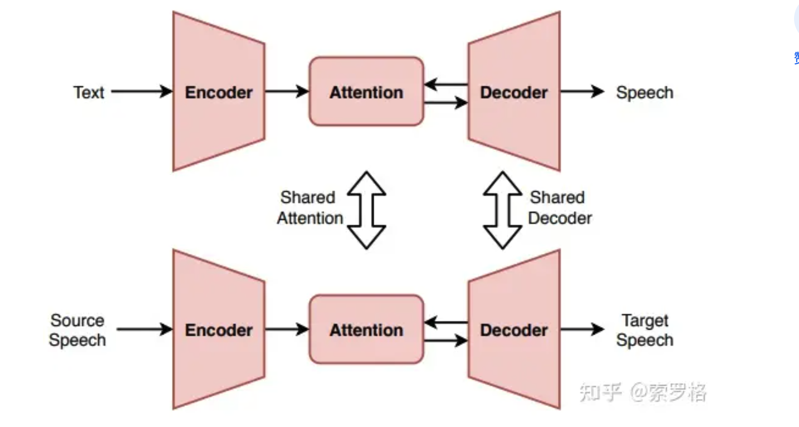
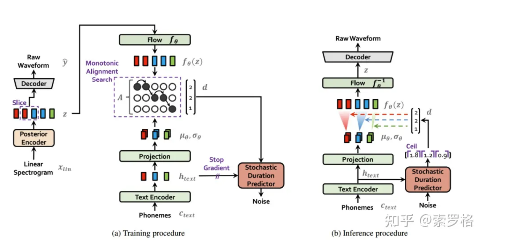
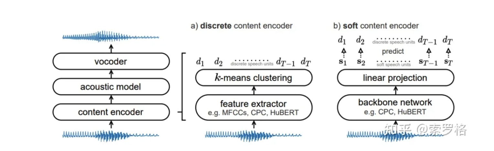
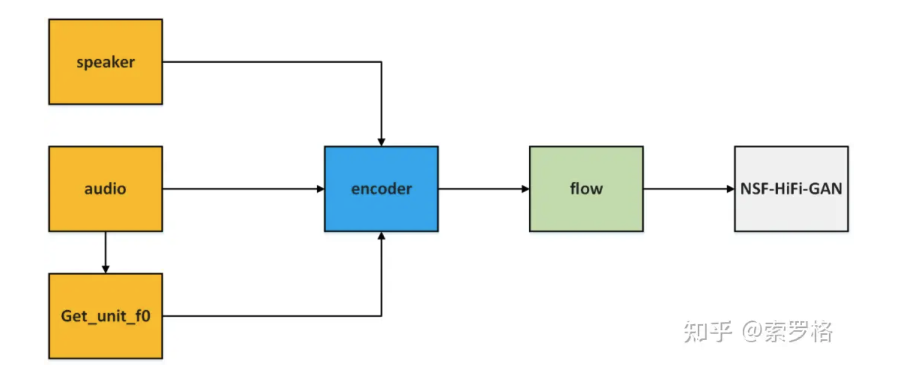
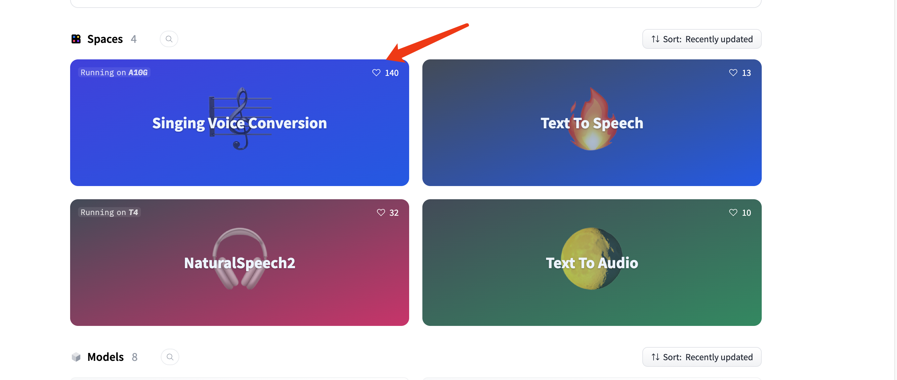
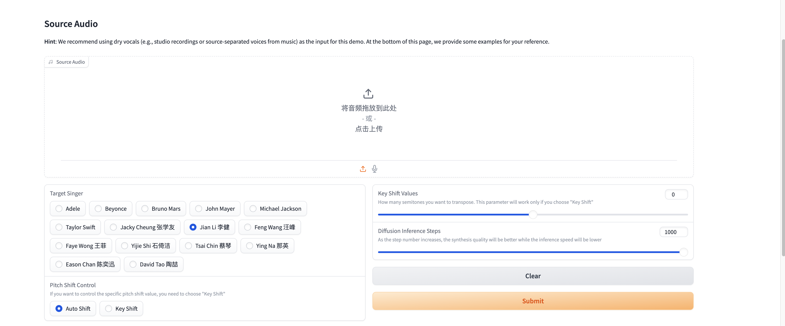
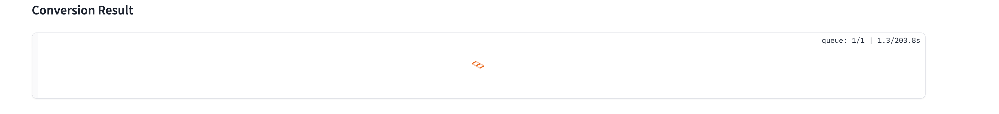
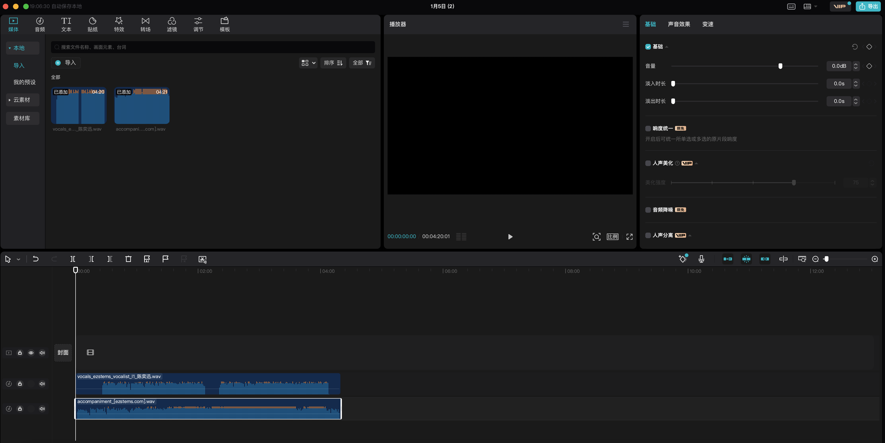

# 手把手教会你如何让喜欢的歌手唱你喜欢的歌

最近ai孙燕姿和ai力宏都比较火，笔者也想自己研究下然后让喜欢的歌手翻唱其他歌手的歌。

**本文不需要任何计算机编程基础，80岁大爷都能操作**。想知道如何操作的请直接跳转第二章

##  1、歌声转换原理

(以下内容转载自知乎：https://zhuanlan.zhihu.com/p/631685001)

歌声转换简称SVC（Singing Voice Conversion），而SVC又属于VC（Voice Conversion）：

>VC（Voice Conversion）,语音转换，也被称为声音转换或语音变换，是一种用于改变人的语音特征的技术，同时保留语言内容和说话者的身份。它涉及修改源说话者的声音特性，使其听起来像目标说话者的声音。语音转换的目标是将源说话者的声音的各个方面进行转换，如基频（音高）、频谱包络（声道特征）和韵律特征（节奏、语调和重音），以使其与目标说话者的特征相匹配。这样，源说话者的声音就能够采用目标说话者的特征，而不改变语言内容。

最开始人们通过信号处理的方式进行语音转换，主要是通过基音和速度对语音信息进行建模，然后通过PSOLA对语音基音或者速度进行修改从而达到变声的效果，。但是这种修改只能简单地调高/调低音调，并不能达到生成指定说话人音色的目的。随着深度学习的兴起，许多人开始尝试使用神经网络强大的特征提取能力对语音信息进行建模。早期的语音转换分为三个部分，分别是语音分析、特征映射和语音重建。随着韩国科学院在ICML 2021发布VITS(VITS: Conditional Variational Autoencoder with Adversarial Learning for End-to-End Text-to-Speech)论文和代码，语音转换进入了端到端的时代。VITS本身是用于语音合成任务，但语音合成和语音转换具有相似的结构，或者可以说语音转换网络是利用了语言信息的语音合成网络:

VITS的主体是一个条件VAE模型，包含了prior encoder，posterior encoder，decoder，discriminator和stochastic duration predictor。其中posterior encoder和discriminator只在训练中使用。VITS采用了和Fastspeech系统相同的transformer作为文本Encoder，与Glow-TTS相同的Flow结构作为VAE的主体以及和HiFiGAN生成器相同的反卷积作为Decoder，此外还采用Glow-TTS相同的单调对齐搜索算法(MAS), 保证生成对齐的稳定性。在推理时，输入的phoneme透过prior encoder得到隐变量z，然后z通过decoder生成原始波形。VITS整体训练和推理流程如下所示：

上面介绍了端到端的语音合成网络VITS，我们接下来看下如何使用VITS进行歌声转换。这里我们以SoVITS[9]为例进行讲解，网上搜了一圈都是介绍如何应用的，原理性的讲解比较少。总的来说，SoVITS在VITS的基础上，将解码器改为NSF-HiFiGAN，输入改为ContentVec，在推理时对ContentVec预测和pitch decoder的输出进行聚类，以减少输入语音泄漏，并在原始网络之前增加了Conv1d。

SoVITS输入改自SoftVC，原始SoftVC论文中的encoder有两种，如下图所示，其中第一种是离散内容编码器，它首先提取特征，然后通过聚类的方法生成一系列离散的语音单元；另一种是软内容编码器，它不使用聚类的方法而是训练一个网络去预测离线语音单元，去除了不必要的说话人信息，因此更适合语音转换这个任务，这也是SoVITS中采用soft content encoder的原因：

此外，由于是歌声转换任务，作者将f0显式的引入到了vits中以便更好的对歌声信息进行建模，这点我们可以从作者代码中获得。最后作者将声码器改为NSF-HiFiGAN以解决声音中断的问题。在推理过程中，只需说话人信息和音频信息，其中音频信息会首先计算f0，然后将说话人信号，音频信号和f0一起送到encoder，随后encoder的输出经过flow和NSF-HiFiGAN生成最终的结果，其完整流程如下所示：

## 2、如何实现

本文我们用github上开源的工具包：https://github.com/open-mmlab/Amphion

**Amphion** 是一个用于音频、音乐和语音生成的工具包。**其目的是支持可重复的研究，并帮助初级研究人员和工程师开始音频、音乐和语音生成研究和开发领域

Amphion目前支持：

- **TTS**：文本转语音
- **SVS**：歌声合成
- **VC**：语音转换
- **SVC**：歌声转换
- **TTA**：文本转音频
- **TTM**：文本转音乐

笔者开头说了本文不需要任何计算机编程基础，所以我们可以直接去huggingface（Hugging Face 是一个致力于自然语言处理（NLP）和人工智能（AI）的开源社区和公司。它提供了一系列强大的工具和库，帮助开发者构建和部署各种 NLP 模型。）上使用他们的在线版服务：https://huggingface.co/amphion

我们选择svc：

进去之后可以看到：

已经内置了张学友、王菲、陈奕迅等等华语歌手的模型，如果你想用其他歌手的可以自行去github上下载源码训练。

在Source Audio中选择音频文件，mp3 wav均可。

请注意：这里的原始素材音频文件必须要用清纯的人声，不能添加背景音乐，所以这里需要对音乐做人声、背景音乐分离，

网上的方法很多这里推荐一个在线版的：https://ezstems.com/

直接上传原始文件，然后选择2stems表示两轨分离，然后等待几分钟之后就可以下载转换之后的结果了，转换结果就是一个压缩包，解压之后里面有两个文件：

`accompaniment_[ezstems.com].wav`表示只有背景音乐的也就是伴奏

`vocals_[ezstems.com].wav`表示只有人声的

不过美中不足的是这个网站只能上传小于5MB的文件，如果下载的音乐比较大就不行了，这里有编程基础的可以自己使用这个网站使用的技术：`spleeter`来进行转换，网上关于`spleeter` 的教程蛮多的，大家可以自行查阅。如果没有编程基础的可以下载一个剪映来分离，不过需要开通VIP。

上传了音频文件文件之后点击submit就可以开始转换了，其他配置都可以不去修改：

等待大概五六分钟就可以在下面看到结果了：

可以下载到本地。

转换结果也是只有人声的音频，我们可以将这个音频和刚刚分离来的伴奏进行合并，也可以网上再找一个这首歌的伴奏进行合并。

合并的话办法就很多了，这里就简单说一下如何用剪映合并，首先我们下载一个剪映，点击“开始创作”，然后把只有人声的音频和伴奏的音频拖进去就行了：

然后点击播放即可，不过由于人声中会有一些空白，需要对齐一下，比如裁剪一下人声音频中开头空白的部分然后将开始的部分和伴奏开始的部分对齐即可，然后点击右上角的导出即可！
