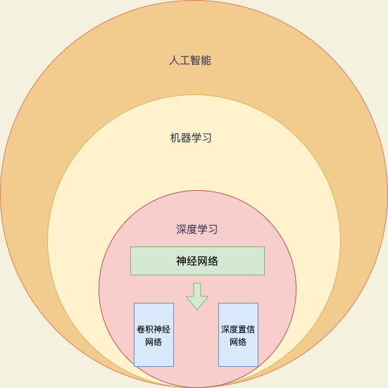
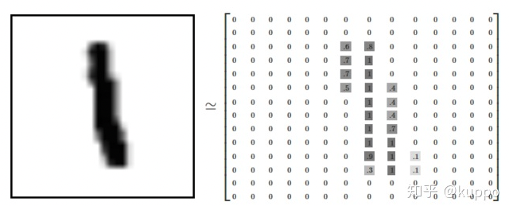
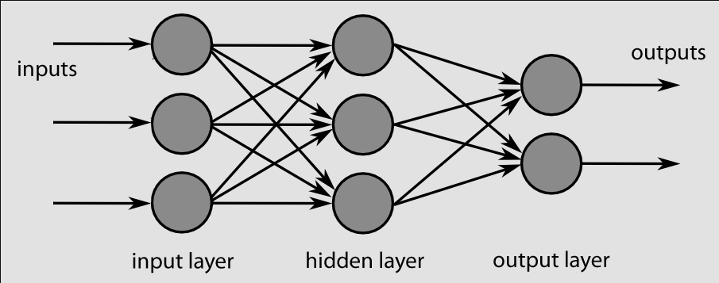

# 用Java来做深度学习——DJL入门


## 1、什么是人工智能？

**人工智能是研究、开发用于模拟、延伸和扩展人的智能的理论、方法、技术及应用系统的一门技术科学。**“人工智能”是“一门技术科学”，它研究与开发的对象是“理论、技术及应用系统”，研究的目的是为了“模拟、延伸和扩展人的智能”。我们现在看到的貌似很高端的技术，如[图像识别](https://www.zhihu.com/search?q=图像识别&search_source=Entity&hybrid_search_source=Entity&hybrid_search_extra={"sourceType"%3A"answer"%2C"sourceId"%3A542298413})、NLP，其实依然没有脱离这个范围，就是“模拟人在看图方面的智能”和“模拟人在听话方面的智能”，本质上和“模拟人在计算方面的智能”没啥两样，虽然难度有高低，但目的是一样的——模拟、延伸和扩展人的智能。另外，人工智能在50年代就提出了。

**机器学习**

   随着人对计算机科学的期望越来越高，要求它解决的问题越来越复杂，已经远远不能满足人们的诉求了。于是有人提出了一个新的思路——能否不为难码农，让机器自己去学习呢？

**机器学习就是用算法解析数据，不断学习，对世界中发生的事做出判断和预测的一项技术。**研究人员不会亲手编写软件、确定特殊指令集、然后让程序完成特殊任务；相反，研究人员会用大量数据和算法“训练”机器，让机器学会如何执行任务。这里有三个重要的信息：1、“机器学习”是“模拟、延伸和扩展人的智能”的一条路径，所以**是人工智能的一个子集**；2、“机器学习”是要基于大量数据的，也就是说它的“智能”是用大量数据喂出来的；3、正是因为要处理海量数据，所以大数据技术尤为重要；“机器学习”只是[大数据技术](https://www.zhihu.com/search?q=大数据技术&search_source=Entity&hybrid_search_source=Entity&hybrid_search_extra={"sourceType"%3A"answer"%2C"sourceId"%3A542298413})上的一个应用。常用的10大机器学习算法有：决策树、随机森林、[逻辑回归](https://www.zhihu.com/search?q=逻辑回归&search_source=Entity&hybrid_search_source=Entity&hybrid_search_extra={"sourceType"%3A"answer"%2C"sourceId"%3A542298413})、SVM、朴素贝叶斯、K最近邻算法、K均值算法、[Adaboost算法](https://www.zhihu.com/search?q=Adaboost算法&search_source=Entity&hybrid_search_source=Entity&hybrid_search_extra={"sourceType"%3A"answer"%2C"sourceId"%3A542298413})、神经网络、马尔科夫。

**深度学习**

  相较而言，深度学习是一个比较新的概念，严格地说是2006年提出的。**深度学习是用于建立、模拟人脑进行分析学习的神经网络，并模仿人脑的机制来解释数据的一种机器学习技术。**它的基本特点，是试图模仿大脑的神经元之间传递，处理信息的模式。最显著的应用是计算机视觉和自然语言处理(NLP)领域。显然，**“深度学习”是与机器学习中的“神经网络”是强相关**，“神经网络”也是其主要的算法和手段；或者我们可以将“深度学习”称之为“改良版的神经网络”算法。深度学习又分为[卷积神经网络](https://www.zhihu.com/search?q=卷积神经网络&search_source=Entity&hybrid_search_source=Entity&hybrid_search_extra={"sourceType"%3A"answer"%2C"sourceId"%3A542298413})（Convolutional neural networks，简称CNN）和深度置信网（Deep Belief Nets，简称DBN）。其主要的思想就是模拟人的神经元，每个神经元接受到信息，处理完后传递给与之相邻的所有神经元即可。所以看起来的处理方式有点像下图（想深入了解的同学可以自行google）。


神经网络的计算量非常大，事实上在很长时间里由于基础设施技术的限制进展并不大。而GPU的出现让人看到了曙光，也造就了深度学习的蓬勃发展，“深度学习”才一下子火热起来。击败李世石的Alpha go即是深度学习的一个很好的示例。Google的TensorFlow是开源深度学习系统一个比较好的实现，支持CNN、RNN和LSTM算法，是目前在图像识别、自然语言处理方面最流行的深度神经网络模型。事实上，提出“深度学习”概念的Hinton教授加入了google，而Alpha go也是google家的。

 **总结：人工智能是一门技术科学，机器学习是其中一门技术，深度学习是属于机器学习的范畴是机器学习的子集，神经网络是深度学习的主要的算法和手段，深度学习又分为卷积神经网络（Convolutional neural networks，简称CNN）和深度置信网（Deep Belief Nets，简称DBN）。所以他们的关系如下图：**



## 2、什么是神经网络？


由上文我们可得知神经网络是深度学习的主要算法和手段，那我们简单来介绍一下什么是神经网络。

如下图，我们已知四个数据点(1,1)(-1,1)(-1,-1)(1,-1)，这四个点分别对应I~IV象限，如果这时候给我们一个新的坐标点（比如(2,2)），那么它应该属于哪个象限呢？


聪明的你马上就能回答出他应该在第二象限，那神经网络的目的就是让计算机也知道这个坐标应该在第一象限。这就是神经网络的一大实践——分类。

在这个例子中，我们输入一个坐标(1,1)希望计算机返回一象限，那么(1,1)就是我们的输入我们可以称之为输入层，一象限就是我们的输出我们可以称之为输出层，那么从(1,1)到第一象限中间肯定有个我们看不到的分析过程，我们就称之为隐藏层，那么这个神经网络就是一个二层神经网络，我们画个图：


在我们的例子中，输入层是坐标值，例如（1,1），这是一个包含两个元素的数组，也可以看作是一个1*2的矩阵。输入层的元素维度与输入量的特征息息相关，如果输入的是一张32✖️32像素的灰度图像，那么输入层的维度就是32✖️32（简单来说图片就是若干个像素组成，32像素代表这个图像由长32宽32的像素矩形成，像素就是色彩点，每个色彩又可以用数字表示，所以图片最后可以转换成一个矩阵来表示）。

连接输入层和隐藏层的是W1和b1。由X计算得到H十分简单，就是矩阵运算(这里需要你回忆一点大学的线性代数知识)：

```mathematica
H=X*W1+b1
```

连接隐藏层和输出层的是W2和b2。同样是通过矩阵运算进行的：

```mathematica
Y=H*W2+b2
```

通过上述两个线性方程的计算，我们就能得到最终的输出Y了，但是如果你还对线性代数的计算有印象的话，应该会知道：***一系列线性方程的运算最终都可以用一个线性方程表示\***。也就是说，上述两个式子联立后可以用一个线性方程表达。对于两次神经网络是这样，就算网络深度加到100层，也依然是这样。这样的话神经网络就失去了意义。所以这里要对网络注入灵魂：**激活层**。

讲到这里差不多就可以打住了，在往下讲就比较复杂了，需要回忆较多的线性代数知识了，所以差不多就到这里，一句话总结一下：**神经网络的传播都是形如Y=WX+b的矩阵运算；为了给矩阵运算加入非线性，需要在隐藏层中加入激活层；输出层结果需要经过Softmax层处理为概率值，并通过交叉熵损失来量化当前网络的优劣。**

算出交叉熵损失后，就要开始反向传播了。其实反向传播就是一个**参数优化**的过程，优化对象就是网络中的所有W和b（因为其他所有参数都是确定的）。

神经网络的神奇之处，就在于它可以自动做W和b的优化，在深度学习中，参数的数量有时会上亿，不过其优化的原理和我们这个两层神经网络是一样的。

这里举一个形象的例子描述一下这个参数优化的原理和过程：

假设我们操纵着一个球型机器行走在沙漠中，我们在机器中操纵着四个旋钮，分别叫做W1，b1，W2，b2。当我们旋转其中的某个旋钮时，球形机器会发生移动，但是旋转旋钮大小和机器运动方向之间的对应关系是不知道的。而我们的目的就是**走到沙漠的最低点**。此时我们该怎么办？就挨个试试

如果增大W1后，球向上走了，那就减小W1。

如果增大b1后，球向下走了，那就继续增大b1。

如果增大W2后，球向下走了一大截，那就多增大些W2。

。。。

这就是进行参数优化的形象解释，这个方法叫做梯度下降法。

当我们的球形机器走到最低点时，也就代表着我们的交叉熵损失达到最小（接近于0）。

总之就是需要找到最好的w和b。

这里只是很简单的介绍一下神经网络，关于神经网络的更详细的介绍可以去知乎上看这篇文章：https://zhuanlan.zhihu.com/p/65472471，当然了如果还想深入了解可以去看吴恩达的deeplearning.ai的《深度学习》课程。


## 3、java的深度学习框架——Djl

### 3.1、 Djl介绍

深度学习主流的语言是python，python有几个主流的深度学习框架——PyTorch、TensorFlow、MXNet、Lasagne、TheanoKeras、Blocks、Keras。但是如果你是一个没有python基础的java程序员也想学习一下深度学习怎么办？我们可以使用aws的Djl（Deep Java Library ）来用java做深度学习！

```
Deep Java Library (DJL) is an open-source, high-level, engine-agnostic Java framework for deep learning. DJL is designed to be easy to get started with and simple to use for Java developers. DJL provides a native Java development experience and functions like any other regular Java library.

You don't have to be machine learning/deep learning expert to get started. You can use your existing Java expertise as an on-ramp to learn and use machine learning and deep learning. You can use your favorite IDE to build, train, and deploy your models. DJL makes it easy to integrate these models with your Java applications.
```

以上是[djl官方文档](https://docs.djl.ai/)上对djl的介绍，简单来说Djl就是一个让java程序员也能轻松上手机器学习和深度学习

## 3.2、 环境搭建

- 安装JDK，这不不用赘述，我们假设阅读本文的有一定基础的java程序员，如果你没有编程基础请使用python来做深度学习。推荐使用jdk11.
- 安装jupyter：`pip3 install jupyter`，这里简单介绍一下一下jupyter：

```
Jupyter Notebook是一个开源的web应用程序，可以使用它来创建和共享包含实时代码、方程、可视化和文本的文档。

Jupyter Notebook是IPython项目的一个派生项目，IPython项目本身曾经有一个IPython Notebook项目。后来从中拆分出去，叫做Jupyter Notebook。

"Jupyter"名字来源于它所支持的核心编程语言:Julia、Python和R。Jupyter随IPython内核一起提供，该内核允许用户使用Python编写程序。目前，还有100多个其他内核也可以使用。
```

- 安装Ijava内核：

```shell
git clone https://github.com/frankfliu/IJava.git
cd IJava/
./gradlew installKernel
```

### 3.3、代码准备

我们新建一个maven项目就可以了，然后引入以下依赖：

```xml
     <properties>
        <djl.version>0.19.0</djl.version>
    </properties>
    
    <dependencies>
        <!-- djl begin -->
        <dependency>
            <groupId>ai.djl</groupId>
            <artifactId>api</artifactId>
            <version>${djl.version}</version>
        </dependency>
        <dependency>
            <groupId>ai.djl</groupId>
            <artifactId>basicdataset</artifactId>
            <version>${djl.version}</version>
        </dependency>
        <dependency>
            <groupId>ai.djl</groupId>
            <artifactId>model-zoo</artifactId>
            <version>${djl.version}</version>
        </dependency>
        <dependency>
            <groupId>ai.djl.pytorch</groupId>
            <artifactId>pytorch-model-zoo</artifactId>
            <version>${djl.version}</version>
        </dependency>
        <!-- djl end-->
    </dependencies>
```

这里使用的底层python的深度学习框架是pytorch，如果你不是mac M1的话可以尝试使用mxnet：

```xml
<dependency>
  <groupId>ai.djl.mxnet</groupId>
  <artifactId>mxnet-engine</artifactId>
  <version>${djl.version}</version>
</dependency>
```

### 3.4、用Mnist来做第一次深度学习

经过上文介绍，我们知道神经网络是一个黑匣子函数。不用自己编码此函数，而是为该函数提供了许多示例输入/输出对。然后，我们尝试训练网络，以了解如何最好地近似仅给定这些输入/输出对的函数的观测行为。具有更多数据的更好模型可以更准确地近似函数。

简单来说深度学习由以下过程：1、选定一个数据集；2、选定一个深度学习网络；2、深度学习网络对数据集进行训练生成模型；3、依据模型对输入进行推理得到结果。

简单举个例子就像你要教会刚刚学会说话的宝宝认识数字一样，给他看有数字的卡片然后告诉他这是读几，然后教他一段时间之后你写一个数字他就可以读出来这是几，这个就是形象的深度学习过程：宝宝就是深度学习网络，有数字的卡片就是数据集，教他的过程就是在训练，宝宝心里对这些的记忆和分类就是模型，写数字让他读就是推理。

这里我们数据集选择深度学习中的“Hello World”——Mnist数据集，一个手写数字数据库。每张图像都包含一个 28x28 图像中从 0 到 9 的黑白数字。它通常在开始深度学习时使用，因为它体积小且训练速度快。数


据集其实可以理解为一张图片对应一个数字的集合，比如图片1对应的数字是1，就真的和教小朋友的卡片很像，你眼里的图片其实在计算机眼里是一个矩阵，然后这个矩阵是对应数字几，这个就和上文简单介绍的神经网络结合起来。



如果要自己创建自己的数据集可以参考文档：https://djl.ai/docs/development/how_to_use_dataset.html

深度学习网络我们这里选择最简单和最古老的深度学习网络之一：多层感知器 (MLP)。MLP 被组织成层。第一层是包含输入数据的输入层，最后一层是产生网络最终结果的输出层。它们之间是被称为隐藏层的层。拥有更多的隐藏层和更大的隐藏层允许 MLP 表示更复杂的功能。

下面的示例包含大小为 3 的输入、大小为 3 的单个隐藏层和大小为 2 的输出。隐藏层的数量和大小通常通过实验确定。每对层之间是一个线性运算（有时称为完全连接运算，因为输入中的每个数字都通过矩阵乘法连接到输出中的每个数字）。未图示，每次线性运算后还有一个非线性激活函数。



#### 3.4.1、新建神经网络

这里我们先新建一个MLP网络：

```java
public class Mlp extends SequentialBlock {

    /**
     * 使用 RELU 创建 MLP 神经网络。
     *
     * @param input  : 输入向量的大小
     * @param output :输出向量的大小
     * @param hidden :所有隐藏层的大小
     */
    public Mlp(int input, int output, int[] hidden) {
        this(input, output, hidden, Activation::relu);
    }

    /**
     * 创建 MLP 神经网络。
     *
     * @param input      :    输入向量的大小
     * @param output     :   输出向量的大小
     * @param hidden     :  所有隐藏层的大小
     * @param activation : 要使用的激活函数
     */
    public Mlp(int input, int output, int[] hidden, Function<NDList, NDList> activation) {
        add(Blocks.batchFlattenBlock(input));
        for (int hiddenSize : hidden) {
            add(Linear.builder().setUnits(hiddenSize).build());
            add(activation);
        }

        add(Linear.builder().setUnits(output).build());
    }
}
```

这里就对应了我们上文介绍的输入层、输出层、隐藏层、激活层

#### 3.4.2、初始化数据集

接下来我们初始化数据集，Djl内置了mnist数据集，我们直接使用就可以了：

````java
int batchSize = 32;
//数据集，自带数据集
Mnist mnist = Mnist.builder().setSampling(batchSize, true).build();
mnist.prepare(new ProgressBar());
````

唯一需要的参数是Sampler(采样器)的选择。采样器在迭代时决定数据集中的哪些元素和多少元素是每个批次的一部分。我们将让它随机打乱批次的元素并使用 32 的 batchSize。batchSize 通常是适合内存的 2 的最大幂

接下来我们就创建我们的模型了：

```java
Model model = Model.newInstance("mlp");
//设置神经网络
model.setBlock(new Mlp(28 * 28, 10, new int[] {128, 64}));
```

这里的神经网络就选择我们刚刚新建的MLP，然后三个参数就是输入层、输出层和隐藏层。这里我们输入层是一个28✖️28的图片，输出是10因为0到9是10个数字。

#### 3.4.3、新建训练师

然后我们需要新建一个训练师来训练：

```java
//训练配置 
DefaultTrainingConfig config = new DefaultTrainingConfig(Loss.softmaxCrossEntropyLoss())
                    //softmaxCrossEntropyLoss 是分类问题的标准损失
                    // 使用准确性，以便我们人类可以了解模型的准确性
                    .addEvaluator(new Accuracy()).addTrainingListeners(TrainingListener.Defaults.logging());
// 现在我们有了训练配置，我们应该为我们的模型创建一个新的训练器
Trainer trainer = model.newTrainer(config);
```

我们要先配置好训练配置，这里训练配置有一些常见的参数：

-  Loss函数：损失函数用于衡量我们的模型与数据集的匹配程度。由于该函数的值越低越好，因此称为“损失”函数。损失是模型唯一需要的参数，这里我们选择的是`Loss.softmaxCrossEntropyLoss()`

- Evaluator函数：评估函数也用于衡量我们的模型与数据集的匹配程度。与损失不同，它们只供人们查看，不用于优化模型。由于许多损失并不那么直观，因此添加其他评估器（例如 Accuracy）有助于了解你的模型的运行情况。这里我们选择的就是Accuracy
- Training Listeners：训练监听器通过监听器接口向训练过程添加附加功能。这可以包括显示训练进度、如果训练变得未定义则提前停止或记录性能指标。Djl默认有几个监听器：https://javadoc.io/doc/ai.djl/api/latest/ai/djl/training/listener/TrainingListener.Defaults.html

#### 3.4.4、初始化训练

在训练模型之前，我们必须使用起始值初始化所有参数。可以通过传入输入形状使用训练器进行此初始化。

- 输入形状的第一个轴是批量大小。这不会影响参数初始化，所以我们可以直接传入 1。

- MLP 的输入形状的第二个轴 - 输入图像中的像素数。就是我们输入层的图像，这里就是28*28。

  ```java
   trainer.initialize(new Shape(1, 28 * 28));
  ```

  

#### 3.4.5、开始训练

现在，我们可以训练模型了。

训练时，通常将其组织成 epoch，每个 epoch 对数据集中每个项目的模型训练一次。它比随机训练略快。

然后我们只需要调用一句代码就可以开始训练了，非常简单：

````java
// 深度学习通常在 epoch 中进行训练，每个 epoch 在数据集中的每个项目上训练模型一次。
int epoch = 2;
//开始训练
EasyTrain.fit(trainer, epoch, mnist, null);
````

#### 3.4.6、保存模型

训练模型后，我们就应该保存模型，以便以后重新加载。还可以向其中添加元数据，例如训练精度、训练的 epoch 数等，可在加载模型或检查模型时使用。

```java
//保存模型
Path modelDir = Paths.get("build/mlp");
Files.createDirectories(modelDir);
model.setProperty("Epoch", String.valueOf(epoch));
model.save(modelDir, "mlp");
```

我们训练好的模型就保存在当前项目的`build/mlp`目录下，是一个二进制文件。


#### 3.4.7、使用模型进行推理

我们模型训练好之后，就是使用了，首先我们要有输入，就是一个28*28的手写数字的图像输入：

```java
Image oldImage = ImageFactory.getInstance().fromFile(Paths.get("你图片的绝对路径"));
NDArray resize = NDImageUtils.resize(oldImage.toNDArray(NDManager.newBaseManager()), 28, 28);
Image image = ImageFactory.getInstance().fromNDArray(resize);
img.getWrappedImage();
```

这里加载进来就可以了，注意：1、一定要是黑底白色字体，可以用白纸黑字写上然后颜色反转，笔者在源码的`image`路径下上传了一个数字4和3的图片，还有0到9连续的截图，大家可以自行截取用，2、我们输入的图形不一定是刚刚好28*28的，所以可以用Djl提供的工具类进行图片大小的调整。

然后我们就需要加载我们刚刚保存的模型：

```java
Path modelDir = Paths.get("build/mlp");
Model model = Model.newInstance("mlp");
model.setBlock(new Mlp(28 * 28, 10, new int[] {128, 64}));
model.load(modelDir);
```

接下来我们要创建一个用于封装应用程序的Translator预处理和后处理功能。processInput 和 processOutput 的输入应该是单个数据项，而不是批次：

````java
Translator<Image, Classifications> translator = new Translator<Image, Classifications>() {

                @Override
                public NDList processInput(TranslatorContext ctx, Image input) {
                    // 将图像转换为 NDArray
                    NDArray array = input.toNDArray(ctx.getNDManager(), Image.Flag.GRAYSCALE);
                    return new NDList(NDImageUtils.toTensor(array));
                }

                @Override
                public Classifications processOutput(TranslatorContext ctx, NDList list) {
                    // 使用输出概率创建分类
                    NDArray probabilities = list.singletonOrThrow().softmax(0);
                    List<String> classNames = IntStream.range(0, 10).mapToObj(String::valueOf).collect(Collectors.toList());
                    return new Classifications(classNames, probabilities);
                }

                @Override
                public Batchifier getBatchifier() {
                    // 批处理器描述了如何将批处理组合在一起
                    // Stacking，最常见的批处理器，将 N [X1, X2, ...] 数组转换为单个 [N, X1, X2, ...] 数组
                    return Batchifier.STACK;
                }
            };
````

然后我们要创建一个推理器，推理器在推理过程中，经过训练的模型用于预测值，通常用于生产用例。预测器不是线程安全的，所以如果你想并行进行预测，你应该多次调用 newPredictor 来为每个线程创建一个预测器对象：

```java
 Predictor<Image, Classifications> imageClassificationsPredictor = model.newPredictor(translator);
```

最后就是运行推理，得到结果了：

```java
Classifications classifications = imageClassificationsPredictor.predict(image);
```

classifications就是我们最后的结果：

```
[
	class: "3", probability: 0.99993
	class: "8", probability: 0.00005
	class: "2", probability: 3.3e-06
	class: "1", probability: 2.1e-06
	class: "5", probability: 3.1e-07
]
```

会把每个数字的概率打印出来，选择第一个就可以了：

```java
classifications.best()
```

以上就是一次完整的深度学习的过程。


### 3.5、Djl深入学习

这里笔者只是抛砖引玉，简单介绍了下Djl的入门，有兴趣的读者可以自行阅读他们的官方书籍——动手学深度学习：https://d2l-zh.djl.ai/chapter_preface/index.html

