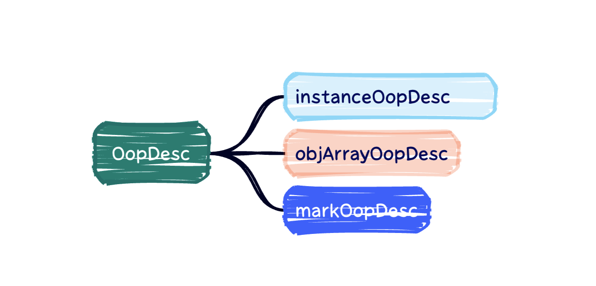

# 聊一聊JAVA的oop-klass模型

在上文《G1新对象分配源码分析》中，我们知道在新建对象的时候JVM会解释执行new关键字，在源码里：

```c++
 IRT_ENTRY(void, InterpreterRuntime::_new(JavaThread* thread, ConstantPool* pool, int index))
  //先会去常量池（这里的常量池其实运行时常量池）中查找Klass的信息
  Klass* k_oop = pool->klass_at(index, CHECK);
  //然后将其包装成instanceKlassHandle句柄,其实就是klass包装类
  instanceKlassHandle klass (THREAD, k_oop);
  //做一些验证和初始化操作
  klass->check_valid_for_instantiation(true, CHECK);
  klass->initialize(CHECK);
  //调用申请对象的方法
  oop obj = klass->allocate_instance(CHECK);
  //将申请的结果返回
  thread->set_vm_result(obj);
IRT_END
```

我们在那一篇文章中重点看的是如何在堆中分配，跳过了前面的oop-klass部分只是简单介绍了一下：

> oop-klass模型是一种用于描述Java对象的内部结构的模型。它定义了Java对象的布局和访问方式，包括对象头、实例变量和方法等。在JVM中，每个Java对象都有一个oop-klass指针，指向该对象的类信息。oop-klass模型是JVM实现Java面向对象编程的基础，也是JVM实现Java虚拟机规范的关键之一。

今天我们来详细看看。


## 基本概念

当我们在写 Java 代码的时候，我们会面对着无数个接口，类，对象和方法。但我们有没有想过，Java 中的这些对象、类和方法，在  JVM 中是如何存在的呢？

首先JVM 并不会根据 Java 对象映射出一个C++对象，而是用oop-klss模型来表示一个java类：

- `klass` 表示 `元数据和方法信息`，用来描述 Java 类，简单来说就是java类在JVM中的存在形式，Java的每个类，在JVM中，都有一个对应的Klass类实例与之对应，存储类的元信息如：常量池、属性信息、方法信息

​	他在JVM中的存在形式以及继承信息如下：


普通的Java类在JVM中对应的是instanceKlass类的实例，再来说下它的三个子类

1. InstanceMirrorKlass：用于表示java.lang.Class，Java代码中获取到的Class对象，实际上就是这个C++类的实例，存储在堆区，学名镜像类
2. InstanceRefKlass：用于表示java.lang.ref.Reference类的子类
3. InstanceClassLoaderKlass：用于遍历某个加载器加载的类

Java中的数组不是静态数据类型，是动态数据类型，即是运行期生成的，Java数组的元信息用ArrayKlass的子类来表示：

1. TypeArrayKlass：用于表示基本类型的数组
2. ObjArrayKlass：用于表示引用类型的数组


- `oop` 指的是 `Ordinary Object Pointer`（普通对象指针），它用来表示对象的实例信息。例如`Student s=new Student()`这里`Student`这个类的信息在jvm中是以Klass的形式存在，那么这个`s`也就是这个类的实例就是我们的oop了。

oop在jvm中的存在以及继承关系如下：



`instanceOopDesc` 描述的是一个 JVM 层面的 Java 对象

`objArrayOopDesc`描述的是JVM层面的数组

`markOopDesc` 描述的不是一个真正的对象，而是一个字长的数据。在32为机器上，其大小为32位，在64位上为64位。这个就是八股里面的老演员：`mark word`

在父类OopDesc中：

```c++
class oopDesc {
...
 private:
  volatile markOop _mark;
  union _metadata {
    Klass*      _klass;
    narrowKlass _compressed_klass;
  } _metadata;

```

分为两个部分：

- `_mark`：即mark word，它用于存储对象的运行时记录信息，如哈希值、GC 分代年龄(Age)、锁状态标志（偏向锁、轻量级锁、重量级锁）、线程持有的锁、偏向线程 ID、偏向时间戳等，`markOop` 为指向 `markOopDesc` 的指针
- `_metadata`：元数据指针，它是联合体，可以表示未压缩的 Klass 指针(`_klass`)和压缩的 Klass 指针。对应的 klass 指针指向一个存储类的元数据的 Klass 对象

这两个就构成了我们的对象头，一个记录运行时信息一个记录元数据。


## 源码解读

上文《G1新对象分配源码分析》中我们比较在意的是G1的新对象分配，也就是到了GC哪一层了，TLAB（后面补上了）和oop-klass部分都跳过了，这样看起来就比较零碎，今天补上这块拼图，这样我们整个对象初始化的链路就清楚了。

在以前我们看源码都是看的`hotspot/src/share/vm/interpreter/InterpreterRuntime.cpp`这个类，并且这个类是解释执行JVM的字节码指令的，但是也不全对，实际上我们还有一个类：`hotspot/share/interpreter/bytecodeInterpreter.cpp`：

>`bytecodeInterpreter.cpp` 和 `InterpreterRuntime.cpp` 是 JVM（Java虚拟机）源码中的两个不同文件，它们在功能和目的上有一些区别。
>
>1. `bytecodeInterpreter.cpp`：这个文件实现了字节码解释器（Bytecode Interpreter）的主要逻辑。字节码解释器是 JVM 的一部分，用于解释和执行 Java 字节码指令。`bytecodeInterpreter.cpp` 中的代码负责解析字节码指令、执行指令操作、处理异常和跳转等。它提供了对字节码指令集的支持，包括加载、存储、算术运算、逻辑运算、方法调用等操作。字节码解释器通常是 JVM 的一种执行引擎，相对于即时编译器来说，执行速度较慢，但具有跨平台的优势。
>2. `InterpreterRuntime.cpp`：这个文件包含了一些与解释器相关的运行时函数和辅助函数。它提供了一些在解释器执行过程中需要使用的功能，例如对象创建、类型转换、异常处理等。`InterpreterRuntime.cpp` 中的函数被字节码解释器调用，以支持解释器的执行过程。这些函数通常涉及到 JVM 内部的数据结构和操作，以及与解释器相关的运行时行为。

总的来说，`bytecodeInterpreter.cpp` 实现了字节码解释器的核心逻辑，而 `InterpreterRuntime.cpp` 则提供了与解释器相关的运行时函数和辅助函数，以支持解释器的执行过程。这两个文件在协同工作，共同支持了 JVM 对 Java 字节码的解释和执行

也就是我们比较关心一个jvm指令比如monitorEnter的实现这种那么就可以直接看`InterpreterRuntime.cpp`

如果我们要理清整个流程，那么就应该从`bytecodeInterpreter.cpp`开始看，因为`bytecodeInterpreter.cpp`是入口，他是读取解析jvm字节码并且执行的类，而`InterpreterRuntime.cpp`测试提供关键的函数，硬要类比的话`bytecodeInterpreter.cpp`相当于我们mvc架构下的spring mvc的controller，而`InterpreterRuntime.cpp`则相当于service。

所以我们看`bytecodeInterpreter.cpp`，在上文上文《G1新对象分配源码分析》中我们知道新建对象的指令就是new，所以这里我们直接看new指令:

```c++
  CASE(_new): {
    		//获取一个无符号的 16 位整数，作为常量池中的索引值，该索引值指向一个类的描述符，也就是new指令携带的指向常量池的下标，这里的pc就是程序计数器
        u2 index = Bytes::get_Java_u2(pc+1);
        ConstantPool* constants = istate->method()->constants();
    		//当前类的klass被解析过了
        if (!constants->tag_at(index).is_unresolved_klass()) {
          // 如果被解析过了则从常量池中获取klass
          Klass* entry = constants->resolved_klass_at(index);
          //转换为InstanceKlass，也就是普通java类在jvm中的类型，注意这里的ik是在元空间的
          InstanceKlass* ik = InstanceKlass::cast(entry);
          //检查该类是否已经初始化并且可以使用快速分配路径进行对象分配
          if (ik->is_initialized() && ik->can_be_fastpath_allocated() ) {
            //通过klass获取该类的大小
            size_t obj_size = ik->size_helper();
            oop result = NULL;
            // 是否将新创建的 TLAB 内的所有字节归零，ZeroTLAB是TLAB的JVM参数
            bool need_zero = !ZeroTLAB;
            //如果使用了TLAB则通过TLAB分配对象
            if (UseTLAB) {
              //直接在当前线程的已存在的TLAB中分配，这里返回的就是oop
              result = (oop) THREAD->tlab().allocate(obj_size);
            }
            // 没有使用TLAB的情况或者TLAB分配失败
#ifndef CC_INTERP_PROFILE
            if (result == NULL) {
              need_zero = true;
              // 尝试直接在eden中分配
            retry:
               /*
              这里很简单，由于类是对象的模板，所以开辟对象的大小都已经是确定值。
              在Java堆初始化就已经使用mmap系统调用开辟了一大段空间，并且根据垃圾回收器和垃圾回收策略决定好空间的分布
              所以当前只需要从开辟好的空间中得到当前对象所需的空间的大小作为当前对象的内存。
              并发的情况下就使用CAS保证Java堆内存的线程安全
              而c/c++很妙的地方在于可以直接操作内存，可以动态对内存的解释做改变（改变指针类型）
              所以得到一小段空间并返回基地址（对象的起始地址），而这片空间直接使用oop来解释。
              如果：后续给对象中某个属性赋值，这将是一个很简单的寻址问题，已知基地址 + 对象头的常数偏移量 + 偏移量（类中保存了对象排布）= 属性的地址
            */
              HeapWord* compare_to = *Universe::heap()->top_addr();
              HeapWord* new_top = compare_to + obj_size;
              if (new_top <= *Universe::heap()->end_addr()) {
                //CAS的方式，第一个是新值，第二个是内存地址，第三个是老值，老值相等才更新为新值
                if (Atomic::cmpxchg(new_top, Universe::heap()->top_addr(), compare_to) != compare_to) {
                  goto retry;
                }
                //结果转换为oop
                result = (oop) compare_to;
              }
            }
#endif
            //对象开辟成功，需要对其初始化，设置对象头
            if (result != NULL) {
              // Initialize object (if nonzero size and need) and then the header
              if (need_zero ) {
                HeapWord* to_zero = (HeapWord*) result + sizeof(oopDesc) / oopSize;
                obj_size -= sizeof(oopDesc) / oopSize;
                if (obj_size > 0 ) {
                  memset(to_zero, 0, obj_size * HeapWordSize);
                }
              }
             // 如果使用偏向锁的话，对象头的内容需要修改
              if (UseBiasedLocking) {
                result->set_mark(ik->prototype_header());
              } else {
                result->set_mark(markOopDesc::prototype());
              }
              result->set_klass_gap(0);
              //设置oop的属性Klass为当前类的klass
              result->set_klass(ik);
              // 发布，让其他线程可见
              OrderAccess::storestore();
              //把对象地址放入到0号操作数栈中
              SET_STACK_OBJECT(result, 0);
              UPDATE_PC_AND_TOS_AND_CONTINUE(3, 1);
            }
          }
        }
        // 没有初始化klass，慢速分配
        CALL_VM(InterpreterRuntime::_new(THREAD, METHOD->constants(), index),
                handle_exception);
        //发布，让其他线程可见
        OrderAccess::storestore();
    		//把对象地址放入到0号操作数栈中
        SET_STACK_OBJECT(THREAD->vm_result(), 0);
        THREAD->set_vm_result(NULL);
        UPDATE_PC_AND_TOS_AND_CONTINUE(3, 1);
      }
```

这里其实是对上文《G1新对象分配源码分析》的一个补充，因为上文比较在意的是G1中分配对象，而忽略了JVM的一些其他细节，我们可以看到，在执行新建对象的时候，如果类已经被初始化过则就是直接分配内存了，那么我们回顾一下在`InterpreterRuntime::_new`中新建对象的代码：

```c++
IRT_ENTRY(void, InterpreterRuntime::_new(JavaThread* thread, ConstantPool* pool, int index))
 // 确保类已经加载并且解析
  // 如果没有加载和解析，那么就去加载和解析类，得到最终的Klass对象，这里的k是在元空间
  Klass* k = pool->klass_at(index, CHECK);
  InstanceKlass* klass = InstanceKlass::cast(k);

  // 确保不是实例化的一个抽象类
  klass->check_valid_for_instantiation(true, CHECK);

  // 确保类已经完成初始化工作
  klass->initialize(CHECK);

  //在堆内分配开辟对象
  oop obj = klass->allocate_instance(CHECK);
 // 使用线程变量完成 值的传递
  thread->set_vm_result(obj);
IRT_END

```

然后我们忽略上文中讲过的再堆中分配的细节，直接看和oop-klass有关的：

```c++
oop MemAllocator::allocate() const {
  oop obj = NULL;
  {
    Allocation allocation(*this, &obj);
    //这里mem表示已经分配好的内存地址
    HeapWord* mem = mem_allocate(allocation);
    //分配完成之后初始化返回的oop对象
    if (mem != NULL) {
      obj = initialize(mem);
    }
  }
  return obj;
}
```

```c++
oop MemAllocator::finish(HeapWord* mem) const {
  assert(mem != NULL, "NULL object pointer");
  //如果使用偏向锁的话，对象头的内容需要修改
  if (UseBiasedLocking) {
    oopDesc::set_mark_raw(mem, _klass->prototype_header());
  } else {
    oopDesc::set_mark_raw(mem, markOopDesc::prototype());
  }
	//对象头设置对象的类信息。
  oopDesc::release_set_klass(mem, _klass);
  //把内存地址转换为oop
  return oop(mem);
}
```

这里我们可以看到在堆上分配好内存空间之后就是和快速分配差不多了，就是对对象头做修改和设置好对象头最后转换为oop对象

## 总结


在JVM中使用二分模型Klass / oop 来表示类和对象，而类是对象的模板。在新建对象的过程中，需要确保类已经被加载、解析完毕，生成好对应的Klass。而生成好Klass类对象后，需要对类做初始化过程，也即链接类中所有的方法和调用父类以及本身的<clinit>方法（也即类的static块），初始化好klass之后就是在堆上分配空间给对象了。而分配的入口有两个，如果是已经被加载好的类会直接分配内存然后填充对象头，如果是第一次加载则会先加载klass然后分配内存

如果还想深入了解JVM的类创建过程可以参：JVM规范手册第4章、第5章内容 以及Hotspot虚拟机的实现。


